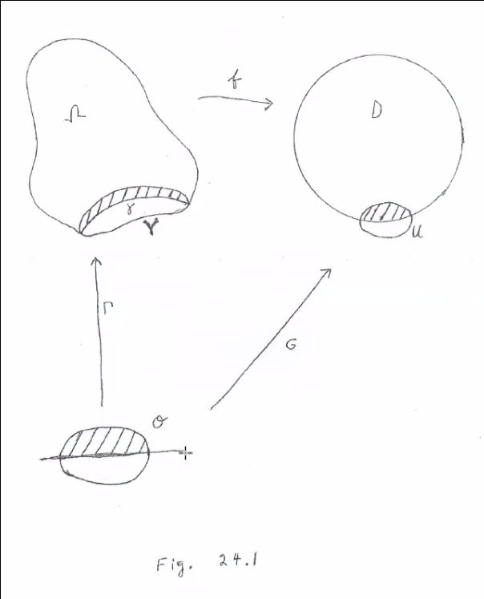

# Wednesday April 15th

Last time: finished proof of Riemann mapping theorem.
Needed concept of normal families, the rest was computations.

Proposition
:   Suppose $f: \Omega \to \DD$ is a holomorphic diffeomorphism.
    Then $z \to \bd \Omega \implies \abs{f(z)} \to 1$.

Proof
:   For each $\eps > 0$, $\bar D_{1-\eps} = \theset {\abs z < 1- \eps}\subset \DD$ is compact and $K_\eps \definedas f\inv (\bar D_{1-\eps}) \subset \Omega$ is compact by continuity of $f$.
    If $z\not\in K_\eps$, then $\abs{f(z)} > 1-\eps$ by definition.

Definition
: For $I = (a, b) \subset \RR$ an interval, a function $f: I \to \CC$ is real analytic iff for each $x_0 \in I$ there exists a $\delta > 0$ such that in a $\delta$ neighborhood of $x_0$, $f(x) = \sum a_k(x_0) (x-x_0)^k$ is given by a convergent power series.

In this case, $a_k(x_0)$ is given by the $k$th Taylor coefficient.

Lemma
: For $f$ real analytic, there is a neighborhood $U$ such that ?.

Proof
:   Fix $x_0 \in I$, let $U_{x_0}$ be a disc of radius $\delta(x_0)$ centered at $x_0$ in $\CC$ such that $f$ equals its power series on $D_\delta(x_0) \intersect \RR$.
    Set $F(z) = \sum a_k(x_0) (z - x_0)^k$ for $z \in D_\delta(x_0)$.
    Take $U = \union_{x_0 \in I} D_\delta(x_0)$
    Then $F: U \to \CC$ extends $F_{x_0}$ for each $x_0$, need to show it is well-defined.
    This follows from Theorem 4.5, Chapter 2 -- we have two functions taking the same values on a sequence with an accumulation point, namely their common restrictions to $\RR$, and the function is defined as every accumulation point in $\RR$.

Theorem
:   Assume $\gamma: I\to \CC$ is a simple real analytic curve with $\gamma'(t) \neq 0$ for all $t$ and bounds a region $\Omega$ such that

    - Points to the left of $\gamma$ are in $\Omega$
    - Points to the right of $\gamma$ are in $\CC \setminus \bar \Omega$

    So $\gamma$ separates $\CC$.
    Then there is a neighborhood $V$ of $\gamma$ and a holomorphic extension $F$ of $f$ to $\Omega \union V \to \CC$ with $F(\gamma) \subset \bd \DD$ and $F'(\gamma) \neq 0$.

Proof

- Use the lemma to get a neighborhood $O$ of $(a, b)$ in $\CC$ and a univalent holomorphic extension $\Gamma$; set $V = \Gamma(O)$
- Assume $O$ is symmetric about $\RR$, say $O^+$ is the part in $\HH$.
- Extend to $G$.
- ?

Theorem
:   Assume $\Omega$ is bounded and $\bd \Omega$ is simple, closed, a finite union of real analytic curves.
    Then the Riemann mapping function $f$ extends to a homeomorphism $f:\bar\Omega \to \bar\DD$.

    
