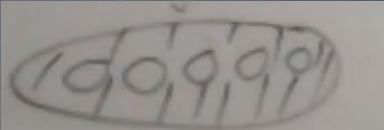

# Wednesday April 15th: Non-Archimedean Uniformization of Algebraic Curves

See Mumford 1972, or the Springer monograph "? Groups and Mumford Curves" which we'll attempt to summarize today.

Let $(K, \abs{\wait})$ be a complete discretely valued field with valuation ring $R$ and residue field $k$.

Definition
: A *Mumford curve* is a curve $C/R$ that is proper, flat, normal, and nice generic fibers $C/K$ where $C/k$ is semistable  and totally degenerate: each component $u$ is isomorphic to $\PP^1_k$, and the intersections of fibers are only transverse double points.

To such a curve we attach a *dual graph* $G(C)$ with vertices corresponding to components and edges corresponding to intersections between components.
We thus think of the special fiber as combinatorially object.

Blowing up such a curve stays within this class of curves, and for genus $>1$, there is a unique regular minimal model.
For an elliptic curve $E$, this says that $E$ has split multiplicative reduction.

For $C/k$ has genus $g\geq 1$, then the Euler characteristic of the dual graph $G$ is given by $\chi(G(C)) = 1-g$, the number of vertices minus the number of edges.

Example:
$E/k$ with split multiplicative reduction, given a minimal regular model, the dual graph is $C_n$.

For $C/k$ a genus $g$ Mumford curve, for $\Jac(C)$ the Néron group is $\GG_m^g/k$.
Thus the Jacobian of a Mumford curve has an analytic uniformization $(K\units)^g/\Lambda$

Theorem (Main Result)
: A curve $C/k$ admits an analytic uniformization iff it is a Mumford curve.

Similar to how abelian varieties admit uniformizations iff split multiplicative reduction.

Example
:   If $B/\QQ$ is a nonsplit indefinite quaternion algebra, which are classified by their discriminants $\disc B = D = p_1 \cdots p_n$.
    Then $X^D/\QQ$ is a Shimura curve, and for each $p$ dividing $D$, $X^D/\QQ_p$ is a Mumford curve and has an explicit $p\dash$adic uniformization (given by Cerdnik-Drinfeld?).

A quick opaque way is to define $\mch$ as the $p\dash$adic upper half plane for some (complicated) "connected" rigid analytic space, then $\mch(K) = \PP^1(\bar K) \setminus \PP^1(K)$.
There is a faithful action by some discrete subgroup $\Gamma \subset \PGL(2, K)$ on $\mch(K)$ by linear fractional transformations.
Every Mumford curve can be realized as $\Gamma \textbackslash \mch$.

Note that $\Gamma$ acts on $\PP \definedas \PP^1(E)$.

Definition
: A point $x\in \PP$ is a *limit point* of $\Gamma$ if there exists a $y\in \PP$ and distinct $\gamma_n$ in $\Gamma$ such that $\gamma_n y \to x$.

These are essentially the accumulation points of the orbits of $\Gamma$.
Define $\Lambda(\Gamma)$ be the set of all limit points, which turns out to be closed in $\PP$, and $U(\Gamma) - \PP\setminus \Lambda(\Gamma)$ the regular points.
Say that $\Gamma$ is *discontinuous* if $U(\Lambda) \neq \emptyset$ and every neighborhood of $\Gamma$ in $\PP$ has compact closure.

Definition
: A *Schotky group* is a discrete $\Gamma \subset \PGL(2, K)$ that is finitely generated and torsionfree.

Theorem 
:   \hfill 
    1. Every Schotky group is free on $g$ generators, each being a hyperbolic element of $\PGL(2, K)$, i.e. the two eigenvalues have distinct norms.
    2. Every discontinuous group has a finite index normal Schotky subgroup.

Here $\Gamma$ is a Schotky group of genus $g$ and $\Gamma$ acts freely on $U(\Gamma)$, which is open in $\PP^1$.
Since $\PP^1$ naturally has the structure of a $k\dash$analytic space, the space $\Gamma \textbackslash U(\Gamma)$ exists in the category of rigid $k\dash$analytic spaces, and is the analytic space associated to a genus $g$ Mumford curve $X/k$.
Conversely, every such $X/k$ arises from such a $\Gamma$.

> Analogy: properly discontinuous group actions. 
> For any point, taking a neighborhood and translating it by the group action yields only finitely many intersecting with the original neighborhood.

Example:
Take $K = \CC$ and $0 < \abs{q} < 1$.
Define $\Gamma = \gens{\gamma_q}$ where 
\begin{align*}
\gamma_q =
\begin{bmatrix}
q & 0 \
0 & 1
\end{bmatrix}
.\end{align*}
What is the subset of $\CC$ on which $\Gamma$ acts freely?
We see $0, \infty \in \PP^1(\CC)$ are the only fixed points, and at every other point $\Gamma$ acts discontinuously.
So $\Lambda(\Gamma) = \theset{0, \infty}$ and $U(\Gamma) = C\units$, and thus $\Gamma \textbackslash U(\Gamma) = q^\ZZ \textbackslash \CC\units$.
What is the fundamental domain for the $\Gamma\dash$action on $U(\Gamma)$?
It will be given by an annulus with the boundaries identified, which yields a torus.

In general, there will be $2g$ discs given by $A_1, B_1, \cdots, A_g, B_g$, so choose $\gamma_i \in \PGL(2 ,K)$ such that $\gamma_i$ maps $A_i^\circ \mapsvia{\cong} B_i^\circ$.
Then $\Gamma = \gens{\gamma_i}$ is a free group of rank $g$, and in fact a Schotky group.
Then $F(\Gamma) \definedas \PP^1 \setminus \union^{2g} D_i$ for $D_i$ open discs, then $F(\Gamma)$ is a fundamental domain for the action of $\Gamma$ on $U(\Gamma)$ and is a genus $g$ torus.

\

Note that this yields an affinoid space?
We can take the $\Gamma$ invariant meromorphic functions on $U(\Gamma)$, this will yield an extension of transcendence degree 1 that will be the function field of the curve.

