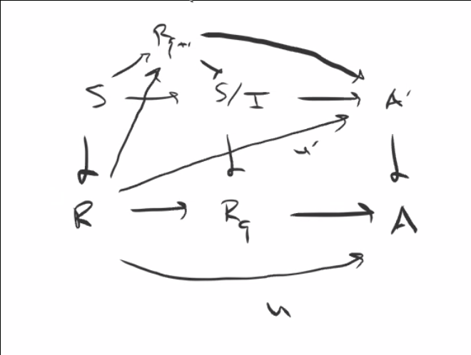
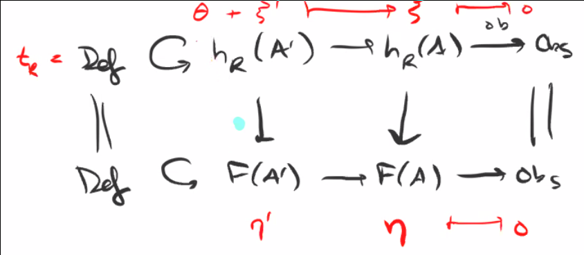

# Tuesday April 7th

> (Missing first few minutes.)

Take $I_{q+1}$ to be the minimal $I$ such that $\mfm_q I_q \subset I \subset I_1$ and $\xi_q$ lifts to $S/I$.

:::{.claim}
Such a minimal $I$ exists, i.e. if $I, I'$ satisfy the two conditions then $I \intersect I'$ does as well.
So $I, I'$ are determined by their images $v, v'$ in the vector space $I_q \tensor k$.
:::

So enlarge either $v$ or $v'$ such that $v + v' = I_q \tensor k$ but $v \intersect v'$ is the same.
We can thus assume that $I + I' = I_q$, and so
\[
S / I \intersect I' = S/I \cross_{S/I_q} S/I'
\]
which by H1 yields a map
\[
F(S/I\intersect I') &\to F(S/I) \cross_{F(S/I_q)} F(S/I')
\]

So $I\intersect I'$ satisfies both conditions and thus a minimal $I_{q+1}$ exists.
Let $\xi_{q+1}$ be a lift of $\xi_q$ over $S/I_{q+1}$ (noting that there may be many lifts).

## Showing Miniversality

:::{.claim}
Define $R = \directlim R_q$ and $\xi = \directlim \xi_q$, the claim is that $(R, \xi)$ is miniversal.
:::

We already have $h_R \mapsvia{\xi} F$ and thus $t_R \mapsvia{\cong}t_F$ is fulfilled.
We need to show formal smoothness, i.e. for $A' \to A$ a small thickening, suppose we have a lift
\begin{tikzcd}
&
& h_R 
  \ar[d, "\xi"] 
\\
h_a 
  \ar[rru, "n"] 
  \ar[rr, bend right] 
  \ar[r] 
& h_{A'} 
  \ar[r] 
& F
\end{tikzcd}

If we have a $u'$ such that commutativity in square 1 holds (?) then we can form a lift $u'$ satisfying commutativity in both squares 1 and 2.
We can restrict sections to get a map $F(A') \to F(A)$ and using representability obtain $h_R(A') \to h_R(A)$.
Combining H1 and H2, we know $t_F$ acts transitively on fibers, yielding

\begin{tikzcd}
t_R \selfmap \ar[d, "\cong"] & u'\in h_R(A') \ar[r] \ar[d] \ar[r] & u\in h_R(A) \ar[d]\\
t_F \selfmap & \eta' \in F(A') \ar[r] \ar[r] & \eta \in F(A) \\
\end{tikzcd}

Then $u' \mapsto u$ is equivalent to (1), and $u' \mapsto \eta'$ is equivalent to (2).
Let $\eta_0$ be the image of $u'$ and define $\eta' = \eta_0 + \theta, \theta \in t_F$ then $u' = u' + \theta, \theta \in t_R$.
So we can modify the lift to make these agree.
Thus it suffices to show

\begin{tikzcd}
A' \ar[r] & A & R_q \ar[l] \\
S \ar[u, "v"] \ar[r] & \ar[lu, dotted, "\exists_? u'"] \ar[u, "u"] \ar[ur] &
\end{tikzcd}

We get a diagram of the form

\begin{tikzcd}
S 
  \ar[d] 
  \ar[r, "w"] 
& A' \cross_A R_1 
  \ar[r]
  \ar[d, "{ \pi_2, \text{small} }"] 
& A' 
  \ar[d, "{ \text{small} }"]
\\
R 
  \ar[r] 
& R_q 
  \ar[r] 
& A
\end{tikzcd}

:::{.observation}
\envlist

- $S \to R_q$ is surjective.

- $\im(w) \subset A' \cross_A R_1$ is a subring, so either

  - $\im(w) \mapsvia{\cong} R_q$ if it doesn't meet the kernel, or
  
  - $\im(w) = A' \cross_A R_q$

In case (a), this yields a section of the middle map and we'd get a map $R_q \to A'$ and thus the original map we were after $R \to A$.
:::

So assume $w$ is surjective and consider

\begin{tikzcd}
0 \ar[r] & I \ar[r] & S \ar[r] & A' \cross_A R_q \ar[r]\ar[d, "\text{small}"] & 0  \\
 & & & R_q &
\end{tikzcd}

and we have $\mfm_S I_1 \subset I \subset I_q$ where the second containment is because $I$ a quotient of $R_q$ factors through $S/I$ and the first is because $S/I$ is a small thickening of $R_q$.
But $\xi_q$ lifts of $S/I$, and we have
\[
\xi \in F(S/I) \surjects \xi = \xi' \cross \xi_q ?
.\]
Therefore $I_{q+1} \subset I$ and we have a factorization

\begin{tikzcd}
S \ar[rr] \ar[dr, dotted] & & S/I \\
& R_{q+1}\ar[ur, dotted] &
\end{tikzcd}

Recall that we had

\todo[inline]{Image to diagram}

where the diagonal map $u'$ gives us the desired lift, and thus

\begin{tikzcd}
R \ar[r] \ar[rr, bend left] & R_{q+1} \ar[r] & A'
\end{tikzcd}

exists.
This concludes showing miniversality.

## Part of Proof

To finish, we want to show that H4 implies that the map on sections $h_R \mapsvia{\xi} F$ is bijective.

\begin{tikzcd}
&
&
& h_R 
  \ar[d, "\xi"]
\\
& h_A 
  \ar[rr, bend right, "\eta"] 
  \ar[rru, bend left, "u"] 
& h_{A'} 
  \ar[r, "\eta'"] 
  \ar[ru, "\exists ! u'"] 
& F
\end{tikzcd}

where the map $\xi$ is "formal etale", which will necessarily imply that it's a bijection over all artinian rings.
So we just need to show formal étaleness.
We have a diagram

\begin{tikzcd}
t_R \selfmap u'\in h_R(A') \ar[r] \ar[d] & u\in h_R(A) \ar[d] \\
t_F \selfmap \eta' \in h_R(A') \ar[r] & \eta \in h_R(A)
\end{tikzcd}

where $u'$ exists by smoothness.

Assume that are two $u', u''$, then $u' = u'' + \theta$ and $\im(u') = \im(u'') + \theta \implies \theta = 0$ and thus $u' = u''$.

## Revisiting Goals

We originally had two goals:

1. Given a representable moduli functor (such as the Hilbert functor), we wanted to understand the local structure by analyzing the deformation functor at a given point.

2. We want to use representability of the deformation functors to get global representability of the original functor.

:::{.question}
What can we now deduce about the local structure of functors using their deformation theory?
:::

:::{.fact title="1"}
Any two hulls $h_R \to F$ are isomorphic but not canonically.
We can lift maps at every finite level and induct up, which is an isomorphism on tangent spaces and thus an isomorphism.
The sketch: use smoothness to get the map, and the tangent space condition will imply the full isomorphism.
:::

:::{.fact title="3"}
Suppose that $F$ has an obstruction theory (not necessarily strong).
This implies there exists a hull $h_R \mapsvia \xi F$.
The obstruction theory of $F$ *gives* an obstruction theory of $h_R$:
given $A' \to A$ a small thickening, we need a functorial assignment
\[
t_R = \mathrm{def} \selfmap h_R(A') \to h_R(A) \mapsvia{\mathrm{obs}} \mathrm{obs} \\
\mathrm{def} \selfmap F(A') \to F(A) \mapsvia{\mathrm{obs}} \mathrm{obs}
\]
where there are vertical maps with equality on the edges.

By formal smoothness, $\eta'$ lifts to some $\xi'$, but using the transitivity of the action of the tangent space can fix this.
We already had an obstruction theory of $R$, since we can always find a quotient
\[
I \to S = k[[t_R\dual]] \surjects R
\]
and $h_K$ has an obstruction theory

- $\mathrm{def} = t_R = \qty{\mfm_R/\mfm_R^2}\dual$
- $\mathrm{obs} = \qty{I/\mfm_S I}\dual$
:::

:::{.fact title="proof can be found in FGA"}
Any other obstruction theory $(\mathrm{def}', \mathrm{obs}')$ of $h_R$ admits an injection $\qty{I/\mfm_S I}\dual \injects \mathrm{obs}'$.
:::

Combining these three facts, we conclude the following:
If $F$ has an obstruction theory $\mathrm{def}(F), \mathrm{obs}(F)$, then $F$ has a miniversal family $h_R \mapsvia \xi F$ with $R = S/ I$ a quotient of the formal power series ring over some ideal, where $S = k[[t_F\dual]]$.
It follows that $\dim(I/\mfm_S I) \leq \dim \mathrm{obs}(F)$, and thus the minimal number of generators of $I$ (equal to the LHS by Nakayama) is bounded by the RHS.
Thus
\[
\dim_k \mathrm{def}(F) \geq \dim R \geq \dim \mathrm{def}(F) - \dim \mathrm{obs}(F)
.\]

In particular, if $\dim(R) = \dim \mathrm{def}(F) - \dim \mathrm{obs}(F)$, then $R$ is a complete intersection.
If $\dim(R) = \dim \mathrm{def}(R)$, the ideal doesn't have any generators, and $R \cong S$.
In particular, if $\mathrm{obs}(F) = 0$, then $R \cong S$ is isomorphic to this power series ring.

Finally, if $F$ is the deformation functor for a global representable functor, then $R = \hat{\OO}_{\mfm, p}$ is the completion of this local ring and the same things hold for this completion.
Thus regularity can be checked on the completion.
So if you have a representable functor with an obstruction theory (e.g. the Hilbert Scheme) with zero obstruction, then we have smoothness at that point.
If we know something about the dimension at a point relative to the obstruction, we can deduce information about being a local intersection.
So the deformation tells you the dimension of a minimal smooth embedding, and the obstruction is the maximal number of equations needed to cut it out locally.

:::{.remark}
The content here: see Hartshorne's *Deformation Theory*.
The section in FGA is in less generality but has many good examples. 
See "Fundamental Algebraic Geometry". 
See also representability of the Picard scheme.
:::

