# Thursday April 9th

Let $F: \Art_{/k} \to \sets$ be a deformation functor with an obstruction theory.
Then H1-H3 imply the existence of a miniversal family, and gives us some control on the hull $h_{R} \to F$, namely
\[
\dim \mathrm{def}(F) \geq \dim R \geq \dim \mathrm{def}(F) - \dim \mathrm{obs}(F)
.\]
In particular, if $\mathrm{obs}(F) = 0$, then $R \cong k[[\mathrm{def}(F)\dual]] = k[[ t_{F}\dual ]]$.

:::{.example title="?"}
Let $M = \hilb_{\PP^n_{/k}}^{dt + (1-g)}$ where $k=\bar k$, and suppose $[Z] \in M$ is a smooth point.
Then
\[
\mathrm{def} = \hom_{ \mods{ \OO_{x} } }(I_{Z}, \OO_{Z}) = \hom_{Z}(I_{Z}/I_{Z}^2, \OO_{Z}) = H^0(N_{Z/X})
.\]
the normal bundle $N_{Z/X} = (I/I^2)\dual$ of the regular embedding, and $\mathrm{obs} = H^1(N_{Z/X})$.

:::{.claim}
If $H^1(\OO_{Z}(1)) = 0$ (e.g. if $d > 2g-2)$ then $M$ is smooth.
:::

:::{.proof title="of claim"}
The tangent bundle of $\PP^n$ sits in the Euler sequence
\[
0 \to \OO \to \OO(1)^{n+1} \to T_{\PP^n} \to 0
.\]

And the normal bundles satisfies
\[
0 \to T_{Z} &\to T_{\PP^n}\mid_{Z} \to N_{Z/\PP^n} \to 0 \\ \\
&\Downarrow \text{ is the dual of }\\ \\
0 \to I/I^2 &\to \Omega \mid_{Z} \to \Omega \to 0
.\]

There is another SES:
\[
?????
.\]

Taking the LES in cohomology yields
\[
H^1(\OO_{Z}(1)^{n+1})=0 \to H^1(N_{Z/\PP^n}) =0 \to 0
\]
and thus $M$ is smooth at $[Z]$.
We can compute the dimension using Riemann-Roch:
\[
\dim_{[Z]} M 
&= \dim H^0(N_{Z/\PP^n}) \\
&= \chi(N_{Z/\PP^n}) \\
&= \deg N + \rk N(1-g) \\
&= \deg T_{\PP^n} \mid _Z - \deg T_{Z} + (n-1)(1-g) \\
&= d(n+1) + (2-2g) + (n-1)(1-g)
.\]

:::

:::

:::{.remark}
This is one of the key outputs of obstruction theory: being able to compute these dimensions.
:::

:::{.example title="?"}
Let $X \subset \PP^5$ be a smooth cubic hypersurface and let $H = \hilb_{X_{/k}}^{\text{lines} = t+1} \subset \hilb_{\PP^5/k}^{t+1} = \Gr(1, \PP^5)$, the usual Grassmannian.

:::{.claim}
Let $[\ell] \in H$, then the claim is that $H$ is smooth at $[\ell]$ of dimension 4.
:::

:::{.proof title="of claim"}
We have

- $\mathrm{def} = H^0(N_{\ell/X})$
- $\mathrm{obs} = H^1(N_{\ell/X})$

We have an exact sequence
\[
0 \to N_{\ell/X} \to N_{\ell/\PP} \to N_{X/\PP}\mid_\ell \to 0 \\
.\]

There are surjections from $\OO_\ell(1)^6$ onto the last two terms.

:::{.claim title="Subclaim"}
For $N = N_{\ell/\PP}$ or $N_{X/\PP}\mid_\ell$, we have $H^1(N) = 0$ and $\OO(1)^6 \surjects N$ is surjective on global sections.
:::

:::{.proof title="of subclaim"}
Because $\ell$ is a line, $\OO_\ell(1) = \OO(1)$ and $H^1(\OO_\ell(1)) = 0$ and the previous proof applies, so $H^1(N) = 0$.

:::

We thus have a diagram:

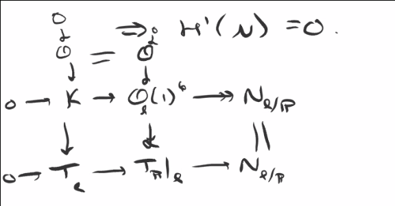

In particular, $T_\ell = \OO(2)$, and the LES for $0 \to \OO \to K \to T_\ell$ shows $H^1(K) = 0$.
Looking at the horizontal SES $0 \to K \to \OO_\ell(1)^6 \surjects N_{\ell/\PP}$ yields the surjection claim.
We have

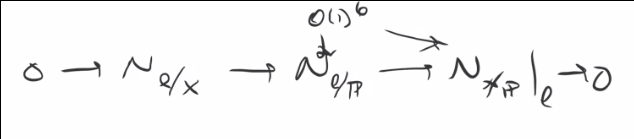

and taking the LES in cohomology yields

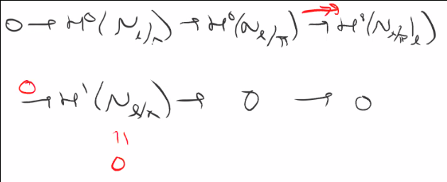\

Therefore $H$ is smooth at $\ell$ and
\[
\dim_\ell H
&= \chi(N_{\ell/X}) \\
&= \deg T_{X} - \deg T_\ell + 3 \\
&= \deg T_\PP - \deg N_{X/\PP} - \deg T_\ell + 3 \\
&= 6 - 3 - 2 + 3 = 4
.\]
:::

:::

:::{.remark}
It turns out that the Hilbert scheme of lines on a cubic has some geometry: the Hilbert scheme of two points on a K3 surface.
:::

## Abstract Deformations Revisited

Take $X_{0} / k$ some scheme and consider the deformation functor $F(A)$ taking $A$ to $X/A$ flat with an embedding $\iota: X_{0} \injects X$ with $\iota \tensor k$ an isomorphism.
Start with H1, the gluing axiom (regarding small thickenings $A' \to A$ and a thickening $A'' \to A$).
Suppose 
\[
X_{0} \injects X' \in F(A') \to F(A)
.\]
which restricts to $X_{0} \injects X$.
Then in $F(A)$, we have $X_{0} \injects X' \tensor_{A'} A$, and we obtain a commutative diagram where $X' \tensor A \injects X'$ is a closed immersion:

{width=350px}

The restriction $X' \to X$ means that there exists a diagram

\begin{tikzcd}
X' 
&  
& X
  \ar[ll, dotted, "\exists"] 
\\
& 
X
  \ar[ur, hook] 
  \ar[ul, hook]
\end{tikzcd}

Note that this is not necessarily unique.
We have

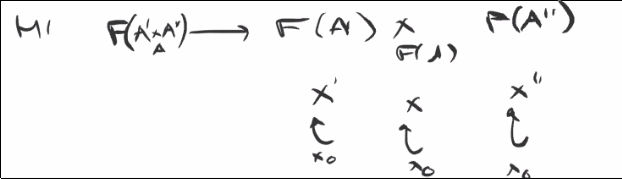{width=350px}

This means that we can find embeddings such that

\begin{tikzcd}
X'' & \ar[l, "\exists", hook] X \ar[r, "\exists", hook] & X' \\
& X_{0} \ar[ul, hook] \ar[u, hook] \ar[ur, hook]
\end{tikzcd}

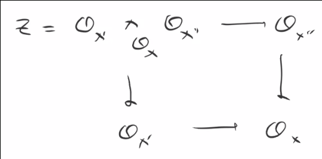{width=350px}

And thus if we have

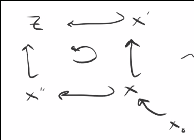{width=350px}

then $X_{0} \injects Z$ is **a** required lift (again not unique).

:::{.question}
When is such a lift unique?
:::

Suppose $X_{0} \injects W$ is another lift, then it restricts to both $X, X'$ and we can fill in the following diagrams:

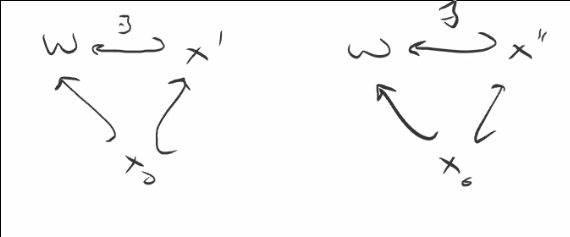{width=350px}

Using the universal property of $Z$, which is the coproduct of this diagram:

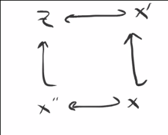{width=350px}

However, there may be no such way to fill in the following diagram:

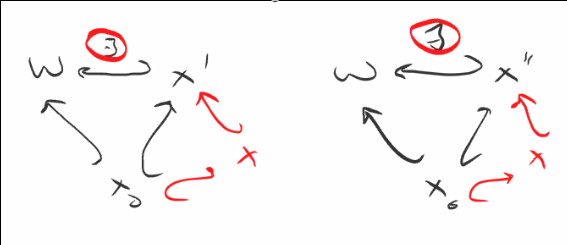{width=350px}

But if there exists a map making this diagram commute:

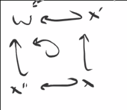{width=350px}

Then there is a map $Z\to W$ which is flat after tensoring with $k$, which is thus an isomorphism.[^nakayama_rmk]

:::{.remark}
Thus the lift is unique if

- $X = X_{0}$, then the following diagrams commute by taking the identity and the embedding you have.
  Note that in particular, this implies H2.

  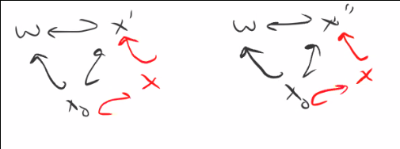{width=350px}

- Generally, these diagrams can be completed (and thus the gluing maps are bijective) if the map
\[
\aut(X_{0}\injects X') \to \aut(X_{0} \injects X)
.\]
of automorphisms of $X'$ commuting with $X_{0} \injects X$ is surjective.
:::

So in this situation, there is only *one* way to fill in this diagram up to isomorphism:

{width=350px}

If we had two ways of filling it in, we obtain bridging maps:

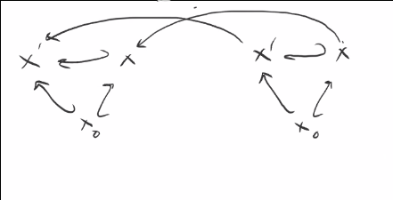{width=350px}

:::{.lemma title="?"}
If $H^0(X_{0}, T_{X_{0}}) = 0$ (where the tangent bundle always makes sense as the dual of the sheaf of Kahler differentials) which we can identify as derivations $D_{\OO_{k}}(\OO_{X_{0}}, \OO_{X_{0}})$, then the gluing map is bijective.
:::

:::{.proof title="?"}
The claim is that $\aut(X_{0} \injects X) = 1$ are always trivial.
This would imply that all random choices lead to triangles that commute.
Proceeding by induction, for the base case $\aut(X_{0} \injects X_{0}) = 1$ trivially.
Assume $X_{0} \injects X_{i}$ lifts $X_{0} \injects X$, then there's an exact sequence
\[
0 
\to 
\Der_{k}(\OO_{X_{0}}, \OO_{X_{0}}) 
\to  
\Aut(X_{0} \injects X_0') 
\to 
\Aut(X_{0} \injects X)
.\]
:::

Thus $F$ always satisfies H1 and H2, and $H^0(T_{X_{0}}) = 0$ (so no "infinitesimal automorphism") implies H4.
Recall that the dimension of deformations of $F$ over $k[\eps]$ is finite, i.e. $\dim t_{F} < \infty$
This is where some assumptions are needed.

If $X_{/K}$ is either

- Projective, or
- Affine with isolated singularities,

this is enough to imply H3.
Thus by Schlessinger, under these conditions $F$ has a miniversal family.

Moreover, if $H^0(T_{X_{0}}) = 0$ then $F$ is pro-representable.

:::{.example title="?"}
If $X_{0}$ is a smooth projective genus $g\geq 2$ curve, then

- Obstruction theory gives the existence of a miniversal family
- We have $\mathrm{obs} = H^2(T_{X_{0}}) = 0$, and thus the base of the miniversal family is smooth of dimension $\mathrm{def}(F) \dim H^1(T_{X_{0}})$,
- $H^0(T_{X_{0}}) = 0$ and $\deg T_{X_{0}} = 2-2g < 0$, which implies that the miniversal family is universal.

We can conclude
\[
\dim H^1(T_{X_{0}}) = -\chi(T_{X_{0}}) =  -\deg T_{X_{0}} + g-1 =  3(g-1)
.\]
:::

:::{.remark}
Note that the global deformation functor is not representable by a scheme, and instead requires a stack.
However, the same fact shows smoothness in that setting.
:::

## Hypersurface Singularities

Consider $X(f) \subset \AA^n$, and for simplicity, $(f=0) \subset \AA^2$, and let 

- $S = \CC[x, y]$.

- $B = \CC[x, y] / (f)$ 

:::{.question}
What are the deformations over $A \da k[\eps]$?
:::

This means we have a ring $B'$ flat over $k$ and tensors to an isomorphism, so tensoring $k\to A\to k$ yields the following:

\begin{tikzcd}
0 
	\ar[r] 
& B 
	\ar[r] 
& B'
	 \ar[r] 
& B 
	\ar[r] 
& 0 
\\
0
	\ar[r]
& S 
	\ar[u] 
	\ar[r] 
& S[\eps] 
	\ar[u, "\exists", twoheadrightarrow] 
	\ar[r] 
& S 
	\ar[r] 
	\ar[u] 
& 0
\\
0 
	\ar[r]
& S \cong I 
	\ar[u] 
	\ar[r] 
& I'= \gens{f'}
	\ar[u]
	\ar[r] 
& I = \gens{f} 
	\ar[u, "\cong"] 
	\ar[r]
& S
\end{tikzcd}

Thus any such $B'$ is the quotient of $S[\eps]$ by an ideal, and we have $f' = f + \eps g$.

:::{.question}
When do two $f'$s give the same $B'$?
:::

We have $\eps f' = \eps f$, so $\eps f \in (f')$ and we can modify $g$ by any $cf$ where $c\in S$, where only the equivalence class $g\in S/(f)$ matters.
Now consider $\aut(B \injects B')$, i.e. maps of the form
\[
x &\mapsto x + \eps a \\
y &\mapsto y + cb
\]
for $a, b\in S$.
Under this map,
\[
f_0' 
= f + \eps g \mapsto & f(x + \eps a, y + \eps b) + \eps g(x ,y) \\ \\
&\Downarrow \quad\text{implies} \\ \\
f(x, y) &= \eps a \dd{}{x} f + \eps b \dd{}{y} f + \eps g(x ,y)
,\]
so in fact only the class of $g\in S/(f, \del_{x} f, \del_{y} f)$.
This is the ideal of the singular locus, and will be Artinian (and thus finite-dimensional) if the singularities are isolated, which implies H3.
We can in fact exhibit the miniversal family explicitly by taking $g_{i} \in S$, yielding a basis of the above quotient.
The hull will be given by setting $R = \CC[[t_{1}, \cdots, t_{m} ]]$ and taking the locus $V(f + \sum t_{i} g_{i}) \subset \AA_{R}^2$.

:::{.example title="simple"}
For $f = xy$, then the ideal is $I = (xy, y, x) = (x, y)$ and $C/I$ is 1-dimensional, so the miniversal family is given by $V(xy + t) \subset \CC[[t_{1}]][x, y]$.
The greater generality is needed because there are deformation functors with a hull but no universal families.
:::

[^nakayama_rmk]: 
Recall that by Nakayama, a nonzero module tensor $k$ can not be zero.

