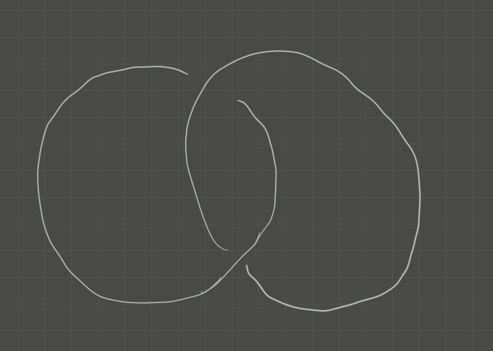
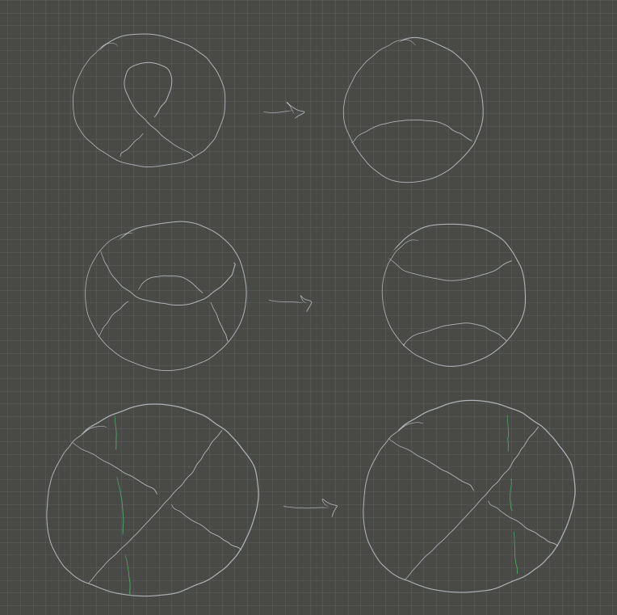
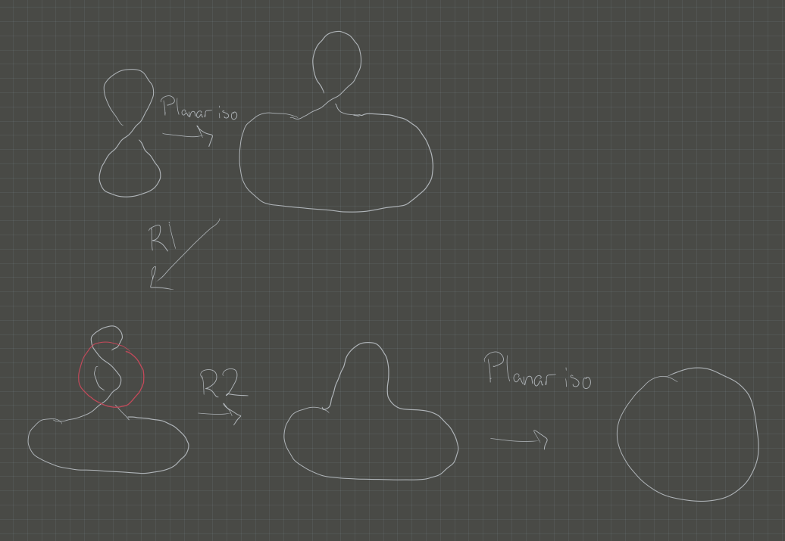
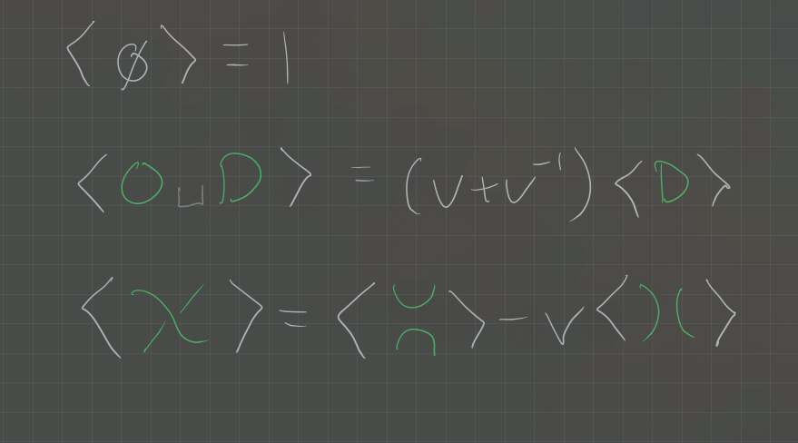
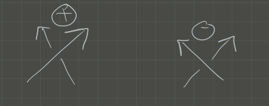
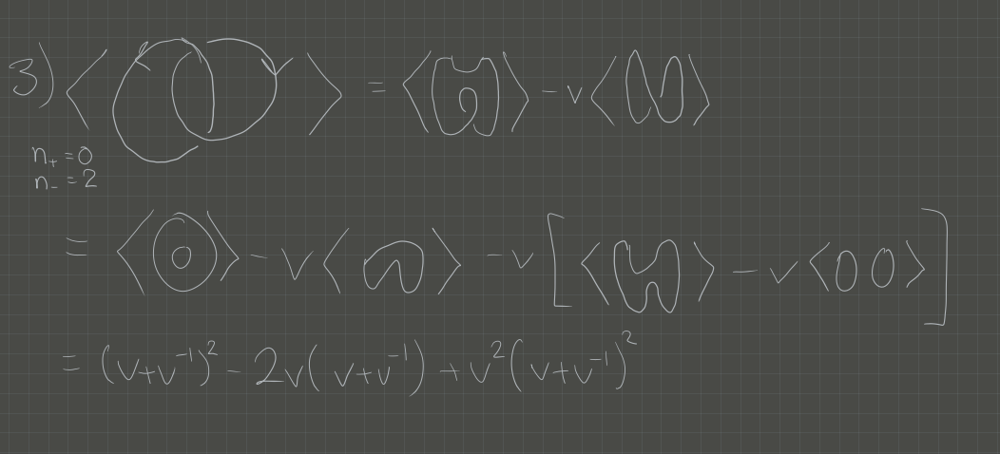
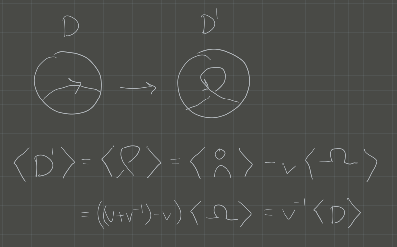

# Monday July 6th

## Motivation

We'll start with $X$ a finite CW complex.

:::{.definition title="CW Complex"}
A **CW complex** is a topological space built by inductively attaching $i\dash$dimensional discs ($i\dash$cells) $\DD^i \definedas \theset{\vector x\in \RR^i \suchthat \norm{\vector x} \leq 1}$ along their boundary $\bd \DD^i = S^{i-1} \definedas \theset{\vector x\in \RR^i \suchthat \norm{\vector x} = 1}$.
:::

:::{.definition title="Euler Characteristic"}
Define $\chi(X) = \sum_{i\in \ZZ} (-1)^i \abs{C_i}$ where $\abs{C_i}$ is the number of $i\dash$cells.
:::

:::{.remark}
Note that a homotopy equivalence between spaces induces an equality between Euler characteristics.
:::

Recall that we can define the cellular chain complex
\[
C_*^{\text{cell}}(X, \CC)\definedas \cdots \mapsvia{\del_{i+1}} C_n^{\text{cell}} (X, \CC) \mapsvia{\del_{i}} \cdots \to C_0^{\text{cell}}(X, \CC)
\]

and $H_i(X, \CC) \definedas \ker \del_i / \im \del_{i+1}$.

:::{.exercise title="?"}
\[
\sum (-1)^i \dim H_i(X, \CC) = \chi(X)
\]
:::

In this sense, cellular homology categorifies the Euler characteristic: we've replaced a set of objects with a category.
This is an improvement because we may not have maps between the elements of sets, *but* we do have maps between objects in a category.
We can also talk about things such as functoriality.

:::{.example}
The euler characteristic is a weaker invariant than homology.
Note that
\[  
\chi(S^1) = 0 &\quad\text{and}\quad \chi(S^1\disjoint S^1) = 0 \\ \\ 
H_0(S^1) = \CC &\quad\text{while}\quad H_0(S^1\disjoint S^1) = \CC\oplus \CC
,\]
so these aren't distinguished by euler characteristic alone.
:::

Our first goal will be to assign invariants to oriented links $L$, where homotopy equivalence will be replaced with isotopy.
We'll assign a Khovanov complex $C_*(L,\CC)$, a complex of $\ZZ\dash$graded $\CC\dash$vector spaces, along with the Jones polynomial $J(L) \in \ZZ[t, t\inv]$.
By taking the (graded) Euler characteristic of the chain complex, we'll recover $J(L)$.

## Setup

:::{.definition title="Links and Knots"}
A *link* $L$ is a smooth, closed 1-dimensional embedded submanifold of $\RR^3$. 
$L$ is a *knot* if it consists of one connected component.

:::

We have planar projections:

{width=250px}

Under this correspondence, isotopy of knots will correspond to planar isotopy of the diagrams and the following 3 Reidemeister moves:

:::{.definition title="Reidemeister Moves"}
There are three planar moves that preserve the isotopy class of a planar projection of a knot:

{ width=300px }

:::

:::{.example}
How to change knot diagrams using Reidemeister moves:

{ width=400px }

:::

We now want to take an oriented, planar link diagram $D$ and associate to it a polynomial $J(D)$.
We start by defining the Kauffman bracket

:::{.definition title="Kauffman Bracket"}
Let $D_f$ be $D$ with the orientation forgotten, then $\gens{D_f} \in \ZZ[v, v\inv]$ is defined recursively by

{width=400px}

In the last case, the first term is a "0-resolution/0-smoothing" and the second is a "1-resolution/1-smoothing".
:::

:::{.definition title="Positive and Negative Crossings"}
We have a notion of positive/negative crossings:

{width=300px}

:::

:::{.definition title="The Jones Polynomial"}
We set 
\[
J(D) = (-1)^{n_-} v^{n^+ - 2n_-} \gens{D_f}
.\]
:::

:::{.example}
\hfill

1. $J(S^1) = v + v\inv$

2. $J(?) = (-1) v^{-2} \qty{ -v^2 (v+v\inv)} = v+v\inv$.

3. $J(?) = v^{-6} + v^{-4} + v^{-2} + 1$ 

:::

:::{.proposition title="Invariance under Reidemeister moves"}
The Jones polynomial is invariant under move $R1$.
:::

:::{.proof}
Can be checked in diagrams:

{width=450px}

:::

:::{.remark}

You can now check that 
\[
J(D') = (-1)^{n_-(D)} v^{n_+(D) + 1} - 2n_-
.\]
:::

:::{.exercise title="?"}
Check invariance under R2, R3.
:::

