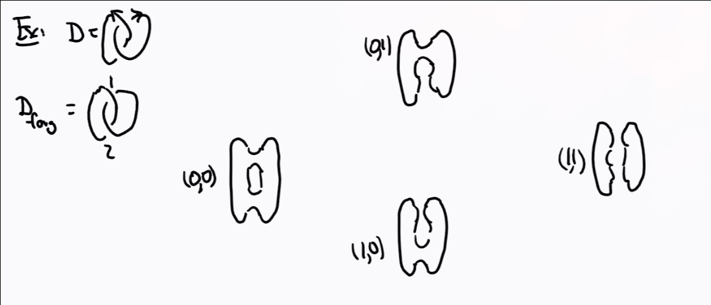
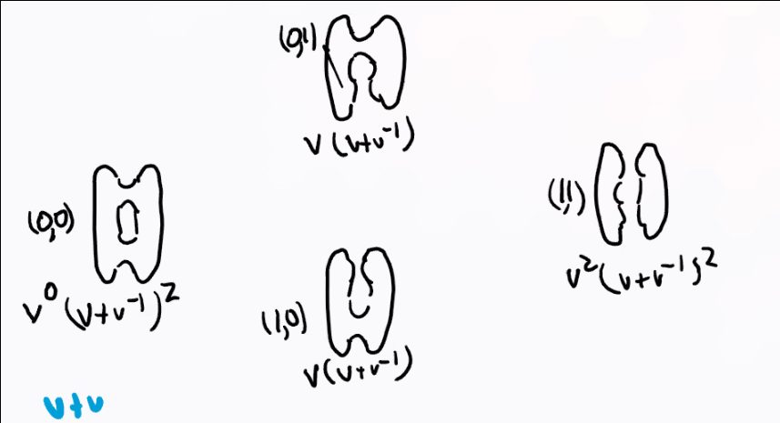
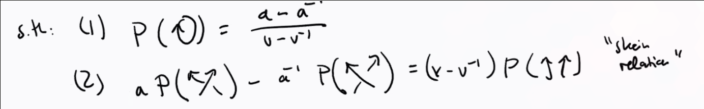

# Tuesday July 7th

Recall that we had recursive rules for computing the Kausffman bracket, and a normalization factor for the Jones polynomial that made it into an invariant.
We'd like a closed formula for these.

We do this by ordering the crossings of the unoriented link $1, \cdots, n$, then there is a correspondence
\[
\theset{0, 1}^n &\iff \text{Complete resolutions} \\
(\alpha_1, \cdots, \alpha_n) &\iff \alpha_i \text{ resolves the $i$th crossing}
.\]

:::{.example}

:::

:::{.claim}
\[
\gens{D} = \sum_{\alpha \in \theset{0, 1}^n} (-1)^{\abs \alpha}  v^{\abs \alpha} (v+v\inv)^{c_\alpha(D)}
,\]

where $\abs \alpha$ is the number of 1-resolutions and $c_\alpha$ is the number of circles in the resolution corresponding to $\alpha$.
:::

:::{.proof}
Idea: look at resolving the $n$th crossing locally and apply the recursive relation.
Then rewrite the sum by appending $\alpha_n = 0$ and $\alpha_n = 1$ respectively.
Note that we can rewrite the sum as 
\[
\sum_{r=0}^n (-1)^r \sum_{\abs \alpha = r} v^r (v+v\inv)^{c_\alpha(D)}
.\]

This amounts to summing over the "columns" in the previous diagram:

Here this yields
\[
(v+v\inv)^2 + (-1)2v(v+v\inv) + v^2 (v+v\inv)^2
.\]

:::

Note that this formula starts to resemble an Euler characteristic!

:::{.remark}
*Problem*:
The coefficient 
\[
\sum v^r(v+v\inv)^{c_\alpha(D)} \in \ZZ^{\geq 0}[v, v\inv]
\]
is a Laurent polynomial instead of a natural number, so this can't immediately be interpreted as a dimension of a vector space.

*Solution*: 
Replace finite-dimensional $\CC\dash$vector spaces by $\ZZ\dash$graded vector spaces.
The category consists of objects given by $V = \bigoplus_{i\in \ZZ} V_i$ and linear maps $f:V\to W$ such that $f(V_i) \subseteq W_i$ for all $i$.

:::

We previously had vector spaces categorifying the natural numbers by taking the dimension, so for graded vector spaces, we take the **graded dimension**:

:::{.definition title="Graded Dimension"}
\[
\grdim \bigoplus_{i\in\ZZ}V_i = \sum_{i\in \ZZ}\qty{\dim V_i}v^i \in \ZZ^{\geq 0}[v, v\inv]
.\]

:::

**Goal**:
We want to associate to an oriented link diagram $D$ a cochain complex of finite-dimensional graded $\CC\dash$vector spaces $C_i(D) \mapsvia{\bd} C_{i+1}(D) \to \cdots$.
Since each chain space decomposes, the differential does as well, and we get a large collection of chain complexes

<!--% https://tikzcd.yichuanshen.de/#N4Igdg9gJgpgziAXAbVABwnAlgFyxMJZABgBpiBdUkANwEMAbAVxiRAB12BjKCHBAL6l0mXPkIoAjOSq1GLNgGEA+sCykABJIEghI7HgJEATDOr1mrRCBVqA1NK069IDAfFEAzGbmW2nHj5BYVdRQwkSUklZCwVrAN5+XRC3MSMpKJj5KxtVdQ1iZxSwjxRTaPNspTyHTULk-TSI7wrfOI5uRODG8KIyYyy-eM6ghtD3dORpAcqh3LVNAFptMdTestIZtpzbLFqNZaKe0uRvLdichNGBWRgoAHN4IlAAMwAnCABbJDIQHAgkNJtkgwEwGAxqAw6AAjGAMAAKJXSIAYMBeODG7y+gOo-yQpmBw2hUDymhWkJhcMREwkKLRGJcWO+iAJeMQ3kJoPBFNhCKRtNR6MxH2ZABZcQDEABWWZxLkQlGUvk0tiChkhJlIGV-SUANlll3YxNJBR0PKp-NV9OF2MQ+p1SAA7AaQWCFVDedSmlahYyRUgABwSpAAThdiHl5uV3usaptzLDDsQkl+F38RpJCwO5MVnstsetfttKeDyaBaYjbqjXvWdN9FAEQA-->
\begin{tikzcd}
\cdots \arrow[r] & {C_{i, 1}} \arrow[r, "{\bd_{i, 1}}"]   & {C_{i+1, 1}} \arrow[r]  & \cdots \\
\cdots \arrow[r] & {C_{i, 0}} \arrow[r, "{\bd_{i, 0}}"]   & {C_{i+1, 0}} \arrow[r]  & \cdots \\
\cdots \arrow[r] & {C_{i, -1}} \arrow[r, "{\bd_{i, -1}}"] & {C_{i+1, -1}} \arrow[r] & \cdots
\end{tikzcd}

This yields two gradings: the first is homological, the second is "internal".

:::{.remark}
We want the following:

1. If $D, D'$ are related by a finite sequence of Reidemeister moves, then 
\[
H_{i, j}(C_{\wait, \wait}(D)) = H_{i, j}(C_{\wait, \wait}(D')) = \ker \bd_{i, j} / \im \bd_{i-1, j} \text{ for all }i, j.
\]

2. Additionally,
\[
J(D) = \chi_{\gr}(C_{*, *}(D)) = \sum_{i\in \ZZ} (-1)^i \grdim \qty{ C_{*, *}(D) }
\]

Note that you can also take the dimension of the homology instead, and at the end of the day this yields $\sum_{i, j\in \ZZ} (-1)^i v^j \dim(H_{i, j})$.
:::

:::{.definition title="Homogeneous elements"}
For $A = \bigoplus A_i, B = \bigoplus B_i$, $a\in A$ is called *homogeneous* of degree $k$ if $a\in A_k$, i.e. it is a sum of basis elements from only the $k$th graded piece.
In this case we say $\abs a = k$.
:::

:::{.proposition title="Bases for various combinations of graded spaces"}
We can union bases over all graded pieces to get a basis for the entire space.

For direct sums $A\oplus B$, a basis is given by $(\alpha_i, 0)$ and $(0, \beta_j)$.
We put $\alpha_i$ in degree $\abs{\alpha_i}$, in which case
\[
\grdim(A\oplus B) 
&= \sum_{k\in \ZZ} \dim(\qty{A\oplus B}_k) v^k \\
&= \sum_k \dim A_k v^k + \sum \dim B_k v^k \\
&= \grdim(A) + \grdim(B)
,\]
so taking direct sums commutes with taking graded dimensions.

Similarly for tensor products $A\tensor_\CC B$, we get a basis $\alpha_i \tensor \beta_j$ placed in degree $\abs{\alpha_i}  + \abs{\beta_j}$. 
:::

:::{.exercise title="?"}
Show that
\[
\grdim(A\tensor_\CC B) = \grdim(A) \cdot \grdim(B)
.\]
:::

We also have degree shifts by $i$ for any $i$, denote $A(i)$, where $A_j \mapsto A_{j+i}$ for every $j$.
Thus the $k$th graded piece is given by $(A(i))_k = A_{k-i}$, thus 
\[
\grdim(A(i)) = v^i \grdim(A)
\]

:::{.example title="Important"}
\[  
H^*(S^2; \CC)
=
\begin{cases}
\CC & * = 0, 2 \\
0 & \text{else}.
\end{cases}
\]

Let $A\definedas H^*(S^2; \CC)(-1)$, which now has $\CC$ in degrees $\pm 1$, and $\grdim A = v + v\inv$.

Note that

- $(v+v\inv)^2$ corresponds to $A^{\tensor 2}$.
- $2v(v+v\inv)$ corresponds to $A(1)^{\oplus 2}$.
- $v^2(v+v\inv)$ corresponds to $A^{\tensor 2}(2)$.

So we can assemble these into a chain complex and take the Euler characteristic in order to recover the Kauffman bracket in the earlier example.
:::

:::{.theorem title="?"}
There exists a unique isotopy invariant of oriented links in $\RR^3$ called $P(D) \in \CC(a, v)$, a rational function in two variables, the HOMFLY-PT polynomial.
It satisfies

 

:::

:::{.example title="The Hopf Link"}
Yields
\[
P(D) = -a(aia\inv) + a^2 \qty{a-a\inv \over v-v\inv}^2
.\]

:::

