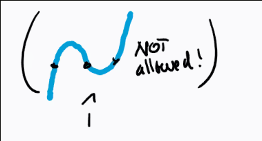
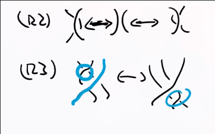
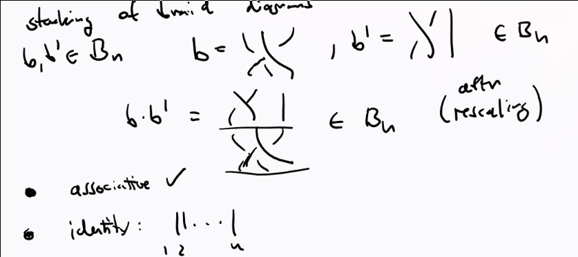
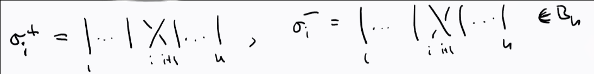
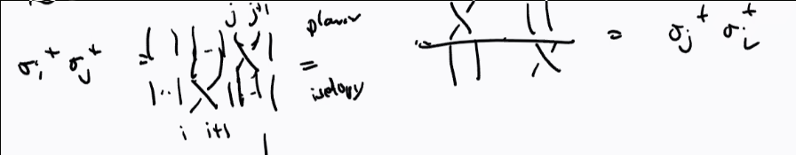
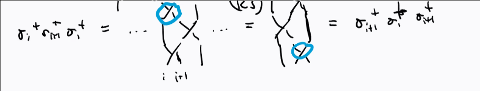
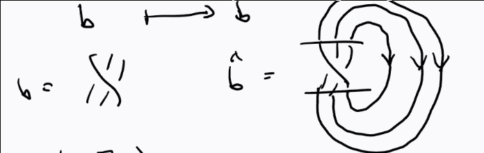

# Wednesday July 8th

Recall that we assigned a chain complex of graded vector spaces to links, where the chains where various tensor powers and shifts of $\mca \definedas H^*(S^2; \CC)(-1)$.
We can consider the diagonal embedding
\[
S^s \mapsvia{\Delta} S^2 \cross S^2
\]

which induces maps on both cohomology and homology, and applying the Kunneth formula and the Poincare isomorphism, we get maps
\[
m:      H^*(S^2)^{\tensor 2} &\to H^*(S^2) \\
\delta: H^*(S^2) &\to H^*(S^2)^{\tensor 2}
.\]

We thus get maps
\[
m:        \CC[x]/(x^2) \tensor \CC[x]/(x^2) &\to \CC[x]/(x^2) \\
\delta:   \CC[x]/(x^2) &\to \CC[x]/(x^2) \tensor \CC[x]/(x^2)
.\]

See course notes for how to construct differentials out of these, categorifying the bracket, and how to correct with shifts to categorify the Jones polynomial.

## Lecture 3

:::{.definition title="Geometric Braids"}
For $n\geq 1$, the geometric braid $b$ on $n$ strands is a topological subspace of $\RR^2 \cross [0, 1]$ such that

a. $b \cong \disjoint_{i=1}^n [0, 1]$ is a homeomorphism
b. We have 
  \[
  b\intersect (\RR^2 \cross \theset{0}) &= \theset{(1,0,0), \cdots, (n,0,0)} \\
  b\intersect (\RR^2 \cross \theset{1}) &= \theset{(1,0,1), \cdots, (n,0,1)}
  .\]
c. The projection $\RR^2 \cross [0, 1] \mapsvia{\pr_2}$ maps each strand homeomorphically onto $[0, 1]$.

:::

:::{.remark}
Braids can be moved via isotopy, and part (c) prevents the following situation:

{width=250px}

:::

There is a purely combinatorial description, namely braid diagrams.
Isotopies on the geometric side will correspond to planar isotopies and Reidemeister moves R2 and R3 (since R1 is ruled out).

{width=250px}

:::{.theorem title="?"}
Two braids are isotopic iff their diagrams are related by planar isotopy and a finite sequence of Reidemeister moves.
:::

:::{.definition title="The Braid Monoid"}
Define $B_n$ to be the set of braid diagrams on $n$ strands up to isotopy and Reidemeister moves, then there is a multiplication given by stacking braid diagrams.
This is associative with identity, so we obtain a monoid:

{width=650px}

:::

:::{.definition title="Elementary braids"}
We define elementary braids:

:::

:::{.remark}
\hfill

- $\theset{\sigma_i^\pm}_{i=1}^{n-1}$ generates $B_n$ as a monoid, so $\beta \in B_n$ implies 
\[
\beta = \prod_{k=1}^n \sigma_{i_k}^{\eps_k} \text{ where } i_k \in \theset{1, \cdots, n-1} \text{ and }\eps_j \in \theset{\pm 1}
.\]

- $\sigma_i^+ \sigma_i^- = \sigma_i^- \sigma_i^+ = 1$ for all $i$, thus every braid $b$ has a two-sided inverse given by reversing the $\sigma_{i_k}$s and swapping $\pm$, so $B_n$ is a group.

We can describe this group completely algebraically as $B_n^{\text{Artin}}$, the group generated by $\theset{\sigma_i}_{i=1}^{n-1}$ with relations 
\[  
\sigma_i \sigma_j &= \sigma_j \sigma_i && \text{for } \abs{i-j} \geq 2 \\ 
\sigma_i \sigma_{i+1} \sigma_i &= \sigma_{i+1} \sigma_i \sigma_{i+1} &&  \text{for } i\in \theset{1, \cdots, n-2}
.\]

:::

:::{.proposition title="?"}
There is an isomorphism
\[
B_n^{\text{Artin}} &\mapsvia{\cong} B_n \\
\sigma_i &\mapsto \sigma_i^+ \\
\sigma_i\inv &\mapsto \sigma_i^-
.\]

:::

:::{.proof}
\hfill

**Well defined**:
Need to check that the map preserves the relations, this is a consequence of changing height of crossings by planar isotopy:

 

- Surjectivity: clear by definition of map.

- Injectivity: omitted.

:::

:::{.remark}
Importantly, we have a way of going from braids to knots and links.
Let $D^{\text{or}}$ be the set of oriented planar link diagrams, then define a map
\[
B_n &\to D^{\text{or}} \\
b &\mapsto \hat b
\]

where $\hat b$ is given by "closing" the braid:

:::

:::{.theorem title="?"}
Every oriented link in $\RR^3$ is isotopic to a closed braid.
:::

:::{.remark}
In fact, there is a map
\[
\disjoint_{n\geq 1} &\surjects D^{\text{or}} /\sim \\
b & \mapsto \hat b
\]
 
where the RHS is the equivalence relation generated by planar isotopy and Reidemeister moves.
This is not injective, since many braids can map onto the unknot.
:::

