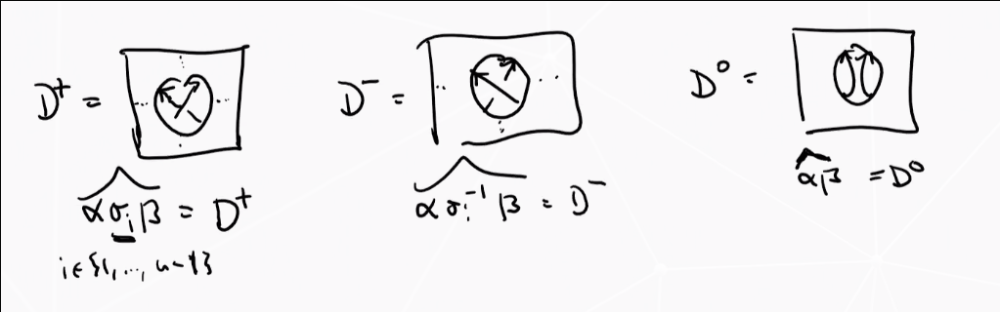

# Friday July 10th

## The Iwahori-Hecke Algebra

:::{.definition title="Iwahori-Hecke Algebra"}
For $n\geq 1$ and $R$ a commutative ring with $q,z \in R\units$, define the *Iwahori-Hecke algebra* $H_n^R(q, z)$ is the associative unital $R\dash$algebra 
\[
\gens{T_i \suchthat R} \text{where the relations $R$ are defined by } \\
T_i T_j &= T_j T_i && \abs{i - j} \geq 2 \\
T_i T_{i+1} T_i &= T_{i+1} T_i T_{i+1} \\
T_i^2 &= zT_i q1
\]
where $1$ is the unit of the algebra.
The first relation is the *braid relation*, the other two are *quadratic* or *skein* relations.

:::

:::{.theorem title="Basis of the Hecke Algebra"}
\hfill

1. For all $w \in S_n$, there exists a unique $T_w\in H_n^R(q, z)$ such that whenever $w = \prod s_{i_k}$ is a minimal expression as a product of simply transpositions, then $T_w = \prod T_{i_k}$.
2. The set $\theset {T_w \suchthat w\in S_n}$ is an $R\dash$module basis of $H_n^R(q, z)$ (the standard basis).
:::

:::{.remark}
\hfill

1. $H_n^R(q, z)$ is a two-parameter generalization of $C(\dcoset B G B)$, and in fact there is an $R\dash$algebra isomorphism 
\[
H_n^\CC(q, q-1) &\cong C(\dcoset B G B)\\
T_w &\mapsto \delta_w
.\]

2. There is an $R\dash$algebra isomorphism $H_n^R(1, 0) \cong R[S_n]$, so we interpret this as a deformation of the group algebra $R[S_n]$.

3. There is an $R\dash$algebra isomorphism 

  \[
  H_n^R(q, z) \cong H_n^R(q, z) \cong R[B_n] / \gens{T_i^2 - zT_i - q\cdot 1}
  \]
  as a quotient of the group algebra on the braid group.

There is also an $R\dash$algebra morphism
\[
\iota_n: H_n^R(q, z) &\to H_{n+1}^R(q, z) \\
T_i &\mapsto T_i
.\]

:::

:::{.theorem title="?"}
There exists a unique collection of $R\dash$linear maps for $n\geq 1$:
\[
\tr_n: H_n^R(q, z) &\to R
.\]

This is uniquely determined by the properties
\[
\tr_n(ab) &= \tr_n(ba) 
&& \forall a,b\in H_n^R(q ,z) \\
\tr_{n+1}(\iota(a) T_n) &= \tr_n(a) = \tr_{n+1} (\iota(a) T_n\inv) 
&&\forall a\in H_n^R(q, z) \\
\tr_{n+1}(\iota(a)) &= {1 - q \over z} \tr_n(a) 
&&\forall a \in H_n^R(q, z) \\
\tr_1(1) &= {1 -q \over z}
.\]

:::

:::{.proof}
See KT, slightly technical. Just have to do it and show uniqueness.
:::

:::{.remark}
Note that a function from the braid group satisfying the first two conditions gives a Markov function.
:::

:::{.example}
Take $n=3$.
Let $1\in H_3^R(q, z)$.
\[
\tr_3(1) \in H_3 
&= {1 -q \over z} \tr_2(1) \in H_2 \\
&= \qty{1 - q \over z}^2 \tr_1(1) \in H_1 \\
&= \qty{1-q \over z}^3
.\]

Now consider $T_1$. 
Using the fact that $a=1 \implies \iota(a) = 1$,
\[
\tr_3(T_1) 
&= {1-q \over z} Z \tr_2(T_1) \\
&= Z \tr_1(1) \\
&= Z^2 \\
&= \tr_3(T_2) \quad Z  \\
&= {1-q \over z}
.\]

Now using relation 2 twice,
\[
\tr_3(T_1 T_2) = \tr_2(T_1) = \tr_1(1) = Z = \tr_3(T_2 T_1)
.\]

Now using the quadratic relation,
\[
\tr_3(T_2 T_1 T_2) 
&= \tr_3(T_1 T_2^2) \\
&= \tr_3(zT_1 T_2 + qT_1) \\
&= z\tr_3(T_1 T_2) + q\tr_1(T_1) && \text{by } R\dash\text{linearity}\\
&= zZ = qZ^2
.\]
:::

:::{.theorem title="?"}
The family $\theset{\tr_n \circ w_n: B_n \to R}_{n\geq 1}$ defined by

\begin{tikzcd}
B_n \ar[r, "w_n"] & H_n^R(q, z)\units \ar[r, "\tr_n"] & R \\
\sigma_i \ar[r] & T_i \ar[r] & \tr_n(T_i)
\end{tikzcd}
\[
\]
is a Markov function.

:::

:::{.proof}
Clear, because the first two relations are defined precisely to do this.
:::

:::{.remark}
Taking $R = \CC(a, v)$ with $q = a^{-2}$ and $z = a\inv(v - v\inv)$ precisely recovers the HOMFLY-PT polynomial!
More precisely, if $D$ is an oriented link diagram with $b\in B_n$ and $\hat b = D$, then $P(D) = \tr_n(w_n(b))$.

\[
T_i^2 - zT_i -q1= 0 
&\mapsvia{\cdot T_i\inv} T_i -z1 - qT_i\inv = 0 \\
&\implies T_i - a\inv(v-v\inv)1 - a^{-2} T_i\inv = 0 \\
&\implies aT_i - (v-v\inv)1 - a\inv T_i\inv = 0
.\]

Note that since HOMFLY was a unique invariant, it suffices to check that this polynomial satisfies the skein relations and takes the correct value on the unknot.

To see that it takes the right value on the unknot, we can compute
\[
\tr_1(w_1(1)) = \tr_1(1) = {1-q \over z} = {1 - a^{-2} \over a\inv(v - v\inv)} = {a\inv(a - a\inv) \over a\inv(v - v\inv)} = {a-a\inv \over v-v\inv}
.\]

Then to check that it satisfies the skein relations,
given an oriented link diagram, write the various resolutions at closures of braids:

\[
&a \tr_n \circ w_n(\alpha \sigma_1 \beta)- a\inv \tr_n \circ w_n (\alpha \sigma_i\inv \beta) - (v-v\inv) \tr_n \circ w_n(\alpha \beta) \\ \\
&= a \tr_n \qty{ w_n(\alpha) T_i w_n(\beta)} - a\inv \tr_n \qty{ w_n(a) T_i\inv w_n(\beta)} - (v-v\inv) \tr_n\qty{ w_n(\alpha) w_n(\beta)} \\ \\
&= \tr_n \qty{ a \qty{ w_n(\alpha) T_i w_n(\beta)} - a\inv \qty{ w_n(a) T_i\inv w_n(\beta)} - (v-v\inv) \qty{ w_n(\alpha) w_n(\beta)}} \\ \\
&= \tr_n\qty{ w_n(\alpha) \qty{ aT_i - a\inv T_i\inv - (v-v\inv)  }w_n(\beta) } \\ 
&= 0
.\]

:::

## Categorifying the Hecke Algebra

Idea: to categorify HOMFLY-PT, we will try to categorify the Hecke algebra.
This doesn't quite make sense yet: what does it mean to categorify an entire algebra instead of just a number?

:::{.definition title="Additive Categories"}
A category $\mca$ is *additive* iff

1. The homs $\mca(X, Y)$ is a $\ZZ\dash$module for all $X, Y\in \mca$
2. $\mca(X, Y) \cross \mca(Y, Z) \to \mca(X, Z)$ where $(f, g) \mapsto g\circ f$ is $\ZZ\dash$bilinear.
3. $\exists 0\in \mca$, an object that is both initial and terminal.
4. For all $X, Y\in \mca$, there exists a coproduct $X\oplus Y$
:::

:::{.definition title="Initial Objects"}
Recall that an object $I$ is initial in $A$ iff for every $X$ there exists a unique $I\to X$, and terminal iff there exists a unique $X\to I$.
:::

:::{.definition title="Coproduct"}
Recall that a coproduct of $X, Y$ is an object $X\oplus Y$ with two morphism $\iota_X: X\to X\oplus Y, \iota_Y: Y\to X\oplus Y$ satisfying the appropriate universal property.
:::

:::{.example}
$R\dash$bimodules over $R$ a ring.
:::

:::{.definition title="Essentially Small"}
An additive category $\mca$ is *essentially small* iff the isoclasses $[X]$ of objects form a set.
:::

:::{.definition title="Split Grothendieck Group"}
Assume $\mca$ is additive and essentially small.
Then we can define a free abelian group on 
\[
F(\mca) \definedas \theset{[X] \suchthat X\in \mca}
\]
along with a subgroup
\[
N(\mca) \definedas \theset{[X\oplus Y] - [X] - [Y]}
.\]
Define the *split Grothendieck group* as the following:
\[
K_0^\oplus \definedas F(A) / N(A)
\]
:::

:::{.remark}
Note that this starts to look like categorification: we can express direct sums in terms of sums in a module.
Notation: mod denotes finitely generated, Mod denotes full categories.
:::

:::{.example}
$\mca = k\dash$mod, the category of finite-dimensional $k\dash$vector spaces.
There is a well-defined group morphism defined on generators
\[
\phi: F(\mca) &\surjects \ZZ \\
[V] &\mapsto \dim_k(V)
\]
which is surjective since $-[V]$ exists in the domain and $[k^n] \mapsto n$ for all $n$.

Note that this will factor through $K_0^\oplus(\mca) = F(\mca)/ N(\mca)$ via a map $\bar\phi$ iff $N(\mca) \subseteq \ker \phi$.
We can check
\[
\phi\qty{[V\oplus W] - [V] - [W] } 
= \dim(V\oplus W) - \dim(V) - \dim(W) = 0
.\]

:::{.claim}
$\phi$ is actually injective.
:::

:::{.proof}
Suppose 
\[
0 = \bar\phi\qty{ \sum \lambda_i [V_i]} = \sum \lambda_i \bar \phi([V_i]) = \sum \lambda_i \dim(V_i)
.\]

We can now check
\[
\sum \lambda_i [V_i] = \sum \lambda_i \dim(V_i) [k] = [k] \sum \lambda_i \dim(V_i)
,\]
where we use the fact that if $\dim V = n$, then $[V] = [k^n] = n[k]$.
:::

:::

:::{.definition title="Categorification"}
Let $G$ be an abelian group, then $\mca$ **categorifies** $G$ iff $K_0^\oplus(\mca) \cong G$.
:::

