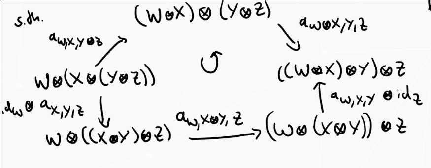
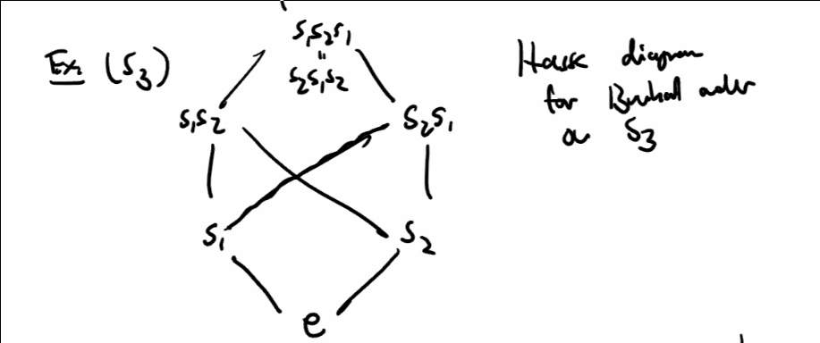
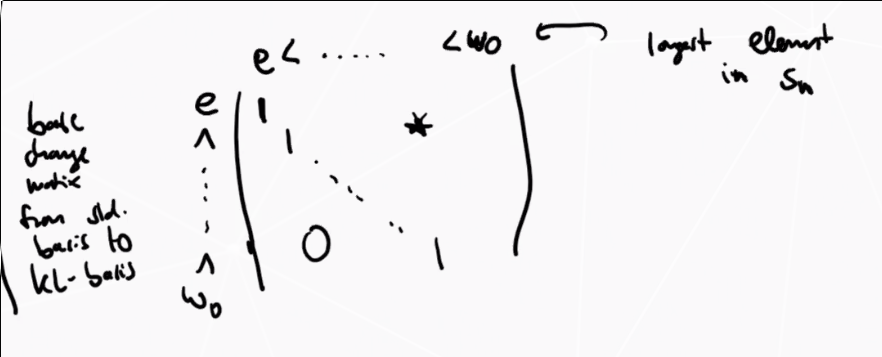

# Monday July 13th

## Ring structure on $K_0^\oplus(\id)$.

:::{.definition title="Monoidal Categories"}
A *monoidal category* is a tuple $(\mcc, \wait \tensor \wait, 1, \alpha, \ell, r)$ such that

- $\mcc$ is a category
- $\wait \tensor \wait: \mcc \cross \mcc \to \mcc$ is a bifunctor.
- $1\in \mcc$
- Natural isomorphisms 
  \[
  \alpha_{X,Y,Z}: (X\tensor Y)\tensor Z \mapsvia{\cong} X\tensor (Y\tensor Z)
  \] 
  for all $X,Y,Z\in \mcc$ (associators).
- Natural isomorphisms 
\[
\ell_X: 1\tensor X &\mapsvia{\cong} X\\
r_X:X\tensor 1 &\mapsvia{\cong}X
\] and for all $X\in \mcc$.

Along with coherence axioms: for all $W,X,Y,Z\in \mcc$,

\begin{tikzcd}
X \tensor(1\tensor Y)\ar[rd, "\id_x \tensor \phi_Y"] \ar[rr, "\alpha_{X, 1, Y}"] & & X\tensor 1 \tensor Y \ar[ld, "r_X \tensor \id_Y"] \\
& X\tensor Y &
\end{tikzcd}

:::

:::{.remark}
If $\mcc$ is additive, we require $\wait \tensor \wait$ to be biadditive, i.e. $X\tensor \wait$ and $\wait \tensor Y$ are additive functors.
In particular, 
\[
X\tensor (V\oplus W) \cong (X\tensor V) \oplus (X\tensor W)
\] 
and similarly 
\[ 
(V\oplus W) \tensor Y \cong (V\tensor Y) \oplus (W\tensor Y)
.\]
:::

:::{.example}
$\rmod$ with $R$ a commutative unital ring, take $\tensor \definedas \tensor_R$ with $1$ the "regular left $R\dash$module" ${}_R R$ with $R$ acting on the left by multiplication.
Similarly, $R\dash$bimodules, take $1 = {}_R R_R$.
:::

:::{.proposition title="?"}
If $\mca$ is additive and $(\mca, \tensor, 1, \alpha, \ell, r)$ is monoidal, then setting $[X] \cdot [Y] \definedas [X\tensor Y]$ defines a ring structure on $K_0^\oplus(\mca) = F(\mca) / N(\mca)$.
:::

:::{.proof}
\hfill

- This is well-defined on $F(\mca)$.
- Unital: Check $[X][1] = [X\tensor 1] = [X] = [1\tensor X] = [1][X]$
- Associativity: 
\[
([X][Y])[Z] 
&= [X\tensor Y][Z] \\
&= [(X\tensor Y) \tensor Z]  \\
&= [X\tensor (Y\tensor Z)]  \\
&= [X][Y\tensor Z] = X([Y][Z])
.\]
- Distributive: Check.

Therefore $F(\mca)$ is a unital ring.

- Check $N(\mca) \subseteq F(\mca)$ is a two-sided ideal (use the isomorphism from the earlier remark.)
:::

:::{.example}
The group morphism $\bar \phi: K_0^\oplus(\kmod) \mapsvia{\cong} \ZZ$ is in fact a ring morphism.

- Check 
\[
\bar \phi([V][W]) 
&= \bar\phi([V\tensor_k W]) \\
&= \dim(V\tensor_k W) \\
&= \dim(V) \dim(W) \\
&= \bar\phi([V]) \bar\phi([W])
.\]
- Check $\bar\phi([k]) = \dim k = 1$.

For $\mca$ an additive category, for all $i\in \ZZ$ there exist additive functors

\[
(i): \mca &\to \mca \\
X &\mapsto (i)(X) = X(i)
.\]
:::

:::{.remark}
These satisfy $(j) \circ (i) = (i+j)$ and $(0) = \id_\mca$, so they will correspond to degree shifts.
:::

:::{.proposition title="?"}
Setting $v^i[X] \definedas [X(i)]$ defines a $\ZZ[v, v\inv]\dash$module structure on $K_0^\oplus(\mca)$.
:::

:::{.proof}
\hfill

- Check that this is well-defined on $F(\mca)$; the module axioms will follow from the above remark.

- Check that is descends to the quotient, i.e 
  \[
  v^i([X\oplus Y] -[X] - [Y])
  &= v^i]X\oplus Y - v^i[X] - v^i [Y] \\
  &= [(X\oplus Y)(i)] - [X(i)] - [Y(i)] \\
  &= [X(i)\oplus Y(i)] - [X(i)] - [Y(i)]
  .\]
:::

:::{.exercise title="?"}
Show that $K_0^\oplus(k\dash\text{grmod}) \cong \ZZ[v, v\inv]$ where $[v] \mapsto \sum_{k\in \ZZ} \dim(V_n)v^n$ is an isomorphism of $\ZZ[v,v\inv]\dash$modules (and in fact an isomorphism of $\ZZ[v,v\inv]\dash$algebras).
:::

:::{.remark}
For $(\mca, \tensor, 1, \alpha, \ell, r)$ a monoidal category with additive functors $(i)$ as above, if
\[
(i) \circ (X\tensor \wait) \cong (X\tensor \wait) \circ (i) \\
(i) \circ (\wait \tensor Y) \cong (\wait \tensor Y) \circ (i) 
\]
using the fact that 
\[
(X\tensor Y)(i) \cong X \tensor (Y(i)) \cong (X(i)) \tensor Y
.\]
Thus $K_0^\oplus(\mca)$ is a $\ZZ[v, v\inv]\dash$algebra.
:::

Recall that $H_n^R(q, q-1)$ taking $R = \ZZ[v, v\inv]$ with $q=v^{-2}$ and $q-1 = z$ was the Iwahari-Hecke algebra, generated by $\theset{T_i}_{i\leq n-1}$ and the braid/skein relations.

Substitute $Hs_i = vT_i$ (Soergel's correction) to obtain a new presentation of $H_n^{\ZZ[v, v\inv]}(v^{-2}, v^{-2}-1)$.
The generators are now $\ts{ H_{s_i} \st i\leq n-1}$ and 
\[  
H_{s_i} H_{s_{i+1}} H_{s_i} 
&= H_{s_{i+1}} H_{s_i} H_{s_{i+1}} \\
H_{s_i} H_{s_j} 
&= H_{s_j}  H_{s_i} 
&& 
\abs{i-j} \geq 2 \\
H_{s_i}^2 
&= v^2 T_i^2 \\
&= v^2 \qty{ (v^{-2} - 1)T_i + v^{-2}1} \\
&= (1-v^{-2}) T_i + 1 \\
&= (v\inv - v) H_{s_i} +1
.\]

Notation: we'll abbreviate $\mch(S_n) = H_n^{\ZZ[v, v\inv]} (v^{-2}, v^{-2} - 1)$.
There is a standard basis
 \[  
H_w \definedas H_{s_{i_1}} \cdots H_{s_{i_r}} = v^{\ell(w)} T_w 
&&
w\in S_n,\,\, 
w = s_{i_1} \cdots s_{i_r}, \,\, 
\ell(w) = r
 .\]
where $w$ is written as a minimal length reduced expression.

## Some technical tools

(1) The Bruhat order.

This is a partial order on the symmetric group $S_n$ where $w'\leq w$ iff there exists a word for $w'$ obtained by deleting some $s_i$ from the reduced expression for $w$.

:::{.example}
For $S_3$:

:::

(2) The Bar involution.

There is a ring morphism 
\[
\mch(S_n) &\to \mch(S_n) \\
h &\mapsto \bar h
.\]
uniquely determined by $\bar{H_{s_i}} = H_{s_i\inv}$ (which incidentally equals $H_{s_i} + (v-v\inv)1$) and $\bar v = v\inv$.

:::{.theorem title="KL-Soergel"}
For all $w\in S^n$ there exists a unique $C_w \in \mch(S_n)$ such that

1. $\bar{C_w} = C_w$, self-duality
2. $C_w = H_w + \sum_{x < w} h_{x, w} H_x \in v\ZZ[v]$, upper triangularity.
:::

:::{.definition title="?"}
$\theset{C_w \suchthat w\in S_n}$ is the *KL-basis* of $\mch(S_n)$.
:::

This is a basis because we can refine $\leq$ to a total order, then write a change-of-basis matrix from the standard basis to this:

The elements $h_{x, w} \in \ZZ[v, v\inv]$ are called the *KL-polynomials* where we set $h_{w, w} = 1$ and $h_{x, w} = 0$ when $x\not\leq w$.

:::{.example}
Note $C_e = H_e$ and 
\[  
C_{s_1} &= H_{s_1} + v1 \\
C_{s_2} &= H_{s_2} + v1
.\]

Thus (2) is satisfied, and (1) follows from
\[
\bar{C_{s_i}} 
&= \bar{H_{s_i} + v_1} \\
&= \bar{H_{s_1}} + \bar{v} 1 \\
&= H_{s_i\inv} + v\inv 1 \\
&= H_{s_i} + (v-v\inv)1 + v\inv 1 \\
&= H_{s_i} + v1
.\]

Can also check that
\[
C_{s_1 s_2} &= C_{s_1 s_2} 
&&\text{automatically self-dual} \\
&= (H_{s_1} + v) (H_{s_2} + v) \\
&= H_{s_1} H_{s_2} + v H_{s_2} + vH_{s_1} + v^2
.\]

Similarly expand $C_{s_2 s_1} = H_{s_2 s_1} + vH_{s_1} + vH_{s_2} + v^2$.

Finally compute 

\[
C_{s_2} C_{s_1} C_{s_2} 
&= (H_{s_2 s_1} +v H_{s_1} + vH_{s_2} + v^2 )(H_{s_2} + v) \\
&= H_{s_2 s_1 s_2} + v H_{s_1 s_2} + v H_{s_2}^2 + v^2 H_{s_2} = v H_{s_2 s_1} + v^2 H_{s_1} + v^2 H_{s_2} + v^4
.\]

Note that coefficients need to be contained in $v\ZZ[v]$ but we still need self-duality.
:::

