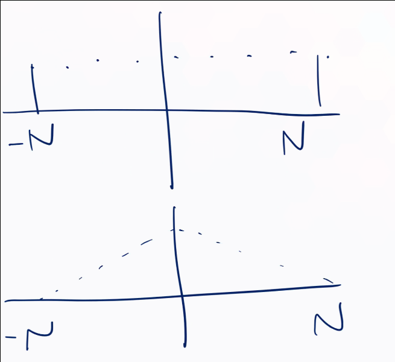
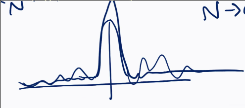

# Monday July 6th

We define $e(n\theta) \definedas e^{2\pi i n \theta}$ where $n\in \ZZ$ and $\theta \in \RR/\ZZ$, i.e. $\theta \in [0, 1]$.
Note that $e(n(\theta + t)) = e(n\theta)$ for $t\in \ZZ$.

We'll define a Fourier series as a sum $\sum_{n\in \ZZ} f(n) e(n\theta)$, which may or may not converge.
We'll restrict our attention to coefficient functions $f$ which are supported on finite subsets $A\subset \ZZ$, in which case the sum is a bona fide function.

Note that if the phase $n$ is zero, then $\int_0^1 e(n\theta) \,d\theta = \int_0^1 \cos(2\pi n \theta) + i\sin(2\pi n \theta)$. 
But these are periodic functions, which integrates to zero unless the integrand is constant.

Thus
\begin{align*}
\int_0^1 e(n\theta) \, d\theta = \one{n = 0}
.\end{align*}

See notes for the following formulas:

1. Fourier coefficient formula
2. Parseval's identity
3. Plancherel's formula

Proving (1):
\begin{align*}
\int_0^1 f(\theta) \bar G(\theta) \,d\theta 
&= \int_0^1 \sum_{\abs n \leq N} a_n e(n\theta) \bar{\sum_{\abs m \leq N} b_m e(m\theta)} \,d\theta \\
&= \sum_{\abs n \leq N} \sum_{\abs m \leq N} \int_0^1 e(n\theta) \bar{e(m\theta)} \,d\theta \\
&= \sum_{\abs n \leq N} \sum_{\abs m \leq N} \int_0^1 e(n\theta) e(-m\theta) \,d\theta\\
&= \sum_{\abs n \leq N} \sum_{\abs m \leq N} \one{n = m} \\
&= \sum_{\abs n \leq N} a_n \bar{b_n}
.\end{align*}

We used the following properties

- $e(n\theta) e(m\theta) = e((n+m)\theta)$.
- $\bar{e(m\theta)} = e(-m\theta)$.

Proof that $(\hat {F \cdot G})(t) = \sum_{n+m = t} a_n b_m$:
\begin{align*}
f(\theta) \cdot G(\theta)
&= \sum_{\abs n \leq N} a_n e(n\theta) \sum_{\abs m \leq N} b_m e(m\theta) = \sum_{n, m} a_n b_m e((n+m)\theta) \\
&= \sum_t e(t\theta) \sum_{n+m = t} a_n b_m
.\end{align*}

Write $F_a(\theta) = \sum_{n} \one(n) e(n\theta)$, then $F_A(\theta)^2 = \sum_{s} \one_A \ast \one_A (s) e(s\theta) = \sum_{n+m = s} \one_A(n) \one_A(m)$, where each coefficient counts the number of ways of writing $a+b=s$ with $a, b\in A$.

Exercise
: Let $F(\theta) = \sum_{p\leq N \text{ prime}} e(p\theta)$.
Show that $\int_0^1 \abs{F(\theta)}^2 e(-2\theta) \, d\theta$, expand, and use the orthogonality relations to show that this counts the number of twin primes.

Two important trigonometric polynomials:

1. The Dirichlet kernel $D_N(\theta) = \sum_{\abs n \leq N} e(n\theta)$
2. The Fejer kernel $K_N(\theta) = \sum_{\abs n \leq N} \qty{1 - {\abs n \over N+1} }e(n\theta)$.

Exercise
: Use the fact that the Dirichlet kernel is a geometric series to find a closed formula.

Sketch of the two kernels:

To show the Fejer kernel is positive, show it's a square:
\begin{align*}
K_N(\theta) = {1\over N+1} { \sin(\pi(N+1)\theta)^2 \over \sin(\pi \theta)^2 }
.\end{align*}

To show it integrates to 1, just expand:
\begin{align*}
\int_0^1 K_N(\theta) \, d\theta 
&= \int_0^1 \sum_{\abs n \leq N} e(n\theta) \qty{1 - {\abs n \over N+1}} \\
&= \int_0^1 e(0\theta)\, d\theta = 1
.\end{align*}

To show it detects zero, use the fact that the numerator is bounded, the denominator is bounded away from $\theta = 0, 1$, and we're taking $N\to \infty$.

Proving Fejer's theorem:

Assume $\theta = 0$, then
\begin{align*}
F \ast K_N(\theta) 
&= \int_0^1 F(\theta - \tau) K_N(\tau) \, d\tau \\
&= \int_0^1 F(-\tau) K_N(\tau) \, d\tau \\
\implies F_\ast K_N(0) - F(0) 
&= \int_0^1 \qty{F(-\tau) - F(0) }K_N(\tau) \, d\tau \quad\text{since }\int K_n = 1
.\end{align*}
 
- Using continuity, the first term can be made small for $\tau$ small.
- Since $K_N$ is a good kernel, $K_N(\tau)$ is small for $\tau$ large.

So write this as 
\begin{align*}
\int_0^t \qty{F(-\tau) - F(0) } K_N(\tau) \, d\tau
+ \int_{1-t}^1 \qty{F(-\tau) - F(0) } K_N(\tau) \, d\tau 
+ \int_{t}^{1-t} \qty{F(-\tau) - F(0) } K_N(\tau) \, d\tau 
.\end{align*}

- By continuity, for $t$ small enough, the first integral is bounded by $\eps \int_0^t K_N(\tau) \leq \eps \int_0^1 K_N(\tau) = \eps$.

- Note $K_N(\tau)$ is a bounded function

\todo{Figure out how this should go.}

