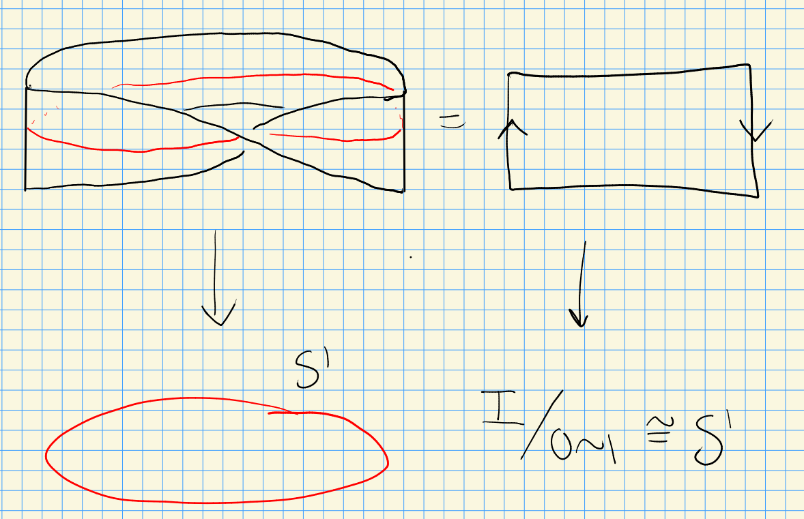

# Thursday, August 19

## Intro and Overview

:::{.remark}
Course website: <https://akramalishahi.github.io/CharClass.html>

Description from Akram's syllabus:

> This course is about characteristic classes, which are cohomology classes naturally associated to vector bundles or, more generally, principal bundles. They are a key tool in modern {algebraic, differential}×{topology, geometry}. The course starts with an introduction to vector bundles and principal bundles. It then discusses their main characteristic classes—the Euler class, Stiefel-Whitney classes, Chern classes, and Pontryagin classes. The last part of the class discusses some applications of characteristic classes to bordisms. In the process, we will see some nice applications (e.g., to immersions) and review some important parts of algebraic topology (e.g., obstruction theory).

**References**:

- [@Hu] Husemoller, Fiber bundles.
- [@MS] Milnor and Stasheff, Characteristic classes.
- [@S] Steenrod, The topology of fibre bundles.
- [@Ha] Hatcher, Vector bundles and K-theory .
- [@BottTu] Bott and Tu, Differential forms in algebraic topology.

Prerequisites:

- Smooth manifolds: smooth maps and derivatives, differential forms.
- Algebraic topology: homology and cohomology.

:::

:::{.remark}
An overview of what we'll cover:

- **General definitions and constructions related to *vector bundles* and *fiber bundles*.**

    Why bundles? For a bundle $E \mapsvia{\pi} B$, characteristic classes will be cohomology classes in $H^*(B)$.
  Natural examples include 

  - The tangent bundle $TX\to X$, and vector fields will be sections.
  - Exterior products $\Extprod^n TX$, where differential forms live
  - Normal bundles $\nu$, giving directions an embedded submanifold can be deformed.

  Also note that manifolds locally look like vectors spaces ($\RR^n$!) and so embedded manifolds locally look like vector bundles.
  In particular, if $f: M^n \injects N^k$ is an embedding, locally $\nu$ is locally a $k-n$ dimensional vector bundle over $\RR^n$ (and globally a bundle of the form $\nu: E \to f(M_n)$)

  \begin{tikzpicture}
  \fontsize{34pt}{1em} 
  \node (node_one) at (0,0) { \import{/home/zack/SparkleShare/github.com/Notes/Class_Notes/2021/Fall/CharacteristicClasses/sections/figures}{2021-08-19_13-04.pdf_tex} };
  \end{tikzpicture}

- **Characteristic Classes: Euler, Stiefel-Whitney, Pontryagin, etc.**

  These package geometric information into algebraic invariants that are often computable.
  Some examples: 

  - Stiefel-Whitney classes can detect if $M^n = \bd M^{n+1}$ is a boundary (for smooth closed manifolds).
  - Euler classes can prove the Hairy Ball theorem, i.e. $S^2$ admits no nonvanishing continuous vector fields, which can be generalized to $S^{2n}$ and to splitting the tangent bundle.
  - Pontryagin classes: Milnor used these to produce exotic $S^7$s!
    These are manifolds $M^7$ which are homeomorphic but not diffeomorphic to $S^7$.
  - Chern classes.
:::

## Fiber Bundles

:::{.definition title="Fiber bundle"}
A **fiber bundle** over $B$ with fiber $F$ is a continuous map $\pi: E\to B$ where each $b\in B$ admits an open neighborhood $U \subseteq B$ and a homeomorphism $\phi: \pi\inv(U)\to U\cross F$ such that the following diagram commutes in $\Top$:

\begin{tikzcd}
	{\pi\inv(U)} && {U\cross F} \\
	\\
	& U
	\arrow["\phi", from=1-1, to=1-3]
	\arrow["\pi"', from=1-1, to=3-2]
	\arrow["{p_2}", from=1-3, to=3-2]
\end{tikzcd}

 Here the square is $[0, 1]^{\times 2}$.

> [Link to Diagram](https://q.uiver.app/?q=WzAsMyxbMCwwLCJcXHBpXFxpbnYoVSkiXSxbMiwwLCJVXFxjcm9zcyBGIl0sWzEsMiwiVSJdLFswLDEsIlxccGhpIl0sWzAsMiwiXFxwaSIsMl0sWzEsMiwicF8yIl1d)

:::

:::{.remark}
Note that this necessarily implies that all fibers are homeomorphic, noting that $F_b \da \pi\inv(b) \mapsvia{\phi} \ts{b} \times F$.
We have inclusions: vector bundles $\implies$ fiber bundles $\implies$ fibrations.
For a fibration that's not a fiber bundle, one can collapse a fiber in a trivial bundle, e.g. 

\begin{tikzpicture}
\fontsize{44pt}{1em}4
\node (node_one) at (0,0) { \import{/home/zack/SparkleShare/github.com/Notes/Class_Notes/2021/Fall/CharacteristicClasses/sections/figures}{2021-08-19_13-37.pdf_tex} };
\end{tikzpicture}

:::

:::{.example title="?"}
An **atlas bundle** for $\pi:E\to B$ is a collection of charts $\ts{(U_\alpha, \phi_\alpha)}_{\alpha\in I}$ such that $\ts{U_\alpha}\covers B$.
:::

:::{.example title="?"}
\envlist

- $E \da B\cross F \mapsvia{p_2} F$ the trivial/product bundle.
- $\hat{X} \to X$ any covering space. 
  Note that the fibers are discrete.

- The Möbius band:

<-- Xournal file: /home/zack/SparkleShare/github.com/Notes/Class_Notes/2021/Fall/CharacteristicClasses/sections/figures/2021-08-19_13-41.xoj -->

  This is a fiber bundle with fibers $[0, 1]$.
  For a fiber bundle, include the boundary, but to make this a vector bundle do not include it!

:::

:::{.remark}
Consider the following setup:

- $B\in \Top$
- $\pi:E\to B$ is a map of underlying sets
- There is a bundle atlas $\ts{\phi_\alpha}$, each $\phi_\alpha$ being a bijection.

Then there exists *at most* one topology on $E$ such that $\pi: E\to B$ is a fiber bundle with the given atlas.
:::

:::{.exercise title="?"}
Find necessary conditions for at least one topology to exist!
:::

## Vector Bundles

:::{.definition title="Vector bundle"}
An $n\dash$dimensional real (resp. complex) **vector bundle** over $B$ is a fiber bundle $\pi:E\to B$ along with a real vector space structure on each fiber $F_b$ such that for each $b\in B$ there exists a neighborhood $U \ni b$ and a chart $(U, \phi: \pi\inv(U) \to U\times \RR^n)$ (resp. $\CC^n$) where $\ro{\phi}{F_b}: F_b \mapsvia{\sim}  \RR^n$ (resp. $\CC^n$) is an isomorphism of vector spaces.
:::

:::{.example title="?"}
\envlist

- The trivial (product) bundle $B\cross\RR^n \mapsvia{p_1} B$.
- The tangent bundle $T X$.
- Identifying the Möbius band as $[0, 1] \cross (0, 1)/\sim$ as $I \cross \RR / (0, t)\sim (1, -t)$ yields a 1-dimensional bundle $M\to S^1$.
:::

:::{.remark}
We have some natural operations:

1. 
Direct sums.

  For $E_1, E_2 \in \VectBun\slice{B}$, so $E_1 \mapsvia{\pi_1} B$ and $E_2 \mapsvia{\pi_2} B$, we can form $E_1 \oplus E_2 \mapsvia{\pi} B$.
  As a set, take 
  \[
E_1 \oplus E_2 \da \Union_{b\in B} F_{1, b} \oplus F_{2, b}
  \]
  as a union of direct sums of vector spaces.
  For the bundle map, take $\pi(F_{1, b} \oplus F_{2, b}) \da \ts{b}$.
  For charts, for any $b\in B$ pick individual charts about $b$, say $(U_1, \phi_1)$ for $E_1$ and $(U_1, \phi_2)$ for $E_2$, form charts 
  \[
\ts{ (U_1 \intersect U_2, \phi: \pi\inv(U_1 \intersect U_2) \to \RR^{n_1 + n_2})}
  \]
  where $n_1 \da \dim_\RR F_{1, b}$ and $n_2 \da \dim_\RR F_{2, b}$ and define $(b, (v_1, v_2)) \mapsvia{\phi}  (\phi_1(v_1), \phi_2(v_2))$.
:::

