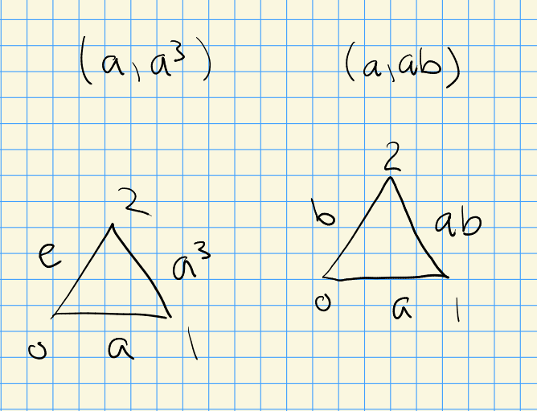

# Thursday, September 16

:::{.remark}
Let $G\in \Grp$, and consider the following two categories.
$\B G$ will be the category:

- $\Ob(\B G) = \ts{\pt}$.
- $\Mor_{\B G}(\pt, \pt) = \ts{g\in G}$, i.e. there is one morphism for every group element, with composition $g_1 \circ g_2 \da g_1g_2$ given by group multiplication.

$E G$ will be the category:

- $\Ob(EG) = \ts{g\in G}$, one object for each element of $G$,
- $\Mor(g, h)=\ts{g\inv h}$, a single (conveniently labeled!) morphism for each ordered pair $(g, h)$.

Note that $G\actson EG$:

\begin{tikzcd}
	{g_0} && {g_1} \\
	\\
	{gg_0} && {gg_1}
	\arrow[""{name=0, anchor=center, inner sep=0}, "{g_0\inv g_1}", from=1-1, to=1-3]
	\arrow[""{name=1, anchor=center, inner sep=0}, "{g\cdot g_0\inv g_1}", from=3-1, to=3-3]
	\arrow[shorten <=9pt, shorten >=9pt, Rightarrow, from=0, to=1]
\end{tikzcd}

> [Link to Diagram](https://q.uiver.app/?q=WzAsNCxbMCwwLCJnXzAiXSxbMiwwLCJnXzEiXSxbMCwyLCJnZ18wIl0sWzIsMiwiZ2dfMSJdLFswLDEsImdfMFxcaW52IGdfMSJdLFsyLDMsImdcXGNkb3QgZ18wXFxpbnYgZ18xIl0sWzQsNSwiIiwwLHsic2hvcnRlbiI6eyJzb3VyY2UiOjIwLCJ0YXJnZXQiOjIwfX1dXQ==)

This induces an action on $\nerve{EG} \in \Top$, where the 0-simplices correspond to elements of $G$. and $n\dash$simplices are chains
\[
g_0 \mapsvia{g_0\inv g_1} g_1 \mapsvia{g_1\inv g_2} g_2 \to \cdots \to g_n
.\]
Acting on this by $G$ yields
\[
gg_0 \mapsvia{g_0\inv g_1} gg_1 \mapsvia{g_1\inv g_2} gg_2 \to \cdots \to gg_n
,\]
noting we leave the morphism labeling unchanged, and that uniqueness of morphisms makes the simplicial boundary map behave nicely.
:::

:::{.exercise title="?"}
Show that
\[
\nerve{EG}/G = \nerve{\B G}
.\]

:::

:::{.remark}
Note that
\[
\nerve{\B G} &= \Delta^0 \disjoint \Delta^1 \times G \disjoint \Delta^2 \times G\cartpower{2} \disjoint \Delta^3 \times G\cartpower{3}\cdots \\
\nerve{E G} &= \Delta^0 \times G \disjoint \Delta^1 \times G\cartpower{2} \disjoint \Delta^2 \times G\cartpower{3}\cdots 
,\]
where the gluing data for $\nerve{\B G}$ is given by
\[
\bd_n: 
\Delta^n \times G\cartpower{n} &\to
\Delta^{n-1} \times G\cartpower{n-1} \\
(\vector x, \vector g) &\mapsto (\vector x\sm\ts{x_n}, \vector g \sm\ts{g_n})
\]
and for $\nerve{EG}$ is
\[
\bd_n: \Delta^n \times G\cartpower{n+1} &\to
\Delta \times G\cartpower{n} \\
(\vector x, \vector g) &\mapsto (\vector x\sm\ts{x_n}, \vector g \sm\ts{g_n})
.\]

The action $G\actson EG$ is the following:
\[
g\cdot (\vector x, \vector g) \mapsto (\vector x, \tv{gg_0, gg_1,\cdots, gg_n} )
.\]

:::

:::{.example title="?"}
Take $G = C_4, G' = C_2\prodpower{2}$, and $[ (x_0, x_1, x_2), (a, a^2)] \in \Delta^2 \times G\prodpower{2}$.
Then its faces are
\[
[(0, x_1, x_2), (a, a^2)] &\sim [(x_1, x_2), (a^2)] \\
[(x_0, 0, x_2), (a, a^2)] &\sim [(x_0, x_2), (a)] \\
[(x_0, x_1, 0), (a, a^2)] &\sim [(x_0, x_1), (a)] \\
.\]
These describe a 2-simplex mapping into $\B C_4$ by $a \to a^2 \to a^3$, yielding the relation $a\cdot a^2 = a^3$.
One can check that in $\B G$, these groups yield distinct higher simplices:

<!-- Xournal file: /home/zack/SparkleShare/github.com/Notes/Class_Notes/2021/Fall/CharacteristicClasses/sections/figures/2021-09-16_16-58.xoj -->

:::

:::{.lemma title="?"}
If $\cat C$ has an initial or terminal object, then $\nerve{\cat C}$ is contractible.
:::

:::{.remark}
This clearly holds for $E G$, since every object is initial and terminal.
:::

:::{.proof title="?"}
Suppose $y\in \cat C$ is terminal and any other object $x\in \cat C$, denote $f_x: x\to y$ the unique morphism.

Then for any sequence ending in $y$, deformation retract to $y$: $x_0 \mapsvia{f_0} \to x_1 \mapsvia{f_1} \cdots \mapsvia{f_x} y \leadsto y$.
If a sequence doesn't end in $y$, add it on: $x_0 \mapsvia{f_0} x_1 \cdots \to x_n {\color{green} \mapsvia{f_{x_n}} y} \leadsto y$.
:::

:::{.corollary title="?"}
$\nerve{EG}$ is contractible, and the quotient $\nerve{EG}\to \nerve{\B G}$ is a universal $G\dash$bundle.
:::

:::{.exercise title="?"}
Construct $E G$ and $\B G$ for $G = C_4, C_2\cartpower{2}$ and explicitly compare their 3-skeleta.
:::

