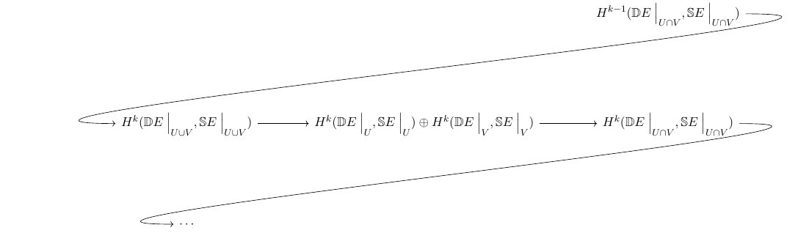

# Thursday, September 30

## Line Bundles: Chern and Stiefel-Whitney Classes

:::{.remark}
Last time: defining characteristic classes.
Recall that given $F, G \in \Fun(\Top, \wait)$, a characteristic class with values in $G$ is a natural transformation $c: F \iso G$.
If $F$ is representable, then characteristic classes $c: F\to G$ is of the form $c(\id_B) \in G(B)$ for $\id_B \in [B, B] \cong F(B)$, since $c$ is determined by where it sends $\id_B$.
Recall that Eilenberg-MacLane spaces $K(G, n)$ represent $H^n(\wait; G)$ for $G\in \Ab\Grp$, and are characterized by $\pi_i(K(G, n)) = G$ only in degree $i=n$.

:::

:::{.example title="?"}
\envlist

- $\VectBundlerk{n}(\RR, X) \iso [X, \BO_n]$ and we realized $\BO_n \homotopic \Gr_n(\RR^\infty)$.
  For $\alpha\in H^j(\BO_n; \ZZ)$, we can take a homotopy class $f:X\to \BO_n$ and pullback to get $f^*(\alpha) \in H^j(X; \ZZ)$.

- $\VectBundlerk{n}(\CC, X) \iso [X, \BU_n]$, where $\BU_n \homotopic \Gr_n(\CC^\infty)$ and we can again pullback cohomology classes.

:::

:::{.example title="?"}
For line bundles, we can identify $\BU_1 \homotopic \Gr_1(\CC^\infty) \homotopic \CP^\infty$, so $\VectBundlerk{1}(\CC, X) \iso [X, \CP^\infty]$.
The claim is that line bundles are uniquely characterized by their first Chern classes.
Using that $H^2(\CP^\infty; \ZZ) \cong \ZZ = \gens{\alpha}$, where we've chosen a positive generator, we obtain the **first Chern class** $c_1 \da f^*(\alpha) \in H^2(X; \ZZ)$.
Note that $\CP^\infty \homotopic K(\ZZ, 2)$, and $[X, K(G, n)] \iso H^n(X; M)$ where $f\mapsto f^*(\alpha)$ for $H^n(K(G, n); \ZZ) = \gens{\alpha}$, so there is an isomorphism 
\[
[X, \CP^\infty] &\iso H^2(X; \ZZ) \\
f &\mapsto f^*(\alpha),\quad \gens{\alpha} = H^2(\CP^\infty)
.\]
So the set of bundles is an affine space over $H^2(X)$.
:::

:::{.corollary title="?"}
There is a bijection
\[
c_1: \VectBundlerk{1}(\RR, X) \iso H^2(X)
,\]
:::

:::{.example title="?"}
For $\VectBundlerk{1}(\RR, X)$ we can identify $\BO_1 \homotopic \Gr_1(\RR^\infty) = \RP^\infty$, so for $\gens{\alpha} = H^2(\RP^\infty; \ZZ/2) \cong \ZZ/2$, we obtain the **first Stiefel-Whitney class** $w_1$ and a bijection
\[
w_1: [X, \RP^\infty] &\iso H^1(X; \ZZ/2) \\
f &\mapsto f^*(\alpha)
.\]
:::

:::{.remark}

We can define $c_1$ for vector bundles of any dimension by taking a top exterior power to get a line bundle:

\begin{tikzcd}
	{\VectBundlerk{n}(\CC, X)} && {\VectBundlerk{1}(\CC, X)} && {H^2(X; \ZZ)} \\
	E && {\Extalg^n E} \\
	\\
	X && X
	\arrow["{\Extalg^n(\wait)}", from=1-1, to=1-3]
	\arrow[from=2-1, to=4-1]
	\arrow[from=2-3, to=4-3]
	\arrow["{c_1}", from=1-3, to=1-5]
	\arrow[maps to, from=2-3, to=1-5]
	\arrow["{\Extalg^n(\wait)}"', from=2-1, to=2-3]
	\arrow["{\da c_1 E}"{description}, dashed, from=2-1, to=1-5]
	\arrow["\id"', from=4-1, to=4-3]
\end{tikzcd}

> [Link to Diagram](https://q.uiver.app/?q=WzAsNyxbMCwwLCJcXFZlY3RCdW5kbGVfbihcXENDLCBYKSJdLFsyLDAsIlxcVmVjdEJ1bmRsZV8xKFxcQ0MsIFgpIl0sWzAsMSwiRSJdLFswLDMsIlgiXSxbMiwxLCJcXEV4dGFsZ15uIEUiXSxbMiwzLCJYIl0sWzQsMCwiSF4yKFg7IFxcWlopIl0sWzAsMSwiXFxFeHRhbGdebihcXHdhaXQpIl0sWzIsM10sWzQsNV0sWzEsNiwiY18xIl0sWzQsNiwiIiwyLHsic3R5bGUiOnsidGFpbCI6eyJuYW1lIjoibWFwcyB0byJ9fX1dLFsyLDQsIlxcRXh0YWxnXm4oXFx3YWl0KSIsMl0sWzIsNiwiXFxkYSBjXzEgRSIsMSx7InN0eWxlIjp7ImJvZHkiOnsibmFtZSI6ImRhc2hlZCJ9fX1dLFszLDUsIlxcaWQiLDJdXQ==)

So
\[
c_1(E) \da c_1(\Extalg^n E)
.\]

:::

:::{.remark}
There is a natural isomorphism $c(f^*(E)) \cong  f^*(c(E))$, since we can take iterated pullbacks:

% https://q.uiver.app/?q=WzAsNixbMCwwLCJmXiogRSJdLFswLDIsIlkiXSxbMiwyLCJYIl0sWzIsMCwiRSA9IGdeKlxcZ2FtbWFfbiJdLFs0LDAsIlxcZ2FtbWFfbiJdLFs0LDIsIlxcR3JfbihcXFJSXntcXGluZnR5fSkiXSxbMiw1LCJnIiwyXSxbMyw0XSxbMywyXSxbMCwxXSxbMCwzLCIiLDEseyJzdHlsZSI6eyJib2R5Ijp7Im5hbWUiOiJkYXNoZWQifX19XSxbMSwyLCJmIiwyXSxbMCwyLCIiLDEseyJzdHlsZSI6eyJuYW1lIjoiY29ybmVyIn19XSxbMyw1LCIiLDEseyJzdHlsZSI6eyJuYW1lIjoiY29ybmVyIn19XSxbNCw1XV0=
\begin{tikzcd}
	{f^* E} && {E = g^*\gamma_n} && {\gamma_n} \\
	\\
	Y && X && {\Gr_n(\RR^{\infty})}
	\arrow["g"', from=3-3, to=3-5]
	\arrow[from=1-3, to=1-5]
	\arrow[from=1-3, to=3-3]
	\arrow[from=1-1, to=3-1]
	\arrow[dashed, from=1-1, to=1-3]
	\arrow["f"', from=3-1, to=3-3]
	\arrow["\lrcorner"{anchor=center, pos=0.125}, draw=none, from=1-1, to=3-3]
	\arrow["\lrcorner"{anchor=center, pos=0.125}, draw=none, from=1-3, to=3-5]
	\arrow[from=1-5, to=3-5]
\end{tikzcd}

So we can identify $c(f^*(E)) = ( g\circ f)^* \alpha$ and $f^*(c(E)) = f^*(g^* \alpha) = (g\circ f)^* \alpha$.
:::

## Euler Classes and the Thom Isomorphism

:::{.remark}
Note that any vector bundle with a Riemannian metric admits a unit disc bundle.
:::

:::{.definition title="Oriented disc bundles"}
A unit disc bundle $D \mapsvia{\pi} B$ is **oriented** if there is a locally coherent choice of a generator of $H^n(D_b \da \pi\inv(b), S^b \da \bd D_b; \ZZ)$.
:::

:::{.example title="?"}
The unit disc bundle for an oriented $E \in \VectBundlerk{n}(\RR, X)$ with a Riemannian metric will be oriented as a disc bundle.
:::

:::{.remark}
Given a bundle $E\to X$ and taking its disc bundle $\DD E\to X$, taking boundaries on fibers yields a sphere bundle $\SS E\to X$, so $\SS E_b \da \bd \DD E_b$ on fibers.
Note the $\DD E \homotopic X$ by a deformation retraction.
:::

:::{.theorem title="Thom Isomorphism Theorem"}
Let $\DD E\to X\in \VectBundlerk{n}(\RR, X)$ be an oriented disc bundle and $\SS E \to X$ its corresponding sphere bundle.
Then

1. $H^{i< n}(\DD E, \SS E; \ZZ) = 0$
2. There exists a generator, the **Thom class** $u_E \in H^n(\DD E, \SS E; \ZZ)$ mapping to a distinguished generator of $H^n(\DD E_x, \SS E_x)$, inducing isomorphisms 
\[
(\wait) \cupprod u_E : H^j( \DD E) &\iso H^{j+n}(\DD E, \SS E) && \forall j\geq 0 \\
\eta &\mapsto \eta \cupprod u_E
,\]
:::

:::{.proof title="of theorem"}
\envlist

- **Step 1**: Look locally to see why we might expect this result!
  If $\DD E\to X$ is trivial, then the claims hold.

- **Step 2**: If the claims hold for $\ro{\DD E}{U}, \ro{\DD E}{V}, \ro{\DD E}{U \intersect V}$, then it holds for $\ro{\DD E}{U \union V}$.
  As a corollary, the claims hold for compact $X$.

- **Step 3**: Prove claims for $H^*(\wait; k)$ for $k\in \Field$

- **Step 4**: Prove claims for $H^*(\wait; \ZZ)$.

:::

:::{.proof title="step 1"}
Trivial bundles are products, and we have formulas for cohomology of products.
Write $\DD E = X \times \DD^n$, and note that $H^*(\DD^n, S^{n-1}; \ZZ) = \ZZ[n]$, which is always torsionfree.
Thus
\[
H^k(\DD E, \SS E; \ZZ) 
&= H^k(\DD^n\times X, S^{n-1} \times X; \ZZ) \\
&\cong \bigoplus_{0\leq i\leq k} H^i(X; \ZZ) \tensor_\ZZ H^{k-i}(\DD^n, S^{n-1}; \ZZ) \\
&\cong \bigoplus_{0\leq i\leq k} H^i(X; \ZZ) \tensor_\ZZ \qty{\ZZ[i+n ]}  \\
&= H^{k-n}(X; \ZZ) & \quad \text{ when } k>n, \text{ else } 0
.\]

So pick $u\in H^n(\DD^n, S^{n-1})$ be the generator specified by the orientation, and take $u_E \in H^n(\DD E, \SS E; \ZZ)$ to be the corresponding generator pulled back along the Kunneth isomorphism (which recall was induced by a cup product).
:::

:::{.proof title="step 2"}
Use Mayer-Vietoris:

<!--- 
\begin{tikzcd} 
[
  column sep={2em},
  row sep={3em},
]
	&&&& {H^{k-1}(\DD E\mid_{U \intersect V}, \SS E\mid_{U \intersect V} )} \\
	\\
	{H^k(\DD E\mid_{U \union V}, \SS E\mid_{U \union V} )} && {H^k(\DD E\mid_{U}, \SS E\mid_{U} ) \oplus H^k(\DD E\mid_{V}, \SS E\mid_{V} )} && {H^k(\DD E\mid_{U \intersect V}, \SS E\mid_{U \intersect V} )} \\
	\\
	\cdots
	\arrow[from=3-1, to=3-3]
	\arrow[from=3-3, to=3-5]
	\arrow[from=1-5, to=3-1, in=180, out=0]
	\arrow[from=3-5, to=5-1, in=180, out=0]
\end{tikzcd}
--->

> [Link to Diagram](https://q.uiver.app/?q=WzAsNSxbMCwyLCJIXmsoXFxERCBFXFxtaWRfe1UgXFx1bmlvbiBWfSwgXFxTUyBFXFxtaWRfe1UgXFx1bmlvbiBWfSApIl0sWzIsMiwiSF5rKFxcREQgRVxcbWlkX3tVfSwgXFxTUyBFXFxtaWRfe1V9ICkgXFxvcGx1cyBIXmsoXFxERCBFXFxtaWRfe1Z9LCBcXFNTIEVcXG1pZF97Vn0gKSJdLFs0LDIsIkheayhcXEREIEVcXG1pZF97VSBcXGludGVyc2VjdCBWfSwgXFxTUyBFXFxtaWRfe1UgXFxpbnRlcnNlY3QgVn0gKSJdLFs0LDAsIkhee2stMX0oXFxERCBFXFxtaWRfe1UgXFxpbnRlcnNlY3QgVn0sIFxcU1MgRVxcbWlkX3tVIFxcaW50ZXJzZWN0IFZ9ICkiXSxbMCw0LCJcXGNkb3RzIl0sWzAsMV0sWzEsMl0sWzMsMF0sWzIsNF1d)

- If $k< n$, the union terms vanish in degree $k$, since they're surrounded by zeros.
- If $k=n$, the kernel of $\oplus \to \intersect$ is isomorphic to $\ZZ$, so pick a generator $u_{U \union V} = \ro{u_E}{U \union V}$ that lifts $\ro{u_E}{U}$ and $\ro{u_E}{V}$.

Next time: we'll show that $u_{U \union V} \cupprod (\wait)$ yields the isomorphism in part 2 of the theorem statement.
:::

