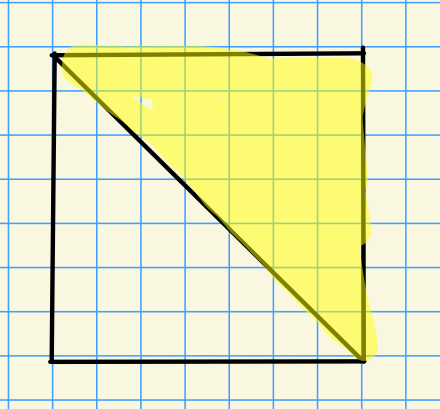
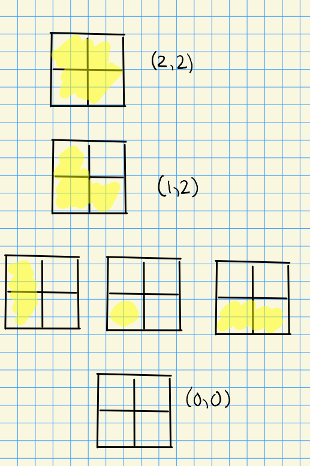

# First Examples of Flag/Schubert Varieties (Wednesday, August 18)

:::{.remark}
Course description from Scott's syllabus:

> Schubert varieties are key examples of algebraic varieties that on one hand have an intrinsic interest and beauty, and on the other hand have many applications to algebraic geometry, algebraic topology, and representation theory; e.g., category $\OO$, infinite dimensional representation theory of real reductive groups, modular representation theory, polar varieties, Chern classes, Schubert calculus, etc. 
>
> The course goal is to understand Schubert varieties and their algebraic geometry, equivariant cohomology, and equivariant K-theory. There are many open problems related to basic geometry of Schubert varieties, so we will of course not complete this goal. One of the key applications of equivariant cohomology and equivariant K-theory of flag varieties is the complete description of the singular locus of any Schubert variety, and we will settle on learning this theory as our goal. This result was originally obtained by the author of our course textbook, and is described completely by him in Chapter XII. 
>
> The language of this result is naturally and originally described in the ominous generality of (possibly infinite dimensional) Kac-Moody groups – which are becoming increasingly more important in many areas – and the result at the time was new even for the finite dimensional case. In fact much recent literature on Schubert varieties is written in this language and at the same time is new for the finite dimensional case. 

:::

:::{.remark}
The goal of this course: describe the singular locus of arbitrary Schubert varieties.
Note that we'll assume all varieties and schemes are reduced!

**References:**

- *Introduction to Lie Algebras and Representation Theory*, Humphreys.
- *Representations of Semisimple Lie Algebras in the BGG Category $\OO$*, Humphreys.
- *Linear Algebraic Groups*, Humphreys.
  - *Linear Algebraic Groups*, Springer.
- *Kac-Moody Groups, their Flag Varieties, and their Representation Theory*, Shrawan Kumar.
- *Chries-Ginzburg.*, particularly for \(\K\dash\)theory of abelian categories.
  See Youtube lectures and course notes from Geordie's course!
- Brian' Conrad's notes on group schemes: <http://math.stanford.edu/~conrad/papers/luminysga3.pdf>
- Björner and Brenti: *Combinatorics of Coxeter Groups*
:::

:::{.remark}
First up, defining the words in the course title: flag varieties, equivariant cohomology, \(\K\dash\)theory.

- Flag variety: complete homogeneous algebraic variety, i.e. with a transitive algebraic group action.
- Cohomology: it suffices to work with $H^*_\sing(X, A; \RR)$, the relative singular cohomology.
  See also Borel-Moore homology.
- \(\K\dash\)theory: 
  The study of coherent sheaves (take the Grothendieck group on the category $\cat{C} = \Coh(X)$)

:::

:::{.definition title="$T\dash$spaces"}
For $T \cong (\CC\units)^n$ a torus, define a **$T\dash$space** $X$ as a space $X$ with an action $T \times X\to X$ which is also an algebraic morphism.
:::

:::{.remark}
Notions of *equivariance* will take into account this action.
For cohomology, we'll consider a space $E\times^T X = (E\cross X)/T$ where $T$ acts by $(e, x)t \da (et, t\inv x)$.
This is not a variety, but instead an *Ind-variety*.

For \(\K\dash\)theory, the version we'll work with is the following:
:::

:::{.definition title="$T\dash$equivariant sheaves"}
Let $m: T\cross T\to T$ be the multiplication map.
For $X$ a $T\dash$space, a sheaf $\mcf \in\Sh(\mods{\OO_X})$, **$T\dash$equivariant** iff

1. There is a given isomorphism of sheaves on $T\cross X$ written $I: a^* \mcf\to\pr_2 \mcf$ where $\pr_2^* :T\cross X\to X$ is projection onto the second coordinate and $a:T\cross X\to X$ is the given action map.

2. The pullbacks by $\id\cross a$ and $m\cross \id$ if the isomorphism $I$ are given by the equation
\[
\pr_{23}^* I \circ (\id_G \cross a) I = (m\cross \id_X)^* I
.\]

3. There is an isomorphism $I_{e\cross X} = \id$ and $\mcf = a^* \mcf\ro{}{e\cross X} \mapsvia{\sim} \mcf_{e\cross X} = \mcf$.

:::

:::{.example title="?"}
Note that for $f: X\to Y$ and $\mcf \in \Sh(Y)$, then 
\[
f^{\star} \mcf = \OO_X \tensor_{f^* \OO_Y} f^* \mcf
.\]
For any $T\dash$space $X$, $\OO_X$ has a canonical $T\dash$equivariant structure given by 
\[
\pr_2^* \OO_X \cong \OO_{T\cross X} \cong a^\star \OO_X
.\]
:::

:::{.example title="1"}
Take $X\da\pt\cong G/G$, since any group action is transitive and we get a complete space.
This is a silly but important example!
We can take $H_G^* = H_G^*(\pt) \da H^*_\sing(\B G)$.
For $G = \CC\units$, this is a polynomial ring, and for $T = (\CC\units)^n$ it's just a polynomial ring in more variables.
One can then take the constant sheaf $\ul{\CC} \in \Sh(X)$ which is $\CC$ for $U=X$ and $0$ otherwise.
:::

:::{.example title="2"}
$X\da \PP^1$ with an action by $G\da \SL_2(\CC)$:

\begin{tikzpicture}
\fontsize{40pt}{1em} 
\node (node_one) at (0,0) { \import{/home/zack/SparkleShare/github.com/Notes/Class_Notes/2021/Fall/FlagVarieties/sections/figures}{2021-08-18_14-28.pdf_tex} };
\end{tikzpicture}

In the coordinate chart $\tv{z_1, z_2}$ with $z_2\neq 0$, we can scale $z_2$ to 1 and set
\[
\matt{a}{b}{c}{d} \tv{z, 1} = \tv{{az+b\over cz+d}, 1} && cz +d\neq 0
.\]
Then 

- $G\actson X$ transitively, and 

- $B\da \Stab_G(\tv{0, 1})$ is a nontrivial Borel given by upper triangular matrices, and $X = G/B$.

<-- Xournal file: /home/zack/SparkleShare/github.com/Notes/Class_Notes/2021/Fall/FlagVarieties/sections/figures/2021-08-18_14-26.xoj -->

Note that $\OO_X(\PP^1) = \CC$ by Liouville's theorem, and $\OO_X(U) \cong \CC[x]$ for $U \subseteq \PP^1$.
:::

:::{.example title="3"}
The Grassmannian of $k\dash$planes, given by 
\[
X^Y\da \Gr_k(\CC^n) = \ts{E \subseteq \CC^n \st \dim(E) = k}
.\]
This has the structure of an algebraic group, either by taking some transitive algebraic group action and lifting structure from the quotient, or taking a Segre embedding.
For notation, write $\CC^i \da \spanof_\CC\ts{e_1,\cdots, e_i}$ for the span of the first $i$ standard basis vectors.

- $G\da \GL_n$ acts transitively by $g.E \da gE$, for example by extending a basis from $E$ to $\CC^n$ and using that $\GL_n$ sends bases to bases, thus sending $E\to E'$ another $k\dash$plane.

- $\Stab_G(\CC^2)$ are upper block-triangular matrices:

<-- Xournal file: /home/zack/SparkleShare/github.com/Notes/Class_Notes/2021/Fall/FlagVarieties/sections/figures/2021-08-18_14-33.xoj -->

Then define $X^Y \da G/P$, noting that here $P$ is a parabolic.
:::

:::{.remark}
Much study of Schubert varieties reduces to studies of the combinatorics of the Weyl group.
Write $W^Y$ for the Young diagrams on an set of $k\cross (n-k)$ blocks.

For example, for $n=4, k=2$:

<-- Xournal file: /home/zack/SparkleShare/github.com/Notes/Class_Notes/2021/Fall/FlagVarieties/sections/figures/2021-08-18_14-36.xoj -->

:::

:::{.definition title="?"}
For every $\lambda\in W^Y$, define
\[
X_\lambda^Y = \ts{E\in X^Y \st \forall i=1,\cdots, k,\, \dim(\CC^{\sum \lambda_i + i} \intersect E )\geq i}
.\]
:::

\todo[inline]{Does this have a name?}

:::{.example title="?"}
For $\lambda = (1, 2)$, we have
\[
X_\lambda^Y = \ts{ E \in \Gr_2(\CC^4) \st \dim(\CC^2 \intersect E) \geq 1, \dim(\CC^4 \intersect E) \geq 2 } 
.\]

:::

