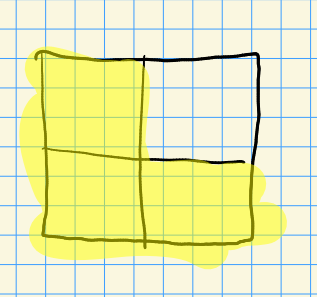
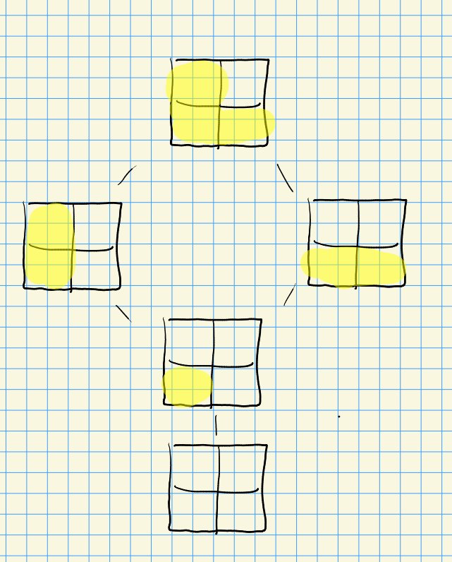
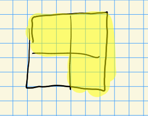
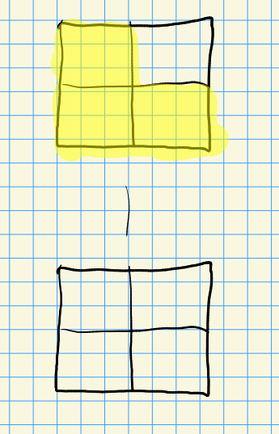

# Friday, August 20

:::{.remark}
Recall that we were discussing example 3, Grassmannians, and defined $W^Y$ as Young diagrams in a $k\times (n-k)$ grid.
We write 
\[
X^Y_{\lambda} = \ts{ E \in X^Y = \Gr_k(\CC^n) \st \forall 1\leq i \leq k ,\, \dim(\CC^{\lambda_i + i} \intersect E) \geq i}
.\]
:::

:::{.example title="?"}
\[
X_{(1, 2)}^Y = \ts{ E \st \dim(\CC^2 \intersect E) \geq 1, \dim(\CC^4 \intersect E)\geq 2 } 
.\]
Note that the second condition is redundant since $E \subset \CC^4$ is a 2-plane.
Why is this a closed variety?
Perhaps the easiest way to see this is using Plucker relations.
Using more technology later, this allows follows from looking at $B\dash$orbits and Bruhat decompositions.
:::

:::{.fact}
Note that for the rank function $\rk: \Mat(m\times n)\to \ZZ$, one can compute the closure 
\[
\bar{\rank\inv(r)} = \rank\inv\qty{[0, r)}
.\]
Also note that $\pr_2: \CC^r\to \CC^q$, we have $\ker (\ro{\pr_2}{E}) = \CC^2 \intersect E$.
:::

## Example 4: The Full Flag Variety

:::{.example title="4: The Full Flag Variety (Type $A_{n-1}$)"}
Define the full flag variety
\[
X \da \ts{ F^\bullet = \qty{0 \subseteq F^1 \subseteq F^2 \subseteq \cdots \subseteq F^{n-1} \subseteq \CC^n } \st \dim(F^k) = k} 
.\]

Write $\CC^\bullet \da \qty{0 \subseteq \CC^1 \subseteq \cdots \subseteq \CC^n}$ for a distinguished basepoint.

- This is a complete homogeneous space,
- $GL_n\actson X$ transitively,
- $\Stab_G(\CC^\bullet) = B$, the Borel of upper triangular matrices.
- $X \cong G/B$.

For $G$ a linear algebraic group and $B$ a closed subgroup, $G/B$ will generally be a variety.
:::

:::{.definition title="Weyl Group"}
The Weyl group is generally given by $W = N_G(T)/T$ for $T$ a torus.
:::

:::{.remark}
Some facts:

- $N_G(T)$ is the set of permutation matrices with arbitrary nonzero entries.
- $W = S_n$ in general, and can be written $W = \ts{ (w(1), w(2), \cdots, w(n) ) \st w\in S_n }$.
- $W \injects X$ sits in the flag variety via $w\mapsto c \CC^\bullet$, i.e. acting on the distinguished basepoint.

As an example, we can write permutation matrices in one-line notation, using that $w(e_i) = e_{w(i)}$:

\[
A = \tv{e_4, e_1, e_2, e_3} \leadsto (4,1,2,3)
.\]

Using that $B/B \cong \CC^\bullet$ is the basepoint, we have $w\CC^{\bullet} = wB/B \in BwB/B$.
:::

:::{.proposition title="?"}
\[
BwB / B \cong \ts{ F^\bullet \in X \st \forall i,j,\,\, \dim(\CC^i \intersect F^j) \intersect \dim(\CC^i \intersect w\CC^j) } 
.\]
:::

:::{.remark title="?"}
Moreover, $\dim(\CC^i \intersect w\CC^j) = \#\ts{ k \st k\leq i, w(k) \leq j}$.
Just compute $\gens{e_1} \intersect w\gens{e_1} = \gens{e_4} = 0$ for entry $1, 1$, and continue:
\[
\begin{bmatrix}
0 & 1 & 1 & 1 \\
0 & 1 & 2 & 2 \\
0 & 1 & 2 & 3 \\
1 & 2 & 3 & 4 \\
\end{bmatrix}
.\]

Now check that counting $\ts{k \st k\leq j,\, w(k) \leq i}$ yields the same entries in the $i, j$ spot, and thus the same matrix.
:::

## Combining Examples 3 and 4

:::{.remark}
There is a map
\[
\pi: X &\to X^Y \\
F^\bullet &\mapsto F^k
,\]
which is equivalently sending a Borel to its corresponding parabolic, and geometrically corresponding to sending $T\dash$fixed points to $T\dash$fixed points.
This induces a map $W\to W^Y$, and since $W\cong S_n$, this is sending a Young diagram to a partition.

- This is $G\dash$equivariant for $G\da \GL_n$
- $\pi(w) = \lambda$, so there is a map $w\to \ts{w(1), \cdots, w(k)} = \ts{ \lambda_1 - 1, \lambda_2 - 2, \cdots, \lambda_k - k}$.

:::

:::{.example title="?"}
Given $\lambda$ and $1\leq i \leq k$, let $w(i) = \lambda_i + i$ and extend $w$ by filling in the remaining numbers in increasing order, so $w(k+1) < w(k+2) < \cdots < w(n)$.
For example, take $(1, 2)\mapsto w = (2, 4 \st 1, 3)$, recalling that $(1, 2)$ has this form:

<!-- Xournal file: /home/zack/SparkleShare/github.com/Notes/Class_Notes/2021/Fall/FlagVarieties/sections/figures/2021-08-20_14-31.xoj -->

One could also do $w_{\max} = (4, 2 \st 3, 1)$.

:::

:::{.remark}
Note that the Hasse diagrams under a given diagram give the closure relations under $B\dash$orbits:
For $\lambda = (1, 2)$, the $B\dash$orbits in $X_\lambda^Y$ are given by the following:

<!-- Xournal file: /home/zack/SparkleShare/github.com/Notes/Class_Notes/2021/Fall/FlagVarieties/sections/figures/2021-08-20_14-35.xoj -->

We get $BwP/P = \CC^{\ell(w^r)}$, and we in fact get a CW structure.
Since $H_\sing^2(X_\lambda^Y; \ZZ) \neq H_\sing^4(X_\lambda^Y; \ZZ)$, this doesn't satisfying Poincare duality, so it can not be a smooth manifold.
So what is the singular locus?
:::

:::{.remark}
The open element is not in the singular locus.
Note that $P$ acts on $X_\lambda^Y$, where $P$ is defined as
<!-- Xournal file: /home/zack/SparkleShare/github.com/Notes/Class_Notes/2021/Fall/FlagVarieties/sections/figures/2021-08-20_14-40.xoj -->

One can determine that the singular locus is the single point $\ts{\CC^2}$ corresponding to the empty diagram:

<!-- Xournal file: /home/zack/SparkleShare/github.com/Notes/Class_Notes/2021/Fall/FlagVarieties/sections/figures/2021-08-20_14-41.xoj -->

:::

