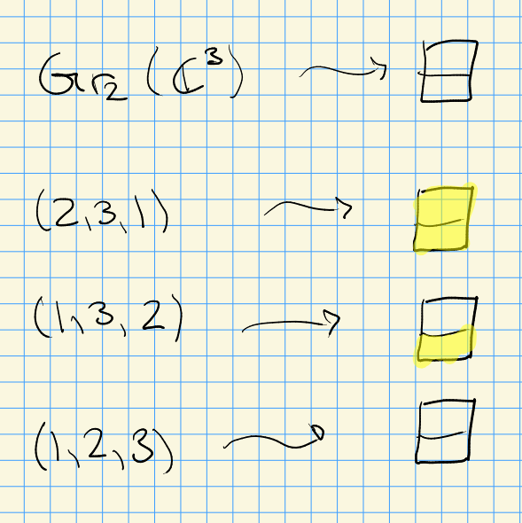
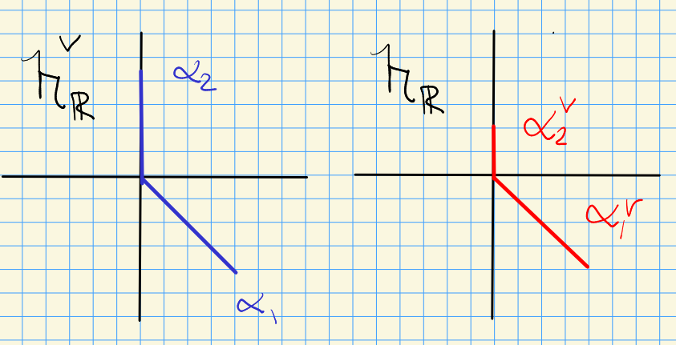
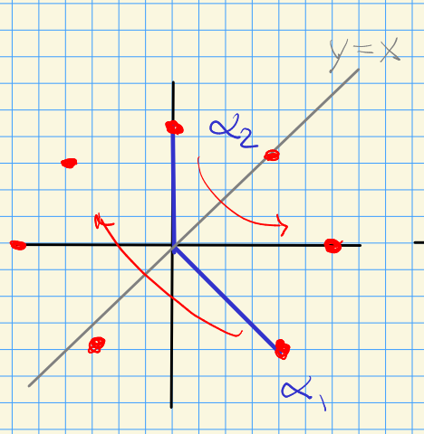
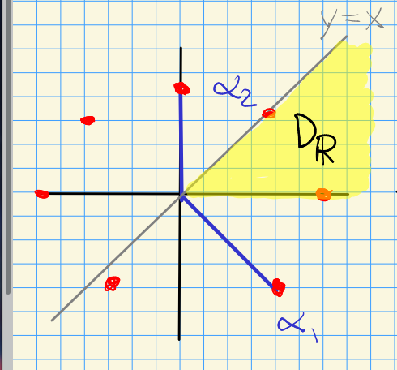

# Wednesday, September 08

:::{.remark}
Today: finish chapter one.
:::

:::{.definition title="Bruhat-Chevalley Partial Order"}
For $v, w\in W$ we set $v\leq w \iff$ there exists $\elts{t}{p} \in T$ such that

- $v = t_p\cdots t_1 w$
- $\ell(t_{j} \cdots t_1 w) \leq \ell(t_{j-1} \cdots t_1 w)$.

:::

:::{.definition title="Minimal length representatives"}
For $Y \subseteq S$ we set
\[
W'_Y \da \ts{\ell(wv) \geq \ell(w) \forall v\in W_Y}
.\]
:::

:::{.example title="?"}
Consider $W = S_3$ with $S\da \ts{s_1, s_2} = \ts{1, 2}$.
The Hasse diagram is the following:

\begin{tikzcd}
	& {(3,2,1)} \\
	{(2,3,1)} && {(3,1,2)} \\
	{s_1 = (2,1,3)} && {(1,3,2) = s_2} \\
	& {(1,2,3)}
	\arrow[from=2-1, to=1-2]
	\arrow[from=2-3, to=1-2]
	\arrow[from=3-1, to=2-1]
	\arrow[from=3-3, to=2-3]
	\arrow[from=3-1, to=2-3]
	\arrow[from=3-3, to=2-1]
	\arrow[from=4-2, to=3-1]
	\arrow[from=4-2, to=3-3]
\end{tikzcd}

> [Link to Diagram](https://q.uiver.app/?q=WzAsNixbMSwwLCIoMywyLDEpIl0sWzAsMSwiKDIsMywxKSJdLFsyLDEsIigzLDEsMikiXSxbMCwyLCJzXzEgPSAoMiwxLDMpIl0sWzIsMiwiKDEsMywyKSA9IHNfMiJdLFsxLDMsIigxLDIsMykiXSxbMSwwXSxbMiwwXSxbMywxXSxbNCwyXSxbMywyXSxbNCwxXSxbNSwzXSxbNSw0XV0=)

We have

- $\emptyset \subseteq \ts{1} \subseteq {1, 2}$
- 
\[
G/B = \ts{0 \subseteq F^1 \subseteq F^2 \subseteq \CC^3} \to \ts{0 \subseteq F^2 \subseteq \CC^3} \da \Gr_2(\CC^3) \to \ts{0 \subseteq \CC^3} = G/G
.\]
  Note that Kumar writes 
  \[
  X^{\emptyset} &\da G/B \\
  X^{\ts{1}} &= \Gr_2(\CC^3)\\
  X^{\ts{1,2}} &= G/G
  .\]

- For $Y\da \ts{1}$, we just have to check how lengths change upon swapping the first two positions.
  Thus $W_Y = \ts{e, s_1}$ since $(2,3,1)$ is minimal length.
  Similarly $(1,3,2)$ and $(1,2,3)$ are minimal length.

<!-- Xournal file: /home/zack/SparkleShare/github.com/Notes/Class_Notes/2021/Fall/FlagVarieties/sections/figures/2021-09-08_14-03.xoj -->

- For $Y = \ts{1, 2}$, we get $W_Y = W$ with a minimal element $(1,2,3)$.

:::

:::{.lemma title="?"}
Fix a reduced expression $w = \prod_{i\leq n} s_i$.
Then $v\leq w$ iff there exist indices $1\leq j_1 < j_2 < \cdots < j_p \leq n$ such that $v = \prod_{i\neq j_k} s_i$.
:::

:::{.example title="?"}
For $m_{12} = 3$, if $(s_1 s_2)^{m_{12} = 3} = e$, so $s_1 s_2 s_1 = s_2 s_1 s_2$, which is a braid relation that corresponds to $(3,2,1)$.
Let $w_0$ be the maximal element (which generally only works when the Coxeter group is finite), so here $w_0 = s_1 s_2 s_1$.
We can cross out various reflections to get closure relations:

\begin{tikzcd}
	& {w_0 = s_1 s_2 s_1 = s_2 s_1 s_2} \\
	{s_1 s_2} && {s_2 s_1} \\
	{s_1} && {s_2} \\
	& e
	\arrow[from=4-2, to=3-1]
	\arrow[from=4-2, to=3-3]
	\arrow[from=3-3, to=2-3]
	\arrow[from=2-3, to=1-2]
	\arrow[from=2-1, to=1-2]
	\arrow[from=3-1, to=2-1]
	\arrow[from=3-1, to=2-3]
	\arrow[from=3-3, to=2-1]
\end{tikzcd}

> [Link to Diagram](https://q.uiver.app/?q=WzAsNixbMSwwLCJ3XzAgPSBzXzEgc18yIHNfMSA9IHNfMiBzXzEgc18yIl0sWzAsMSwic18xIHNfMiJdLFsyLDEsInNfMiBzXzEiXSxbMCwyLCJzXzEiXSxbMiwyLCJzXzIiXSxbMSwzLCJlIl0sWzUsM10sWzUsNF0sWzQsMl0sWzIsMF0sWzEsMF0sWzMsMV0sWzMsMl0sWzQsMV1d)

Here for $Y = \ts{1} = \ts{s_1}$, we get minimal length elements $e, s_2, s_1 s_2$.
:::

:::{.example title="?"}
In general, we start with a GCM $A$, take a realization $(\lieh, \pi, \pi\dual)$, get Kac-Moody Lie algebra $\lieg$, and extract a group $W$ which we now know is a Coxeter group.
Write $\ts{\elts{\alpha}{\ell}} \subseteq \lieh\dual$ and $S = \ts{s_1, \cdots, s_\ell}$, then
for any $1\leq i\leq \ell$ set
\[
s_i(\chi) \da \chi - \inner{\chi}{\alpha_i\dual}\alpha_i && \forall \chi\in\lieh\dual
.\]
Fix a real form $\lieh_\RR$ of $\lieh$ satisfying 

- $\pi\dual \subseteq \lieh_\RR$,
- $\alpha_i(\lieh_\RR) \subseteq \RR$ for all $1\leq i \leq \ell$.
:::

:::{.definition title="Dominant Chamber"}
Define the **dominant chamber** $D_\RR \subseteq \lieh_\RR\dual \da \Hom_{\mods{\RR}}(\lieh_\RR, \RR)$ as
\[
D_\RR \da\ts{ \lambda\in \lieh_\RR\dual \st \lambda(\alpha_i) \geq 0 \, \forall i}
.\]
:::

:::{.definition title="Tits Cone"}
Define the **Tits cone** as 
\[
C \da \Union_{w\in W} wD_\RR
.\]
:::

:::{.remark}
Consider the reductive group $\Sp_4(\CC)$, which is semisimple, simply connected, and connected.
One way to realize this group is as
\[
\Sp_4(\CC) \da \ts{ g\in \GL_4(\CC) \st \Theta(g) = g}
\]
for $\Theta$ some involution of $\GL_4(\CC)$.
Noting that we always have associated root datum $(n, \ts{ \alpha_i}_{i=1}^\ell ,\ts{\alpha_i\dual}_{i=1}^\ell )$, here we have
\[
\Sp_4(\CC) = (2, \ts{ (1,-1), (0, 2)}, \ts{(1, -1), (0, 1)} )
.\]
This yields a GCM
\[
A = \matt{2}{-2}{-1}{2}
,\]
which comes from computing $(A)_{ij} \da \alpha_i(\alpha_j\dual)$.
Here 
\[
G/Z(G) = (2, \ts{ (1, 0), (0, 1) } , \ts{ (2, -2), (-1, 2) } )
.\]
Note that these two root data are distinct over $\ZZ$.
We can consider the real form $\lieh_\RR\dual$:

<!-- Xournal file: /home/zack/SparkleShare/github.com/Notes/Class_Notes/2021/Fall/FlagVarieties/sections/figures/2021-09-08_14-27.xoj -->

We have

- $\chi \in \lieh_\RR\dual = \ts{(x, y)}$,
- $s_1(x, y) = (x, y) - \inner{(x, y)}{(1, -1)}(1, -1) = (y, x)$
- $s_2(x, y) = (x, y) - \inner{(x, y)}{(0, 1)}(0, 2) = (x, -y)$

We can look at the $W\dash$orbits of these, and it turns out to recover all of the roots:

$W \subseteq \Aut(\lieh_\RR\dual)$ is the subgroup given by $\ts{s_1, s_2}$, and there are maps
\[
s_1 s_2: (x, y) &\mapsto (-y, x)\\
s_2 s_1 s_2: (x, y) &\mapsto (y, -x)\\
s_1s_2 s_1 s_2: (x, y) &\mapsto (-x, -y)\\
s_2 s_1s_2 s_1 s_2: (x, y) &\mapsto (-x, y)\\
\vdots &\quad  \vdots \\
(s_1s_2)^4: (x, y) &\mapsto (x, y) \implies m_{12} = 4
.\]
Here we've used that $(s_1 s_2)^2 = (s_2 s_1)^2$.
We can then find the dominant chamber:

For $\lambda \in D_\RR$, we set $W_\lambda \da \ts{w\in W \st w(\lambda) = \lambda}$.
This is generated by the simple reflections it contains.
Setting $Y = Y(\lambda) = \ts{s_i \in S \st \lambda( \alpha_i\dual) = 0}$, we actually get $W_\lambda = W_Y$.
:::

:::{.remark}
Recall what regular weights are!
:::

