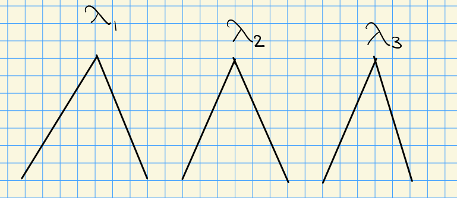

# Category $\OO$ (Friday, September 10)

Counterexamples: Kac Moodys that aren't usual Lie algebras: affine Kac Moodys.

:::{.remark}
Our setup: $A \leadsto (\lieh,\pi,\pi\dual)$.
Fix $\lambda \in \lieh\dual$ and $c\in \CC_{ \lambda} \ni z$ a representation of $\lieh$ by $x.\cdot \da \lambda(x)z$.
Recall that we have a triangular decomposition $\lieg = \lien^- \oplus \lieh \oplus \lien$ with $\lieh \oplus \lien \leq \lieb$ a subalgebra of the Borel.
Since $\lien \normal \lieb$ is an ideal, we can quotient to extend the representation 
\[
\lieb \to \lieb/\lien \cong \lieh \mapsvia{\lambda} \CC_{\lambda}
.\]
This extends from $\lieh$ to $\lieb$ by making it zero on $\lien$, and generally one can do this with nilradicals.
:::

:::{.definition title="Verma Modules"}
\[
M(\lambda) \da U(\lieg) \tensor_{U(\lieb)} \CC_{\lambda} \in \mods{\lieg}
,\]
where $\lieb\actson \CC_{\lambda}$ extends to the universal enveloping algebra.
:::

:::{.remark}
The PBW theorem implies that every $M(\lambda)\cong U(\lien^-) \tensor_\CC \CC_{\lambda}$ as vector spaces, which is in fact an isomorphism in $\mods{\lieb^-}$.
This means $M( \lambda)$ is a weight module for $\lieh$, i.e. there is a decomposition $M(\lambda) = \bigoplus_{\mu \in \lieh\dual}M(\lambda)_{ \mu}$ where
\[
M(\lambda)_{\mu} \da \ts{v\in M( \lambda) \st h\cdot v = \mu(h) v,\,\quad h\in \lieh}
.\]
:::

:::{.definition title="Highest weight modules"}
Any nonzero quotient $L$ of $M(\lambda)$ in $\mods{\lieg}$ is a **highest weight module** with highest weight $\lambda$.
:::

:::{.remark}
Why *highest weight*?
There is a partial order on weights: 
\[
\mu \leq \lambda\iff \lambda- \mu\in Q^+ \da \ZZ_{> 0} \pi
.\]
Also note that $M( \lambda)$ is a highest weight module.
:::

:::{.definition title="Category $\OO$"}
There is a full subcategory $\OO \leq \mods{\lieg}$ where every $M\in \Ob(\OO)$ satisfies the following:

- (Finite multiplicities) $M$ is a weight module with finite-dimensional weight spaces.
- There exist finitely many weights $\elts{\lambda}{k}\in \lieh\dual$ (depending on $M$) such that $P(M) \subseteq \Union_{1\leq j\leq k} \lieh\dual_{\leq \lambda_j}$:

<!-- Xournal file: /home/zack/SparkleShare/github.com/Notes/Class_Notes/2021/Fall/FlagVarieties/sections/figures/2021-09-10_14-07.xoj -->

:::

:::{.lemma title="?"}
Any $M(\lambda)$ has a unique proper maximal $\lieg\dash$submodule $M'(\lambda)$.
In particular, \( \lambda\not \in M'(\lambda) \), and there is a unique irreducible quotient $L(\lambda) \da M( \lambda)/M'( \lambda)$.

> The proof is easy: use that $\lambda$ generated $M(\lambda)$ as a $\lieg\dash$module.

:::

:::{.lemma title="?"}
For any irreducible $L \in \Ob(\OO)$, there exists a unique $\lambda \in \lieh\dual$ such that $L \cong L(\lambda)$.
:::

:::{.definition title="Dominant Integral Weights"}
Define the **dominant integral weights**
\[
D \da \ts{ \lambda\in \lieh\dual \st \forall \alpha_i\dual \in \pi\dual,\,\, \inner{ \lambda}{\alpha_i\dual} \in \ZZ_{> 0} }
.\]
:::

:::{.definition title="Maximal integrable highest weight modules"}
For $\lambda \in D$, define $M_1(\lambda) \subseteq M( \lambda)$ as the submodule generated by $\ts{ f_i^{ \lambda(\alpha_i\dual) + 1 } \tensor 1}_{i=1}^\ell$, and define
\[
L^{\max}( \lambda) \da {M(\lambda) \over M_1( \lambda)}
,\]
the operators that act locally nilpotently (so there is an exponent depending on the vector)
:::

:::{.example title="?"}
Let $A = \tv{2}$ be a $1\times 1$ GCM, which yields $(\CC, \ts{ 2}, \ts{ 1})\leadsto \liesl_2(\CC)$.
Given \( \lambda\in \CC, \) we have 
\[ 
M( \lambda) 
&= U(\liesl_2) \tensor_{U(\lieb)} \CC_{\lambda} \\
&\cong U(\lien^-) \tensor_\CC \CC_{\lambda} \\
&= \CC[y] \tensor_\CC \CC_{ \lambda}
.\]
where noting that $\lien^- = \gens{f_i}$ and $\lien = \gens{e_i}$, we identify the variable $y$ with $f$.

This has weights $\lambda, \lambda-2, \lambda-4, \cdots$, identifying elements as $y^k \tensor 1$.
How do $e,f,h \in \lieg$ act in this basis?

- $h(y^k \tensor 1) = (hy^k) \tensor 1 = (\lambda - 2k)(y^k\tensor 1)$.
- $f(y^k\tensor 1) = y(y^k\tensor 1) = y^{k+1}\tensor 1$.
- $e$: more complicated!

The game: move $e$s across the tensor product to kill terms:

- For $k=0$:
\[
e(1\tensor 1) = e\tensor 1 = 1\tensor e(1) = 0
\]
  since we extended $\lambda$ by zero on $\lien$.
- For $k=1$:
\[
e(y\tensor 1) 
&= e(f\tensor 1) \\
&= (ef)\tensor 1 \\
&= ([ef] + fe)\tensor 1 \\
&= [ef] \tensor 1 \\
&= \alpha\dual \tensor 1 \\
&= 1\tensor \alpha\dual\cdot 1 \\
&= \lambda( \alpha\dual)(1\tensor 1) \\
&= \lambda
,\]
  using $ef = [e,f] + fe = ef-fe + fe$ and $fe\tensor 1 = f\tensor e(1) = 0$.

- For $k=2$:
\[
eff\tensor 1 
&= ([ef] + fe)f \tensor 1 \\
&=( \alpha\dual f + fef )\tensor 1 \\
&= ( \alpha\dual f + f([ef] + fe) ) \tensor 1 \\
&= (\alpha\dual f + f[ef]) \tensor 1 \\
&= (\alpha\dual f + f \alpha\dual) \tensor 1 && f \alpha\dual \in \lieh \\
&= ( \alpha\dual f + \lambda f) \tensor 1 \\
&= ( [\alpha\dual, f] + f \alpha\dual + \lambda f) \tensor 1 \\ 
&= ( - \alpha( \alpha\dual) f + 2 \lambda f) \tensor 1 && \text{using Kac-Moody relns.} \\
&= 2( \lambda- 1)f \tensor 1
.\]

Then general pattern is $e(y^k \tensor 1) = k ( \lambda - (k-1) ) \qty{ y^{k-1} \tensor 1 }$.

Here 
\[
D =\ts{ \lambda\in \lieh\dual = \CC \st \inner{ \lambda}{ \alpha\dual} \in \ZZ_{>0} } = \ZZ_{>0} \subseteq \CC = \lieh\dual
\]
and for \( \lambda \in D \),  
\[
M_1( \lambda) = \ts{f^{ \lambda( \alpha_i\dual) + 1} \tensor 1}_{1\leq i \leq \ell = 1} = \ts{f^{\lambda+ 1} \tensor 1}
.\]
Note that $e\cdot f^{ \lambda+1}\tensor 1 = 0$, which can be checked from the above formula:
\[
e(y^{\lambda+1} \tensor 1) = ( \lambda+1)( \lambda- \lambda) y^{ \lambda} = 0
.\]
Thus $M_1( \lambda) = \CC \gens{y^{\lambda+1}, y^{ \lambda+2}, \cdots}$.
Finally, 
\[
{M( \lambda) \over M_1( \lambda)} = L^{\max}( \lambda) = L( \lambda)
.\]
:::

