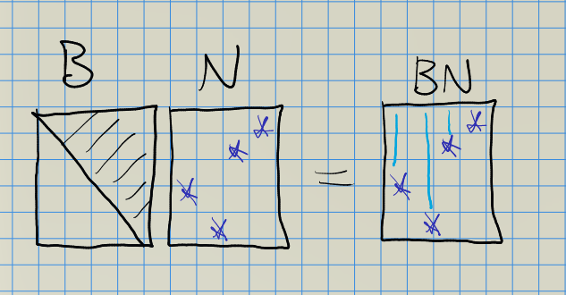
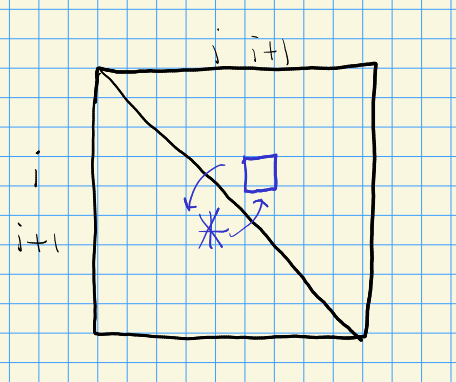
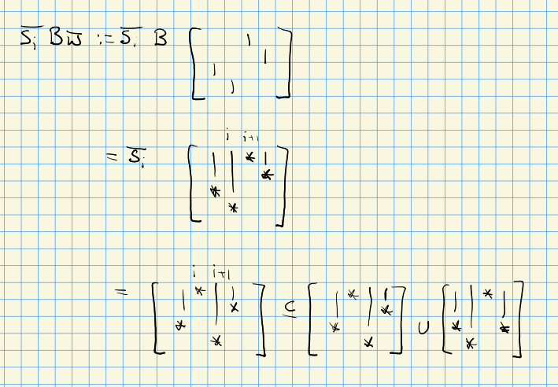
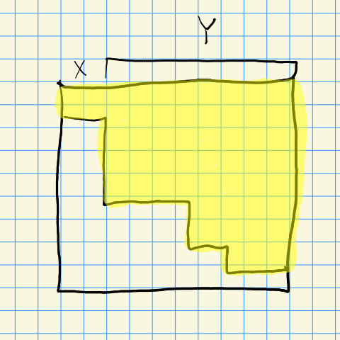

# Tits Systems, 5.1 (Monday, September 13)

:::{.remark}
The basic setup from the book:
\[
A\leadsto (\lieh, \pi, \pi\dual) \leadsto \lieg \leadsto (W, S)
.\]
We'll think of $G\leadsto (\lieh, \pi, \pi\dual)$ as the root data associated to a semisimple simply connected connected algebraic group.
Warning: this association isn't unique in the non-semisimple case!
Noting that $(W, S)$ is a Coxeter group, is there a way to recover an algebra $\lieg$ and a Kac-Moody group $\mcg$?

For today: take 

- $G\da \GL_n$, 
  Note that $G$ is not semisimple or simply connected.
- $B$ the fixed Borel (maximum connected closed solvable subgroup) of upper-triangular matrices.
  Flag varieties are homogeneous projective spaces, so $G/B$ is a flag variety.
- $T$ the maximal torus of diagonal matrices
- $N = N_G(T)$ to be the subgroup generated by all permutation and scalar matrices.
- The Weyl group $W\da N/ B \intersect N = N/T$ since $B \intersect N = T$.
  Note that $W\cong S_n$ is a Coxeter group.
- $S \subseteq W$ is the subset of simple reflections, writing $w = (w_1, \cdots, w_n)$ and taking only those permutations that transpose two adjacent coordinates, so
\[
\tau_{k}: (w_1, \cdots, w_k, w_{k+1}, \cdots, w_n) &\mapsto
(w_1, \cdots, w_{k+1}, w_{k}, \cdots, w_n)
.\]

  This can be written as $\gens{\tau_k} \da \gens{(k, k+1) \st {1\leq k \leq n-1}}$.

:::

:::{.remark}
More generally, $G \contains B \contains T$ and we set $W \da N_G(T) / Z_G(T)$ and show $Z_G(T) = T$, but what is $B \intersect N$ generally?
Maybe use the fact that $N_G(B) = B$?
Or that the unipotent radical intersects it trivially.
:::

:::{.definition title="Tits Systems"}
A **Tits system** is a tuple $(G,B,N,S)$ where $B,N\leq G$ are subgroups and $S \subseteq W = N/B \intersect N$, which collectively adhere to the following axioms:

1. $B \intersect N \normal N$,
2. $B, N$ generate $G$,
3. For all $s_i\in S$, we have $sBs\inv \not\subseteq B$
4. For $w\in S_n$ and $s\in S$, defining $C(x) \da B \bar{x} B \subseteq G$ for any coset representative $\bar{x}$ of $x$ in $N$, we require $C(s) C(w) \subseteq C(w) \union C(sw)$.

:::

:::{.remark}
Consider elements in $BN$ for $\GL_n$: $B$ is upper triangular, $N$ has one (possibly) nonzero entry in each row/column, and multiplying this can "smear" the entries upward by filling a column above an entry:

<!-- Xournal file: /home/zack/SparkleShare/github.com/Notes/Class_Notes/2021/Fall/FlagVarieties/sections/figures/2021-09-13_14-13.xoj -->

Similarly, multiplying on the right smears rightward, and it's not so hard to convince yourself that these generate $\GL_n$.

For the conjugation axiom, consider the following:

<!-- Xournal file: /home/zack/SparkleShare/github.com/Notes/Class_Notes/2021/Fall/FlagVarieties/sections/figures/2021-09-13_14-16.xoj -->

We also have $B\bar{s} B\bar{w} B \subseteq B\bar w B \union B \bar s \bar w B$.
To prove this, we'll show

- $\bar s B \bar w \subseteq$ the RHS,
- The right-hand side is stable under the $B\times B$ action of left/right multiplication.

To see the first, consider the example:

<!-- Xournal file: /home/zack/SparkleShare/github.com/Notes/Class_Notes/2021/Fall/FlagVarieties/sections/figures/2021-09-13_14-21.xoj -->

For the second, consider
\[
(1,3,2,4)(3,4,1,2) = (2,4,1,3)
.\]
The hard case is when lengths of the result change.
:::

:::{.definition title="Parabolics"}
Any $B \subseteq P \subseteq G$ is called a **standard parabolic**.
Any subgroup $Q$ conjugate to $P$ is called **parabolic**.
:::

:::{.remark}
Standard parabolics correspond to subsets $Y$ of simple reflections $\emptyset \subseteq Y \subseteq S$.
Any subgroup containing the upper triangular matrices looks like the following:

<!-- Xournal file: /home/zack/SparkleShare/github.com/Notes/Class_Notes/2021/Fall/FlagVarieties/sections/figures/2021-09-13_14-31.xoj -->

For $P_Y$, we take everything but skip the first index.
:::

:::{.remark}
\envlist

- Take $S \subseteq \ts{w\in W \st w^2 = \id}$ a subset of order 2 elements.
- $P_Y = BW_Y B = \Disjoint_{s\in U} B \bar{s} B \subseteq \mcg$.
- $G = \Disjoint_{w\in W} C(w)$
- There is a decomposition into double coset orbits:
\[
G = \Disjoint_{w\in \dcoset{W_Y}{W}{W_{Y'}} } P_Y w P_{Y'}
.\]
- We have
\[
C(s) C(w) = 
\begin{cases}
C(sw)  & \ell(sw) \geq \ell(w) 
\\
C(w) \union C(s) & \ell(sw) = \ell(w).
\end{cases}
\]

- $(W, S)$ is a Coxeter group.
- For any parabolic $P$ (not necessarily standard), its normalizer satisfies $N_G(P) = P$.
  Note that you can plug in a Borel here.
  Moreover $G/P = G/N_G(P)$, which parameterizes parabolic subgroups of $G$.

  - $w\in W_Y'(Y) \cong W/W_Y$.
  Fixing a *reduced* decomposition $w = w_1\cdots w_k$, i.e. $\ell(w) =\sum_{i=1}^k \ell(w_i)$.

  - For any $A_i \subseteq C(w_i)$ where $A_i \to C(w_i)/B$ is bijective (resp. surjective), the multiplication $\phi: A_1\times \cdots A_{k} \to BwP_Y/P_Y$ is bijective (resp. surjective).
  
:::

