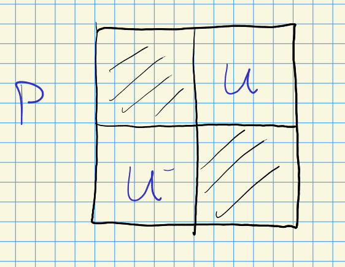

# Wednesday, September 29

:::{.remark}
Ch. 7 and 8 in Kumar: algebraic vector bundles, particularly line bundles on ind-varieties.
Let $\mce \mapsvia{\pi} X$ be an algebraic vector bundle, so there are local trivializations:

\begin{tikzcd}
\pi\inv(U) 
  \ar[rd, "\pi"]
  \ar[rr, "\pr_1"] 
& 
& 
U\times \CC^n
  \ar[ld, ""] 
\\
& 
U 
& 
\end{tikzcd}

i.e. these look like projections onto the first coordinate of an actual product on sufficiently small sets.
We write $\mce_x \da \pi\inv(x)$.
The key data: transition functions.

Our first examples were $\OO_{\PP^n}(k)$, particularly for $n=1$.
:::

:::{.remark}
Equivariant coherent sheaves yields algebraic representations by taking global sections.
Kumar uses character formulas to compute global sections.
:::

:::{.definition title="Equivariant vector bundles"}
For $G\in \Alg\Grp$ is linear (and e.g. connected reductive), if $\pi$ is $G\dash$equivariant and $G$ maps $\mce_x\to \mce_{gx}$ *linearly*, then $\pi$ yields an **equivariant vector bundle**.
:::

:::{.remark}
For $G$ connected reductive and $T \subseteq G$ a maximal torus, a character $\lambda \in X^*(T)$ is a map $\lambda: T\to \CC\units$, and using $T \subseteq B \subseteq G$ we get a representation $\lambda: B\to \CC\units$ of the Borel.
We then define
\[
G\mix{B} \CC_{\lambda} \da (G\times \CC)/B
.\]
There is a map

\begin{tikzcd}
	{G\times \CC} && {G\mix{B}\CC_{\lambda}} && {[g, z]} \\
	\\
	G && {G/B} && {gB/B}
	\arrow["{\pr_1}", from=1-1, to=3-1]
	\arrow["{\wait/B}", from=3-1, to=3-3]
	\arrow[from=1-3, to=3-3]
	\arrow[dashed, from=1-1, to=1-3]
	\arrow[maps to, from=1-5, to=3-5]
\end{tikzcd}

> [Link to Diagram](https://q.uiver.app/?q=WzAsNixbMiwwLCJHXFxtaXh7Qn1cXENDX3tcXGxhbWJkYX0iXSxbMiwyLCJHL0IiXSxbNCwwLCJbZywgel0iXSxbNCwyLCJnQi9CIl0sWzAsMCwiR1xcdGltZXMgXFxDQyJdLFswLDIsIkciXSxbNCw1LCJcXHByXzEiXSxbNSwxLCJcXHdhaXQvQiJdLFswLDFdLFs0LDAsIiIsMix7InN0eWxlIjp7ImJvZHkiOnsibmFtZSI6ImRhc2hlZCJ9fX1dLFsyLDMsIiIsMix7InN0eWxlIjp7InRhaWwiOnsibmFtZSI6Im1hcHMgdG8ifX19XV0=)

Even better, if $Y = \ts{1\leq i\leq \ell \st \inner{\lambda}{\alpha_i\dual} }$ then
taking $\lambda \in D_Y^0$ so $\lambda: P \to \CC\units$ yields a map $G\mix{P} \CC_{ \lambda} \mapsvia{\pi} G/P$ where $G/P \contains U_w$.
Write $P = LU$ and $P^- = LU^-$ for $L$ the Levi and $U^\pm$ the unipotent radical and its opposite:

<!-- Xournal file: /home/zack/SparkleShare/github.com/Notes/Class_Notes/2021/Fall/FlagVarieties/sections/figures/2021-09-29_14-07.xoj -->

There is an embedding \[
U^- &\injects G/P\\
u &\mapsto uP/P
.\]
For $w\in W_Y'$, we have 
\[
\eta_w: {}^w U^- &\to G/P \\
wuw\inv &\mapsto wuP/P
,\]
and ${}^w U^- = wU^- w\inv$ for $w\in W= N_G(T)/T$. 
:::

:::{.example title="?"}
Let $\PP^1 = G/P$ for $G= \SL_2$.
Here $W = \ts{e, s}\cong C_2$ and $S = \ts{s} \supseteq Y$, and we want $Y = \emptyset$.
Any $\lambda \in X^*(T)$ needs to be orthogonal to $\alpha\dual$.
We can take a realization $\SL_2(\CC, \ts{2}, \ts{1})$ which yields $X^*(T) = \ZZ$.
So $\inner{ \lambda}{ \alpha\dual} = 0 \iff 1\cdot \lambda \neq 0$, forcing \( \lambda\neq 0 \) for this to be a flag variety.
For $\lambda = k$, we have $\lambda \cdot \matt{t}{0}{0}{t\inv} = t^k$.
We get a line bundle $G\mix{B} \CC_{\lambda} \mapsvia{\pi} G/B=\PP^1$, how does this compare to $\OO_{\PP^1}(k)$?
The flag varieties look like the following:

\begin{tikzpicture}
\fontsize{45pt}{1em} 
\node (node_one) at (0,0) { \import{/home/zack/SparkleShare/github.com/Notes/Class_Notes/2021/Fall/FlagVarieties/sections/figures}{2021-09-29_14-17.pdf_tex} };
\end{tikzpicture}

Here $s, e$ are the two $T\dash$fixed points.
We have $U_s \intersect U_e \cong \CC\units$, and we'll replace $U_s \to {}^s U^-$ and $U_e \to {}^{e}U^- = U^-$.
The transition functions read:

\begin{tikzcd}
	{{}^{s}U^- \times \CC} && {\pi\inv(U_s)} && {\pi\inv(U_e)} && {U^-\times \CC} \\
	\\
	& {U_s} &&&& {U_e}
	\arrow["\pi", from=1-3, to=3-2]
	\arrow["{\pr_1}"', from=1-1, to=3-2]
	\arrow["\cong", from=1-1, to=1-3]
	\arrow["\cong", from=1-5, to=1-7]
	\arrow["{\pr_1}", from=1-7, to=3-6]
	\arrow["\pi"', from=1-5, to=3-6]
	\arrow["{\text{on }U_e \intersect U_s}"', from=1-3, to=1-5]
\end{tikzcd}

> [Link to Diagram](https://q.uiver.app/?q=WzAsNixbMiwwLCJcXHBpXFxpbnYoVV9zKSJdLFswLDAsInt9XntzfVVeLSBcXHRpbWVzIFxcQ0MiXSxbNCwwLCJcXHBpXFxpbnYoVV9lKSJdLFs2LDAsIlVeLVxcdGltZXMgXFxDQyJdLFsxLDIsIlVfcyJdLFs1LDIsIlVfZSJdLFswLDQsIlxccGkiXSxbMSw0LCJcXHByXzEiLDJdLFsxLDAsIlxcY29uZyJdLFsyLDMsIlxcY29uZyJdLFszLDUsIlxccHJfMSJdLFsyLDUsIlxccGkiLDJdLFswLDIsIlxcdGV4dHtvbiB9VV9lIFxcaW50ZXJzZWN0IFVfcyIsMl1d)

We have $U_s \intersect U_e \cong \CC\units$, so what map $\CC\units \selfmap$ do we get?
Consider $U^-B/B \intersect sU^-B/B$, so
\[
u_{\alpha} (x) = \matt 1 x 0 1 && u_{-\alpha}(x) = \matt 1 0 x 1
.\]
Then and  $u_{-\alpha}(x) = s u_\alpha(-x)s\inv$, so
\[
u_{-\alpha}(x) B &= u_{- \alpha}(y) B \\
s u_{\alpha}(-x)s\inv B &= s u_{- \alpha}(y) B \\
u_{ \alpha}(-x) s\inv B &= u_{-\alpha} B
.\]

Now check that
\[
\matt 1 {-x} 0 1 \matt 0 {-1} 1 0 = \matt 1 0 y 1 \matt a b 0 {a\inv}&& \text{for some }\matt a b 0 {a\inv}\in B \\ \\
\matt {-x} {-1} {1} 0 = \matt a b {ay} {yb+a\inv}
,\]
so we have $-x=y\inv$.
Thus
\[
T_{es}U_s\units \times \CC &\to U_e\units \times \CC \\
(x, z) &\mapsto (x\inv, x^{-k} z) \\ \\
T_{se}U_e\units \times \CC &\to U_s\units \times \CC \\
(x, z) &\mapsto (x\inv, x^{-k} z)
.\]

> These computations are hard, even in the case of $\SL_2$!
> Perhaps a motivation for having character formulas.

We then identify $G\mix{B} \CC_{ \lambda} \mapsvia{\pi} G/B$ with $\OO(-k)$, and $\mcl( \lambda) = G\mix{B} \CC_{\lambda}$.
:::

