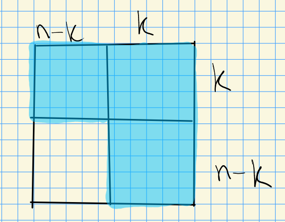

# Kumar Ch. 8: Demazure Character Formulas  (Friday, October 01)

:::{.remark}
For any $\lambda \in D_Y^0$ define the algebraic line bundle $\mcl^Y(- \lambda)$ over $X^Y = \mcg/P_Y$ to be the following pullback:

\begin{tikzcd}
	{\mcg/P_y} && \eta \\
	\\
	{\mcx^Y} && {\PP(L^{\max} ( \lambda ))}
	\arrow["{\iota_{\lambda}}", from=3-1, to=3-3]
	\arrow[from=1-3, to=3-3]
	\arrow[from=1-1, to=3-1]
	\arrow[from=1-1, to=1-3]
	\arrow["\lrcorner"{anchor=center, pos=0.125}, draw=none, from=1-1, to=3-3]
\end{tikzcd}

> [Link to Diagram](https://q.uiver.app/?q=WzAsNCxbMCwwLCJcXG1jZy9QX3kiXSxbMiwwLCJcXGV0YSJdLFsyLDIsIlxcUFAoTF57XFxtYXh9ICggXFxsYW1iZGEgKSkiXSxbMCwyLCJcXG1jeF5ZIl0sWzMsMiwiXFxpb3RhX3tcXGxhbWJkYX0iXSxbMSwyXSxbMCwzXSxbMCwxXSxbMCwyLCIiLDEseyJzdHlsZSI6eyJuYW1lIjoiY29ybmVyIn19XV0=)

Let $H^Y = \Gr_k(\CC^n) = G/P^Y$ for $G\da \GL_n$.

:::

:::{.definition title="The Tautological Bundle"}
Then define a vector bundle
\[
\mce \da \ts{ (x, v) \in X^Y \times \CC^n \st v\in x} = \ts{(E, v) \in \Gr_k(\CC^n) \times \CC^n \st v\in E}
,\]
and define $\mce \mapsvia{\pi} X^Y = \Gr_k(\CC^n)$ to be projection to the first factor such that

1. $\pi\inv(E) \cong E \in \mods{\CC}^{\dim = k}$ is a $k\dash$dimensional vector space for any $E\in X^Y$.
2. $\pi$ is $G\dash$equivariant: $\pi(g\cdot (x, v)) = g \cdot \pi(x, v)$, where the first action is $g\cdot (x, v) = (gx, gv)$, and $\pi(x, v) = gx$.
  Moreover $G$ acts on fibers linearly, so $g\cdot(\wait): \pi\inv(x) \to \pi\inv(gx)$ which sends $E\to gE$ as subspaces in $\CC^n$, and we require that this map of subspaces is a $\CC\dash$linear map.

:::

:::{.remark}
Equivariant bundles on homogeneous spaces are determined by the representation of the stabilizer on the corresponding fiber.
We can pick a base point $\spanof_\CC\ts{e_1,\cdots, e_k} \cong \CC^k \in \Gr_k(\CC^n)$, whence $\stab_G(\CC^k) = P$ is all but the lower-left block:

<!-- Xournal file: /home/zack/SparkleShare/github.com/Notes/Class_Notes/2021/Fall/FlagVarieties/sections/figures/2021-10-01_14-09.xoj -->

Then $\pi\inv(\CC^k) = \CC^k$.
We conclude
\[
\mce: G \mix{P} \CC^k &\to G/P \\
[g, v] &\mapsto gv
.\]
:::

:::{.example title="?"}
For $k=1$, we're considering $\Gr_1(\CC^n) = \PP^{n-1}$.

- $T \subseteq \GL_n$ are diagonal matrices, and $t\actson \tv{x_1, 0, \cdots, 0} = \tv{tx_1, 0, \cdots, 0}$.
- $Y = \ts{1\leq i \leq n-1 \st \inner{\lambda}{\alpha_i\dual} = 0} = \ts{2, \cdots, n-1}$.

- Taking $\lambda = \tv{1, 0,\cdots, 0}$, we have a character
\[
\lambda: T &\to \CC\units \\
\diag(t_1,\cdots, t_n) &\mapsto t_1^1 t_2^0\cdots t_n^0
.\]

- $\mce = G\mix{P} \CC^1 = G\mix{P} \CC_{\tv{1, 0, \cdots, 0}} = \mcl(- \lambda)$.

Note that since this weight $\lambda$ is dominant (and not antidominant), there are no global sections.
:::

:::{.remark}
Define 
\[
\lieh\dual_{\ZZ, Y} \da \ts{ \lambda\in \lieh\dual_\ZZ \st \inner{ \lambda} { \alpha_i \dual} = 0, i\in Y}
.\]
For any \( \lambda\in \lieh\dual_\ZZ \) take \( \lambda_1, \lambda_2 \in D_Y^0 \) such that \( \lambda= \lambda_1 - \lambda_2 \), i.e. we can write any weight as a difference of dominant weights:

\begin{tikzpicture}
\fontsize{45pt}{1em} 
\node (node_one) at (0,0) { \import{/home/zack/SparkleShare/github.com/Notes/Class_Notes/2021/Fall/FlagVarieties/sections/figures}{2021-10-01_14-21.pdf_tex} };
\end{tikzpicture}

Set
\[
\mcl( \lambda) \da \mathcal{L} ^Y( - \lambda_2) \tensor \mcl( - \lambda_1)\dual
.\]
For example, given $T \subseteq G$ and \( \lambda\in X(T) \), we have
\[
\mathcal{L} (\lambda) = G\mix{P} \CC_{ - \lambda}
.\]
:::

:::{.remark}
Given $w\in W$, define
\[
\mcl_w( \lambda) \da P_{i_1}\mix{B} P_{i_2} \mix{B} \cdots \mix{B} P_{i_n} \mix{B} \CC_{ - \lambda}
.\]
:::

:::{.claim}
Let 

- ${w} = (s_{i_1}, \cdots, s_{i_n})$
- $i_{\lambda}: \mcg/P_Y \to \PP(L^{\max} ( \lambda))$
- $m_w: Z_w \to \mcg/P_Y$

Then
\[
\mcl_{w} (\lambda) = m_{w}\dual \mathcal{L} ^Y(\lambda)
.\]
:::

:::{.proof title="?"}
Define
\[
f: \mcl_{w}( \lambda) &\to Z_w 
= P_{i_1}\mix{B} P_{i_2} \mix{B} \cdots \mix{B} P_{i_n} \mix{B} \CC_{ - \lambda}
\\ 
[p_1,p_2, \cdots, p_n, z] &\mapsto [p_1, p_2, \cdots, p_n B/B] \\ \\ 
g: \mcl_{w}( \lambda) &\to \mcl^Y( \lambda)  \\
[p_1,p_2, \cdots, p_n, z] &\mapsto [p_1 \cdot p_2 \cdots p_n, z]
.\]

:::{.exercise title="?"}
Check that these maps are well-defined.
:::

Using the universal property of pullbacks, we get a diagram:

\begin{tikzcd}
	{\mcl_w(\lambda)} \\
	\\
	&& {m_w^* \mcl^Y(\lambda) = Z_w \fiberprod{G/P} \mcl^Y(\lambda)} && {\mcl^Y(\lambda)} \\
	\\
	&& {Z_w} && {G/P}
	\arrow["\pi", from=3-5, to=5-5]
	\arrow["{m_w}"', from=5-3, to=5-5]
	\arrow[from=3-3, to=5-3]
	\arrow[from=3-3, to=3-5]
	\arrow["g", curve={height=-24pt}, from=1-1, to=3-5]
	\arrow["f", curve={height=24pt}, from=1-1, to=5-3]
	\arrow["{\exists \varphi}", dashed, from=1-1, to=3-3]
\end{tikzcd}

> [Link to Diagram](https://q.uiver.app/?q=WzAsNSxbMiw0LCJaX3ciXSxbNCw0LCJHL1AiXSxbNCwyLCJcXG1jbF5ZKFxcbGFtYmRhKSJdLFsyLDIsIm1fd14qIFxcbWNsXlkoXFxsYW1iZGEpID0gWl93IFxcZmliZXJwcm9ke0cvUH0gXFxtY2xeWShcXGxhbWJkYSkiXSxbMCwwLCJcXG1jbF93KFxcbGFtYmRhKSJdLFsyLDEsIlxccGkiXSxbMCwxLCJtX3ciLDJdLFszLDBdLFszLDJdLFs0LDIsImciLDAseyJjdXJ2ZSI6LTR9XSxbNCwwLCJmIiwwLHsiY3VydmUiOjR9XSxbNCwzLCJcXGV4aXN0cyBcXHZhcnBoaSIsMCx7InN0eWxlIjp7ImJvZHkiOnsibmFtZSI6ImRhc2hlZCJ9fX1dXQ==)

The claim is that $\phi$ is an isomorphism, we'll show this by explicitly construction its inverse algebraic morphism.
We have $\phi([p_1, \cdots, p_n, z]) = ( [p_1, \cdots, p_n B/B] \times [ p_1p_2\cdots p_n, z] )$.
Define
\[
\psi: m_w^* \mcl^Y( \lambda) &\to \mcl_w( \lambda) \\
[p_1, \cdots, p_nB/B] \times [g, z] &\mapsto [p_1, \cdots, p_n, p_n\inv\cdots p_1\inv gz]
,\]
where $p_1\inv\cdots p_1\inv g\in P$.
This will clearly be an inverse, it remains to show it's well-defined.
Note that 
\[
p_1\cdots p_n P/P = gP/P \implies f\inv p_1\cdots p_n \in P
,\]
which follows from chasing the fiber product diagram around the two sides.
:::

:::{.exercise title="?"}
Check that this is well-defined by showing a different representative has the same image.
Then compose $\phi, \psi$ in both orders.
:::

