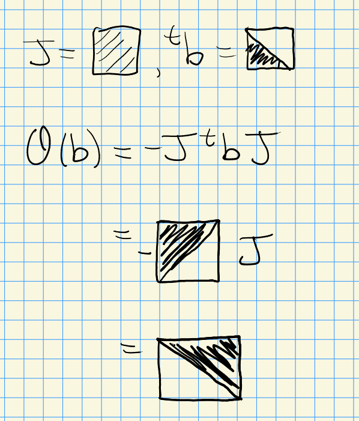
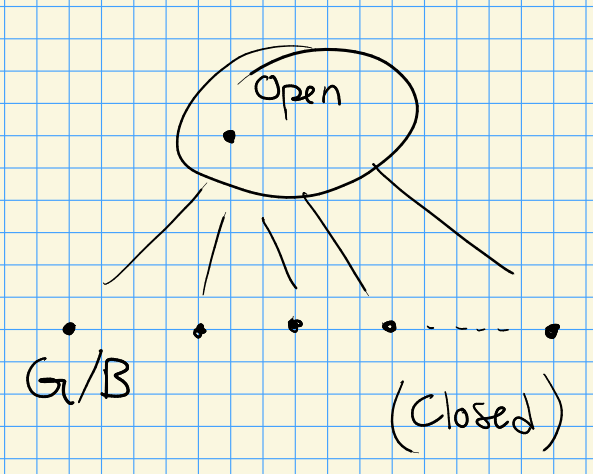

# Ch.8 Continued (Monday, October 18)

:::{.remark}
Today: looking at more examples of Schubert varieties in detail, e.g. $\Sp_{2n}$.
One can take $G' \da \GL_{2n}$ and define involutions $G' \mapsvia{\Theta} G'$.
One example is $g\mapsto g^{-t}$, whose fixed points are $\Orth_{2n}$, and it's easy to check that this is an involution:
\[
(\Theta')^2(g) = \Theta' ({}^t g\inv) = {}^t( {}^t g\inv)\inv = {}^t ({}^t g) = g
.\]
For $\Sp_{2n}$, taking 
\[
\theta(g) = -J^t g J 
\]
where $J$ is the matrix
\[
\begin{bmatrix}
 &  &  &  &  &  & 1 \\
 &  &  &  &  & \cdots &  \\
 &  &  &  & 1 &  &  \\
 &  &  & -+- &  &  &  \\
 &  & -1 &  &  &  &  \\
 & \cdots &  &  &  &  &  \\
-1 &  &  &  &  &  &  
\end{bmatrix}
.\]

We can check that this is an involution:
\[
\Theta^2(g) 
&= \Theta(-J^t g J) \\
&= -J^t(-J^t g J)\inv J \\
&= J(Jg^{-t} J)\inv J \\
&= JJ g JJ \\
&= g
.\]

:::

:::{.definition title="?"}
$(G')^\Theta \da \ts{g'\in G'\st \Theta(g') = g'$ are the fixed points under the involution $\Theta$. 
:::

:::{.proposition title="?"}
One can write
\[
(G')^\Theta = \ts{g\in G' \st \omega(g' x, g' y) = \omega(x, y)}
.\]
for $\omega$ the associated bilinear form $\omega(x, y) = \ltranspose{x} J y$.
Note that $g'x, g'y$ should be column vectors here.
:::

:::{.proof title="sketch"}
Write the RHS set  as $\ts{g\in G \st \ltranspose{g'} J g' = J}$.
Then check that if $\theta(g) = g$ for some $g\in G'$, 
\[
\omega(gx, gy) 
&= \ltranspose{(gx)} J (gy) \\
&= \ltranspose{(x\inv )} g J  gy \\
&= \ltranspose{(x\inv )} g J  \Theta(g) y \\
&= \ltranspose{(x\inv )} g J (-J \ltranspose{g\inv} J ) y \\
&= \ltranspose{x} Jy
.\]
So these two act the same on all elements $x, y$, and thus have the same matrix, yielding $\subseteq$.
For the reverse containment, if $\omega(gx, gy) = \omega(x, y)$, then
\[
\ltranspose{g} J g &= J \\
\implies Jg &= \ltranspose{g\inv} J \\
\implies \Theta(g) &= -J \ltranspose{g\inv } J \\
&= -JJ g \\
&= g
.\]
:::

:::{.remark}
We can realize $\Sp_{2n}$ as $(G')^{\Theta}$.
:::

:::{.fact}
How do we get a Borel? 
It is a general fact that these can be obtained by intersecting with Borels in the ambient group, so take $B' \intersect \Sp_{2n}$ for $B' \subseteq G'$ upper triangular.
Then $B'$ is $\Theta\dash$stable:

<!-- Xournal file: /home/zack/SparkleShare/github.com/Notes/Class_Notes/2021/Fall/FlagVarieties/sections/figures/2021-10-18_14-23.xoj -->

:::

:::{.remark}
Let $G = (G')^\Theta$, then $G\actson G'/B'$ with finitely many orbits.
So we get closure relations:

<!-- Xournal file: /home/zack/SparkleShare/github.com/Notes/Class_Notes/2021/Fall/FlagVarieties/sections/figures/2021-10-18_14-26.xoj -->

One can also fix $T' \subseteq G'$ as a maximal torus of diagonal matrices, and this is also $\Theta\dash$stable.
Then $T' \intersect G$ is of the following form:

\[
\begin{bmatrix}
t_1 &  &  &  &  &  \\
 & \ddots &  &  &  &  \\
 &  & t_n &  &  &  \\
 &  &  & t_n\inv &  &  \\
 &  &  &  & \ddots &  \\
 &  &  &  &  & t_1\inv 
\end{bmatrix} 
\cong (\CC\units)\cartpower{n}
.\]

Writing $G'/B' = \ts{ F^\bullet \text{ complete flags}} = G' \cdot \CC^\bullet$ for the standard flag $\CC^\bullet \da (0 \subseteq \CC^1 \subseteq \CC^2 \subseteq \cdots \subseteq \CC^{2n})$.
We can write this set as $\ts{F^\bullet \st (F^k)^\perp = F^{2n+1-k}}$, where $(F^k)^\perp \da \ts{ x\in \CC^{2n} \st \omega(x, y) = 0 \,\,\forall y\in F^k}$.
Generally the former will be flags $\CC^{2n} =F^{2n} \to F^{2n-1} \to \cdots \to F^1\to 0$, and this says we can describe this more compactly as flags $\CC^{2n} \to F^n \to F^{n-1} \to \cdots \to F^1\to 0$ where the $F^k$ are isotropic, by inserting their orthogonal complements into the chain appropriately.
:::

:::{.question}
What are the Schubert varieties in $G/B$?
:::

:::{.answer}
For $w'\in W' = S_{2n}$, the Weyl group for $G' = \GL_{2n}$ and writing $X' = G'/B'$, the Schubert varieties are exactly $X_{w'}' \intersect G/B$.
This is empty if there exists a $k$ with ???, and is $X_W$ otherwise where $W \subseteq W'$ is $\ts{ (w_1,\cdots, w_n) \st w_1 + w_{2n} = 2n+1 }$.
For example, take $\sigma = (1,3,2,4) \in W$, then $X_{W'}' = (\CC^4 \to \CC^3 \to F^2 \to \CC^1)$ and $X_W = (\CC^4 \to \CC^3 \to F_2 \to \CC^1)$, where $F^2$ is a Lagrangian subspace of $\CC^4$.
:::

:::{.remark}
This produces a large collection of normal varieties: start with flags and add conditions.
:::

