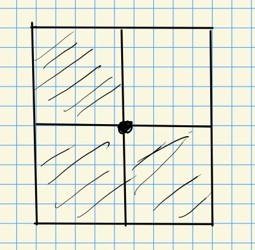

# Wednesday, October 20

:::{.remark}
Last time: Schubert varieties for $G \leq G'$ for $G \da \Sp_{2n}$ and $G' \da \GL_{2n}$.
There are Weyl groups $W \leq W'$ where here $W' = S_{2n}$ and $W = \ts{w\in S_{2n} \st w(k) + w(2n+1-k) = 2n+1-k }$.
For $\Sp_2 \leq \GL_4$, e.g. we can take $w = (1,3 \mid 2, 4)$ and $X_W = \ts{F^\bullet \in G'/B' \st \CC^4\to \CC^3 \to F^2\to \CC^1 \to 0} \cong \PP^1$.
:::

:::{.remark}
For $G' = \GL_4$, we can produce a singular Schubert variety.
Take $G/P$ for $P = P_Y$ where $Y = \ts{1, 3}$, so $G/P = \Gr_2(\CC^4)$.
Take the following Young diagram:

<!-- Xournal file: /home/zack/SparkleShare/github.com/Notes/Class_Notes/2021/Fall/FlagVarieties/sections/figures/2021-10-20_14-02.xoj -->

So $X_\lambda^Y = \ts{E^2 \in \Gr_2(\CC^4) \st \dim (\CC^2 \intersect E^2) \geq 1}$, and $X_W = \pi\inv(X_\lambda^Y)$.
The minimal length permutation is $w' = (2,4 \mid 1,3)$ (obtained from the Young diagram above) and the maximal is $w=(4,2 \mid 3, 1)$.
Note this satisfies $w(k) + 2(2n +1) = 2n + 1$ for $n=2$ since $4+1 = 2+3 = 5$, so $w\in W = W(\Sp_4)$.

For this $Y$, we have a map
\[
\pi: G/B &\to G/P \\
F^\bullet &\mapsto F^2
,\]
where the full preimage is $\pi\inv(P/P) = P/B$.
Writing $X_W' = \ts{F^\bullet \in G'/B' \st \dim(\CC^2 \intersect F^2) \geq 1 } \subseteq G'/B'$, we can realize
\[
X_W = \ts{ F^\bullet \in G/B \st \dim(\CC^2 \intersect F^2) \geq 1, (F^1)^\perp = F^3, (F^2)^\perp = F^2}
.\]
:::

:::{.remark}
For $G = \Sp_4$, $S = \ts{1, 2}$, $Y = \ts{1}$, and $G/P_Y = \ts{\CC^4 \to F^2 \to 0 \st F^2 = (F^2)^\perp}$ since the $1\in Y$ implies omitting $F^1$, and we also omit $(F^1)^\perp = F^3$.
This yields the **Lagrangian flag variety**.
:::

:::{.remark}
Let $s_1 = (2,1,4,3)$ and $s_2 = (1,3,2,4)$, then $ws_1 = (4,2,3,1)(2,1,3,4) = (2,4,1,3)$ and notably $\ell(2,4,1,3) < \ell(4,2,3,1)$ and the length has strictly decreased.
So $w$ is maximal length in $wW_Y$.

We can conclude $X_w^Y = \ts{F^2 \in \mcl \da \Gr^0_2(\CC^4) \st \dim(\CC^2 \intersect F^2) \geq 1  }$ where $\Gr^0$ denotes isotropic subspaces.
So this yields a normal but not smooth variety.
:::

## Statements in Equivariant \(\K\dash\)theory 

> See Chris-Ginzburg

:::{.remark}
On flat pullback: for $f:X\to Y$ a $G\dash$equivariant morphism of $G\dash$spaces, if $f$ is flat (so tensor-exact) then there is a morphism of $G\dash$equivariant \(\K\dash\)theories:
\[
f^*: K_i^G(Y) \to K_i^G(X)
\]
induced by an exact pullback functor
\[
f^*: \Coh^G(Y) & \to \Coh^G(X) \\
\mcf &\mapsto f^& \mcf = \OO_{X} \tensor_{f\inv \OO_Y} f\inv \mcf
.\]

:::

:::{.slogan}
Flat implies sameness among fibers in a bundle.
:::

## Flat Pullback

### Equivariant Descent

:::{.remark}
A principal $G\dash$bundle can mean several things.
The difference between local triviality in the Zariski vs étale topology
[^zar_impl]
Then $\pi:P\to X \in \Prin\Bung$, since étale implies flat there is an equivalence of categories $\Coh(X) \iso \Coh^G(P)$.
Thus there is an isomorphism $\pi^*: K(X) \iso K^G(P)$.

[^zar_impl]: 
Zariski locally trivial implies étale locally trivial.

:::

### Restriction/Induction

:::{.remark}
For $H \leq G$ a closed subgroup and $X$ an $H\dash$space, then $G\mix{H} X$ is always an algebraic variety.
E.g. for $X = \pt$, $G\mix{H} \pt = G/H$.
Note that there is a projection $G\times X \to G$ where $H$ acts diagonally on the left and $G$ is an $H\dash$space, and this map is $H\dash$ equivariant, so there is an induced map $G\mix{H}X\to G/H$.
What's hard is showing there are varieties.
This is flat with fiber $X$ since it's a fiber bundle in our case.

For $\mcf\in \Sh^G(G\mix{H} X)$ a $G\dash$equivariant sheaf, 

There is a functor
\[
\Ind_H^G: \Coh^H(X) &\to \Coh^G(G\mix{H} X)
.\]

For $p:G\times X\to X$ and $\mcf \in \Sh^H(X)$ an $H\dash$equivariant sheaf, we can use a diagonal action to obtain $p^* \mcf \in \Sh^H(X)$ and write
\[
\Ind_H^G = p^* \mcf \in \Coh(G\mix{H} X) \iso \Coh^H(G\times H)
.\]
This defines a $G\dash$equivariant structure on $p^* \mcf$.
:::

