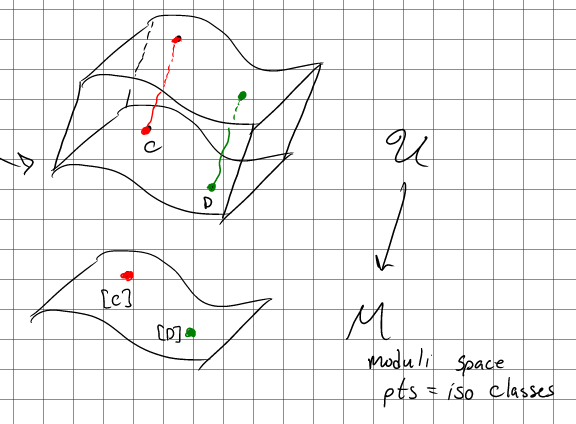
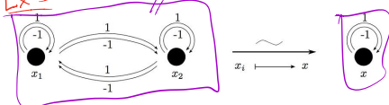
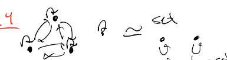

# Lecture 3: Groupoids and Prestacks (Monday, September 06)

## Groupoids 

:::{.remark}
Last time: functors, sheaves on sites, descent, and Artin approximation.
Today: groupoids and stacks.

Recall that a **site** $\cat{S}$ is a category such that for all $U\in \Ob(\cat{S})$, there exists a set $\Cov(U) \da \ts{U_i \to U}_{i\in I}$ (a *covering family*) such that

- $\id_U \in \Cov(U)$,
- $\Cov(U)$ is closed under composition.
- $\Cov(U)$ is closed under pullbacks:

\begin{tikzcd}
	{\exists U_i\fiberprod{U}V} && {U_i} \\
	\\
	V && U
	\arrow["{\in \Cov(U)}", from=1-3, to=3-3]
	\arrow[from=3-1, to=3-3]
	\arrow[dashed, from=1-1, to=1-3]
	\arrow[dashed, from=1-1, to=3-1]
	\arrow["\lrcorner"{anchor=center, pos=0.025}, draw=none, from=1-1, to=3-3]
	\arrow["{\in\Cov(U)}"{description}, curve={height=-12pt}, dashed, from=1-1, to=3-3]
\end{tikzcd}

> [Link to Diagram](https://q.uiver.app/?q=WzAsNCxbMiwyLCJVIl0sWzAsMiwiViJdLFsyLDAsIlVfaSJdLFswLDAsIlxcZXhpc3RzIFVfaVxcZmliZXJwcm9ke1V9ViJdLFsyLDAsIlxcaW4gXFxDb3YoVSkiXSxbMSwwXSxbMywyLCIiLDAseyJzdHlsZSI6eyJib2R5Ijp7Im5hbWUiOiJkYXNoZWQifX19XSxbMywxLCIiLDIseyJzdHlsZSI6eyJib2R5Ijp7Im5hbWUiOiJkYXNoZWQifX19XSxbMywwLCIiLDEseyJzdHlsZSI6eyJuYW1lIjoiY29ybmVyIn19XSxbMywwLCJcXGluXFxDb3YoVSkiLDEseyJjdXJ2ZSI6LTIsInN0eWxlIjp7ImJvZHkiOnsibmFtZSI6ImRhc2hlZCJ9fX1dXQ==)

:::

:::{.example title="The big étale site"}
Take $\cat{S} \da \Sch_{\Et}$ to be the big étale site: the category of all schemes, with covering families given by étale morphisms $\ts{U_i\to U}_{i\in I}$ such that $\Disjoint_i U_i \surjects U$.
Note that there is a special covering family given by *surjective* etale morphisms.

\todo[inline]{Reducing to case of single surjective etale cover somehow?}

:::

:::{.definition title="Sheaves on sites"}
Let $\cat{C}$ be a category (e.g. $\cat C \da \Set$) and recall that a *presheaf* on a category $\cat S$ is a contravariant functor $\cat{S}\to \cat{C}$.

A $\cat{C}\dash$valued **sheaf** on a site $\cat{S}$ is a presheaf 
\[
\mcf:\cat{S} \to \cat{C}
\]
such that for all $U_i, U_j\in \Cov(U)$,
the following equalizer diagram is exact in $\cat{C}$

\begin{tikzcd}
    0
    \stackarr{1}[r]
    &
    F(U)
    \stackarr{3}[r]
    &
	\prod\limits_{i} F(U_i)
    \stackarr{5}[r]
	&
    \prod\limits_{i, j} F(U_i \fiberprod{U}  U_j)
\end{tikzcd}

:::

:::{.exercise title="Criterion for sheaves on the big etale site"}
Show that a presheaf $F$ is a sheaf on $\Sch_\Et$ iff 

- $F$ is a sheaf on $\Sch_\Zar$ and 
- For all etale surjections $U' \surjects_{\et} U$ of affines, the equalizer diagram is exact.

:::

:::{.proposition title="Yoneda"}
For $X\in \Sch$, the presheaf 
\[
h_X \da \Mor(\wait, X): \Sch \to \Set
\]
is a sheaf on $\Sch_{\Et}$.

:::

:::{.remark}
We'll often consider *moduli functors*: functors $F: \Sch \to \Set$ where $F(S)$ is a family of objects over $S$.
Then $F$ will be a sheaf iff families glue uniquely in the étale topology, and representability of such functors will imply they are sheaves.
:::

:::{.example title="A non-sheaf"}
Consider the following moduli functor:

\begin{tikzpicture}
\node {%
  \(\begin{aligned}
    F_{\Alg}: \Sch &\to \Set \\
	S &\mapsto
	\left\{
	\begin{tikzcd}
	\mathcal{C}
	  \ar[d] 
	\\
	S 
	\end{tikzcd}
	\right.
	\begin{aligned}
	\text{Smooth families of}\\
	\text{genus $g$ curves.}
	\end{aligned}
  \end{aligned}\)
};
\end{tikzpicture}

This is *not* representable by a scheme and not a sheaf.
:::

:::{.remark}
Why care about representability?
Suppose there were a scheme $M$, so 
\[
F_{\Alg}(S) \simeq \Mor(S, M)
.\]
Then taking $\id_M \in \Mor(M, M)$ should yield a universal family $\mcu \to M$:

Then the points of $M$ would correspond to isomorphism classes of curves, and every family of curves would be a pullback of this.

For any $S\in\Sch$ and a family $\mcc \mapsvia{f} S$, the fiber $f\inv(s)\in\mcc$ is a curve for any $s\in S$,
so one could define a map 
\[
g: S &\to M \\
s &\mapsto [s]
,\]
where we send a curve to its isomorphism class.
Then $\mcc$ would fit into a pullback diagram:

\begin{tikzcd}
	\mcc && \mcu \\
	\\
	S && M
	\arrow[from=1-3, to=3-3]
	\arrow[from=3-1, to=3-3]
	\arrow[from=1-1, to=3-1]
	\arrow[dashed, from=1-1, to=1-3]
	\arrow["\lrcorner"{anchor=center, pos=0.125}, draw=none, from=1-1, to=3-3]
\end{tikzcd}

> [Link to Diagram](https://q.uiver.app/?q=WzAsNCxbMCwwLCJcXG1jYyJdLFsyLDAsIlxcbWN1Il0sWzAsMiwiUyJdLFsyLDIsIk0iXSxbMSwzXSxbMiwzXSxbMCwyXSxbMCwxLCIiLDAseyJzdHlsZSI6eyJib2R5Ijp7Im5hbWUiOiJkYXNoZWQifX19XSxbMCwzLCIiLDEseyJzdHlsZSI6eyJuYW1lIjoiY29ybmVyIn19XV0=)

If $S$ was itself a curve, then $g: S\to M$ would be a path in $M$ deforming a base curve.
:::

## Groupoids

:::{.remark}
Recall that a **groupoid** is a category where every morphism is an isomorphism.
Morphisms of groupoids are functors, and isomorphisms of groupoids are equivalences of categories.

:::

:::{.example title="Groupoid of a set"}
A basic example is the category of sets where 
\[
\Mor(A, B) \da 
\begin{cases}
\id_A & A=B 
\\
\emptyset & \text{else}.
\end{cases}
\]

A similar construction: for any set $\Sigma$, one can form a groupoid $\mcc_\Sigma$:

- Object: Elements $x\in \Sigma$.
- Morphisms: $\id_x$

:::

:::{.example title="Moduli of curves"}
Define a category $\mg(\CC)$:

- Objects: smooth projective curves over $\CC$ of genus $g$.
- Morphisms: 
\[
\Mor(C, C') = \Isom_{\Sch\slice\CC}(C, C') \subseteq \Mor_{\Sch\slice\CC}(C, C')
.\]
:::

:::{.example title="Equivalence of groupoids"}
Groupoids are equivalent iff they are equivalent as categories.
The following is an example of mapping the quotient groupoid $[C_2/C_4]$ to $\B C_2$:

:::

:::{.example title="Groupoids equivalent to sets"}
If a groupoid $\mfx$ is equivalent to $\cat{C}_{\Sigma}$ for any $\Sigma \in \Set$, we say $\mfx$ is **equivalent to a set**.
For example, the following groupoid is equivalent to a 2-element set:

:::

:::{.example title="Quotient groupoids"}
For $G\actson \Sigma$ a group acting on any set, define the **quotient groupoid** $[\Sigma/G]$ in the following way:

- Objects: $x\in \Sigma$, i.e. one object for each element of the set $\Sigma$.
- Morphisms: $\Mor(x, x') = \ts{g\in G \st gx' = x}$.

:::

:::{.exercise title="Groupoids equivalent to sets"}
Show that $[\Sigma/G]$ is equivalent to a set iff $G\actson \Sigma$ is a free action.
:::

:::{.example title="Classifying stacks"}
For $\Sigma = \ts{\pt}$, we obtain 
\[
\B G \da [\pt/ G]
,\]
where there is one object $\pt$ and $\Mor(\pt, \pt) = G$.
:::

:::{.example title="from representation stability"}
Define $\Finset$ to be the category of finite sets where the morphisms are set bijections.
Then $\Finset = \Disjoint_{n\in \ZZ_{\geq 0}} \B S_n$ for $S_n$ the symmetric group.
:::

:::{.definition title="Fiber products of groupoids"}
For $C, D' \to D$ morphisms of groupoids, we can construct their **fiber product** as the cartesian diagram:

\begin{tikzcd}
	\textcolor{rgb,255:red,92;green,92;blue,214}{C\fiberprod{D}D'} && {D'} \\
	\\
	C && D
	\arrow["f"', from=3-1, to=3-3]
	\arrow["{g}", from=1-3, to=3-3]
	\arrow["{\pr_1}"', from=1-1, to=3-1]
	\arrow["{\pr_2}", from=1-1, to=1-3]
\end{tikzcd}

> [Link to Diagram](https://q.uiver.app/?q=WzAsNCxbMCwyLCJDIl0sWzIsMiwiRCJdLFsyLDAsIkQnIl0sWzAsMCwiQ1xcZmliZXJwcm9ke0R9RCciLFsyNDAsNjAsNjAsMV1dLFswLDEsImYiLDJdLFsyLDEsImYnIl0sWzMsMCwiXFxwcl8xIiwyXSxbMywyLCJcXHByXzIiXV0=)

It can be constructed as the following category:

\[
\Ob(C\fiberprod{D} D') \da 
\left\{ 
\begin{array}{l}
(c, d', \alpha)
\end{array}
\middle\vert 
\begin{array}{l}
c\in C, d'\in D', \\ \\
\alpha: f(c) \mapsvia{\sim} g(d')
\end{array}
\right\}
\]

\includegraphics{figures/BigDiagram1.pdf}

<!--
\begin{tikzpicture}
\node {%
  \(\Mor((c_1, d_1', \alpha_1), (c_2, d_2', \alpha_2)) \da 
	\left\{
	\begin{aligned}
	c_1 \mapsvia{\beta} c_2 \\ \\
	d_1' \mapsvia{\gamma} d_2' 
	\end{aligned}
\,\,
	\middle\vert
\begin{tikzcd}
	{f(c_1)} && {f(c_2)} \\
	\\
	{g(d_1')} && {g(d_2')}
	\arrow["{f(\beta)}", from=1-1, to=1-3]
	\arrow["{g(\gamma)}"', from=3-1, to=3-3]
	\arrow["{\alpha_1}"', from=1-1, to=3-1]
	\arrow["{\alpha_2}", from=1-3, to=3-3]
\end{tikzcd}
	\right\}\)
};
\end{tikzpicture}
-->

:::

:::{.exercise title="Universal property of pullbacks in Groupoids"}
Describe the universal property of the pullback in the 2-category of groupoids.
:::

:::{.example title="$G$ is a pullback of $\B G$"}
$G$ regarded as a groupoid is the pullback over inclusions of points into $\B G$:

\begin{tikzcd}
	\textcolor{rgb,255:red,92;green,92;blue,214}{G} && \pt \\
	\\
	\pt && {\B G}
	\arrow[from=3-1, to=3-3]
	\arrow[color={rgb,255:red,92;green,92;blue,214}, from=1-1, to=3-1]
	\arrow[from=1-3, to=3-3]
	\arrow[color={rgb,255:red,92;green,92;blue,214}, from=1-1, to=1-3]
	\arrow["\lrcorner"{anchor=center, pos=0.125}, draw=none, from=1-1, to=3-3]
\end{tikzcd}

> [Link to Diagram](https://q.uiver.app/?q=WzAsNCxbMCwwLCJHIixbMjQwLDYwLDYwLDFdXSxbMiwwLCJcXHB0Il0sWzAsMiwiXFxwdCJdLFsyLDIsIlxcQiBHIl0sWzIsM10sWzAsMiwiIiwwLHsiY29sb3VyIjpbMjQwLDYwLDYwXX1dLFsxLDNdLFswLDEsIiIsMix7ImNvbG91ciI6WzI0MCw2MCw2MF19XSxbMCwzLCIiLDEseyJzdHlsZSI6eyJuYW1lIjoiY29ybmVyIn19XV0=)

:::

:::{.example title="Orbit/Stabilizer"}
Let $G\actson \Sigma$ and $x\in \Sigma$, and let $Gx$ be the orbit and $G_x$ be the stabilizer.
Then there is a morphism of groupoids $f \in \Mor(\B G_x, [\Sigma/G])$ inducing a pullback:

\begin{tikzcd}
	\textcolor{rgb,255:red,92;green,92;blue,214}{G_x} & {} & \Sigma \\
	\\
	{\B G_x} && {[\Sigma/G]} \\
	\pt && x
	\arrow["{\exists f}", from=3-1, to=3-3]
	\arrow[color={rgb,255:red,92;green,92;blue,214}, from=1-1, to=3-1]
	\arrow[from=1-3, to=3-3]
	\arrow[color={rgb,255:red,92;green,92;blue,214}, from=1-1, to=1-3]
	\arrow["\lrcorner"{anchor=center, pos=0.125}, color={rgb,255:red,92;green,92;blue,214}, draw=none, from=1-1, to=3-3]
	\arrow[maps to, from=4-1, to=4-3]
\end{tikzcd}

> [Link to Diagram](https://q.uiver.app/?q=WzAsNyxbMCwwLCJHX3giLFsyNDAsNjAsNjAsMV1dLFsxLDBdLFsyLDAsIlxcU2lnbWEiXSxbMCwyLCJcXEIgR194Il0sWzIsMiwiW1xcU2lnbWEvR10iXSxbMCwzLCJcXHB0Il0sWzIsMywieCJdLFszLDQsIlxcZXhpc3RzIGYiXSxbMCwzLCIiLDAseyJjb2xvdXIiOlsyNDAsNjAsNjBdfV0sWzIsNF0sWzAsMiwiIiwyLHsiY29sb3VyIjpbMjQwLDYwLDYwXX1dLFswLDQsIiIsMSx7ImNvbG91ciI6WzI0MCw2MCw2MF0sInN0eWxlIjp7Im5hbWUiOiJjb3JuZXIifX1dLFs1LDYsIiIsmfx7InN0eWxlIjp7InRhaWwiOnsibmFtZSI6Im1hcHMgdG8ifX19XV0=)

:::

## Prestacks

:::{.remark}
Motivation: to specify a moduli functor, we'll need the data of

- Families over $S$,
- How to pull back families under morphisms, and
- *How* objects are isomorphic.

As a first attempt, we might try to define a 2-functor $F: \Sch \to \Grpd$ between 2-categories, where the latter is the category of groupoids.
For this, we need the following data:

- For all $S\in \Sch$, an assignment of a groupoid $F(S)$,
- For all morphisms $f\in \Mor_{\Sch}(S, T)$, an assignment of morphisms of groupoids 
\[
f^* \in \Mor_{\Grpd}(F(T), F(S))
.\]
- For compositions of morphisms of schemes $S \mapsvia{f} T \mapsvia{g} U$, an isomorphism of functors 
\[
\psi_{fg}: g^* \circ f^* \mapsvia{\sim} (g \circ f)^*
.\]
- Compatibility of these isomorphisms on chains of compositions $S \to T \to U \to V \to \cdots$. [^lasfunctors]

This is a lot of data to track, so instead we'll construct a large category $\mfx$ that encodes all of this, along with a fibration

\begin{tikzcd}
\mfx \da \Disjoint_{S\in \Sch} F(S) \ar[d, "p"] 
& (S, \alpha \in F(S)) \ar[d, maps to]
\\
\Sch & S
\end{tikzcd}

Here $S \in \Sch$ and $F(S) \in \Grpd$, so the "fibers" above $S$ are groupoids.

[^lasfunctors]: 
This leads to the notion of **lax** or **pseudofunctors**.

:::

:::{.definition title="Prestack"}
Let $p:\mfx \to \cat{C}$ be a functor between two 1-categories, so we have the following data:

\begin{tikzcd}
	\mfx && a && b & {\in \Ob(\mfx)} \\
	\\
	\cat{C} && S && T & {\in \Ob(\cat C)}
	\arrow["f", from=3-3, to=3-5]
	\arrow["p"', from=1-1, to=3-1]
	\arrow[maps to, from=1-3, to=3-3]
	\arrow[maps to, from=1-5, to=3-5]
	\arrow["\alpha", from=1-3, to=1-5]
\end{tikzcd}

> [Link to Diagram](https://q.uiver.app/?q=WzAsOCxbMCwwLCJcXG1meCJdLFswLDIsIlMiXSxbMiwwLCJhIl0sWzQsMCwiYiJdLFsyLDIsIlMiXSxbNCwyLCJUIl0sWzUsMCwiXFxpbiBcXE9iKFxcbWZ4KSJdLFs1LDIsIlxcaW4gXFxPYihTKSJdLFs0LDUsImYiXSxbMCwxLCJwIiwyXSxbMiw0LCIiLDAseyJzdHlsZSI6eyJ0YWlsIjp7Im5hbWUiOiJtYXBzIHRvIn19fV0sWzMsNSwiIiwyLHsic3R5bGUiOnsidGFpbCI6eyJuYW1lIjoibWFwcyB0byJ9fX1dLFsyLDNdXQ==)

Then $\mfx, p$ define a **prestack** over $\cat C$ iff

- Pullbacks exist: for $S \mapsvia{f} T$, there exists a (not necessarily unique) map $f^*b$, sometimes denoted $\ro{b}{f}$, yielding a cartesian square:

\begin{tikzcd}
	\textcolor{rgb,255:red,92;green,92;blue,214}{\exists a} && b \\
	\\
	S && T
	\arrow[from=3-1, to=3-3]
	\arrow[from=1-3, to=3-3]
	\arrow["{f^* b = \ro{b}{f}}", color={rgb,255:red,92;green,92;blue,214}, dashed, from=1-1, to=1-3]
	\arrow[color={rgb,255:red,92;green,92;blue,214}, dashed, from=1-1, to=3-1]
	\arrow["\lrcorner"{anchor=center, pos=0.125}, color={rgb,255:red,92;green,92;blue,214}, draw=none, from=1-1, to=3-3]
\end{tikzcd}

> [Link to Diagram](https://q.uiver.app/?q=WzAsNCxbMCwwLCJcXGV4aXN0cyBhIixbMjQwLDYwLDYwLDFdXSxbMiwwLCJiIl0sWzAsMiwiUyJdLFsyLDIsIlQiXSxbMiwzXSxbMSwzXSxbMCwxLCJmXiogYiA9IFxccm97Yn17Zn0iLDAseyJjb2xvdXIiOlsyNDAsNjAsNjBdLCJzdHlsZSI6eyJib2R5Ijp7Im5hbWUiOiJkYXNoZWQifX19LFsyNDAsNjAsNjAsMV1dLFswLDIsIiIsMCx7ImNvbG91ciI6WzI0MCw2MCw2MF0sInN0eWxlIjp7ImJvZHkiOnsibmFtZSI6ImRhc2hlZCJ9fX1dLFswLDMsIiIsMSx7ImNvbG91ciI6WzI0MCw2MCw2MF0sInN0eWxlIjp7Im5hbWUiOiJjb3JuZXIifX1dXQ==)

- A universal property making $\mfx$ a *fibered category*: every arrow in $\mfx$ is a pullback, so there are always lifts of the following form:

\begin{tikzcd}
	\textcolor{rgb,255:red,92;green,92;blue,214}{a} && b && c \\
	\\
	R && S && R
	\arrow[from=3-1, to=3-3]
	\arrow[from=3-3, to=3-5]
	\arrow[maps to, from=1-3, to=3-3]
	\arrow[maps to, from=1-5, to=3-5]
	\arrow[from=1-3, to=1-5]
	\arrow[color={rgb,255:red,92;green,92;blue,214}, dashed, maps to, from=1-1, to=3-1]
	\arrow["{\exists !}", color={rgb,255:red,92;green,92;blue,214}, dashed, from=1-1, to=1-3]
	\arrow["\lrcorner"{anchor=center, pos=0.125}, draw=none, from=1-1, to=3-3]
\end{tikzcd}

> [Link to Diagram](https://q.uiver.app/?q=WzAsNixbMCwwLCJhIixbMjQwLDYwLDYwLDFdXSxbMiwwLCJiIl0sWzQsMCwiYyJdLFswLDIsIlIiXSxbMiwyLCJTIl0sWzQsMiwiUiJdLFszLDRdLFs0LDVdLFsxLDQsIiIsmfx7InN0eWxlIjp7InRhaWwiOnsibmFtZSI6Im1hcHMgdG8ifX19XSxbMiw1LCIiLDIseyJzdHlsZSI6eyJ0YWlsIjp7Im5hbWUiOiJtYXBzIHRvIn19fV0sWzEsMl0sWzAsMywiIiwwLHsiY29sb3VyIjpbMjQwLDYwLDYwXSwic3R5bGUiOnsidGFpbCI6eyJuYW1lIjoibWFwcyB0byJ9LCJib2R5Ijp7Im5hbWUiOiJkYXNoZWQifX19XSxbMCwxLCJcXGV4aXN0cyAhIiwwLHsiY29sb3VyIjpbMjQwLDYwLDYwXSwic3R5bGUiOnsiYm9keSI6eyJuYW1lIjoiZGFzaGVkIn19fSxbMjQwLDYwLDYwLDFdXSxbMCw0LCIiLDAseyJzdHlsZSI6eyJuYW1lIjoiY29ybmVyIn19XV0=)

:::

:::{.slogan}
An alternative definition: a prestack is a category *fibered in groupoids*.
:::

:::{.warnings}
We often conflate $\mfx$ and the functor $\mfx \mapsvia{p} S$, and don't spell out the composition law in $\mfx$.
Moreover, we write $f^*b$ or $\ro{b}{f}$ for a *choice* of a pullback.
:::

:::{.definition title="Fiber Categories"}
For $p: \mfx\to \cat{C}$ a functor and $S\in \Ob(\cat C)$ any fixed object, the associated **fiber category over $S$**, denoted $\mfx(S)$, is the subcategory of $\mfx$ defined by:

- Objects: $a\in \Ob(\mfx)$ such that $a \mapsvia{p} S$, 
- Morphisms: $\Mor(a, a')$ are morphisms $f\in \Mor_{\mfx}(a, a')$ over $\id_S$:

\begin{tikzcd}
a 
  \ar[rd, ""]
  \ar[rr, "f"] 
& 
& 
a'
  \ar[ld, ""] 
\\
& 
S 
& 
\end{tikzcd}

:::

:::{.remark}
We can now equivalently define presheaves as categories fibered in sets.
:::

:::{.exercise title="Justifying 'category fibered in groupoids'"}
Show that if $\mfx \to \cat{C}$ is a prestack, then for all $S\in \cat{C}$, all maps in $\mfx(S)$ are invertible.
Conclude that the fiber categories $\mfx(S)$ are all groupoids.
:::

:::{.example title="Presheaves"}
Every presheaf forms a prestack.
Let $F \in \Presh(\Sch, \Set)$ be a presheaf of sets, and define $\mfx_F$ as the following category:

- Objects: Pairs $(S, a \in F(S))$ where $S\in \Sch$ and $F(s) \in \Set$.
- Morphisms: 
\[
\Mor( (S, a), (T, b) ) \da \ts{ S \mapsvia{f} T \st a = f^* b}
.\]

Note that we'll often conflate $F$ and $\mfx_F$.
This yields the fibration

\begin{tikzcd}
	{\mfx_F} && {(S, a)} \\
	\\
	\Sch && S
	\arrow[from=1-1, to=3-1, "p"]
	\arrow[maps to, from=1-3, to=3-3]
\end{tikzcd}

> [Link to Diagram](https://q.uiver.app/?q=WzAsNCxbMCwwLCJcXG1jeF9GIl0sWzAsMiwiXFxTY2giXSxbMiwwLCIoUywgYSkiXSxbMiwyLCJTIl0sWzAsMV0sWzIsMywiIiwwLHsic3R5bGUiOnsidGFpbCI6eyJuYW1lIjoibWFwcyB0byJ9fX1dXQ==)

:::

:::{.example title="Schemes"}
For $X\in \Sch$, take its Yoneda functor $h_X: \Sch \to \Set$.
Then define the category $\mfx_X$:

- Objects: Morphisms $S\to X$ of schemes.
- Morphisms: $\Mor(S\to X, T\to X)$ are morphisms over $X$:

\begin{tikzcd}
S 
  \ar[rd, ""]
  \ar[rr, ""] 
& 
& 
T
  \ar[ld, ""] 
\\
& 
X 
& 
\end{tikzcd}

This yields the fibration

\begin{tikzcd}
	{\mfx_X} && {(S\to X)} \\
	\\
	\Sch && S
	\arrow[from=1-1, to=3-1, "p"]
	\arrow[maps to, from=1-3, to=3-3]
\end{tikzcd}

> [Link to Diagram](https://q.uiver.app/?q=WzAsNCxbMCwwLCJcXG1jeF9GIl0sWzAsMiwiXFxTY2giXSxbMiwwLCIoUywgYSkiXSxbMiwyLCJTIl0sWzAsMV0sWzIsMywiIiwwLHsic3R5bGUiOnsidGFpbCI6eyJuYW1lIjoibWFwcyB0byJ9fX1dXQ==)

:::

:::{.example title="Moduli of curves"}
Define $\mg$ as the following category:

- Objects: families $\mcc\to S$ of smooth genus $g$ curves,
- Morphisms: $\Mor(\mcc \to S, \mcc'\to S')$: cartesian squares

\begin{tikzcd}
	\mcc && {\mcc'} \\
	\\
	S && S'
	\arrow[from=3-1, to=3-3]
	\arrow[from=1-1, to=3-1]
	\arrow[from=1-3, to=3-3]
	\arrow[from=1-1, to=1-3]
	\arrow["\lrcorner"{anchor=center, pos=0.125}, draw=none, from=1-1, to=3-3]
\end{tikzcd}

> [Link to Diagram](https://q.uiver.app/?q=WzAsNCxbMCwwLCJDIl0sWzAsMiwiUyJdLFsyLDIsIlMiXSxbMiwwLCJDJyJdLFsxLDIsIlxcaWRfUyIsMl0sWzAsMV0sWzMsMl0sWzAsM10sWzAsMiwiIiwxLHsic3R5bGUiOnsibmFtZSI6ImNvcm5lciJ9fV1d)

This yields a fibration

\begin{tikzcd}
	{\mg} && {(\mcc \to S)} \\
	\\
	\Sch && S
	\arrow[from=1-1, to=3-1]
	\arrow[maps to, from=1-3, to=3-3]
\end{tikzcd}

:::

:::{.example title="Bundles"}
For $C$ a smooth connected projective curve over $k$ a field, define $\Bun(C)$ as the following category:

- Objects: pairs $(S, F)$ where $F$ is a vector bundle over $C\times S$.
- Morphisms: 
\[
\Mor((S, F), (S', F'))
=
\left\{ 
\begin{array}{l}
  f\in \Mor_{\Sch}(S, S') \\
  \text{and a chosen isomorphism} \\
\alpha: (f\times \id)^* \circ F' \mapsvia{\sim} F
\end{array}
\right\}
.\]

:::{.remark}
A technical point: the choice of pushforward here is not necessarily canonical. 
However, as part of the data, one can take morphisms $F' \to (f\cross \id)_* \circ F$ such that the adjunction yields an isomorphism.
:::

:::

:::{.example title="Quotient prestack"}
Let $X\slice S\in \Grp\Sch$ where $G\actson X$.
Then define a category $[X/G]^\pre$:

- Objects: Morphisms over $\id_S$:

\begin{tikzcd}
T 
  \ar[rd, ""]
  \ar[rr, ""] 
& 
& 
X
  \ar[ld, ""] 
\\
& 
S 
& 
\end{tikzcd}

- Morphisms: 

\[
\Mor(T\to X, T'\to X)
\da 
\left\{ 
\begin{array}{l}
  T\to T'
\end{array}
\,\,
\middle\vert 
\begin{array}{l}
  (T \to T' \to X ) = g(T \to X) \\
  g\in G(T) \\
  G(T) \actson X(T)
\end{array}
\right\}
.\]

:::

:::{.remark}
A group scheme can alternatively be thought of as a functor with a factorization through $\Grp$.
:::

:::{.exercise title="Quotient prestacks and quotient groupoids"}
Show that for $T\in \Sch$, there is an equivalence
\[
[X/G]^\pre(T) \mapsvia{\sim} [X(T) / G(T)]
,\]
where the left-hand side is a fibered category over $T$ and the right-hand side is a quotient groupoid.

:::

### Morphisms of Prestacks

:::{.definition title="Morphisms of prestacks"}
A **morphism of prestacks** is a functor $\mfx \mapsvia{f} \mfx'$ such that there is a (strictly) commutative triangle

\begin{tikzcd}
	\mfx && \mfx' \\
	\\
	& \cat{C}
	\arrow["f", from=1-1, to=1-3]
	\arrow["{p_X}"', from=1-1, to=3-2]
	\arrow["{p_Y}", from=1-3, to=3-2]
\end{tikzcd}

> [Link to Diagram](https://q.uiver.app/?q=WzAsMyxbMCwwLCJcXG1jeCJdLFsyLDAsIlxcbWN5Il0sWzEsMiwiXFxTY2giXSxbMCwxLCJmIl0sWzAsMiwicF9YIiwyXSxbMSwyLCJwX1kiXV0=)

Here we require a strict equality $p_X(a) = p_Y(f(a))$ for any $a\in \mfx$

A **2-morphism** $\alpha$ between morphisms $f, g$ is a natural transformation: 

\begin{tikzcd}
	\mfx &&& \mfx'
	\arrow[""{name=0, anchor=center, inner sep=0}, "f", curve={height=-30pt}, from=1-1, to=1-4]
	\arrow[""{name=1, anchor=center, inner sep=0}, "g"', curve={height=30pt}, from=1-1, to=1-4]
	\arrow["\alpha", shorten <=8pt, shorten >=8pt, Rightarrow, from=0, to=1]
\end{tikzcd}

> [Link to Diagram](https://q.uiver.app/?q=WzAsMixbMCwwLCJcXG1meCJdLFszLDAsIlxcbWZ5Il0sWzAsMSwiZiIsMCx7ImN1cnZlIjotNX1dLFswLDEsImciLDIseyJjdXJ2ZSI6NX1dLFsyLDMsIlxcYWxwaGEiLDAseyJzaG9ydGVuIjp7InNvdXJjZSI6MjAsInRhcmdldCI6MjB9fV1d)

such that for all $a\in \mfx$, the following triangle $\alpha_a\in \Mor_{\mfx'}(f(a), g(a))$ is a morphisms over $\id_S$ for any $S\in \cat{C}$:

\begin{tikzcd}
f(a) 
  \ar[rd, ""]
  \ar[rr, ""] 
& 
& 
g(a)
  \ar[ld, ""] 
\\
& 
S 
& 
\end{tikzcd}

We define a category $\Mor(\mfx, \mfx')$ by:

- Objects: morphisms of prestacks.
- Morphisms: 2-morphisms of prestacks.

:::

:::{.exercise title="?"}
Show that $\Mor(\mfx, \mfx')$ is a groupoid.
:::

:::{.definition title="2-commutativity"}
A diagram is **2-commutative** iff there exists a 2-morphism $\alpha: g \circ f' \mapsvia{\sim} f\circ g'$ which is an isomorphism:

\begin{tikzcd}
	{\mfx \fiberprod{\mfx'} \mfx''} && {\mfx''} \\
	\\
	\mfx && \mfx'
	\arrow["g", from=1-3, to=3-3]
	\arrow["f"', from=3-1, to=3-3]
	\arrow["{g'}"', from=1-1, to=3-1]
	\arrow["{f'}", from=1-1, to=1-3]
	\arrow["\alpha", Rightarrow, from=3-1, to=1-3]
\end{tikzcd}

> [Link to Diagram](https://q.uiver.app/?q=WzAsNCxbMCwwLCJcXG1meCBcXGZpYmVycHJvZHtcXG1meX0gXFxtZnknIl0sWzIsMCwiXFxtZnknIl0sWzIsMiwiXFxtZnkiXSxbMCwyLCJcXG1meCJdLFsxLDIsImciXSxbMywyLCJmIiwyXSxbMCwzLCJnJyIsMl0sWzAsMSwiZiciXSxbMywxLCJcXGFscGhhIiwwLHsibGV2ZWwiOjJ9XV0=)

:::

:::{.definition title="Isomorphisms of prestacks"}
An **isomorphism** of prestacks is a 1-isomorphism of prestacks $f: \mfx \to \mfx'$ along with 2-isomorphisms $g\circ f \mapsvia{\sim} \id_{\mfx}$ and $f\circ g \mapsvia{\sim} \id_{\mfx'}$.
:::

:::{.exercise title="Isomorphisms of prestacks can be checked on fibers"}
Show that $\mfx \to \mfx'$ is an isomorphism iff $\mfx(S) \mapsvia{\sim} \mfx'(S)$ is an isomorphism on all fibers.
:::

:::{.proposition title="2-Yoneda"}
If $\mfx\in \prest {}\slice{\cat C}$ is a prestack over $\cat C$, then for any $S\in \Ob(\cat C)$, there is an equivalence of categories induced by the following functor:
\[
\Mor(S, \mfx) & \mapsvia{\sim}  \mfx(S) \\
f &\mapsto f_S(\id_S )
.\]

:::

:::{.remark}
For $S\in \Sch$, view $S$ as a prestack and consider a morphism $f:S\to \mfx$.
How is this specified?
For all $T\in \Sch$, the objects of $S\slice T$ are morphisms 
\[
f_T: \Mor(T, S) \to \mfx(T)
\]
and if $T=S$ this sends $\id_S$ to $f_S(\id_S)\in \mfx(S)$.

What is the inverse?
For $a\in \mfx(S)$ and for each $T \mapsvia{g} S$, **choose** a pullback $g^* a$.
Then define $f: S \to \mfx$ by
\[
f_T: \Mor(T, S) &\to \mfx(T) \\
g &\mapsto g^* a
.\]
:::

:::{.exercise title="?"}
Define what this equivalence should do on morphisms.
:::

:::{.remark}
Next time: fiber products of prestacks.
:::

