# Lecture 1: Overview (Wednesday, January 13)

## Course Logistics

> Note (DZG): Everything in this section comes from Akram!

### Description
  
"I am teaching a topics course about Heegaard Floer homology next semester. Heegaard Floer homology was defined by Peter Ozsváth and Zoltan Szabó around 2000. It is a package of powerful invariants of smooth 3- and 4-manifolds, knots/links and contact structures. Over the last two decades, it has become a central tool in low-dimensional topology. It has been used extensively to study and resolve important questions concerning unknotting number, slice genus, knot concordance and Dehn surgery. It has been employed in critical ways to study taut foliations, contact structures and smooth 4-manifolds. There are also many rich connections between Heegaard Floer homology and other manifold and knot invariants coming from gauge theory as well as representation theory. We will learn the basic construction of Heegaard Floer homology, starting with the definition of the 3-manifold and knot invariants. In the second half of this course, we will turn to computations and applications of the theory to low-dimensional topology and knot theory. In particular, several numerical invariants have been defined using this homological invariants. At the end of the semester, I would expect each one of you to learn the construction of one of these invariants (of course with my help) and present it to the class."

### Expository Papers

- [@G] J. Greene, [Heegaard Floer homology](https://www.ams.org/journals/notices/202101/rnoti-p19.pdf)
- [@H] J. Hom, [Lecture notes on Heegaard Floer homology](https://arxiv.org/pdf/2008.01836.pdf)
- [@L] R. Lipshitz, [Heegaard Floer homologies](https://arxiv.org/abs/1411.4540)
- [@M] C. Manolescu, [An introduction to knot Floer homology](https://arxiv.org/abs/1401.7107)
- [@OS-1] P. Ozsváth and Z. Szabó, [An introduction to Heegaard Floer homology](https://web.math.princeton.edu/~petero/Introduction.pdf)
- [@OS-2] P. Ozsváth and Z. Szabó, [Lectures on Heegaard Floer homology](https://web.math.princeton.edu/~petero/Lectures.pdf)
- [@OS-3] P. Ozsváth and Z. Szabó, [Heegaard diagrams and holomorphic disks](https://arxiv.org/pdf/math/0403029.pdf) 

### Research Papers

- [@OSz04a] Peter Ozsváth and Zoltán Szabó, Holomorphic disks and topological invariants for closed three-manifolds. Ann. of Math. (2) 159 (2004), no. 3, 1027–1158. [arXiv:math/0101206](https://arxiv.org/abs/math/0101206)
- [@OSz04b] Peter Ozsváth and Zoltán Szabó, Holomorphic disks and three-manifold invariants: properties and applications. Ann. of Math. (2) 159 (2004), no. 3, 1159–1245. [arXiv:math/0105202](https://arxiv.org/abs/math/0105202)
- [@OSz04c] Peter Ozsváth and Zoltán Szabó, Holomorphic disks and knot invariants. Adv. Math. 186 (2004), no. 1, 58–116. [arXiv:math/0209056](https://arxiv.org/abs/math/0209056)
- [@OSz06] Peter Ozsváth and Zoltán Szabó, Holomorphic triangles and invariants for smooth four manifolds. Adv. Math. 202 (2006), no. 2, 326–400. [arXiv:math/0110169](https://arxiv.org/abs/math/0110169)
- [@Per08] Timothy Perutz, Hamiltonian handleslides for Heegaard Floer homology. Proceedings of Gökova Geometry-Topology Conference 2007, 15–35, Gökova Geometry/Topology Conference (GGT), Gökova, 2008. [arXiv:0801.0564](https://arxiv.org/abs/0801.0564)

### Basic Morse Theory, Symplectic Geometry and Floer Homology

- [@Mi-1] Milnor, [Morse theory](https://press.princeton.edu/books/paperback/9780691080086/morse-theory-am-51-volume-51)
- [@Mi-2] Milnor, [Lectures on the $h\dash$cobordism theorem](https://press.princeton.edu/books/hardcover/9780691651132/lectures-on-the-h-cobordism-theorem)
- [@Ca] A. Cannas da Silva. [Lectures on Symplectic Geometry](https://www.springer.com/gp/book/9783540421955)
- [@Mc] D. McDuff, [Floer theory and low-dimensional topology](http://www.math.stonybrook.edu/~dusa/floer8.pdf)
- [@AD] M. Audin and M. Damian, [Morse theory and Floer homology](https://link.springer.com/book/10.1007/978-1-4471-5496-9)
- [@Hu] M. Hutchings, [Lecture notes on Morse homology (with an eye towards Floer theory and pseudoholomorphic curves)](https://math.berkeley.edu/~hutching/teach/276-2010/mfp.ps)

### Low-dimensional Topology

- [@S] N. Saveliev, [Lectures on the topology of 3-manifolds](https://www.degruyter.com/view/title/121170)
- [@R] D. Rolfsen, [Knots and links](https://bookstore.ams.org/chel-346-h/)
- [@GS] R. Gompf and A. Stipsicz, [4-manifolds and Kirby calculus](https://bookstore.ams.org/gsm-20)
- [@L] R. Lickorish, [An introduction to knot theory](https://link.springer.com/book/10.1007/978-1-4612-0691-0)

### Suggested Topics for Presentations

- [@SW] S. Sarkar and J. Wang, [An algorithm for computing some Heegaard Floer homologies, Ann. of Math., 171 (2010), 1213–1236, [arXiv:math/0607777](https://arxiv.org/abs/math/0607777).

- Grid homology from:
  - C. Manolescu and P. Ozsváth and S. Sarkar, [A combinatorial description of knot Floer homology](https://annals.math.princeton.edu/wp-content/uploads/annals-v169-n2-p07.pdf), Ann. of Math., 169 (2009), 633–660, [arXiv:math/0607691](https://arxiv.org/abs/math/0607691).

  - P. Ozsváth and A. Stipsicz and Z. Szabó, [Grid Homology for Knots and Links](https://bookstore.ams.org/surv-208), 
  
    - Also available [here](https://web.math.princeton.edu/~petero/GridHomologyBook.pdf) with comment: please go and buy a hard copy, too!

- J. Hom, [A survey on Heegaard Floer homology and concordance](https://www.worldscientific.com/doi/abs/10.1142/S0218216517400156) J. of Knot Theo. and Its Ram.(2) 26 (2017) [arXiv:1512.00383](https://arxiv.org/abs/1512.00383)

- K. Honda and W. Kazez and G. Matić, [On the contact class in Heegaard Floer homology](https://projecteuclid.org/euclid.jdg/1261495333), J. Differential Geom. (2) 83 (2009), 289-311, [arXiv:math/0609734](https://arxiv.org/abs/math/0609734)

- Sutured Floer homology from:
  - [@L] Lipshitz expository paper listed above
  - A. Juhász [Holomorphic discs and sutured manifolds](https://projecteuclid.org/euclid.agt/1513796585) Algebr. Geom. Topol., (3) 6 (2006), 1429-1457, [arXiv:math/0601443](https://arxiv.org/abs/math/0601443)
  - A. Juhász, [Knot Floer homology and Seifert surfaces](https://projecteuclid.org/euclid.agt/1513796824) Algebr. Geom. Topol., (1) 8 (2008), 603-608 [arxiv:math/0702514](https://arxiv.org/abs/math/0702514)

\todo[inline]{Convert to bibtex?}

## Intro and Motivation

:::{.remark}
We'll assume everything is smooth and oriented.
:::

:::{.proposition title="Osvath-Szabo (2000)"}
To closed 3-manifolds $M$ we can assign a graded abelian group $\hat{\HF}(M)$, which can be computed combinatorially
[^see_sarjour_combinatorial]
.
There are several variants: 

- $\HF^- \in \grMod(\ZZ_2[u])$,
[^hfminus_strongest]

- $\HF^+ \in \Mod(\ZZ_2[u, u ^{-1} ] / u \ZZ_2[u])$.

- $\HF^\infty \in \grMod(\ZZ_2[u, u ^{-1} ])$, 

$\HF^+$ and $\HF^\infty$ can be computed using $\HF^-$.
In general, we'll write $\HF^\cdot$ to denote constructions that work with any of the above variants.

[^see_sarjour_combinatorial]: 
See Sarkar-Wang

[^hfminus_strongest]: 
This is the strongest variant.

:::

:::{.remark}
Note that $\ZZ_2$ can be replaced with $\ZZ$, but it's technical and we won't discuss it here.
For the first half of the course, we'll just discuss $\hat{\HF}$, and we'll discuss the latter 3 in the second half.
:::

## Geometric Information

:::{.remark}
These invariants can be used to compute the **Thurston seminorm** of a 3-manifold: 
:::

:::{.definition title="Thurston Seminorm"}
A homology class \( \alpha\in H_2(M)\) can be represented as \( \alpha\in [S] \) for $S$ a closed surface whose fundamental class represents \( \alpha \) where $S = \Union_{i=1}^n S_i$ can be a union of closed embedded surfaces $S_i$.
Then we first compute
\[
\max\ts{0, - \chi(S_i) } 
=
\begin{cases}
0 & \text{if } S_i \cong \SS^2, \TT^2 \\ 
\\
- \chi(S_i) = 2g(S_i) - 2  & \text{ else} .
\end{cases}
\]
Note that the max checks if \( \chi \) is positive.
Then define
\[
\norm{ \alpha } \da \min_S \qty{ \sum_{i=1}^n 
\max\ts{0, - \chi(S_i) } }
,\]
where we sum over the embedded subsurfaces and check which overall surface gives the smallest norm.

:::

:::{.remark}
Note that this can't be a norm, since if $\SS^2, \TT^2 \in [S] \implies \norm \alpha = 0$.
:::

:::{.theorem title="Osvath-Szabo"}
$\HF$ detects
[^detects_means]
the Thurston seminorm, and there is a splitting as groups/modules
\[
\HF^\cdot(M) = \bigoplus _{\mathfrak{s} \in \Spin^c(M)} \HF^\cdot(M, S) 
\] 
where $S \in \Spin^c(M)$ is a **spin$^c$ structure**: an oriented 2-dimensional vector bundle on $M$ (up to some equivalence).

[^detects_means]: 
What "detect" means is slightly technical.

:::

:::{.remark}

The Thurston norm $\norm{a}$ can be computed from this data by considering a perturbed version of $\hat{\HF}$, denoted $\underline{\hat{\HF}}$, in the following way: taking the first Chern class $c_1(\mathfrak{s}) \in H^2(M)$ (which can be associated to every 2-dimensional vector bundle), we have 
\[
\norm{ \alpha} = \max_{\underline{\hat{\HF}}(M, \mathfrak{s}  ) \neq 0 }
\abs{\inner{ c_1(\mathfrak{s})  }{ \alpha }  }
.\]
:::

:::{.slogan}
Floer homology groups split over these spin$^c$ structures and can be used to compute Thurston norms.
:::

:::{.theorem title="Ni"}
Given $F \subseteq M$ with genus $g\geq 2$, $\HF$ detects if $M$ *fibers* over $S^1$ with $F$ as a fiber, i.e. there exists a fiber bundle

\begin{tikzcd}
F 
  \ar[r, hook] 
& 
M
  \ar[d, "\pi"] 
\\
& 
S^1 
\end{tikzcd}

This uses the existence of the splitting over spin$^c$ structures and uses $\HF^+$ in the following way: such a bundles exists if and only if 
\[
\bigoplus _{\inner{ c_1(\mathfrak{s}) }{ [F] }  =2g-2} \HF^+(M, \mathfrak{s}) = \ZZ 
.\]
:::

:::{.definition title="Contact Structure"}
A **contact structure** is equivalently

- A smooth oriented nowhere integrable 2-plane field $\xi$, or

- A 2-plane field \( \xi \da \ker( \alpha) \) where \( \alpha \) is a 1-form such that \( \alpha\wedge d \alpha > 0 \).
[^equiv_nowhere]

[^equiv_nowhere]: 
Note that wedging to a nontrivial top form is equivalent to being nowhere integrable here.
 
:::

:::{.example title="?"}
The standard contact structure on $\RR^3$ is given by 
\[
\alpha\da dz - ydz
,\]
which yields the following 2-plane field \( \xi \da \ker \alpha \):

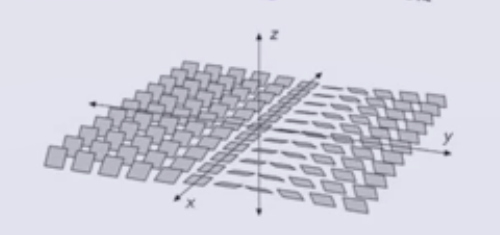

You can see that $z=0 \implies y=0$, so the $xy\dash$plane is in the kernel, yielding the flat planes down the middle:

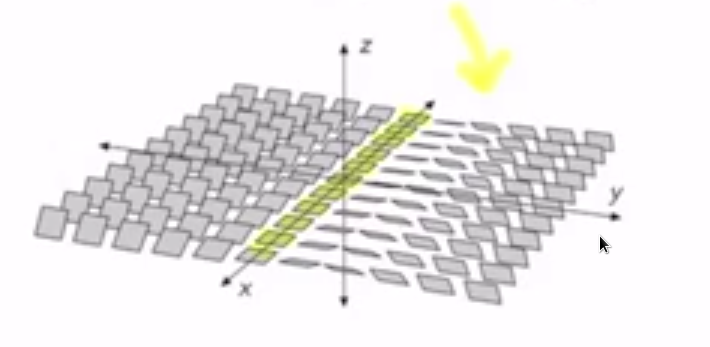

:::

:::{.proposition title="Contact Class (Osvath-Szabo-Honda-Kazez-Matic)"}
To each such \( \xi \) one can associate a **contact class** \( c(\xi) \in \hat{\HF}(-M) \), where $-M$ is $M$ with the reversed orientation.
:::

:::{.remark}
This gives obstructions for two of the following important properties of contact structures:

- Being **overtwisted**, or
- Being **Stein fillable**.

:::

:::{.theorem title="?"}
\envlist

- If $\xi$ is overtwisted, then $c(\xi) = 0$.
- If $\xi$ is Stein fillable, then $c(\xi) \neq 0$.
:::

:::{.remark}
We'll also discuss similar invariants for knots that were created after these invariants for manifolds.
:::

:::{.definition title="Knots"}
Recall that a **knot** is an embedding $S^1 \injects M$.

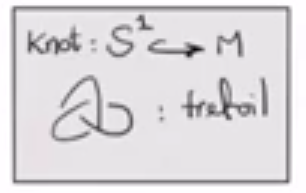{width=150px}
:::

:::{.proposition title="Knot Floer Homology (Ozsváth-Szabó)"}
Given a knot $K \subseteq M$ a 3-manifold (e.g. $M = S^3$), there is extra algebraic structure on $\hat{\CF}(M)$: a filtration.
These allow defining a new bigraded abelian group $\hat{\HFK}(M, K)$ (which is also a $\ZZ_2\dash$vector space) that takes includes the information of $K$.
This yields a decomposition
\[
\hat{\HFK}(M, K) = \bigoplus _{m, a} \hat{\HFK}_m(M, K, a)
.\]

This similarly works for other variants: there is a filtration on $CF^-(M)$ which yields $\HFK^-(M, K)$, a bigraded $\ZZ_2[u]\dash$module.
:::

### Some properties of Knot Floer Homology

:::{.fact}

$\hat{\HFK}(K)$ categorifies the Alexander polynomial \( \Delta_K(t) \) of $K$, i.e. taking the graded Euler characteristic yields
\[
\Delta_K (t) =\sum_{m, a} (-1)^m\qty{ \dim \hat{\HFK}_m(K, a) } t^a
.\]

:::

:::{.fact}
$\hat{\HFK}(K)$ detects the **Seifert genus** of a knot $g(K)$, defined as the smallest $g$ such that there exists an embedded surface 
[^seif_surf]
$F$ of genus $g$ in $S^3$ that bounds $K$, so $\bd F = K$.

:::{.example title="The Unknot"}
The unknot bounds a disc, so its genus is zero:

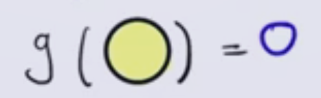

:::

:::{.exercise title="The Trefoil"}
Using the "outside" disc on the trefoil, find 3 bands that show its genus is 1.

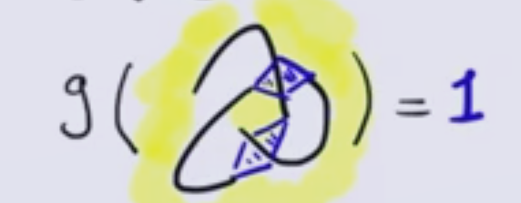

:::

The genus can be computed by setting $\hat{\HFK}(K, a) \da \bigoplus _m \hat{\HFK}_m(K, a)$, which yields
\[
g(k) = \max \ts{ a \st \hat{\HFK}(K, a) \neq 0 }
.\]
Note that the $a$ grading here is referred to as the **Alexander grading**.

[^seif_surf]: 
These are referred to as **Seifert surfaces**.

:::

:::{.fact}
$\hat{\HFK}$ detects whether or not a knot is **fibered**, where $K$ is fibered if and only if it admits an $S^1$ family $F_t$ of Seifert surfaces such that $t\neq s\in S^1 \implies F_t \intersect F_s = K$.
I.e., there is a fibration on the knot complement where each fiber is a Seifert surface:

\begin{tikzcd}
\Sigma_g 
  \ar[r] 
& 
S^3\sm K
  \ar[d, "\pi"] 
\\
& 
K 
\end{tikzcd}

:::{.example title="The Unknot"}
The unknot is fibered by copies of $\DD^2$:

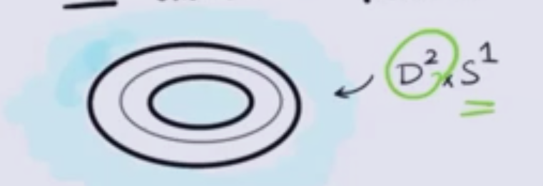

:::

This is "detected" in the following sense: $K$ is fibered if and only if 
\[
\hat{\HFK}(k, g(K)) = \ZZ_2
.\]

:::

:::{.definition title="Slice Genus"}
Let $K \subseteq S^3$.
We know $S^3 = \bd \Ball^4$, so we consider all of the smoothly properly embedded surfaces $F$ in $\Ball^4$ such that $\bd F = K$ and take the smallest genus:

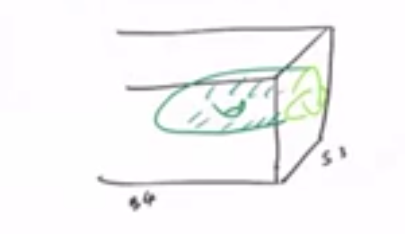

We thus define the **slice genus** or **4-ball genus** as
\[
g_S(K) \da g_4(K) \da \min 
\ts{
g(F) \st F\injects \Ball^4 \text{ smoothly, properly with } \bd F = K
}
.\]
:::

:::{.exercise title="?"}
Show that $g_4(K) \leq g(K)$.
:::

:::{.definition title="Unknotting number"}
Define $u(K)$ the **unknotting number** of $K$ as the minimum number of times that $K$ must cross itself to become unknotted.
:::

:::{.example title="The Trefoil"}
Consider changing the bottom crossing of a trefoil:

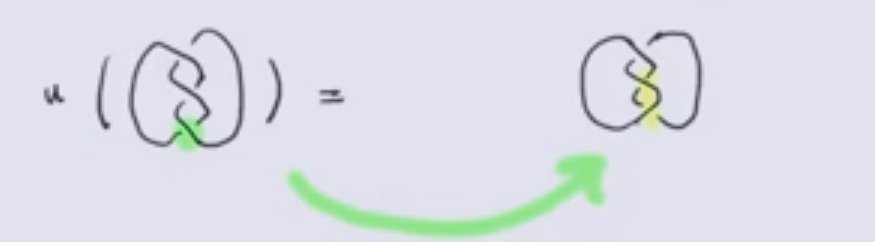

This in fact produces the unknot:

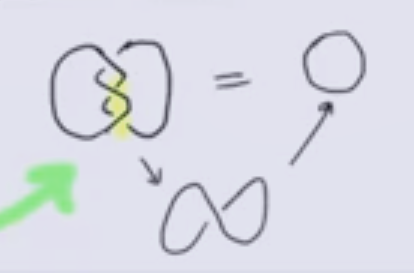

Thus $u(K) = 1$, assuming that we know $K \neq 0$ is not the unknot.
:::

:::{.exercise title="?"}
Show that $g_f(K) \leq u(K)$.

> Hint: each crossing change $K\to K'$ yields some surface that is a cobordism from $K$ to $K'$ in $\Ball^4$, and you can use each step to build your surface.

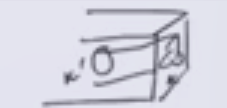

:::

:::{.theorem title="Ozsváth-Szabó"}
There is an invariant $\tau(K) \in \ZZ$ from $\hat{\HFK}$ such that 
\[ \abs{\tau(K)} \leq g_4(K) \leq u(K)
.\]
:::

:::{.definition title="Torus Knots $T_{p, q}$ "}
Recall that we can view $\TT^2 \da \RR^2/\ZZ^2$ where the action is $(x, y) \mapsvia{(m, n)} (x+m, y+m)$, i.e. we module out by integer translations.
Then for $p, q > 0$ coprime, the **torus knot** $T_{p, q}$ is the image of the line $y = mx$ in $\TT^2$ where $m=p/q$.
:::

:::{.example title=" $T_{2, 3}$ "}
The torus knot $T_{2, 3}$ wraps 3 times around the torus in one direction and twice in the other:

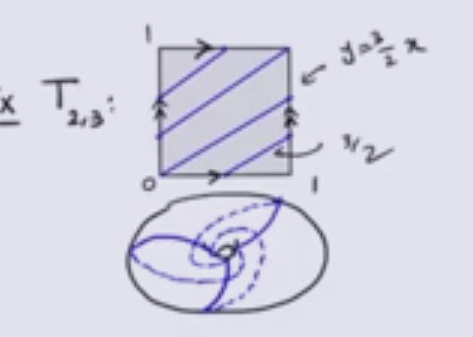

:::

:::{.theorem title="Milnor"}
\[
g_4(T_{p, q}) = u(T_{p, q}) = { (p-1)(1-q) \over 2}
.\]

- First proved by Kronheimer-Mrowka
- Another proof by Osvath-Szabó using Heegard Floer homology.
:::

:::{.exercise title="?"}
Show that $u(T_{p. q}) \leq {(p-1)(q-1) \over 2}$, i.e. torus knots can be unknotted with this many crossing changes.
:::

:::{.theorem title="Osvath-Szabó"}
\[
\tau(T_{p, q}) = 
{(p-1)(q-1) \over 2}
,\]

which implies 
\[
{(p-1)(q-1) \over 2}
\leq g_4(T_{p, q})
\leq u(T_{p, q})
\leq {(p-1)(q-1) \over 2}
,\]
making all of these equal.
:::

:::{.remark}
There are better lower bounds for $u(K)$ defined using $\hat{\HFK}$ which are *not* lower bounds for the slice genus.
There are also other lower bounds for the slice genus with different names (see Jen Hom's survey), some of which are stronger than \( \tau \).
:::

:::{.remark}
Another application of having these lower bounds is that we can construct exotic (or *fake*) $\RR^4$s, i.e. 4-manifolds $X$ homeomorphic to $\RR^4$ but not diffeomorphic to $\RR^4$.
:::

:::{.remark}
All of these invariants work nicely in a $(3+1)\dash$TQFT: we have invariants of 3-manifolds $M_i$ and knots in them, so we can talk about **cobordisms** between them: $W^4$ a compact oriented 4-manifold with $\bd W^4 = -M_1 \disjoint M_2$.

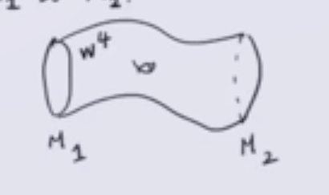

Osvath-Szabó define a map
\[
F_{W, t}^\cdot: \HF^\cdot(M_1, \ro{t}{M_1} ) \to \HF^\cdot(M_2, \ro{t}{M_2})
\]
using $t$ coming from the splitting of spin$^c$ structure which yields an invariant of closed 4-manifolds referred to as **mixed invariants**.

Similarly, if we have knots in 3-manifolds we can define a cobordism $(M_1, K_1) \to (M_2, K_2)$ as $(W^4, F)$ where $W^4$ is a cobordism $M_1\to M_2$ and $F\injects W$ is a smoothly embedded surface that is a cobordism from $K_1\to K_2$ with $F \intersect M_i = K_i$ and $\bd F = -K_1 \disjoint K_2$.

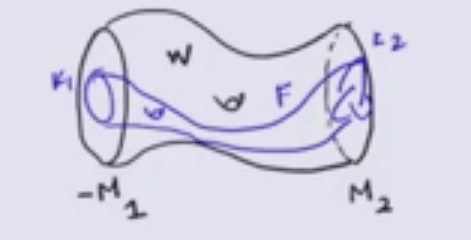

This similarly yields a map

\[
F_{W, F t}^\cdot: \HF^\cdot(M_1, K_1, \ro{t}{M_1} ) \to \HF^\cdot(M_2, K_2, \ro{t}{M_2})
\]
:::

:::{.remark}
This smoothly embedded surface in the middle can be used to study other smoothly embedded surfaces in 4-manifolds, which has been done recently.
:::
