# Lecture 3: Morse Theory (Thursday, January 19)

## Intro to Morse Theory

:::{.remark}
Let $M^n$ be a smooth closed manifold, then the goal is to study the topology of $M$ by studying smooth functions $f \in C^ \infty (M, \RR)$.
We'll need $f$ to be *generic* in a sense we'll discuss later.

:::

:::{.definition title="Critical Point"}
A point $p\in M$ is called a **critical point** if and only if $(df)_p = 0$.
:::

:::{.definition title="Hessian / Second Derivative"}
Fixing a critical point $p$ for $f$, the **second derivative** or **Hessian** of $f$ at $p$ is a bilinear form on $T_pM$ which is defined in the following way:
for $v, w\in T_p M$, extend $w$ to a vector field $\tilde w$ in a neighborhood of $p$ and set
\[
d^2 f_p(v, w) = v\cdot (\tilde w \cdot f)(p) \da v \cdot (df)(\tilde w)(p)
.\]
where we take the derivative of $f$ with respect to $\tilde w$, then take the derivative with respect to $v$, then evaluate at the point to get a number.
:::

:::{.remark}
This is only well-defined at critical points (check!).
Note that we need $\tilde w$ so that $\tilde w \cdot f$ is again a function (and not a number) which can be differentiated again.
You can also take e.g. $\tilde v \cdot (\tilde w \cdot f)$, differentiating with respect to the vector field instead of just the vector $v$, but we're plugging in $p$ in either case.
:::

:::{.claim}
The second derivative is 

1. Well-defined, and

2. Symmetric
:::

:::{.remark}
If you fix a coordinate chart in a neighborhood of $p$, then the bilinear form is represented by a matrix given by
\[
(d^2 f)_p = H_p =  \qty{ \dd{^2}{x_j \del x_i}(p)}_{ij}
.\]
:::

:::{.proof title="of 2"}
We can compute
\[
(d^2 f)_p(v, w) - (d^2 f)_p(w, v) 
&= v\cdot (\tilde w \cdot f)(p) - w \cdot (\tilde v \cdot f)(p) \\
&\da df_p \qty{ [\tilde v, \tilde w]} \\
& = 0 && \text{since $p$ is a critical point and $df_p = 0$}
.\]
:::

:::{.proof title="of 1"}
This is now easier to prove: we are picking an extension of $w$ to a vector field, so we need to show that the definition doesn't depend on that choice.
\[
(d^2 f)(_p(v, w) 
&= v\cdot (\tilde w \cdot f)(p) && \text{which doesn't depend on }\tilde v\\
&= (d^2 f)_p(w, v) \\
&= w\cdot (\tilde v \cdot f)(p) && \text{which doesn't depend on } \tilde w
,\]
and thus this is independent of both $\tilde v$ and $\tilde w$.
:::

:::{.exercise title="?"}
Show that the second derivative in local coordinates is given by the matrix $H_p$ above.
:::

:::{.remark}
In local coordinates, we can write $v = \sum_{i=1}^n a_i \dd{}{x_i}$ and $w = \sum_{i=1}^n b_i \dd{}{x_i}$, and thus
\[
(d^2 f)_p(v, w) = \vector b^t H_p \vector a = \sum_{1 \leq i,j \leq n} a_i b_j \dd{^2 f}{x_i \del x_j}(p)
.\]
:::

:::{.definition title="Nondegenerate Critical Points"}
A critical point $p\in M$ is called **nondegenerate** if the bilinear form $(d^2 f)_p$ is nondegenerate at $p$, i.e. for all $v\in T_p M$ there exists a $w\in T_pM\sm\ts{\vector 0}$ such that $(d^2 f)_p(v, w) \neq 0$.
This occurs if and only if $H_p$ is invertible.
:::

:::{.definition title="Index of a critical point"}
Given a nondegenerate critical point $p\in M$, define the **index** $\ind(p)$ of $f$ at $p$ in the following way: since $H_p$ is symmetric and nondegenerate, its eigenvalues are real and nonzero, so define the index as the number of *negative* eigenvalues of $H_p$.
:::

:::{.definition title="Morse Function"}
A function $f\in C^ \infty (M, \RR)$ is called a **Morse function** if and only if all of its critical points are nondegenerate.
:::

:::{.remark}
We'll see that almost every smooth function is Morse, and these are preferable since they have a simple and predictable structure near critical points and don't do anything interesting elsewhere.
:::

:::{.theorem title="Morse Lemma"}
Let $p\in M$ be a nondegenerate critical point of $f$ with $\ind(p) = \lambda$.
Then there exists charts \( \varphi:(U, p) \to (\RR^n, 0) \) such that writing $f$ in local coordinates yields 
\[
(f \circ \varphi ^{-1} )(x) = f(p) - \sum_{i=1}^{\lambda} x_i^2 + \sum_{j= \lambda + 1}^n x_j^2
.\]
:::

:::{.remark title="Observation 1"}
We have
\[
H_p = 
\begin{bmatrix}
-2&&&&&&\\
&\ddots&&&&&\\
&&-2&&&&\\
&&&2&&&\\
&&&&\ddots&&\\
&&&&&2&\\
&&&&&&2
\end{bmatrix}
= -2 I_{\lambda} \oplus 2 I_{n- \lambda}
.\]
:::

:::{.remark title="Observation 2"}
If \( \lambda=n \)??
:::

:::{.remark title="Observation 3"}
??
:::

:::{.example title="Sphere"}
Consider $S^2$ with a height function:

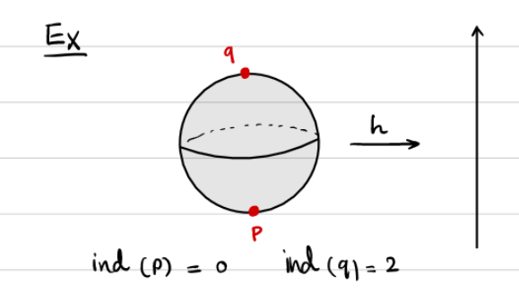

Then we have a local minimum at the South pole $p$ and a local max at the North pole $q$, where $\ind(p) = 0$ and $\ind(q) = 2$.
Note that the critical points essentially occur where the tangent space is horizontal
:::

:::{.example title="Torus"}
Consider $\TT^2$ with the height function:

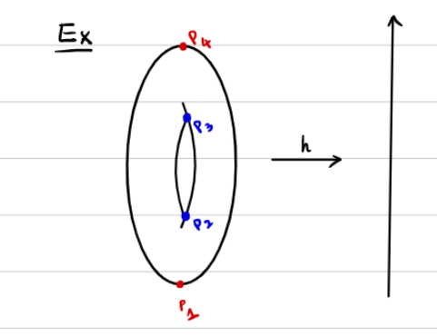

This has a similar max/min as the sphere, but also has two critical points in the middle that resemble saddles:

:::

:::{.remark}
Define $M_a \da f ^{-1} ((- \infty , a])$; we then want to consider how $M_a$ changes as $a$ changes:

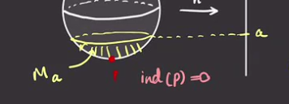

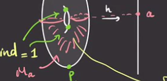

:::

:::{.lemma title="?"}
If $f ^{-1} ([a, b])$ contains no critical points, then 
\[
f ^{-1} (a) &\cong f ^{-1} (b) \\
M_a &\cong M_b
.\]
:::

:::{.definition title="Gradients"}
Choose a metric $g$ on $M$, then the **gradient vector** of $f$ is given by 
\[
g(\nabla f, v) = df(v)
.\]

:::

:::{.remark}
We have
\[
df( \nabla f) = g(\nabla f, \nabla f) = \norm{\nabla f}^2
.\]

:::

:::{.proof title="?"}
We have the following situation:

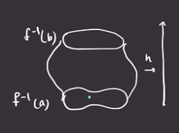

The gradient vector is always tangent to the level sets, so we can consider the curve \( \gamma \) which satisfies \( \dot\gamma(t) = -\nabla f( \gamma(t)) \):

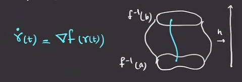

For technical reasons, we want to end up with cohomology instead of homology and will take $-\nabla f$ instead of $\nabla f$ everywhere:

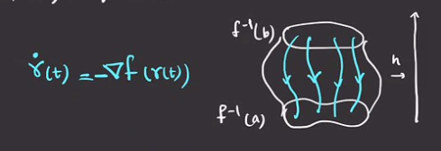

So \( \gamma \) will be a trajectory of $- \nabla f$, and $f ^{-1} [a, b] \cong f ^{-1} (a) \cross [0, 1]$.
A problem is that following these trajectories may involve arriving at $f ^{-1} (a)$ at different times:

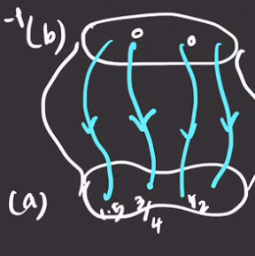

We can fix this by normalizing:
\[
V \da - \nabla f / \norm{ \nabla f}^2 \implies (df)(v) = \inner{ \nabla f}{ - \nabla f / \norm{\nabla f}^2} = -1
.\]

For every \( p \in f ^{-1} (b) \), if \( \gamma(t) \) is the trajectory starting from $p$, i.e. \( \gamma(0) = p \), then \( \gamma(b-a) \in f ^{-1} (a) \).
So define
\[
\Phi: f ^{-1} (b) \cross [0, b-a] &\to f ^{-1} ([a, b]) \\
(p, t) &\mapsto \gamma_p (t)
,\]
which will be a diffeomorphism.
:::

:::{.theorem title="?"}
Suppose $f ^{-1} ([a, b])$ contains exactly one critical point $p$ with $\ind(p) = \lambda$ and $f(p) = c$. 
Then
\[
M_b = M_a \union_{\bd} \qty{ D^ \lambda \cross D^{n - \lambda} }
\]
where $n \da \dim M$.
:::

:::{.example title="?"}
For \( \lambda= 1, n - \lambda= 2 \):

:::

:::{.example title="?"}
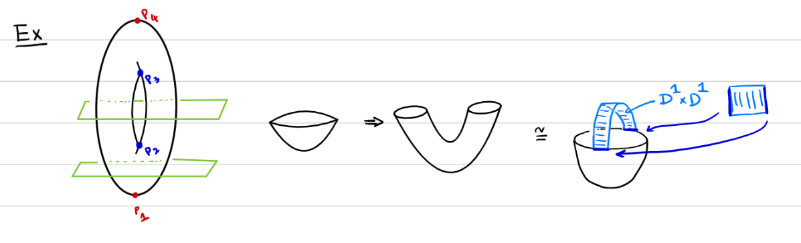
:::

:::{.definition title="Unstable Submanifold"}
\[
W_f^u(p) \da \ts{p} \union \ts{
\dot{\gamma(t)} = -\nabla f(\gamma(t)),\, \lim_{t\to -\infty} \gamma(t) = p,\, t\in \RR
}
.\]
:::

:::{.lemma title="?"}
If $\ind(p) = \lambda$ then $W_f^u(p) \cong \RR^ \lambda$.
:::

:::{.example title="?"}
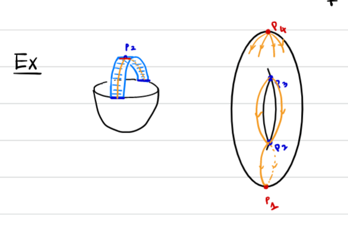
:::

:::{.example title="?"}
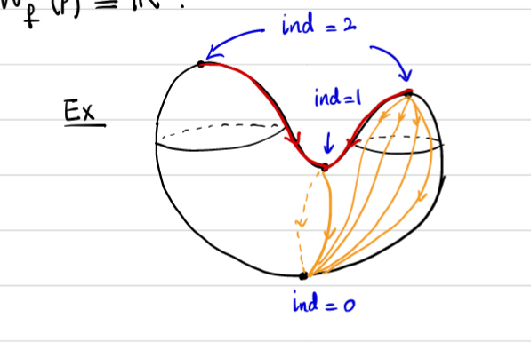
:::

:::{.definition title="Stable Manifold"}
\[
W_f^s(p) \da \ts{p} \union \ts{
\dot{\gamma(t)} = -\nabla f(\gamma(t)),\, \lim_{t\to +\infty} \gamma(t) = p,\, t\in \RR
}
.\]
:::

:::{.lemma title="?"}
If $\ind(p) = \lambda$ then $W_f^s(p) \cong \RR^{n- \lambda}$.
:::

:::{.definition title="$C^\infty$ "}
$C^ \infty (M; \RR)$ is defined as smooth function $M\to |RR$, topologized as:

- ?
- ?

And a basis for open neighborhoods around $p$ is given by 
\[
N_g(f) = \ts{
g:M\to \RR \st
\abs{
\dd{^k g}{\del x _{i_1} \cdots \del x _{i_k} }(p)
- 
\dd{^k f}{\del x _{i_1} \cdots \del x _{i_k} }(p)
} < \infty\, \forall \alpha,\, \forall p\in h_ \alpha(C_ \alpha)
}
.\]
:::

:::{.theorem title="?"}
The set of Morse functions on $M$ is open and dense in $C^ \infty (M; \RR)$.
:::

