# Tuesday, January 26

## Attaching Handles

:::{.remark}
Goal: we want to use Morse functions (smooth, nondegenerate critical points) to study the topology of $M$.
Recall that the torus had 4 critical points, 

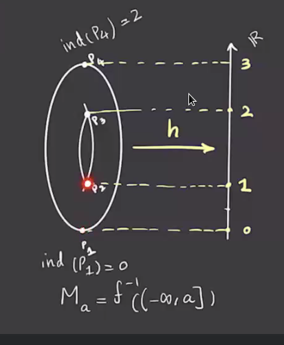

We defined the index as the number of negative eigenvalues of the Hessian matrix. 
Here the highest index will be the dimension of the manifold, and by the Morse lemma the two intermediate critical points will be index 1.

:::

:::{.remark}
We want to use the Morse function to decompose the manifold, so we consider \( M_a \da f ^{-1} ((- \infty , a ]) \).
If \( f ^{-1} [a, b] \) does not contain a critical point, then $M_a \cong M_b$ and $f ^{-1} (a) \cong f ^{-1} (b)$.
So taking $M_{1/2}$ and $M_{3/4}$ here both yield discs:

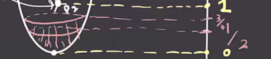

Passing through critical points does change the manifold, though:

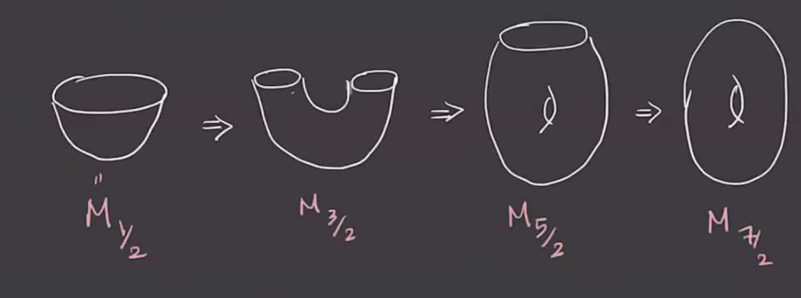

:::

:::{.theorem title="?"}
Suppose \( f ^{-1} [a, b] \) contains exactly *one* critical point of index \( \lambda \) then 
\[
M_b \cong M_a \union_{\varphi} (D_ \lambda \cross D_{n - \lambda})
,\]
where \( \varphi: (\bd D_ \lambda \cross D_{ n - \lambda}) \injects \bd M_a \).

:::

:::{.example title="?"}
For the case \( \lambda= 1, n = 3 \), we have the following situation:

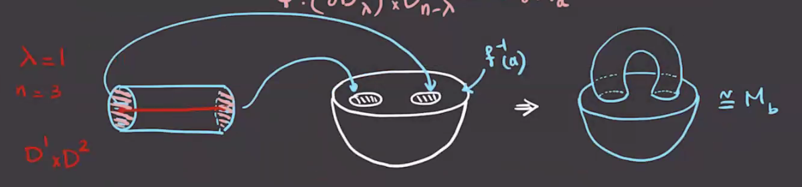

:::

:::{.example title="?"}
Taking \( \lambda=1, n=2 \), we attach $D^1 \cross D^1$ and get the following situation:

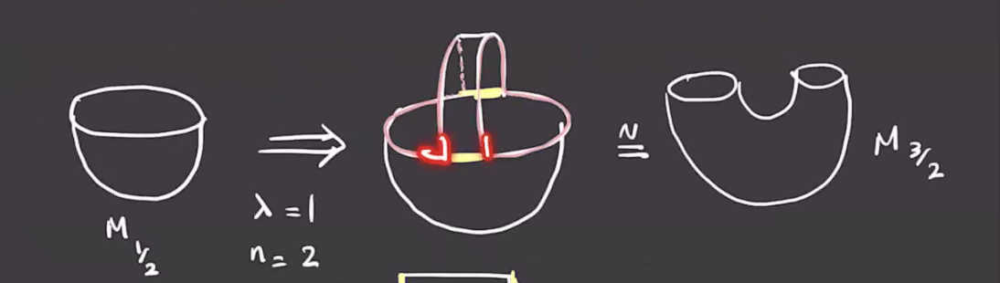

Adding on another piece, the new boundary is given by the highlighted region:

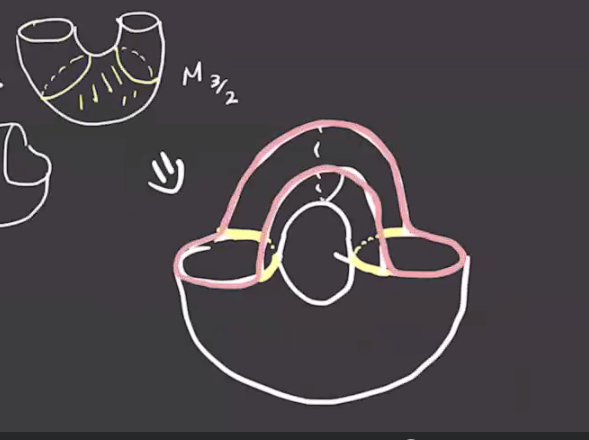

And continuing to attach the last pieces yields the following:

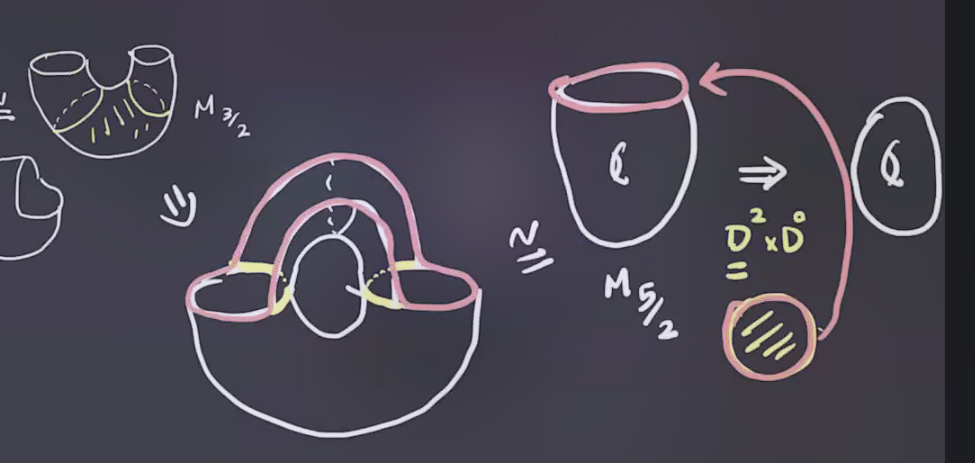

:::

:::{.remark}
There is a deformation retract $M_b \to M_a \union C_ \lambda$, where \( C_ \lambda \) is a \( \lambda\dash \)cell given by \( D_ \lambda \cross \ts{0} \).
For example:

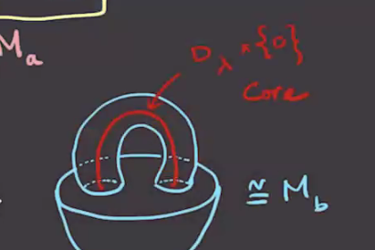

:::

## Stable and Unstable Manifolds

:::{.definition title="Unstable Manifold"}
Given \( - \nabla f \) for a fixed metric, the **unstable manifold** for a critical point $p$ is defined as 
\[
W_f^u(p) \da \ts{p} \union \ts{ \gamma(t) \st \dot \gamma(t) = - \nabla f( \gamma(t) ),\, \gamma(t) \converges{t\to -\infty}\to p }
.\]
Here \( \gamma(t) \) is the trajectory of \( -\nabla(f) \).

:::

:::{.example title="?"}
The unstable manifold is highlighted in blue here:

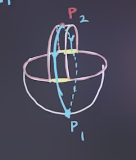

The gradient trajectories for other points are given by the yellow lines in the following:

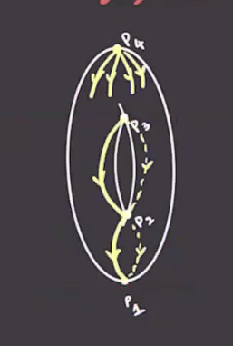
:::

:::{.lemma title="?"}
If $\ind(p) = \lambda$, then the unstable manifold $W_f^u$ at $p$ is isomorphic to $\RR^ \lambda$.
:::

:::{.example title="?"}
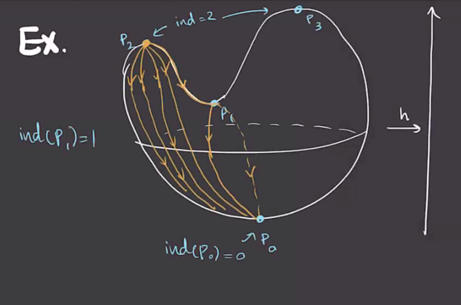

Here the unstable manifold for $p_2$ will be 2-dimensional, with one flow line ending at $p_1$ and the rest ending at $p_0$.

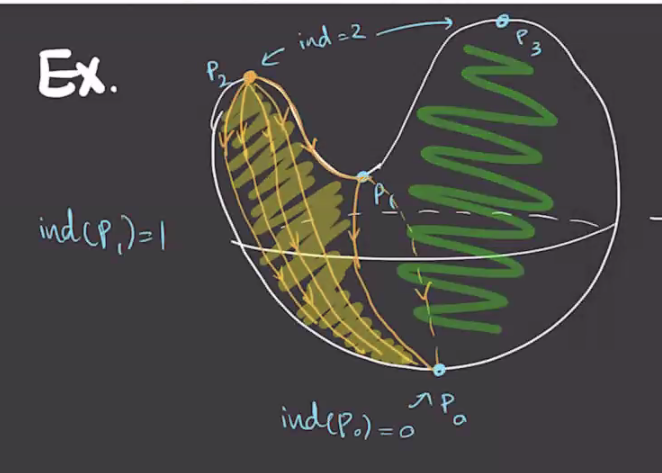

:::

:::{.definition title="Stable Manifold"}
The **stable manifold** for a critical point $p$ is defined as 
\[
W_f^s(p) \da \ts{p} \union \ts{ \gamma(t) \st \dot \gamma(t) = - \nabla f( \gamma(t) ),\, \gamma(t) \converges{t\to {\color{red} +} \infty}\to p }
.\]

:::

:::{.example title="?"}
The stable manifold for $p_0$ above is every trajectory ending at $p_0$.
$W^s(p) = S^2 \sm W^s(p_1) \union W_s(p_3)$? See video?

\todo[inline]{Which point $p$ is this for?}

:::

## Morse Functions

:::{.theorem title="Existence of Morse Functions"}
The set of Morse functions is open and dense in $C^ \infty (M; \RR)$ in a certain topology.[^see_akram_define_topology]

[^see_akram_define_topology]: 
See Akram's notes for details.

:::

:::{.remark}
We'll use this to define a chain complex $C_*(f, g)$ where $g$ is a chosen metric, define a differential, and use this to define a homology theory.
For notation, we'll write $\crit(f)$ as the set of critical points of $f$, and given $p, q\in \crit(f)$ with \( \gamma \) a trajectory running from $p$ to $q$, we have
\[
W^u(p) \intersect W^s(q) = \ts{ \gamma(t) \st 
\gamma(t) \converges{t\to -\infty }\to p,\,
\gamma(t) \converges{t\to +\infty }\to q
}
.\]

:::

:::{.definition title="Transverse Intersections"}
Two submanifolds $X, Y \subseteq M$ **intersect transversely** if and only if 
\[
T_pX + T_p Y \da \ts{v+w\st v\in T_p X, w\in T_p Y} = T_p M && \forall p\in X \intersect Y
.\]
In this case, we write $X \transverse Y$.
:::

:::{.example title="?"}
An example of a transverse intersection:

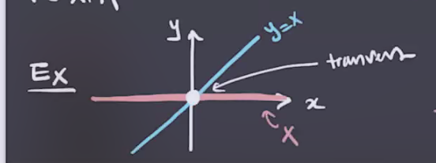

:::

:::{.example title="?"}
An example of an intersection that is *not* transverse:

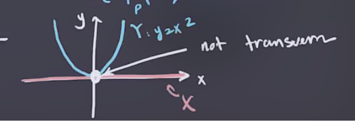

:::

:::{.definition title="Morse-Smale"}
A pair $(f, g)$ with $f$ a Morse function and $g$ a metric is **Morse-Smale** if and only if 

- $f$ is a Morse function,
- $W^u(p)$ is *transverse* to $W^s(q)$ for all $p, q\in \crit(f)$.
:::

:::{.theorem title="?"}
For a generic metric $g$, the pair $(f, g)$ is Morse-Smale.
:::

:::{.remark}
This means that metrics can be perturbed to become Morse-Smale.
:::

:::{.example title="?"}

The following is not Morse-Smale:

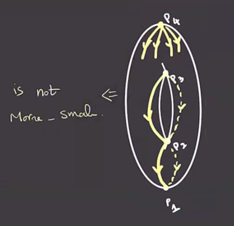

Note that if $X^a \transverse Y^b$, then $X \intersect Y \subseteq M^n$ is a smooth submanifold of dimension $a+b-n$.
In general, we have $M^s(p) \cong \RR^{n - \lambda}$ where \( \lambda = \ind(p) \).

:::{.observation}
If $(f, g)$ is Morse-Smale, then $M^u(p) \transverse M^s(q)$.
In this case, 
\[
\dim(M^u(p) \intersect M^s(q)) = \ind(p) + n - \ind(q) - n = \ind(p) - \ind(q)
.\]
Thus if $\ind(p) = \ind(q)$ then $\dim M^s(p) \intersect M^s(q) = 0$.
:::

:::{.remark}
There is an $\RR\dash$action of $M^s(p) \intersect M^s(q)$:
\[
\qty{ M^s(p) \cross M^u(q) } \cross \RR &\to M^s(p) \intersect M^u(q) \\
( \gamma(t), c) &\mapsto \gamma(t+c)
.\]
If $p\neq q$, this action is free and we can thus quotient by it to obtain
\[
\mathcal{M}(p, q) \da \qty{ M^s(p) \intersect M^u(q)} / \RR 
.\]
This identifies all points on the same trajectory, yielding one point for every trajectory, and so this is called the **moduli space of trajectories from $p$ to $q$**.

:::

If $\ind(p) = \ind(q)$, we have $\dim M^u(p) \intersect M^s (q) = 0$, making $\dim \mathcal{M}(p, q) = -1$ and thus \( \mathcal{M}(p, q) = \emptyset  \) and no gradient trajectories connect $p$ to $q$.
Referring back to the example, since $\ind(p_3) = \ind(p_2)$, if $(f, g)$ were Morse-Smale then there would be no trajectory $p_3 \to p_2$, whereas in this case there is at least one.

:::

:::{.remark}
If $\ind(p) - \ind(q) = 1$, then $\dim \mathcal{M}(p, q) = \ind(p) - \ind(q) - 1 = 0$, making \( \mathcal{M}(p, q)  \) a compact 0-dimensional manifold, which is thus finitely many points, meaning there are only finitely many trajectories connecting $p\to q$ and it becomes possible to define a Morse complex.
:::

:::{.definition title="Morse Complex"}
Fix $(f, g)$ a Morse-Smale pair, then define
\[
C_i(f, g) \da \ZZ/2\ZZ\left[\ts{p \st \ind p = i}\right] = \bigoplus_{\ind(p) = i} \ZZ/2\ZZ\gens{p}
,\]
with a differential
\[
\bd: C_i(f, g) &\to C_{i-1}(f, g) \\
p, \ind(p) = i & \mapsto \sum_{\ind(q) = i-1} \# \mathcal{M}(p, q) q 
,\]
where we take the count mod 2.
:::

:::{.theorem title="?"}
$\bd^2 = 0$, and thus $( C(f, g), \bd)$ is a chain complex.
:::

:::{.remark}
Next time we will work on proving this.
:::

