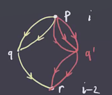
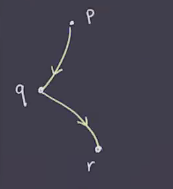
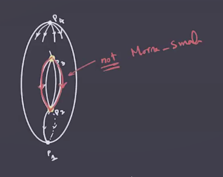
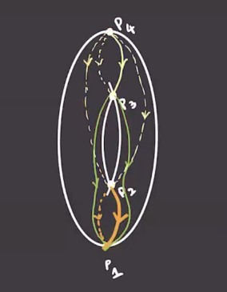
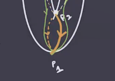
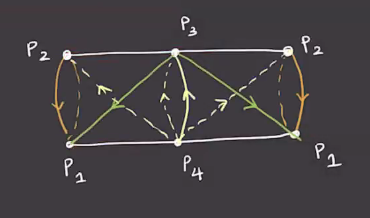
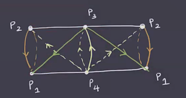
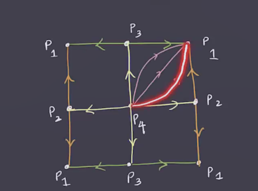
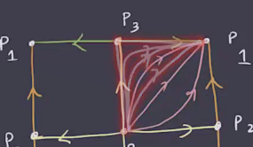
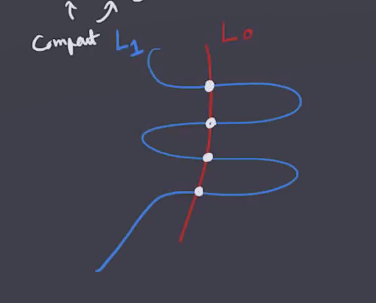

# Morse Homology and Lagrangian Floer Homology (Thursday, January 28)

## Morse Homology

:::{.remark}
Last time: defined the Morse complex.
Assumed $(f, g)$ was a Morse-Smale pair, where $f$ is a Morse function and $g$ is a Riemannian metric, and this guarantees that if $p, q\in \crit(f)$ with $\ind(p) - \ind(q) = 1$, then (among other things) there are finitely many gradient trajectories $p\leadsto q$.
We denoted this \( \mathcal{M}(p, q)  \).
The chain complex was defined by $C_i(f, g) \da \bigoplus_{\ind(p) = i} \ZZ_2 \gens{ p }$ with differential $\bd_i: C_i \to C_{i-1}$ was defined by sending an index $i$ critical point $p$ to $\sum_{\ind(q) = i-1} \# \mathcal{M}(p, q) q \mod 2$. 

:::

:::{.theorem title="The Morse Complex is a Chain Complex"}
$\bd_{i} \circ \bd_{i+1} = 0$.
:::

:::{.proof title="?"}
Idea of the proof:
we can directly compute
\[
\bd(\bd p) 
&= \bd \qty{ \sum_{\ind(q) = i-1} \# \mathcal{M}(p, q) q } \\
&= \sum_{\ind(q) = i-1} \# \mathcal{M}(p, q) \bd q \\
&= \sum_{\ind(q) = i-1} \# \mathcal{M}(p, q) \qty{ \sum_{\ind(r) = i-2 \# \mathcal{M}(q, r) r  }}   \\
&= \sum_{\ind(r) = i-2} \qty{\sum_{\ind(q) = i-1} \# \mathcal{M}(p, q) \# \mathcal{M}(q, r) }  r \\
&= \sum_{\ind(r) = i-2} c_{p,q,r} r \\
&= 0 && \text{(claim)}
.\]

This happens if and only if $c_{p, q, r} = 0 \mod 2$ for all $r$ with $\ind(r) = i-2$.
This is multiplication of the number of trajectories:

In other words, this is the total number of trajectories $p\leadsto r$ that pass through $q$.
These trajectories "break" at $q$, and so we refer to these as **broken trajectories**.

:::

:::{.definition title="Broken Trajectories"}
Suppose $\ind(r) = \ind(p) - 2$, then a **broken trajectory** from $p$ to $r$ is a trajectory from $p$ to $q$ followed by a trajectory $q$ to $r$ where $\ind(q) = \ind(p)-1 = \ind(r) + 1$.

:::

:::{.question}
Why is the number of broken trajectories even?
:::

:::{.answer}
We can check that $\dim \mathcal{M}(p, r) = \dim \qty{ W^u(p) \transverse W^s(r)}/\RR = (\ind(p) - \ind(r)) - 1 = 2-1 = 1$.
We can compactify \( \mathcal{M}(p, r)  \) by adding in all of the broken trajectories to define 
\[ 
\overline{\mathcal{M}(p, r)} \union \qty{ \Union_{\ind(q) = i-1} \mathcal{M}(p, q) \cross \mathcal{M}(q, r) } 
.\] 
This is useful here because we can appeal to the classification of smooth compact 1-dimensional manifolds, which are unions of copies of $S^1$ and $D_1 = I$.
In particular, the number of boundary points 
\[
\bd \overline{\mathcal{M}(p, r)} = \Union_{\ind(q) = i-1} \mathcal{M}(p, q) \cross \mathcal{M}(q, r)
\]
is even:

:::

:::{.example title="Morse Homology of the Torus"}
Suppose you have two critical points of the same index.
The Morse-Smale condition implies that there's no trajectory between them.
A counterexample would be $p_3 \leadsto p_2$ on the torus with the height function:

However, if you perturb this slightly, the trajectories can be made to miss $p_2$ and end at $p_1$ instead.
All of the trajectories are disjoint, so we end up with a situation like the following after perturbing the metric:

We can cut along a curve on the bottom to better analyze these trajectories:

Now cut this cylinder along the trajectories $p_1\leadsto p_3 \leadsto p_1$, i.e. the green trajectories here:

Here we can see that as the trajectories approach the corners, they limit to broken trjacetories:

We can compute

- $C_0 = \ZZ/2\ZZ \gens{ p_1 }$ 
- $C_1 = \ZZ/2\ZZ \gens{ p_2, 3 }$ 
- $C_2 = \ZZ/2\ZZ \gens{ p_4 }$ 

Since there are exactly two trajectories $p_4$ to $p_2$ or $p_3$, we get $\bd_2 = 0$.
Similarly $\bd_1 = 0$, and we get $HM_i(T) = [\ZZ/2\ZZ, \ZZ/2\ZZ^2, \ZZ/2\ZZ, 0, \cdots]$, which is the same as its singular homology.
:::

:::{.theorem title="?"}
\[
HM_i(f, g) \cong H_i^{\sing}(M; \ZZ/2\ZZ)
.\]
In particular, it doesn't depend on the choice of Morse-Smale pair $(f, g)$.
See proof in references, e.g. Audin.
:::

:::{.proof title="?"}
By definition, $\# \crit_i(f) = \rank C_i(f, g) = \rank HM_i(f, g)$, and in any chain complex the rank of the chain groups are always at least the rank of the homology.
:::

## Lagrangian Floer Homology

:::{.remark}
Suppose $L_0^n, L_1^n \subset M^{2n}$ are compact with $L_0 \transverse L_1$, so the intersection is finitely many points.

We can do Morse theory on the space of paths between them:
\[
\mathcal{P}(L_0, L_1) \da \ts{ \gamma: I\to M \st \gamma(0) \in L_0, \gamma(1) \in L_1}
.\]

We'll find analogs of Morse functions on $P(L_0, L_1)$ such that the critical points are constant paths, i.e. $L_0 \intersect L_1$.
The Morse inequalities then gives bounds on the number of intersection points between $L_0$ and $L_1$.

:::

:::{.definition title="Symplectic Manifolds"}
A **symplectic manifold** is a pair $(M^{2n}, \omega)$ with \( \omega \) a 2-form which is

- Closed, i.e. $d \omega = 0$, and
- Nondegenerate, i.e. $\Wedge^n \omega \neq 0$.
:::

:::{.definition title="Lagrangian Submanifolds"}
A half-dimensional submanifold $L^n \subset M^{2n}$ is called **Lagrangian** if \( \ro{ \omega}{L^n} = 0 \).
:::

:::{.example title="?"}
The pair $(\RR^{2n}, \sum_{i=1}^n dx_i \wedge dy_i$ is a symplectic manifold (and also a symplectic vector space).
Note that this 2-form is also a bilinear form of the following shape:

\[
\begin{bmatrix}
0 & \id_n 
\\
-\id_n & 0
\end{bmatrix}
.\]

This has a Lagrangian submanifold $\RR^n \da \ts{y_1 = \cdots = y_n = 0}$.

> Note: See Darboux theorem.

:::

:::{.remark}
The general setup for next time: we'll have $(M^{2n}, \omega)$ a symplectic manifold, a pair $L_0, L_1 \subset M$ such that $L_0 \transverse L_1$, and we want to do Morse Homology on \( \mathcal{P}(L_0, L_1) \).
:::

