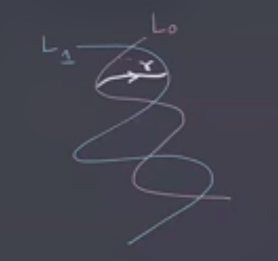
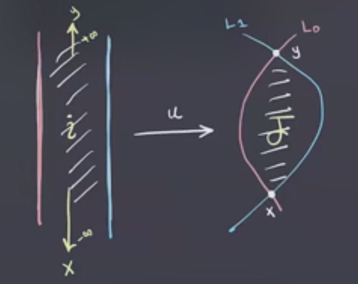
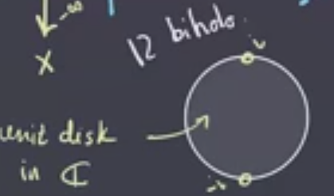
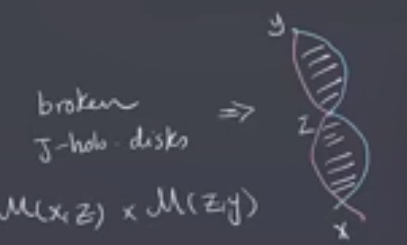

# Lecture 7 (Thursday February 04)

## Lagrangian Floer Homology

:::{.remark}
Recall that we had a symplectic manifold $(M^{2n}, \omega)$ with $L_0, L_1 \subset M$ two Lagrangians.
We wanted to do something like Morse theory on $\Path(L_0, L_1)$.

What ingredients do we need?

- Something to replace $-df$: $\alpha$

- Something to replace the vector field \( -\gradient \): we defined a metric $g^\Path$ using $\alpha$

To define \( \alpha \) we needed to look at 
\[
T_{ \gamma} \Path = \ts{ \xi: I\to TM \st \xi(s) \in T_{\gamma(s)}M } 
,\]
which is like a collection of tangent vectors along \( \gamma \) giving a way to deform the path.
Since \( \alpha\in \Omega^1(\Path) \), for any \( \gamma \) it induces a map 
\[
T_{ \gamma} M &\mapsvia{\alpha} \RR \\
\xi &\mapsto \alpha_{ \gamma} (\xi) \da \int_0^1 \omega( \dot{ \gamma}, \xi)\ds
.\]

:::

:::{.observation}
\( \alpha_{ \gamma} = 0 \iff \gamma \) is constant, which happens if and only if \( \gamma\in L_0 \intersect L_1 \).
This corresponds to critical points of the functional yielding intersection points of the Lagrangians.
:::

:::{.remark}
We wanted to define the gradient, for which we needed a metric on $\Path$.
We did this by lifting a metric from $M$.
Pick an almost complex structure $J$ compatible with \( \omega \), then this yields a Riemannian metric defined by \( g(v, w) = \omega(v, Jw) \).
Then we can define
\[
g^\Path_{\gamma}(\xi, \eta) \da \int_0^1 g( \xi(s), \eta(s) )\ds
.\]
We used this to compute the vector field \( -\grad_{\gamma} J \cdot{\gamma}(s) \).
What are its trajectories?
These are paths of paths $u(s, t) \da u_t(s)$ such that \( \dd{}{t} u_t(s) = J \dd{}{s} u_t \).
We thus get an equation
\[
\dd{u}{t}(s, t) = J \dd{u}{s}(s, t)
.\]
:::

:::{.remark}
For $x, y \in L_0 \intersect L_1$ trajectories connecting $x$ to $y$, we'll write this as 
\[
\mathcal{M}(x, y) \da \ts{ 
u(s, t) :[0,1] \cross \RR\to M 
\substack{ 
  u(0, t) \in L_0 \\ 
  u(1, t) \in L_1 \\ 
  u(s, t) \converges{t\to - \infty }\to x \\ 
  u(s, t) \converges{t\to \infty }\to y \\
  \dd{u}{t} = J \dd{u}{s}
} 
} 
.\]

We can modify this PDE to make things look familiar: multiply both sides with $J$ to obtain 
\[
J \dd{u}{t} = J^2 \dd{u}{s} \implies
J \dd{u}{t} = - \dd{u}{s} \implies
\dd{u}{s} + J \dd{u}{t} = 0
,\]
which is the Cauchy-Riemann equation.
:::

:::{.exercise title="?"}
Check that this equation can be written as $J\, du = du \circ i$ where $i$ is the standard complex structure on $\CC \supseteq [0, 1] \cross \RR$, so $du$ commutes with $i$ and $J$.
:::

:::{.definition title="$J\dash$holomorphic or Pseudoholomorphic Discs"}
If $J\, du = du \circ i$, then $u$ is called a **$J\dash$holomorphic disc** or a **pseudoholomorphic disc**.
:::

:::{.remark}
Schematically, the situation is the following:

Using the Riemann mapping theorem, the strip on the left-hand side is biholomorphic to $\DD \subseteq \CC$ with $\pm i$ removed:

Due to the limit conditions at infinity in the strip, we can extend $u$ to a $J\dash$holomorphic map from the entire disc by sending $i\mapsto y$ and $-i\mapsto x$.
:::

:::{.remark}
In Morse homology, we have an $\RR$ action on the moduli space of trajectories, and that also shows up here.
Here $\RR \actson \mathcal{M}(x, y)$ by $u(s, t) \mapsvia{c} u_c(s, t) \da u(s, t+c)$, noting that translating the strip from above still yields a solution.
:::

:::{.definition title="?"}
We define
\[
\hat{\mathcal{M}}(x, y) \da \mathcal{M}(x, y) / \RR  
.\]

:::

:::{.definition title="?"}
We'll define
\[
CF(L_1, L_2) \da \bigoplus_{x\in L_0 \intersect L_1} \ZZ/2\ZZ \gens{ x } \\ \\
\bd x \da \sum_{y\in L_0 \intersect L_1} \# \hat{\mathcal{M}}(x, y) y 
.\]

:::

:::{.remark}
When is the intersection count \( \# \hat{\mathcal{M}}(x, y)  \) well-defined?
In Morse homology, we have two conditions:

1. \( (f, g) \) is Morse-Smale, to ensure that the moduli spaces are smooth manifolds (using Sard's theorem)

2. \( \ind(x) - \ind(y) = 1 \), ensuring \( \mathcal{M}(x, y)  \) is 1-dimensional

3. Compactness of \( \hat{\mathcal{M}}(x, y)  \) when 1 and 2 hold.

These were enough to guarantee that \( \hat{ \mathcal{M}} (x, y)\) was a smooth compact 0-dimensional manifold, which allowed for point counts.
In Lagrangian Floer homology, we have the following replacements:

**For 2 (indices)**:
Recall that the index in Morse homology was the dimension of the negative eigenspace of the Hessian, but we're in infinite dimensions here.
So we won't have a well-defined index, but we'll have something that can replace the *difference* of indices: the **Maslov index** $\mu(x, y)$, the expected dimension of \( \mathcal{M}(x, y)  \).
To actually have this be the dimension will require some conditions, so it's not always true.
This will be the index of some elliptic operator defined using the Cauchy-Riemann equations.

**For 1 (transversality)**:
We'll need some version of transversality, which will imply that for a generic $J$ that \( \mathcal{M}(x, y)  \) is smooth.

**For 3 (compactness)**:
We'll use **Gromov compactness** and some extra topological assumptions, which will imply that \( \hat{ \mathcal{M}}(x, y), \mathcal{M}(x, y)   \) are both compact.

Taken together, these will make the point-count well-defined.
:::

:::{.remark}
In order for this to be a chain complex, we'll need \( \bd^2 = 0 \).
We'll look at when \( \mu(x, y) = 2 \), and we'll compactify \( \hat{ \mathcal{M}}(x, y)  \) in order to show this holds.
Gromov's compactness will give us
\[
\bd \closure{ \mathcal{M}(x, y) } = \Union_{\mu(x,z) = \mu(z, y) = 1} \mathcal{M}(x, z) \cross  \mathcal{M}(z, y) 
,\]
much like the *broken trajectories* from Morse homology.
Here we'll need to add in broken $J\dash$holomorphic discs:

Using the same argument as in Morse homology, we can obtain $\bd^2 = 0$.

:::

:::{.theorem title="Floer"}
Suppose $(M^{2n}, \omega)$ is a compact symplectic manifold with Lagrangians $L_0, L_1$ such that 

1. $L_0 \transverse L_1$

2. $\pi_2(M) = \pi_2(M, L_0) = \pi_2(M, L_1) = 0$, which are topological conditions on embedded spheres with boundaries mapped to the $L_i$.

Under these assumptions, $\bd^2 = 0$ and the homology
\[
HF(L_0, L_1) \da H_*( CF(L_0, L_1), \bd) \da \ker \bd / \im \bd
\]
is an invariant of $(M, L_0, L_1)$ up to **Hamiltonian isotopies** of $L_0, L_1$.
:::

:::{.definition title="Symplectomorphism"}
A **symplectomorphism** is a diffeomorphism \( \psi: M_1 \to M_2 \) such \( \psi^* \omega_1 = \omega_2 \).
:::

:::{.definition title="Hamiltonian Vector Fields"}
A **Hamiltonian vector field** is a vector field $V$ such that
\[
\iota_V \omega\da \omega(V, \wait) \in \Omega^1
\]
is exact, and thus equal to $df$ for some functional $f\in C^{\infty }(M, \RR)$.
Note that if one has a functional $f$, one can find a symplectic form \( \omega \) such that this holds, so $V$ is sometimes denoted $V_f$ to show this dependence.
:::

:::{.example title="?"}
$\RR^{2n}$ with the standard symplectic form $\sum_{i=1}^n dx_i \wedge dy_i$, we have \( V_f = \dd{f}{y_1}, \cdots, \dd{f}{y_n}, - \dd{f}{x_1}, \cdots, -\dd{f}{x_n} \) for any $f:\RR^{2n} \to \RR$.
Note that we can have time-dependent vector fields (i.e. one parameter families) as well.
:::

:::{.definition title="Hamiltonian Isotopies"}
A **Hamiltonian isotopy** is a family \( \psi_t \) of diffeomorphisms of $M$ such that \( \psi_t \) is the flow of a 1-parameter family of Hamiltonian vector fields $V_t$, so taking the derivative of $V$ yields this function.
:::

:::{.exercise title="?"}
Show that if \( \psi_t \) is a Hamiltonian isotopy, then $\psi_t^* \omega = \omega$ and is thus a symplectomorphism as well.
:::

:::{.remark}
Goal: use this as an invariant of closed 3-manifolds in the form of **Lagrangian Floer homology**, defined by Osvath-Szabo.
Note that Floer's theorem requires topological assumptions which make the homology well-defined, but we don't have these available in the HF setup.
In particular, the assumptions on $\pi_2$ won't hold.
:::

