# Lecture 8 (Thursday, February 04)

## Heegard Splittings

:::{.remark}
Goal: we want to use **Lagrangian Floer homology** to defined invariants of *closed* 3-manifolds, where here closed means that \( \bd M^3 = \emptyset \).
One example of Lagrangian Floer homology is **Heegard Floer homology**.
We'll want some symplectic manifold with two Lagrangian submanifolds.
Oszvath-Szabo used a 2-dimensional description of closed 3-manifolds called **Heegard diagrams**.
We'll need Heegard splittings to define these, and handlebodies to define the splittings.
:::

:::{.definition title="Handlebody of genus $g$"}
A **handlebody** of genus $g$ will mean a compact 3-manifold obtained from $\BB^3$ by attaching $g$ solid 1-handles, i.e. $\DD^1 \cross \DD^2$.
These are glued in via two copies of $\bd \DD^1 \cross \DD^2$:

Alternatively, these can be defined as a regular neighborhood of $\Vee_{i=1}^g S^1 \subset \RR^3$.
We'll write $H_g$ for a genus $g$ handlebody, and $\bd H_g$ will be a genus $g$ surface.
:::

:::{.definition title="Heegard Splitting"}
A **Heegard splitting** of genus $g$ is a decomposition $M = H_1 \disjoint_{\varphi} H_2$ where \( \varphi: \bd H_1 \to \bd H_2 \) is a diffeomorphism.

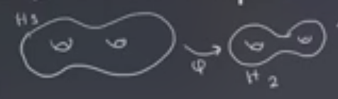

Explicitly, we have
\[
H_1 \disjoint_{ \varphi} H_2 \da { H_1 \disjoint H_2 \over \gens{ x \sim \varphi(x) \st \forall x \in \bd H_1 } }
.\]

:::

:::{.example title="?"}
We can write $S^3 = B_3 \disjoint_{\one} B^3$, where both are just genus $0$ handlebodies.
Note that if you attach a solid 1-handle to $B^3$, this yields $S^1 \cross \DD^2$, i.e. a solid torus:

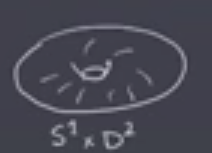

Think of $S^3$ as the one-point compactification of $\RR^3$, we can write (and visualize) a decomposition $S^3 = (S^1 \cross \DD^2) \disjoint_{\varphi} (S^1 \cross \DD^2)$.
The first copy will be a neighborhood of a circle in the plane:

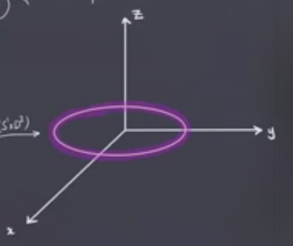

Labeling this circle as $H^1 \da \ts{ x^2 + y^2 = 1, z = 0}$, the complement $H_2 \da S^3 \sm H_1$ will be a regular neighborhood of the $z\dash$axis union $\ts{\infty }$:

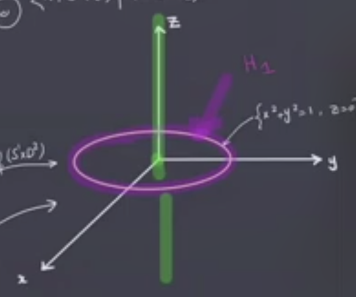

:::

:::{.example title="?"}
We can write a Heegard splitting of $S^1 \cross S^2$. 
Note that $S^2 = \DD^2 \disjoint_{\one} \DD^2$, so splitting the product over the union yields $(S^1 \cross \DD^2) \disjoint_{\one} (S^1 \cross \DD^2)$, where the new map is still the identity since it's just the identity on each factor.
This yields two solid torii glued along their boundaries.
:::

:::{.theorem title="?"}
Any closed 3-manifold $M^3$ admits a Heegard splitting.
:::

:::{.proof title="?"}
A fact from Morse theory: there exists a Morse function $f: M^3\to \RR$ such that

1. $f(p) = i \da \ind(p)$ for every $p\in \Crit(f)$ (i.e. $f$ is **self-indexing**), and

2. $f$ has exactly one index $0$ (minimum) and one index $3$ (maximum) critical point.

We thus have the following situation:

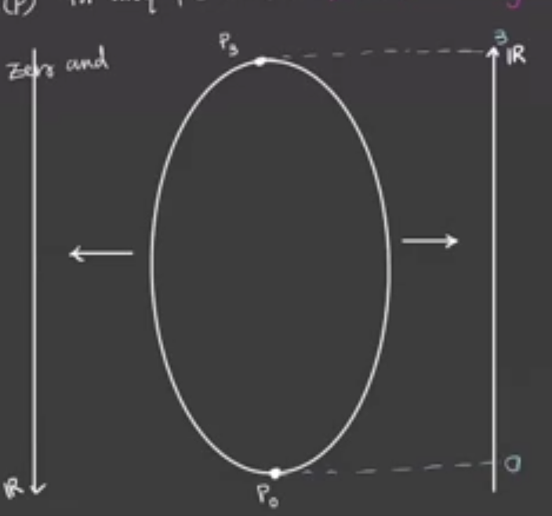

The remaining critical points must occur at 2 and 3:

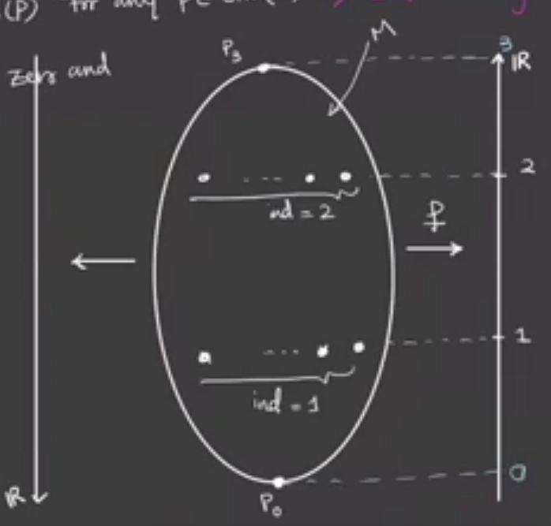

How can we break this into smaller manifolds?
Any time we pass a critical point, we attach a one-handle.
Note that we can define a new Morse function $h \da 3-f$
Suppose we have $g$ critical points of index 1 for $f$ and $g'$ critical points of index 1 for $h$.

- We can check that $f ^{-1} [0, 1/2] = \BB^3$ and $f ^{-1} (1/2) = S^2$.

- \( f ^{-1} [0, 3/2] \Lambda_g, \) a genus $g$ handlebody, and thus \( f ^{-1} (3/2) = \Sigma_g \) will be a genus $g$ surface.

  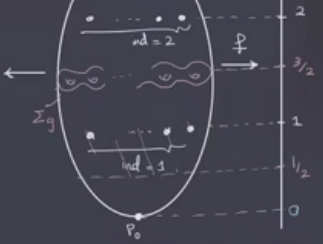

- Repeating the above arguments for $h$, we get \( f ^{-1} [0, 3/2] = g ^{-1} [3/2, 3] = \Lambda_{g'} \).

:::{.exercise title="?"}
Show that $\crit(f) = \crit(h)$ and if $p\in \crit(f)$ with $\ind_f(p) = i$ then $\ind_h(p) = 3-i$.
:::

Thus $g'$ is the number of index 2 critical points for $f$.
This means that $\bd h ^{-1} [0, 3/2] = h ^{-1} (3/2) = f ^{-1} (3/2)$ has genus $g=g'$, and thus the $\# \crit(f)_{\ind=1} = \# \crit(h)_{\ind =2} = g$.
Even without this, we still have our two handlebodies: $H_1 \da f ^{-1} [0, 3/2]$ and $H_2 \da f ^{-1} [3/2, 3]$ glued over \( \Sigma_g \da f ^{-1} (3/2) \), which is a genus $g$ splitting surface.

:::

:::{.definition title="Equivalence of Heegard Splittings"}
We'll say that two Heegard splittings \( M = H_1 \disjoint_{\varphi} H_2 \) and \( M = H_1' \disjoint_{\varphi} H_2 ' \) are **isotopic** if and only if there exists an ambient isotopy \( \psi: M \cross [0, 1] \to M \) such that \( \ro{\psi}{M \cross \ts{ 1} }(H_i) = H_i ' \) for each $i$.
Recall that *ambient isotopy* means

- \( \ro{\psi}{ M \cross \ts{ 0 } } = \one \),

- \( \ro{ \psi } {M \cross \ts{ t } } \) is a homeomorphism.

:::

:::{.question}
Are *any* two Heegard splittings isotopic?
:::

:::{.answer}
No! 
We can distinguish them by the genus of the splitting surface \( \Sigma \), and we just saw two splittings of $S^3$, one with genus 0 and one with genus 1.
:::

:::{.remark}
There are some moves to relate different Heegard splittings.
:::

:::{.definition title="Stabilization"}
Given a genus $g$ Heegard splitting $M = H_1 \disjoint_{ \varphi} H_2$, we can produce a genus $g+1$ splitting $M = H_1' \union_{ \varphi} H_2'$ where

$H_1' = H_1 \union \closure{ \eta( \gamma) }$, where the new piece is a closed regular neighborhood of an unknotted arc \( \gamma \) in $H_2$.
Here *unknotted* means that \( \gamma \) is a properly embedded arc in $H_2 \union \Sigma$ whose boundary is in \( \Sigma \) which bounds a contractible disc:

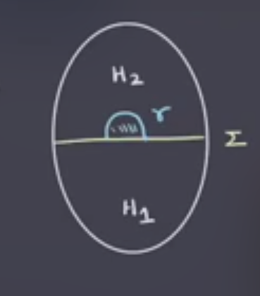

Note that adding a regular neighborhood around \( \gamma \) has the effect of adding a 1-handle to $H_1$.
We can then define $H_2' \da H_2 \sm \eta{\gamma}$.
Why is this still a handlebody?
We have this situation:

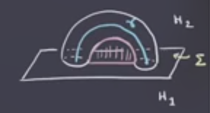

We have the disc below the 1-handle, and if we thicken it to $\DD^2 \cross I$, we have \( B \da \eta(\gamma) \union (\DD^2 \cross [0, 1] \cong \BB^3 \):

We then have \( H_2' \da (H_2 \sm B) \union (\DD^2 \union [0, 1] ) \), and in fact there is something in the intersection of these two terms.
The parts that are attached to $H_2$ are the front and back discs $\DD^2 \cross \ts{0, 1}$:

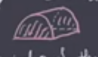

So we can identify this as \( H_2' \da (H_2 \sm B) \disjoint_{\DD^2 \cross \ts{ 0, 1 } } (\DD^2 \union [0, 1] ) \).
Note that $H_2 \sm B \cong_{C^\infty} H_2$ are diffeomorphic, and the right-hand side is a 1-handle.
To see why this is, consider attaching the middle red part, and then pushing the center part away in order to see the handle:

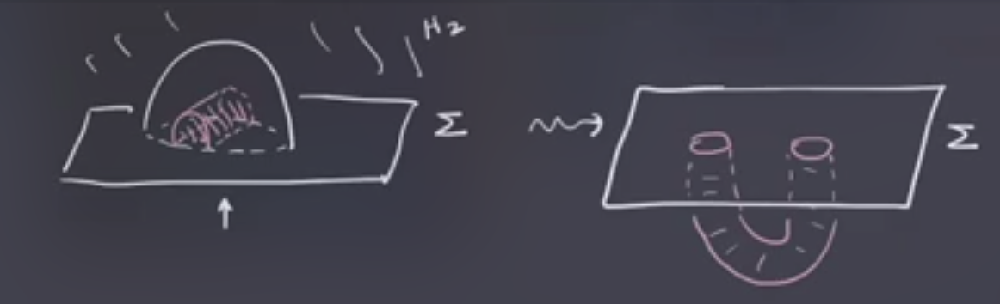

:::

:::{.exercise title="?"}
Show that the isotopy type of $H_1' \union H_2 '$ is independent of the choice of \( \gamma \). 
:::

:::{.theorem title="?"}
Any two Heegard splittings can be made isotopic after sufficiently many stabilizations.
:::

## Heegard Diagrams

2-dimensional pictures of closed 3-manifolds!
We have two handlebodies glued along their boundary, so if we can write the handlebodies in terms of 2-dimensional pictures, we can combine them to get a picture of the entire splitting.

:::{.definition title="Attaching Curves"}
Let $H$ be a genus $g$ handlebody.
A set of **attaching curves** for $H$ is a set \( \ts{ \gamma_1, \cdots, \gamma_g } \)  of pairwise disjoint simple closed curves on \( \Sigma\da \bd H \) such that

1. \( \Sigma\sm \union \ts{\gamma_1, \cdots, \gamma_g} \) is connected, 

2. All the \( \gamma_i \) bound a disc in $H$.

:::

:::{.example title="$S^1 \cross \DD^2$"}
For the solid 2-torus, the attaching curves are copies of $S^1$ that bound discs

:::

:::{.example title="A genus 2 handlebody"}
Consider $\BB^3$ with two 1-handles attached, or a solid genus 2 surface:

Note that curves running around each of the two handles also work:

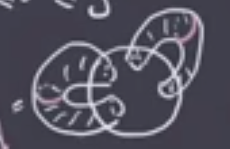

:::

:::{.exercise title="?"}
Show that \( \Sigma\sm \union \ts{ \gamma_1, \cdots, \gamma_g } \)  is connected $\iff$ the classes \( [\gamma_1], \cdots, [\gamma_g] \) are linearly independent in $H_1(\Sigma; \ZZ)$.
:::

:::{.proposition title="Handlebody from a Heegard Diagram"}
Given a surface and a set of attaching curves, so the data of \( (\Sigma, \ts{ \gamma_1, \cdots, \gamma_g } ) \) , we can build a handlebody $H$.
Note that we can go the other way: given a genus $g$ handlebody $H$, we can take \( \Sigma = \bd H \) and find \( g \) attaching circles.

**The recipe:**

1. Thicken \( \Sigma \) to \( \Sigma \cross [0, 1] \) to get a 3-manifold with 2 boundary components, \( \Sigma\cross \ts{ 1 } \) and \( \Sigma \cross \ts{ 2 } \). 

2. Attach thickened discs \( \gamma_i \cross \ts{ 0 } \) for each $i$, yielding some $S^2$ boundary components.

3. Fill the $S^2$ boundary component with a $\BB^3$.

This yields a genus $g$ handlebody $H$ such that \( \bd H = \Sigma_g \cross \ts{ 1 } \), where the curves \( \ts{ \gamma_1 \cross \ts{ 1 } , \cdots, \gamma_g \cross \ts{ 1 } } \).

:::

:::{.example title="?"}
Note that after attaching the disc on one end of this new cylinder, we have the following:

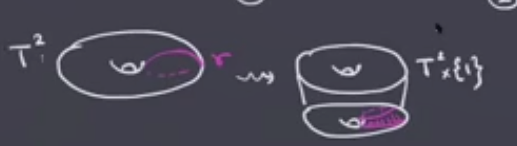

What's left on the boundary is the following:

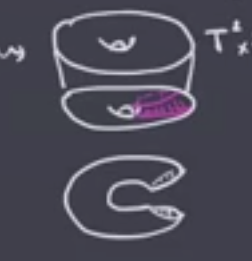

This is a copy of $S^2$.

:::

:::{.exercise title="?"}
Show that for any $g$ we get a 3-manifold with boundary \( \Sigma \cross \ts{ 1 } \disjoint S^2 \) after step (2) above.
:::

