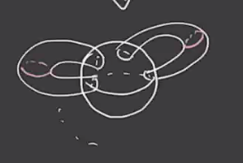
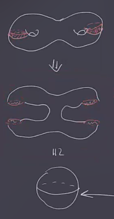
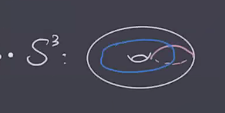
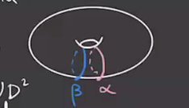
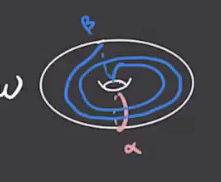
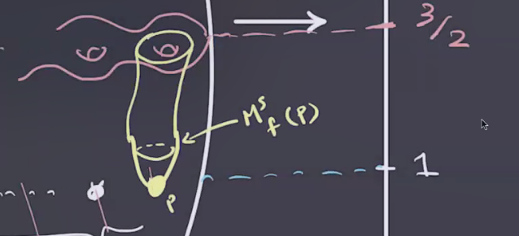
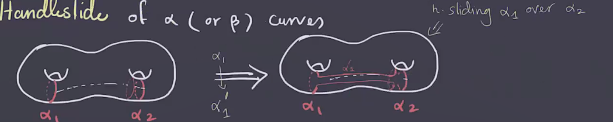
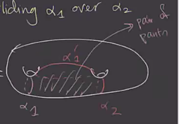
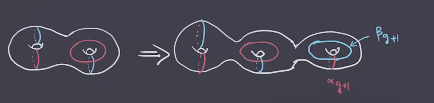

# Lecture 9 (Thursday, February 11)

## Heegard Diagrams

:::{.remark}
Last time we saw that $M_3 = H_1 \disjoint_{\varphi} H_2$ as two handlebodies glued along their boundary by a diffeomorphism \( \varphi: \bd H_1 \to \bd H_2 \).
This is referred to as a **Heegard splitting** for $M$.
We can specify a genus $g$ handlebody as \( ( \Sigma, \ts{ \gamma_1, \cdots \gamma_g } \)  where \( \Sigma\sm \ts{ \gamma_1, \cdots, \gamma_g } \) is connected and each \( \gamma_i \) bounds a disc in $H$.

Moreover, we can go backwards: given such data, we can build a handlebody $H$ by 

1. Thickening \( \Sigma \) to obtain \( \Sigma \cross [0, 1] \)
    This yields $\bd( \Sigma \cross [0, 1] ) = (\Sigma\cross \ts{0} ) \disjoint (\Sigma\cross \ts{1} )$.

2. Attach thickened discs to \( \gamma_i \cross \ts{0} \).
    This makes the boundary $(\Sigma \cross \ts{1} ) \disjoint S_2$

3. Fill in the \( S^2 \) boundary with a \( B^3 \).

:::

:::{.definition title="Heegard Diagrams"}
A **Heegard diagram** for $M^3$ compatible with a splitting $M = H_1 \disjoint_{ \varphi} H_2$ is a triple \( (\Sigma, \alpha, \beta \) where \( \alpha \) and \( \beta \) are attaching circles for $H_1$ and $H_2$ respectively.
:::

:::{.example title="Heegard diagram for $S^3$"}
The following two curves on a torus determine a Heegard splitting for $S^3$:

:::

:::{.example title="Heegard diagram for $S^1 \cross S^2$"}
Writing $S^1 \cross S^2 = D_2 \disjoint_{\one_{\bd D^2}} D^2$, or also $(S^1 \cross D^2) \disjoint_{\one} (S^1 \cross D^2)$.

:::

:::{.exercise title="?"}
Show that the following diagram is a Heegard diagram for $\RP^3$:

*Hint: use that $\RP^3 \cong L(2, 1)$ and find a Heegard diagram for $L(p, q)$.*
:::

:::{.example title="?"}
Given a self-indexing Morse function $f:M \to \RR$ with exactly one index 0 and one index 3 critical point, pick a generic metric $g$ so that $(f, g)$ is a Morse-Smale pair (so the stable and unstable submanifolds intersect transversally).
Taking \( - \gradient f \), we can obtain a Heegard diagram
The stable submanifolds are codimension of their indices, so e.g. for each index critical point there is a 2-dimensional stable submanifold that intersects the next submanifold in a curve:

This occurs for (say) the $g$ critical points of index $1$ here, and since they are distinct critical points the stable submanifolds are disjoint.
So we can obtain a set of attaching circles for the bottom handlebody $f ^{-1} ([0, 3/2])$:
\[
\ts{ M^s(p) \intersect f ^{-1} (3/2) \st p \in \crit(f),\, \ind(p) = 1 }
.\]

So setting these to be the \( \alpha \) curves, repeating with index 2 to get \( \beta \) curves, and setting \( \Sigma\da f ^{-1} (3, 2) \) we get a Heegard diagram for $M$.

:::

:::{.remark}
Note that given \( (\Sigma, \alpha, \beta \)  we can construct $M$ in the following way:

- \( (\Sigma, \alpha \) builds \( H_ \alpha \) with \( \bd H_{\alpha} = \Sigma \).
- \( (\Sigma, \beta \) builds \( H_ \beta \) with \( \bd H_{\beta} = \Sigma \).

:::

:::{.exercise title="?"}
Show that Heegard splittings can be used to compute homology, and 
\[
H_1(M; \ZZ) \cong H_1(\Sigma; \ZZ) / \gens{ [ \alpha_1] , \cdots, [ \alpha_g], [ \beta_1 ], \cdots, [\beta_g] } 
.\]

:::

## Heegard Moves

:::{.proposition title="?"}
Given $M = H_1 \union H_2 = H_1' \union H_2'$, we can *stabilize* to obtain $M = \tilde H_1 \union \tilde H_2$.
Is there a way to relate the two corresponding Heegard diagrams?

1. Isotopy.
  Exchange \( \alpha = \ts{ \alpha_1, \cdots, \alpha_g } \)  with an ambient isotopy of \( \Sigma \), and similarly \( \beta \), keeping curves of the same type disjoint during the isotopy (where e.g. it's fine if an \( \alpha \) curve intersects a \( \beta \) curve).

  

2. Handleslides (of \( \alpha \) or \( \beta \) curves).
 
   

  Equivalently, handle sliding \( \alpha_1 \) over \( \alpha_2 \) replaces \( \alpha_1 \) with \( \alpha_1' \) such that the triple \( \alpha_1, \alpha_1', \alpha_2 \) bound a pair of pants.

  

3. Stabilization.
  This changes \( (\Sigma, \alpha, \beta) \mapsto (\Sigma \connectsum T^2, \alpha \union \ts{ \alpha_{g+1 } , \beta} \union \ts{ \beta_{g+1} } \), where \( \alpha_{g+1}, \beta_{g+1} \subseteq T^2 \) and intersect in exactly on point.

  

3'. Destabilization.
  Reversing the stabilization operation.

:::

:::{.exercise title="?"}
Show that any two sets of attaching curves for a handlebody $H$ can be related by a finite sequence of (1) and (2).
:::

:::{.exercise title="?"}
Show that stabilization yields a Heegard diagram for the same manifold.

*Hint: the new summand is a Heegard diagram for $S^3$, and connect sums in the diagrams correspond to connect sums of the corresponding manifolds. Moreover, $M \cong M\connectsum S^3$.*
:::

:::{.theorem title="?"}
Any two Heegard diagrams for $M$ can be connected by a finite sequence of the above moves.
:::
