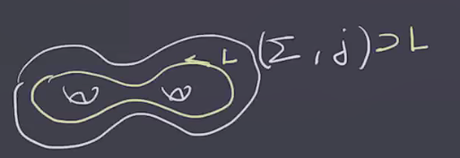
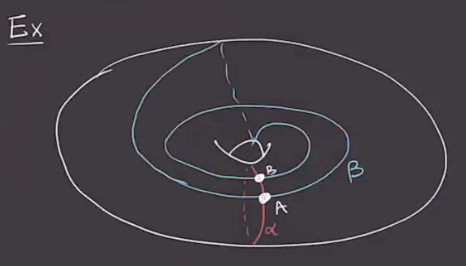
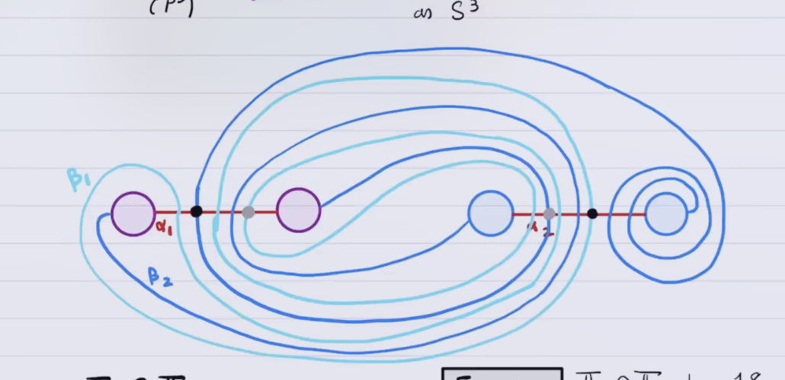

# Tuesday, February 16

:::{.remark}
Note that critical points can be used to compute the Euler characteristic, using the fact the $\chi(C) = \chi(H_*(C))$, i.e. it can be computed on dimensions of chains or ranks of homology, along with the fact that Morse homology is isomorphic to singular homology.
So e.g. for a 3-manifold $M^3$, we can show
\[
\chi(M^3) 
&= \sum_{i=0}^3 \rk H_i \\
&= \sum_{i=0}^3 \rk CM_i \\
&= 1 - \# \crit_1(f) + \# \crit_2(f) - 1 \\
&= 0
,\]
since the number of index 2 and index 3 critical points will be the same.
:::

## Symmetric Product Spaces

:::{.remark}
Let $M^3$ be a closed 3-manifold, then there is a Heegard splitting 
\[
(\Sigma_g, \alpha = \ts{ \alpha_1, \cdots, \alpha_g }, \beta = \ts{ \beta_1, \cdots, \beta_g } =( \Sigma_g, H_ \alpha, H_ \beta) && \bd(H_ \alpha) = \bd( H_ \beta) = \Sigma
,\]
where $M^3 = H_{ \alpha} \coprod_{ \Sigma} H_ \beta$ and $g$ is the genus of $HD$.
We refer to \( \Sigma \) as a **Heegard surface**, and this set of data as a **Heegard diagram**.

We'll define $\Sym^g( \Sigma)$ by letting $S_g \actson \Sigma^{\times g}$ where if \( \varphi\in S_g \) we set \( \varphi(x_1, \cdots, x_g) = x_{ \varphi(1)}, \cdots, x_{ \varphi(g) } \).
Then set \( \Sigma^{\times g} \da \Sigma^{\times g} / S_g \).
Why does this yield a smooth manifold?
Is this action free?
The diagonal \( D \subseteq \Sigma^{\times g} \) consists of the points with at least 2 equal coordinates, and it's easy to see that $S_g\actson D$ can not be free.
However, this still yields a smooth submanifold!

:::

:::{.lemma title="?"}
\( \Sym^g(\Sigma) \) is smooth, and any complex structure $j$ on \( \Sigma \) will induce a complex structure on the quotient, denoted \( \Sym^g(j) \), which is unique in the sense that the quotient map \( \Sigma^{\times g} \mapsvia{\pi} \Sym^g(\Sigma) \) is holomorphic.
:::

:::{.proof title="?"}
We'll check this locally, and then leave it as an exercise to check that it extends globally -- this is easy by just considering what happens under transition functions and checking that \( \pi \) is holomorphic.
Locally we want to produce a map 
\[ 
\Sym^g(\CC) &\mapsvia{f} \CC^g \\
\ts{ z_1, \cdots, z_g } &\mapsto \qty{ 
  \prod_{i=1}^g (z-z_i) 
  = z^g +a_1 z^{g-1} + \cdots + a_g \mapsto [a_1, \cdots, a_g] 
}
.\]
This is a bijection, and by the fundamental theorem of algebra, there is an inverse.
Equip $\Sym^g(\CC)$ with a complex structure that makes $f$ biholomorphic, then $\Sym^g(j)$ is the complex structure locally equal to this one.
This structure is obtained by just pulling back the standard complex structure $i\cross i \cross \cdots i$ on $\CC^g$.
:::

:::{.remark}
\( \Sym^g( \Sigma) \) is a complex manifold of complex dimension $g$ (or real dimension $2g$).
We want to find half-dimensional submanifolds to do Lagrangian-Floer homology.
Using the Heegard splitting, write \( \TT_ \alpha \da \prod_{i=1}^g \alpha_i \subset \Sigma^{\times g}\), which is a $g\dash$dimensional torus such that \( \TT_ \alpha \intersect D = \emptyset \)  since the \( \alpha_i \) are pairwise disjoint.
Composing the inclusion above with \( \pi \), we can note that the action of $S^g$ is free away from the diagonal $D$, so this composition is an embedding \( \TT_ \alpha \embeds \Sym^g( \Sigma) \).
Similarly, \( \TT_ \beta\da \prod_{i=1}^g \beta_i \embeds \Sym^g( \Sigma) \). 

Note that we're only working with complex structures now, and haven't upgraded it to a symplectic structure yet.
But we don't really need this to count holomorphic discs.
Lagrangians $L$ were defined as submanifolds where $\ro{\omega}{L} = 0$, how do we do this without a symplectic form?
:::

:::{.definition title="?"}
Given a complex manifold $(X, J)$, a submanifold $L \subseteq X$ is **totally real** if none of its tangent spaces contains a complex line, i.e. $T_p L \intersect J(T_p L) = \ts{ p, \vector 0 }$ for all $p\in L$.
:::

:::{.example title="?"}
Take a genus $g$ surface \( \Sigma \):

Here any tangent vector has to get rotated out of the tangent space: if it were an eigenvector for $J$, then the rank of $J$ would be too low, contradicting its definition.
Note that any 1-dimensional submanifold of \( (\Sigma, j ) \) is totally real, and so \( \TT_ \alpha, \TT_ \beta \) are also totally real submanifolds of \( \Sigma^{\times g} \).
If you restrict $\pi$ to \( \Sigma^{\times g}\sm D \mapsvia{\pi} \Sym^g(\Sigma) \sm \pi(D) \), this yields a biholomorphic map.
:::

:::{.remark}
We'll write \( \Delta \da \pi(D) \subseteq \Sym^g( \Sigma) \).
Note that if \( \alpha\transverse \beta \), then \( \TT_ \alpha \transverse \TT_ \beta \).
Any intersection point \( x \in \TT_{\alpha} \intersect \TT_{\beta} \) is of the form \( x = \ts{ x_1, \cdots, x_g} \subseteq \Sigma \) such that each \( \alpha_i, \beta_j \) contain exactly one of the coordinates of $x$.
:::

:::{.example title="?"}
The following is a diagram for $\RP^3$:

Here $g=1$ and so $\Sym^1(T^2) = T^2$.
We also have \( \TT_{ \alpha} = \alpha, \TT_{ \beta} = \beta \), and their intersection is \( \TT_{ \alpha} \intersect \TT_{ \beta} = \alpha \intersect \beta = \ts{A, B} \) 
:::

:::{.example title="Heegard diagram for the Poincaré homology sphere"}
Here we have a Poincaré homology sphere $P^3$, i.e. a 3-manifold with the same homology as $S^3$, i.e. $H_*(P^3) = [\ZZ, 0, 0, \ZZ]$ (??)

:::{.exercise title="?"}
Compute $H_*(P^3)$ using this diagram, particularly $H_1$.
Using Poincaré duality here is fine!
:::

The circles with the same color are the "feet" of a handle attachment, or equivalently removing the two circles and identifying their boundary with reversed orientation.
The two different colors for circles indicate that this will be genus 2
The arcs between same-colored circles indicate loops that continue through the handle which aren't shown.
Tracing through the lines on the diagram, there are two \( \alpha \) curves and two \( \beta \) curves.
Since $g=2$, we can identify \( \Sym^2( \Sigma) \supseteq \alpha_1 \cross \alpha_2 = \TT_{\alpha}, \beta_1 \cross \beta_2 = \TT_{\beta} \).
The two black circles indicate intersection points in \( \TT_{ \alpha} \intersect \TT_{ \beta} \).
However, there are more than just those two!

:::{.exercise title="?"}
Show that \( \abs{ \TT_{ \alpha} \intersect \TT_{\beta} } = 18 \).
:::

Computing the intersections:

% https://q.uiver.app/?q=WzAsOCxbMCwxLCJcXGFscGhhXzEiXSxbMCwzLCJcXGFscGhhXzIiXSxbMiwwLCJcXGJldGFfMSJdLFs0LDAsIlxcYmV0YV8yIl0sWzIsMSwiMyJdLFsyLDMsIjMiXSxbNCwxLCIyIl0sWzQsMywiNCJdLFs0LDcsIjEyIiwxLHsibGFiZWxfcG9zaXRpb24iOjgwLCJzdHlsZSI6eyJ0YWlsIjp7Im5hbWUiOiJhcnJvd2hlYWQifSwiYm9keSI6eyJuYW1lIjoiZGFzaGVkIn19fV0sWzUsNiwiNiIsMSx7ImxhYmVsX3Bvc2l0aW9uIjo3MCwic3R5bGUiOnsidGFpbCI6eyJuYW1lIjoiYXJyb3doZWFkIn0sImJvZHkiOnsibmFtZSI6ImRhc2hlZCJ9fX1dXQ==
\begin{tikzcd}
	&& {\beta_1} && {\beta_2} \\
	{\alpha_1} && 3 && 2 \\
	\\
	{\alpha_2} && 3 && 4
	\arrow["12"{description, pos=0.8}, dashed, tail reversed, from=2-3, to=4-5]
	\arrow["6"{description, pos=0.7}, dashed, tail reversed, from=4-3, to=2-5]
\end{tikzcd}

\todo[inline]{How to read this from the diagram?}

We're really working in $\Sym^g(\Sigma)$, but for computations, we'll work directly with the Heegard diagram.

:::

:::{.remark}
For Lagrangian Floer homology, we'll have a triple \( (\Sym^g(\Sigma), \TT_{ \alpha}, \TT_{\beta} ) \).
We'll define
\[
CF( \Sigma, \alpha, \beta) \da \bigoplus_{x\in \TT_{\alpha} \intersect \TT_{\beta} } \ZZ/2\ZZ \gens{ x } \\ \\
\bd(x) \da \sum_{y \in \TT_{ \alpha} \intersect \TT_{\beta}, \mu = 1} \# \hat{\mathcal{M}} y
.\]

We'll first figure out how to count continuous discs up to homotopy classes, since holomorphic discs are much more restrictive.
We'll see that $\pi_2$ plays a role, and define the topology of $\Sym^g$.
:::

