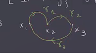
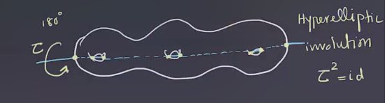
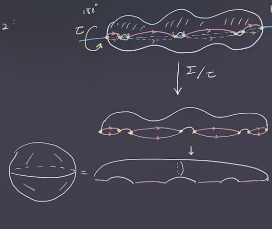
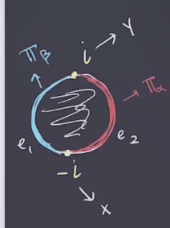
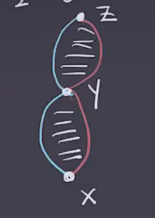
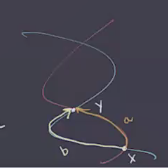

# Thursday, February 18

:::{.remark}
Today: topology of symmetric product spaces $\Sym^g$.
We had an assignment
\[
( \Sigma_g, \alpha, \beta) &\mapsto ( \Sym^g( \Sigma), \TT_ \alpha, \TT_ \beta)
,\]
where if \( \alpha, \beta \) are all transverse then so far \( \TT_ \alpha, \TT_ \beta \), since e.g. \( \TT_ \alpha = \prod_{i=1}^g \alpha_i \).
We wanted to define a chain complex
\[
CF( \sigma, \alpha, \beta) \da \bigoplus _{x\in \TT_ \alpha \intersect \TT_{ \beta } } \ZZ/2\ZZ \gens{ x } \\
\bd x \da \sum_{ \substack{ y \in \TT_{ \alpha} \intersect \TT_{ \beta } \\  \mu(x, y)  = 1} } \# \mathcal{M}(x, y) y 
,\]
where \( \mu \) is the *Maslov index* and we want to count holomorphic discs.
We'll first talk about continuous (topological) discs.
:::

:::{.lemma title="?"}
\[
\pi_1( \Sym^g( \Sigma ) ) \cong H_1 ( \Sym^g( \Sigma ) ) \cong H_1 (\Sigma)
,\]
so the fundamental group is abelian.
:::

:::{.remark}
For a proof of the first isomorphism, see Lemma 2.6 in [@OSZ04a].
Idea of proof for the second isomorphism: we'll define a map
\[
\iota: H_1 ( \Sigma) &\to H_1( \Sym^g( \Sigma) ) \\
x &\mapsto \ts{ x, z, \cdots, z } 
,\]
for some fixed $z \in \Sigma$, along with its inverse.
Note that we're identifying an embedding \( \iota( \Sigma ) = \Sigma \cross \ts{ z }^{\times g-1} \subseteq \Sym^g( \Sigma) \).
Now define $j \da \iota_*$ the induced map on homology.
\[
j: H_1( \Sym^g (\Sigma) ) \to H_1 ( \Sigma) \\
.\]
Picking a loop \( \gamma: S^1 \to \Sym^g( \Sigma ) \), note that \( \diagonal \subset \Sym^g( \Sigma) \) has codimension 2, and so we can perturb \( \gamma \) to be disjoint from \( \diagonal \).
We can arrange so that \( \gamma \) is the union of $g$ paths \( \gamma_1, \cdots, \gamma_g \) such that each \( \gamma_i \) connects \( x_i \in \gamma(0) \) to \( x_{ \sigma(i) } \in \gamma(0) \) where \( \gamma_0 = \ts{ x_1, \cdots, x_g } \) and \( \sigma\in S_g \) is a permutation.

:::{.example title="?"}
For example, for $g=3$:

Then \( \ts{ \gamma_1(t), \gamma_2(t), \gamma_3(t) } \) is a loop from \( \gamma(0) \to \gamma(0) \in \Sym^3( \Sigma) \).

:::

This means that \( \Union_{i=1}^g \gamma_i \) is a 1-cycle in \( \Sigma \), and thus \( [ \union g_i ] \in H_1( \Sigma) \).
So we'll define this as \( j([ \gamma ]) = [ \union \gamma_i ] \).

Let $M \da \ts{ (\vector x, y) \st \vector x \in \Sym^g( \Sigma), y\in \vector x  }$, then we'll define a $g:1$ branched cover away from \( \pi ^{-1} \diagonal \) that yields a fiber bundle:

\begin{tikzcd}
	{S^1} && M \\
	\\
	{S^1} && {\Sym^g(\Sigma)} && \Sigma
	\arrow["{\exists \tilde \gamma}", dashed, from=1-1, to=1-3]
	\arrow["{\pi, \, g:1}", from=1-3, to=3-3]
	\arrow["{\exists g:1}"', dashed, from=1-1, to=3-1]
	\arrow["\gamma"', from=3-1, to=3-3]
	\arrow[curve={height=-18pt}, dotted, from=1-1, to=3-5]
	\arrow["{\pi_2}", curve={height=-24pt}, dotted, from=1-3, to=3-5]
\end{tikzcd}

> [Link to Diagram](https://q.uiver.app/?q=WzAsNSxbMCwwLCJTXjEiXSxbMCwyLCJTXjEiXSxbMiwwLCJNIl0sWzIsMiwiXFxTeW0lZyhcXFNpZ21hKSJdLFs0LDIsIlxcU2lnbWEiXSxbMCwyLCJcXGV4aXN0cyBcXHRpbGRlIFxcZ2FtbWEiLDAseyJzdHlsZSI6eyJib2R5Ijp7Im5hbWUiOiJkYXNoZWQifX19XSxbMiwzLCJcXHBpLCBcXCwgZzoxIl0sWzAsMSwiXFxleGlzdHMgZzoxIiwyLHsic3R5bGUiOnsiYm9keSI6eyJuYW1lIjoiZGFzaGVkIn19fV0sWzEsMywiXFxnYW1tYSIsMl0sWzAsNCwiIiwwLHsiY3VydmUiOi0zLCJzdHlsZSI6eyJib2R5Ijp7Im5hbWUiOiJkb3R0ZWQifX19XSxbMiw0LCJcXHBpXzIiLDAseyJjdXJ2ZSI6LTQsInN0eWxlIjp7ImJvZHkiOnsibmFtZSI6ImRvdHRlZCJ9fX1dXQ==)

This can be restricted to \( M \sm \pi ^{-1} (\diagonal ) \mapsvia{g:1} \Sym^g( \Sigma) \sm \diagonal\).
Here \( j([ \gamma ]) = [ \pi_2 \circ \gamma] \) and \( j \circ \iota_* = \one \).

:::{.example title="?"}
We can use a Heegard diagram and Mayer Vietoris to compute the homology:
\[
H_1( M; \ZZ) = 
{ 
H_1(\Sigma; \ZZ) 
\over 
\gens{ [\alpha_1], \cdots, [ \alpha_g], [\beta_1], \cdots, [\beta_g] }
}
\cong 
{ 
H_1( \Sym^g( \Sigma ) ) \over \gens{ H_1( \TT_ \alpha ), H_1 (\TT_ \beta ) }
}
.\]

:::

:::

:::{.proposition title="?"}
\[
\pi_2( \Sym^g( \Sigma ) ) \cong \ZZ
.\]

:::

:::{.remark}
The generator comes from hyperelliptic involution:

Then consider the quotient \( \Sigma / \tau \).
To identify this quotient, since the top half is identified with the bottom half, we can first forget about the bottom half, and then forget about half of the arcs along the axis of rotation:

Note that this results in a copy of $S^2$.
We can define a map
\[
\Sigma &\to \Sigma^{\times g} \\
x &\mapsto (x, \tau(x), z, \cdots, z)
.\]
This extends to a map to $\Sym^g( \Sigma)$, since \( \tau(x) \mapsto (\tau(x), x, z, \cdots, z) \) and these will be equal in $\Sym^g$.
So we can factor this through the quotient from above:

% https://q.uiver.app/?q=WzAsNCxbMCwwLCJcXFNpZ21hIl0sWzMsMCwiXFxTaWdtYV57XFxwcm9kX2d9fCJdLFswLDIsIlNeMiJdLFszLDIsIlxcU3ltXmcoIFxcU2lnbWEpIl0sWzAsMSwiZiJdLFswLDIsInEiLDJdLFsxLDMsIiIsMCx7InN0eWxlIjp7ImJvZHkiOnsibmFtZSI6ImRhc2hlZCJ9fX1dLFsyLDMsIiIsMix7InN0eWxlIjp7ImJvZHkiOnsibmFtZSI6ImRhc2hlZCJ9fX1dXQ==
\begin{tikzcd}
	\Sigma &&& {\Sigma^{\times g}} \\
	\\
	{S^2} &&& {\Sym^g( \Sigma)}
	\arrow["f", from=1-1, to=1-4]
	\arrow["q"', from=1-1, to=3-1]
	\arrow[dashed, from=1-4, to=3-4]
	\arrow[dashed, from=3-1, to=3-4]
\end{tikzcd}

:::

:::{.definition title="Whitney Disc"}
Given \( x, y \in \TT_{ \alpha} \intersect\TT_{ \beta} \), a **Whitney disc** from $x$ to $y$ is a map
\[
\varphi: \DD^2 \to \Sym^g( \Sigma) 
\]
such that 
\[
\phi(-i) &= x \\
\phi(i) &= y \\
\phi(e_1) &\subseteq \TT_{ \alpha} \\
\phi(e_2) &\subseteq \TT_{ \beta }
.\]

We say \( \varphi_1 \sim \varphi_2 \) if and only if they are homotopic relative to \( \TT_{ \alpha}, \TT_{ \beta} \).
We'll write \( \pi_2(x, y) \) for the homotopy class of Whitney discs from $x$ to $y$.
There is a concatenation operation:
\[
\ast: \pi_2(x, y) \cross \pi_2(y, z) \to \pi_2(x, z)
.\]

Note that this is precisely concatenation of paths in the path space $\Path$.

:::

:::{.exercise title="?"}
If $x=y=z$, then this yields an operation on $(\pi_2(x, x), \ast)$ which defines a group.
:::

:::{.remark}
We can find obstructions to holomorphic discs by just looking at the topology.
For \( x, y\in \TT_{ \alpha} \intersect \TT_{ \beta} \), choose two paths connecting them:
\[
a: I &\to \TT_{ \alpha}\\
b: I &\to \TT_{ \beta} 
.\]

We can consider the homology class $[a-b]$ to investigate $\pi_1$.
This is well-defined as a loop 
\[
\eps(x, y) \da [a-b] \in { H_1 ( \Sym^g ( \Sigma ) ) \over  \gens{ H_1( \TT_{ \alpha } ) \oplus H_1 ( \TT_{ \beta} ) } } \cong H_1(M)
.\]
This turns out to be independent of the choice of $a, b$, and thus 
\[
\eps(x, y) \neq 0 \implies \pi_2(x, y) = \emptyset
,\]
and there are no continuous discs.

:::

