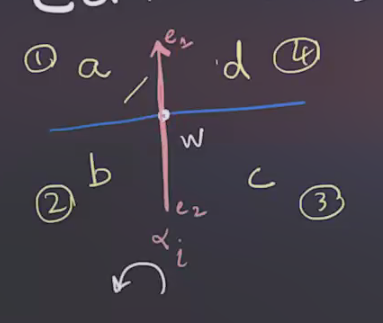
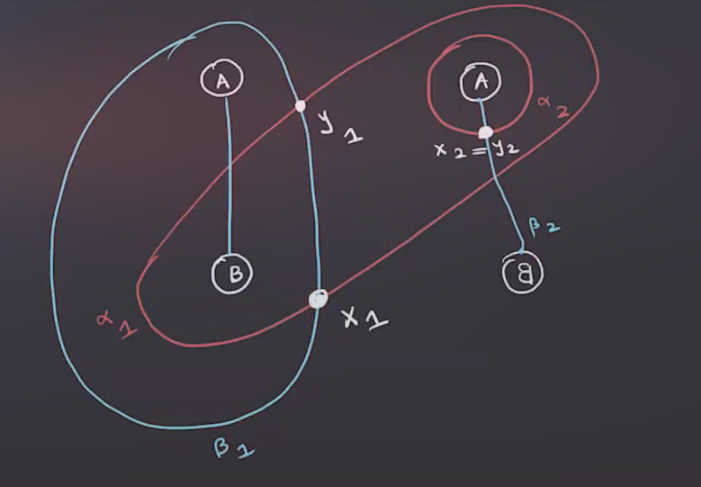
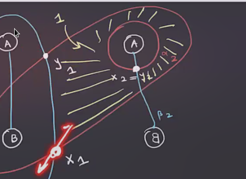
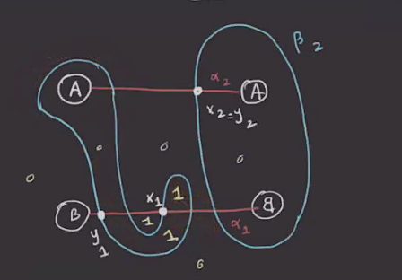
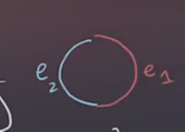
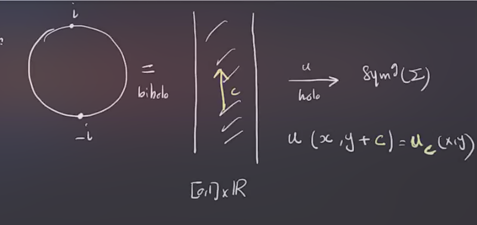

# Thursday, February 25

## Whitney Discs

:::{.remark}
Recall that we discussed the domains of discs: for \( \varphi\in \varphi_2(x, y) \) we defined the 2-chain \( D( \varphi) = \sum_{i=1}^n a_i D_i \) where we've written 
\[ 
\Phi \sm \alpha\union \beta = \disjoint_{i=1}^m \open{D_i} 
\] 
and $a_i$ is the number of points in $\im( \varphi) \intersect L_{z_i}$ for $z_i \in D_i$.

:::

:::{.exercise title="?"}
For \( \varphi\in \pi_2(x, y) \), \( \bd D( \varphi) \) is a 1-chain in \( \alpha \union \beta \).
Then 
\[ 
\ro{ \bd D( \varphi )}{ \alpha} = \sum_{i=1}^g y_i - \sum_{i=1}^g x_i 
\ro{ \bd D( \varphi )}{ \beta} = \sum_{i=1}^g x_i - \sum_{i=1}^g y_i 
\]
where $x_i, y_i \in \alpha_i$.
:::

:::{.corollary title="?"}
For \( \varphi\in \pi_2(x, y) \), consider an intersection point $w$ which labels 4 nearby regions with coefficients $a,b,c,d$:

Consider several cases:

1. $w\not\in x$ and $w\not\in y$:
  Then \( \bd\qty{ \bd \ro{D( \varphi)}{ \alpha} } \not\ni w  \).
  We can expand this out as 
  \[
  D( \varphi) = a D_1 + bD_2 + c D_3 + dD_4 \\
  \bd^2 D( \varphi) = \bd \qty{ a \bd D_1 } + {\cdots} 
  .\]
  Now restrict this to \( \alpha_i \) to yield
  \[
  \bd^2 D( \varphi) = ae_1 + be_2 -ce_2 -de_1
  .\]
  Checking coefficients of $w$ contributes $-aw + bw - cw -d(-w)$, and these should sum to zero.
  This yields $a+c = b+d$, and similarly if $w\intersect x \intersect y$, this also yields $a+c = b+d$.

2. $w\in x$ and $w\not \in y$ implies that $a+c = b +d +1$.

3. $w\not\in x$ and $w\in y$ implies $a+c+1 = b+d$.

:::

:::{.remark}
So if you want to check to see if some 2-chain could be the domain of a Whitney disc, this local condition can be checked, i.e. this is an obstruction to existence.
It turns out that this is an if and only if condition.
:::

:::{.definition title="?"}
A 2-chain $A \da \sum_{i=1}^m a_i D_i$ **connects** $x$ to $y$ if and only if the following local linear conditions are satisfied:
\[
\bd^2 \ro{A}{ \alpha} &= y-x \\
\bd^2 \ro{A}{ \beta} &= x-y \\
.\]
:::

:::{.proposition title="?"}
Suppose $g>1$.
If a 2-chain $A$ connects $x$ to $y$ then there exists a Whitney disc \( \varphi\in \pi_2(x, y) \) such that $D( \varphi) = A$.
If $g>2$, \( \varphi \) is uniquely determined by $A$.
:::

:::{.remark}
See proof in Osvath-Szabo paper.
:::

:::{.example title="?"}
Think of the screen as a plane, and circled letters are handles attached out of the page according to their orientations.
Consider the following diagram along with the indicated intersection points:

Set the coefficients of the unlabeled regions to zero, and let \( x \da \ts{ x_1, x_2} \) and \( y \da \ts{ y_1, y_2 } \).
We can check that if the following yellow region has coefficient 1, it can be the domain of a Whitney disc:

This follows from checking the local conditions (there is a mnemonic involving the diagonal sums for the various cases).
:::

:::{.example title="?"}
Consider a new diagram, changed by an isotopy (here: a "finger move"):

Is there a Whitney disc connecting \( x \da \ts{ x_1, x_2 } \mapsvia{\varphi} y \da \ts{ y_1, y_2 } \)?
Checking the diagonals, all of the local conditions hold, so yes.
:::

:::{.exercise title="?"}
Find the 3-manifold that these two diagrams represent.
:::

## Holomorphic Discs

:::{.remark}
Ultimately these are what we want to define the differential in the chain complex.

We'll set up a correspondence:
\[
\correspond{
  (\text{Riemann surfaces } F, {\color{red} \bd_{ \alpha}}F, {\color{blue}\bd_{\beta}}F)
  \mapsvia{\pi_{\Sigma}} ( \Sigma, {\color{red} \alpha}, {\color{blue} \beta }) \\
  {\big\Downarrow} \hspace{4em} {\scriptsize \text{$g\dash$fold branched cover $\pi_D$} } \\
  (D, e_1, e_2) \\
  \bd F = (\bd_{ \alpha} F) \disjoint_{ \bd} (\bd_{ \beta} F) \\
  \pi_D( \bd_{ \alpha} ) = e_1 \hspace {2em}
  \pi_D( \bd_{ \beta} ) = e_2
}
&\mapstofrom
\correspond{
\text{holomorphic }
u: (D^2, e_1, e_2) \to (\Sym^g(\Sigma), \TT_{ \alpha}, \TT_{ \beta})
  \text{}
}
\]

To do this, we define $u(z) = \pi_{\Sigma}( \pi_D \inv(z) ) \in \Sym^g(\Sigma)$.
Check that if $\pi_D, \pi_\Sigma$ are holomorphic, then $u$ is holomorphic.

\begin{tikzcd}
	&&& {} \\
	F && {\Sigma \times \Sym^{g-1}(\Sigma)} && \Sigma \\
	\\
	{D^2} && {\Sym^g(\Sigma)}
	\arrow["{g\dash\text{fold branched cover}}", from=2-3, to=4-3]
	\arrow["u"', from=4-1, to=4-3]
	\arrow["{\pi_D: g\dash\text{fold branched cover}}"', color={rgb,255:red,214;green,92;blue,92}, from=2-1, to=4-1]
	\arrow[color={rgb,255:red,214;green,92;blue,92}, from=2-1, to=2-3]
	\arrow["{\pi_1}"', from=2-3, to=2-5]
	\arrow["{\pi_\Sigma}"', curve={height=-24pt}, dashed, from=2-1, to=2-5]
\end{tikzcd}

> [Link to Diagram](https://q.uiver.app/?q=WzAsNixbMCwzLCJEXjIiXSxbMiwzLCJcXFN5bV5nKFxcU2lnbWEpIl0sWzIsMSwiXFxTaWdtYSBcXHRpbWVzIFxcU3ltXntnLTF9KFxcU2lnbWEpIl0sWzAsMSwiRiJdLFs0LDEsIlxcU2lnbWEiXSxbMywwXSxbMiwxLCJnXFxkYXNoXFx0ZXh0e2ZvbGQgYnJhbmNoZWQgY292ZXJ9Il0sWzAsMSwidSIsMl0sWzMsMCwiXFxwaV9EOiBnXFxkYXNoXFx0ZXh0e2ZvbGQgYnJhbmNoZWQgY292ZXJ9IiwyLHsiY29sb3VyIjpbMCw2MCw2MF19LFswLDYwLDYwLDFdXSxbMywyLCIiLDAseyJjb2xvdXIiOlswLDYwLDYwXX1dLFsyLDQsIlxccGlfMSIsMl0sWzMsNCwiXFxwaV9cXFNpZ21hIiwyLHsiY3VydmUiOi00LCJzdHlsZSI6eyJib2R5Ijp7Im5hbWUiOiJkYXNoZWQifX19XV0=)

Then if $u$ is holomorphic, it can be shown that $\pi_D, \pi_{\Sigma}$ are also holomorphic.
Given \( \varphi\in \pi_2(x, y) \), define \( \mathcal{M}( \varphi)  \) to be the moduli space of holomorphic discs connecting $x$ to $y$ in the same homotopy class as \( \varphi \) (i.e. such discs *represent* $\phi$).
After perturbing the complex structure $\Sym^g(j)$ to make it generic, \( \mathcal{M}( \varphi)  \) will be smooth.
We'll have a notion of dimension, the *Maslov index* $\mu( \varphi)$, which is the expected dimension of \( \mathcal{M}( \varphi) \).
There will be an $\RR\dash$action on \( \mathcal{M}( \varphi)  \), where we remember the biholomorphism between the disc and the vertical strip:

We'll define \( \hat{ \mathcal{M}}( \varphi) \da \mathcal{M}( \varphi) / \RR   \).
The chain complex will be defined as 
\[
\CF( \Sigma, \alpha, \beta) &\da \bigoplus_{x \in \TT_{ \alpha} \intersect\TT_{ \beta} } \ZZ/2 \gens{ x } 
\\
\bd x &\da \sum_{y\in \TT_{ \alpha} \intersect \TT_{ \beta} } \sum _{ \varphi\in \pi_2(x, y) ?} \# \hat{ \mathcal{M}}(\varphi)  
.\]

We'll need 

- Check that $\bd$ is well-defined and $\bd^2=0$,

- Check independence of choices, e.g. the Heegard the diagram, the complex structure, the perturbations of $\Sym^g(j)$, etc.

:::

:::{.question}
This takes a lot of work!
Is the homology of this complex interesting?
Is this stronger than singular homology?
:::

:::{.answer}
Let $M \in \ZHS^3$, so the homology doesn't distinguish $M$ from a sphere and $H_*(M; \ZZ) \cong H_*(S^3; \ZZ)$.
It turns out that $H_*( \CF(M^3)) \cong H_*(\CF(S^3))$, so the answer is no!
:::

:::{.remark}
Osvath-Szabo picked a basepoint $z\in \Sigma\sm \qty{ \alpha\union \beta}$ and work with *pointed* Heegard diagrams $(\Sigma, \alpha, \beta, z)$.
Perturb the differential to obtain
\[
\tilde \bd x \da \sum_{y \in \TT_{ \alpha} \intersect\TT_{ \beta} } 
\sum_{ \substack{ 
\varphi \in \pi_2(x, y), \\
\mu( \varphi) = 0, \\
n_z( \varphi) = 0
}} 
\# \hat{\mathcal{M}}(\varphi) y 
.\]
where $n_z$ denotes the coefficient of $\phi$ at the basepoint $z$, i.e. the number of intersection points $\# (\im \varphi \intersect L_z)$.

Defining $\hat{\CF}$ as the same chain complex with the new differential now gets interesting!
We'll define $\hat{\HF}$ as the homology of this new complex.

:::

