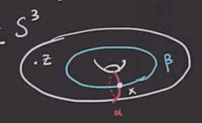
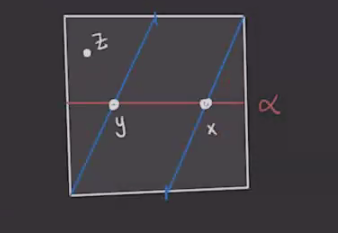
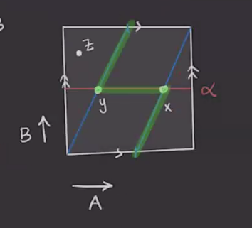
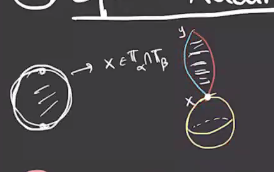

# The Heegard-Floer Chain Complex & Maslov Index (Tuesday, March 02)

## Pointed Heegard Diagrams

:::{.remark}
Last time: to strengthen the homology theory, take a **pointed** Heegard diagram \( (\Sigma, \alpha, \beta, z \in \Sigma\sm \alpha\union \beta \) and define a new chain complex
\[
\hat{\CF}( \Sigma, \alpha, \beta, z) 
&= \bigoplus_{ x\in \TT_ \alpha \intersect \TT_ \beta} \ZZ/2 \gens{ x } \\
\bd x &= \sum_{y \in \TT_ \alpha \intersect\TT_ \beta} 
\sum_{ \substack{ 
  \varphi\in \pi_2(x, y), \\
  \mu( \varphi) = 1, \\
  n_z(\varphi) = 0
}} \# \hat{ \mathcal{M}}(\varphi) y 
.\]
Note that \( n_z( \varphi) = 0 \) means that the coefficient attached to the region containing $z$ is zero.
Recall that we had diagram moves, how do they translate to the pointed setting?

- Allow *pointed isotopies*, which are isotopies disjoint from $z$.
- Allow *pointed handleslides*, where now the bounded pair-of-pants is disjoint from $z$:

- Allow isotopies of the base point.

:::

:::{.lemma title="?"}
Any two pointed Heegard diagrams for a 3-manifold $M^3$ can be connected by a sequence of the following moves:

- Stabilization or destabilization,
- Pointed isotopy,
- Pointed handleslides,
- Isotopes of the basepoint away from \( \alpha, \beta \).

:::

:::{.exercise title="?"}
Prove this lemma.
:::

:::{.example title="$S^3$"}
Here is the simplest Heegard diagram from $S^3$:

Here there is just one one intersection point, so $\hat{\CF} = \ZZ/2\gens{ x }$ is 1-dimensional, and \( \bd x = 0 \).
So $\hat{\HF} = \ZZ/2$.
:::

:::{.example title="$\RP^3$"}
We can write $\RP^3 = L(2 ,1)$ and produce the following Heegard diagram:

Is there a disc between $x$ and $y$?
We can check the obstruction $\eps(x, y)$ by labeling the generators in homology and tracing the following green path:

We obtain
\[
\eps(x, y) = [B] \in { H_1(T^2) \over \gens{ [\alpha] = [A], [\beta] = [A + 2B] } }
.\]
In this quotient, $[B] \neq 0$, and this quotient is $\ZZ/2 = \gens{ [B] }$ so that $2B = 0$. 
So there are no disks in $\pi_2(x, y)$, making $\bd x = \bd y = 0$.
So $\hat{HF}(\RP^3) = \ZZ/2 \oplus \ZZ/2$.

:::

:::{.exercise title="?"}
Compute $\hat{\HF}(L(p, 1))$.
Use that $\eps(x, y) + \eps(y, z) = \eps(x, z)$.
:::

## Maslov Index

:::{.remark}
Recall that we had a natural concatenation operation on Whitney discs:
\[
\ast: \pi_2(x, y) \cross \pi_2(y, z) \to \pi_2(x, z)
,\]
using the identification of these discs with paths in the path space and using concatenation of paths there.
Note that the domains of concatenations are given by $D( \varphi_1 \ast \varphi_2) = D( \varphi_1) + D( \varphi_2)$, since this amounts to adding algebraic intersection numbers.

There is an inverse
\[
\pi_2(x, y) &\to \pi_2(y, x)\\
\varphi &\mapsto \varphi\inv(s, t) \da \phi(s, -t)
,\]
which reverses the parameterization on $(s, t) \in I \cross \RR$ and runs the path backward.
Here $D( \varphi\inv) = -D( \varphi)$.

There is also a *sphere addition*
\[
\pi_2( \Sym^g( \Sigma), x) \cross \pi_2(x, y) &\to \pi_2(x, y) \\
(\Omega, \varphi) &\mapsto \Omega \ast \varphi
.\]

Note that for $g\geq 2$, the $\pi_2$ on the left-hand side is isomorphic to $\ZZ$, which came from quotienting by the hyperelliptic involution several lectures ago.
Writing the positive generator as $S$, we have \( \Omega = kS \) for some $k\in \ZZ$.

:::{.exercise title="?"}
Show that 
\[
D(S) = \sum_{i=1}^m D_i = [ \Sigma]
.\]
:::

:::

:::{.proposition title="?"}
There exists a function $\mu: \pi_2(x, y) \to \ZZ$ called the **Maslov index** satisfying:

1. Additivity: $\mu( \varphi_1 \ast \varphi_2) = \mu( \varphi_1) + \mu (\varphi_2)$.

2. Invertibility: $\mu( \varphi\inv) = - \mu( \varphi)$.

3. Sphere addition: $\mu( kS \ast \varphi) = \mu( \varphi) + 2k$ where $k\in \ZZ$ and $S\in \pi_2( \Sym^g( \Sigma ) )$.

4. If \( \varphi\in \pi_2(x, x) \) is constant, then \( \mu( \varphi) = 0 \).

Note that $2\implies 4$.
:::

:::{.remark}
The Maslov index is the "expected" dimension of 
\[
\mathcal{M}( \varphi) = \ts{ 
u: I \to \RR \to \Sym^g( \Sigma)
\st
[u] = \varphi 
\du \circ i = J \circ \du 
} 
\]
where $i$ is the standard complex structure on the strip and $J$ will be a perturbation of the complex structure over the Heegard surface.
This will yield an operator
\[
\delbar_J: B &\to \mathcal{L} \\
u & \mapsto du \circ i - J \circ du 
\]
for some appropriate infinite dimensional spaces.
The elements of \( \mathcal{M}( \varphi )  \) will be in the kernel of this operator.
We want 0 to be a **regular value** (surjective derivative) for \( \delbar_J \), since in finite dimensions the inverse image would be a smooth manifold.
In the infinite dimensional setting, we'll have by the inverse function theorem that \( \mathcal{M} (\phi) = \delbar\inv_J(0) \) will be a smooth manifold.
We'll want the following derivative to be surjective:
\[
D_u \delbar_J: T_u B \to T_{\delbar_J u} \mathcal{L} 
\]
for all \( u \in \delbar\inv_J(0) \), which is referred to as **transversality** of the operator, and can be made to hold by perturbing the complex structure.
Since the dimension of a manifold is the dimension of the tangent spaces, we'll have \( \mathcal{M}( \varphi)  \) smooth of dimension equal to \( \dim \ker D_u \delbar_J \) for any \( u \in \delbar_J\inv(0) \).
This will be an order 2 elliptic operator (or more generally a Fredholm operator), for which we have a notion of index:
\[
\ind( D \delbar_J) = \dim( \ker D\delbar_J) - \dim (\coker D \delbar_J)
.\]
If surjectivity holds, the cokernel will be zero, so it will suffice to compute the dimension of the kernel to get the dimension of the moduli space.
The index of this operator will be the Maslov index.

:::

:::{.remark}
Take a look at *Gromov compactness* again!

:::

