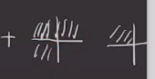
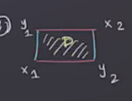
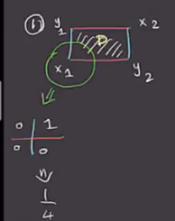
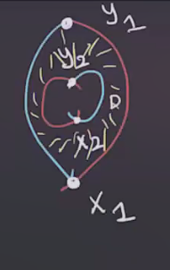
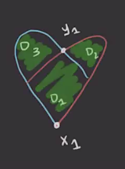
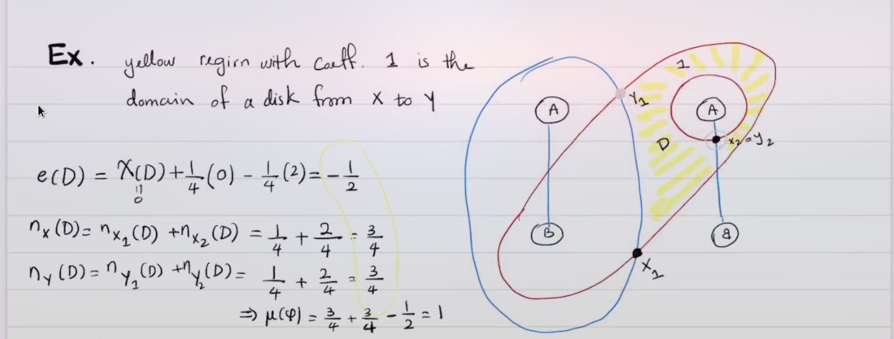
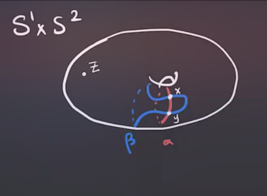
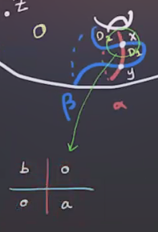
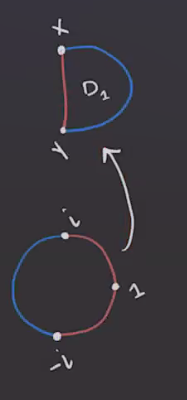

# Maslov Index Formula (Thursday, March 04)

## Review

:::{.remark}
Recall that for $x,y \in \TT_ \alpha \intersect \TT_ \beta$, there is a map
\[
\mu: \pi_2(x, y) &\to \ZZ \\
&\mu &= \ind(D \delbar_J)
.\]

This index is the expected dimension of $M(\varphi)$.
The following theorem can be found in the paper "A cylindrical reformulation of Heegard Floer homology":

:::

:::{.theorem title="Lipschitz"}
Let \( x = \ts{ x_1, \cdots, x_g } \)  and \( y = \ts{ y_1, \cdots, y_g } \)  and \( \varphi\in \pi_2(x, y) \).
Then 
\[
\mu( \varphi) = e( D( \varphi) ) + n_x( D( \varphi ) ) + n_y( D( \varphi ) )
.\]
where $e(\wait)$ is the **Euler measure** and $n_x(\cdots), n_y(\cdots)$ is referred to as the **point measure**.
Note that these only depend on the domain of \( \varphi \).
:::

:::{.definition title="Euler Measure"}
Let $D( \varphi) = \sum_{i=1}^m n_{z_i} ( \varphi) D_i$, then
\[
e (D (\varphi)) \da \sum_{i=1}^m n_{z_i}( \varphi) e(D_i) && e(D_i) \da \chi(D_i) + {1\over 4} C_1 - {1\over 4}C_2
.\]
Here we use the fact that all regions are polygons whose corners occur in one of two types:

So we define $C_1$ to be the number of corners of the first type and $C_2$ the number of the second type.
The point measure is defined as 
\[
n_x (D( \varphi ) ) \da \sum_{i=1}^g n_{x_i}( D( \varphi ) ) = {n_1 + n_2 + n_3 + n_4 \over 4}
,\]

where the $n_i$ are the surrounding regions' coefficients:

:::

:::{.example title="?"}
Let $x = \ts{ x_1, x_2 }, y = \ts{ y_1, y_2 }$ and compute \( \mu( \varphi) \) where \( D( \varphi) \) is one of the following domains:

1. The first type:

   

  

  - Here $D( \varphi) = 0$ and $e(D) = 1 + {1\over 4}(0) - {1\over 4} (0) = 0$.
  - $n_x(D (\varphi ) ) = n_{x_1}( D ) + n_{x_2}(D)F = {1\over 4} + {1\over 4} = {1\over 2}$.
  - $n_y(D ( \varphi ) ) = n_{y_1}(D) + n_{y_2}(D) + {1\over 4} + {1\over 4} = {1\over 2}$.
  - So $\mu( \varphi) = 1$.

2. A second type:

  

  - Here we have an annulus and $D( \varphi) = D$ implies that $e(D (\varphi)) = e(D) = \chi(D) + \cdots = 0 + {1\over 4}(0) - {1\over 4}( 4) = -1$.
  - \( n_{x} (D( \varphi ) ) = n_{x_1}( D) + n_{x_2}(D) = {1\over 4} + {1\over 4} = {1\over 2} \)
  - $\mu( \varphi) = -1 + {1\over 2} + {1\over 2} = 0$.

3. A third type:

  

  - Here $x_2 = y_2$ and are disjoint from $D_1, D_2, D_3$:
  - $D( \varphi) = D_1 + D_2 + D_3$.
  - $e(D ( \varphi ) ) = \sum e(D_i) = \qty{1 - {1\over 4}(4) } + \qty{1 - {1\over 4}(2) } + \qty{1 - {1\over 4}(2)} = 0 + {1\over 2} + {1\over 2} = 1$.
    - We could have alternatively noted that $D( \varphi)$ is a disc with $\chi =1$ and used the formula to get $1 +{1\over 4}(1) - {1\over 4}(1)$.
  - $n_x(D( \varphi ) ) = n_{x_1}(D( \varphi ) ) + n_{x_2}(D( \varphi ) ) = {1\over 4} + 0 = {1\over 4}$.
  - $n_y(D (\varphi)) = n_{y_1}(D( \varphi ) ) + n_{y_2}(D( \varphi ) ) = {3\over 4} + 0 = {3\over 4}$.
  - Thus $\mu( \varphi) = 2$.

:::

:::{.example title="?"}
Another example calculation:

:::{.question}
Does this domain have a holomorphic representative?
:::

:::

## Positivity Principle

:::{.proposition title="Positivity Principle"}
For \( \varphi\in \pi_2(x, y) \), if \( \mathcal{M}( \varphi) \neq \emptyset  \) then \( D( \varphi) \geq 0 \), i.e. $D( \varphi ) = \sum n_i D_i$ where $n_i \geq 0$.
This happens if and only if $n_w( \varphi) \geq 0$ for all \( w \in \Sigma \sm \alpha\union \beta \).
:::

:::{.proof title="Idea"}
If \( u \in M( \varphi) \) then \( u:D \to \Sym^g( \Sigma ) \) is holomorphic and \( \im(u) \) is a complex submanifold.
If \( w \in \Sigma \sm \alpha\union \beta \) then \( \mathcal{L}_w  \) is holomorphic.
:::

:::{.example title="?"}
Show that transverse complex submanifolds intersect non-negatively, i.e. 
\[
n_w( \varphi) \da \# \qty{ \im (u) \intersect \mathcal{L}_w } \geq 0 
.\]
:::

:::{.example title="?"}
Consider $S^1 \cross S^2$ with the following Heegard diagram:

We have \( \hat{\CF} (\Sigma, \alpha, \beta, z) = \ZZ/2 \gens{ x,y }  \).
Then for \( \varphi\in \pi_2(x, y) \) with \( \mu( \varphi) = 1 \) and \( n_z( \varphi) = 0 \), we can write \( D( \varphi) = a D_1 + b D_2 \).
Now checking the diagonals:

Since the sum of multiplicities NW $\to$ SE should be 1 more than the sum NE $\to$ SW, we have $a+b=1$ and by the positivity principle, $D( \varphi) \geq 0$ implies $a, b \geq 0$.
We then obtain
\[
\begin{cases}
a = 0, b = 1 &  \implies D( \varphi) = D_2 \ni \phi_2
\\
a = 1, b = 0 & \implies D( \varphi) = D_1 \ni \phi_1
\end{cases}
.\]

:::

:::{.example title="?"}
For example, if $\mu( \varphi_1) = \mu( \varphi_2) = 1$, we're looking for holomorphic maps

For any $p$ on the \( \alpha \) circle from $y$ to $x$, there exists a unique holomorphic map with $\mu(1) = p$ by the Riemann mapping theorem.
After taking the quotient \( \hat{\mathcal{M}} ( \varphi_1) = \mathcal{M}(\varphi_1) / \RR    \), we obtain \( \# \hat{\mathcal{M}} ( \varphi_1 ) = 1 = \# \mathcal{M}( \varphi_2 )  \).
Then note that
\[
\bd x = \qty{ \# \hat {\mathcal{M}} ( \varphi_1) + \# \hat{ \mathcal{M} } ( \varphi_2) } y = 0
,\]
since we are taking coefficients mod 2.
Then \( \varphi\in \mu(x, y) \) implies that $a+b=-1$, so there is no non-negative disk and $\bd y = 0$.

:::{.exercise title="?"}
Show that there is no non-negative disc in $\pi_2(x, x)$ and $\pi_2(y, y)$ by looking at local coefficients.
:::

So $\bd =0$ which implies that \( \hat{\HF}( \Sigma, \alpha, \beta, z) = (\ZZ/2)^{\oplus 2} \).
:::

:::{.question}
What if we used an isotopic diagram?

The only difference between this and the first is an isotopy of \( \beta \), and we'll see that there's an invariance and a condition called *admissibility* to help decide which to use.

:::

:::{.exercise title="?"}
Do another isotopy to create 4 intersection points and show that the ranks of homology are unchanged.
:::

