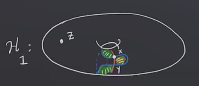
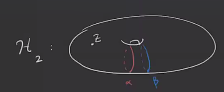
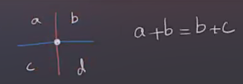
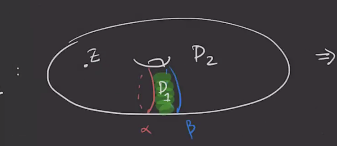
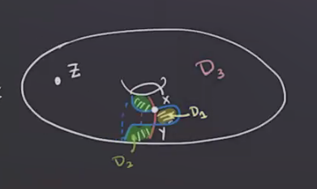
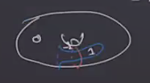
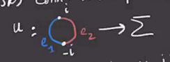
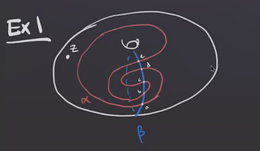

# Tuesday, March 09

:::{.remark}
Recall that we were working with a diagram for $S^1 \cross S^2$:

Here we have \( \bd x = 2y = 0 \) since we're working mod 2, and \( \bd y = 0 \), so we have
\[
\hat{\HF}(H_1) = {\ker \bd \over \im \bd} = { \gens{ x, y }\over 1} = (\ZZ/2)^{\oplus 2} 
.\]

However, with a different diagram, we get a different result:

Here $\hat{\HF}(H_2) = 0$.
To prevent this, we'll have some class of *admissible* diagrams.

:::

:::{.definition title="Periodic Domains"}
A 2-chain \( P = \sum_{i=1}^m a_i D_i \) is called a **periodic domain** if and only if 

1. The local multiplicity of $P$ at $z$ is zero, i.e. $n_z(P) = 0$, and
2. $\bd P$ is a linear combination of \( \alpha, \beta \).
:::

:::{.remark}
Note that for (2), the boundary could involve 1-chains, so this condition avoids corners on \( \bd P \).
The local picture is the following:

:::

:::{.example title="?"}
In this picture, $P = nD_1$ will be a periodic domain for any $n$;

:::

:::{.example title="?"}
Labeling the first picture, we have

We should have $n_1 + n_2 = 0$, so any $P = n(D_1 - D_2)$ will be a periodic domain.
Checking the boundary yields \( \bd P = n \alpha \pm n \beta \).
In fact there is single "generator" for the periodic domains here:

:::

:::{.definition title="Weakly Admissible Diagrams"}
A Heegaard diagram $H = ( \Sigma, \alpha, \beta, z)$ is called **weakly admissible** if any periodic domain $P$ has both positive and negative coefficients.
:::

:::{.example title="?"}
$H_1$ from above is weakly admissible, but $H_2$ is not.
:::

:::{.remark}
For any Whitney disc \( \varphi\in \pi_2(x, x) \) with $n_z( \varphi) = 0$, $D( \varphi)$ is a periodic domain.
For any periodic domain $P$, we can associate a homology class $H(P) \in H_2(M)$.
Writing
\[
\bd P = \sum_{i=1}^g a_i \alpha_i + \sum_{i=1}^g b_i \beta_i
\mapsvia{H} 
H(P) \da [ P + \sum_{i=1}^g a_i A_i + \sum_{i=1}^g b_i B_i]
.\]
using that each \( \alpha_i \) is the boundary of some disc $A_i$ in one handlebody, and \( \beta_i = \bd B_i \) similarly.
Noting that $P$ is a boundary, this amounts to adding a number of discs to get a closed nontrivial cycle.

:::

:::{.exercise title="?"}
Show that if $H(P) =0$ the $P=0$, and that $H$ is a bijection.
:::

:::{.remark}
Let $P = \sum_{i=1}^m n_i D_i$ be a 2-chain that satisfies condition 2, so \( \bd P = \sum_{i=1}^m a_i \alpha_i + \sum_{i=1}^m b_i \beta_i \).
Then we can obtain a periodic domain:
\[
P_0 
\da P - n_z(P) \qty{ \sum_{i=1}^m D_i }
\da P - n_z(P) [ \Sigma ]
.\]

:::

:::{.exercise title="?"}
Show that if $g>2$, then 
\[
\pi_2(x, x) &\mapsvia{\sim}  \ZZ \oplus H_2(M)\\
P = P_0 + n_z(P)[ \Sigma ] &\mapsto (n_z(P), H(P_0))
.\]

Alternatively, given \( \varphi\in n_z( \varphi) S \) where $S$ is the positive generator of $\pi_2( \Sym^g( \Sigma ) ) \freeprod \varphi_0$ (i.e. the hyperelliptic involution) where \( D(\phi_0)\) is a periodic domain.

> Use that for $g\geq 2$ there is a bijection between Whitney discs and domains, and domains of Whitney discs are domains satisfying condition (2) above.

:::

:::{.exercise title="?"}
Show that for a closed 3-manifold $M\in \QHS^3$, $H_2(M; \ZZ) = 0$.
:::

:::{.corollary title="?"}
If $H_2(M) =0$ (e.g. if $M \in \QHS^3$) then any Heegard diagram is weakly admissible.
:::

:::{.remark}
This is because $H_2(M) = 0$ means there are no periodic domains.
:::

:::{.lemma title="?"}
If $H$ is weakly admissible, then for any \( x, y \in \TT_{ \alpha} \intersect \TT_{ \beta} \) there are *finitely* many Whitney discs \( \varphi\in \pi_2(x, y) \) with \( D( \varphi) \geq 0 \).
:::

:::{.theorem title="?"}
Any Heegard diagram can be made admissible using finitely many isotopies.
:::

:::{.example title="?"}
For $g=1$, we have \( \Sym^1( \Sigma) = \Sigma \).
We'll use this in what follows.
:::

:::{.lemma title="?"}
For any \( x, y\in \alpha \intersect \beta \), the 0-dimensional moduli space of holomorphic disks connecting $x$ to $y$ correspond to orientation-preserving immersions of the following form which satisfy:

1. \( u(e_1) \subseteq \beta, u(e_2) \subseteq \alpha, u(-i) = x, u(i) = y \).
2. There are $\pi/2$ radian corners at $x, y$, but these are smooth immersions at other boundary points.

:::

:::{.exercise title="?"}
Prove this lemma using the Riemann mapping theorem.
:::

:::{.example title="?"}
Consider the following example:

List all of the bigons in this picture that will contribute to the differential.
:::

