# Thursday, March 11

:::{.remark}
Recall the example from last time: we are trying to show that changing a diagram by isotopy doesn't change the homology.

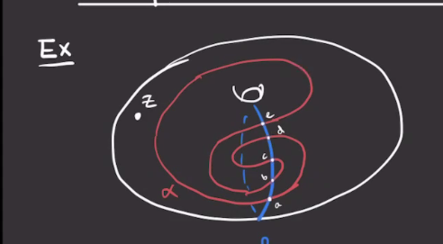

Here we have $g=1$ and so \( \Sym^1(T^2) = T^2 \), and \( \alpha \intersect \beta = \ts{ a,b,c,d,e } \).
So \( \hat{\CF}( \Sigma, \alpha, \beta, z) = \ZZ/2 \gens{ a,b,c,d,e }  \).

First mark the component that contains the base point $z$ and give it a coefficient of zero:

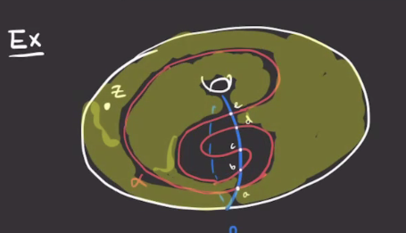

We can make this part bigger, and find that there are only two bigons involving $a$.

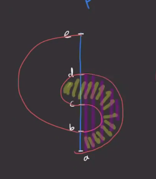

This is because starting at a point and following the orientation should yield red first and then blue, matching up with the orientation on the disc.

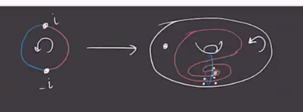

So $\bd a = {\color{yellow} b} + {\color{purple} d}$, since we require 90 degree corners.
Similarly, 

- \( \bd e = b + d \) 
- \( \bd b = c \) 
- \( \bd d = c \) 
- \( \bd c = 0 \) 

We can simplify this information with a graph with arrows pointing toward boundaries:

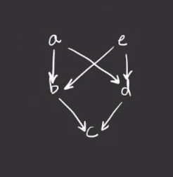

Then any linear combination with the same image will have zero boundary, so we have
\[
\ker \bd &= \gens{ a + e, b + d, c } \\
\im \bd &= \gens{ b+d, c } 
,\]
and thus $\hat{\HF}(\Sigma, \alpha, \beta, z) = \ZZ/2$.
:::

:::{.example title="?"}

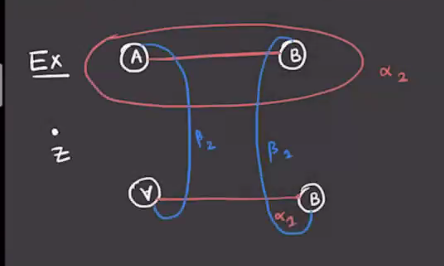

Drawing this on a surface yields the following:

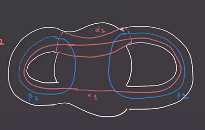

One useful trick here is labeling the points along one curve with letters and the other with numbers.
Another is making a table like the following:

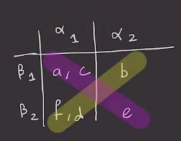

From this it's easy to read off the 4 possible generators \( \ts{ ae, ce, bf, bd } \).
The regions the contain $z$ can be seen in the latter picture:

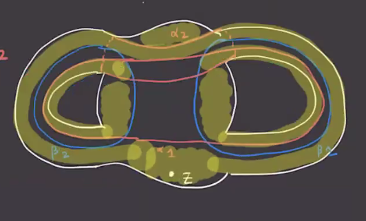

Translating this to the original picture yields these regions:

Note that the half-bigons in the diagram actually pair to a bigon on the surface, so consider this simplified drawing of the surface:

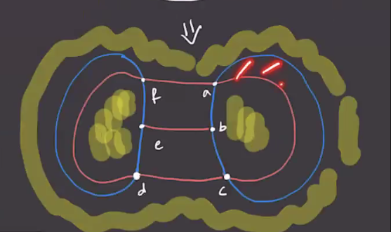

- For the bigon from $a \to c$, we can get $ae\to ce$ using the embedding
\[
\DD \mapsvia{u} \Sigma\injects \Sym^2( \Sigma)
.\]

- For the bigon $d\to f$, we get $bd\to bf$.

Setting $D_1 = D( \varphi)$ for \( \varphi\in \pi_2( ae, bf ) \), we have $\mu( \varphi) = 1$ since we showed that rectangular regions have Maslov index 1.
Are there any holomorphic representatives?
The claim is that \( \# \hat{\mathcal{M}}( \varphi) \).
Checking boundaries yields the following:

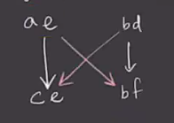

Then
\[
\ker \bd &= \gens{ ce, bf } \\ 
\im \bd &= \gens{ ce + bf } \\ 
&\implies \hat{HF}(\Sigma, \alpha, \beta, z) \cong \ZZ
.\]
This is good, since some valid moves will make this into a standard diagram for $S^3$ (?).
:::

:::{.remark}
Recall that given a rectangle, there is a 2-to-1 branched cover:

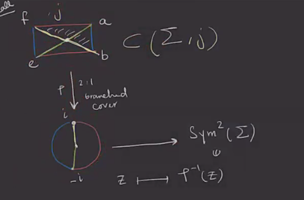

Such branched coverings bijectively correspond to biholomorphic involutions
\[
a &\mapstofrom e \\
b &\mapstofrom f
.\]

This is because there is a unique involution exchanging them by the Schwarz lemma, since any pole of the involution must lie along the line connecting points it exchanges, and exchanging each pair of corners in the rectangle forces to pole to be precisely the point in the center of the rectangle.
So these correspond got biholomorphic involutions of $\DD$ using complex analysis.
:::

:::{.remark}
Next week: more about the Maslov index and $\Spinc$ structures, then invariance under diagram moves.
:::
