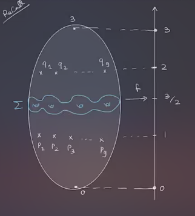
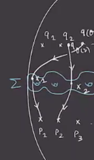
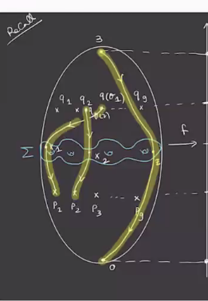

# Maslov Grading and $\Spinc$ Structures (Tuesday, March 16)

:::{.remark}
Let $M\in \Mfd^3(\RR)$ be a closed oriented 3-manifold and \( \mathcal{H} = (\Sigma, \alpha, \beta, z)  \) a Heegaard diagram for $M$.
Letting $b_i$ be the Betti numbers, note that $b_1 = 0 \iff M \in \QHS^3$ is a rational homology 3-sphere, i.e. $H_i(M; \QQ) \cong H_i(S^3; \QQ)$ for all $i$.
This also implies that $H_2(M; \ZZ) = 0$.
Under this condition, we can define a **relative $\ZZ\dash$grading** 
(i.e. we have a difference of grading between any two elements) on $\hat{CF}$ in the following way: for $x, y$ two generators, we set 
\[
\gr(x) - \gr(y) \da \mu( \varphi) -2n_z( \varphi) && \text{for some } \varphi\in \pi_2(x,y)
.\]

Recall that $\mu(\wait)$ denotes the Maslov index, $n_z( \wait)$ is the local multiplicity of a Whitney disc at $z$, and  $x, y$ denote tuples of points.
:::

:::{.remark}
This involves a choice of disc, so why is it well-defined?
We'll also see why we need $M\in \QHS^3$.
:::

:::{.proof title="of well-definedness"}
Let \( \varphi, \varphi' \in \pi_2(x, y) \).
We have 
\[
\varphi \ast (-\varphi') \in \pi_2(x, x) = \ZZ \oplus H_2(M) = \ZZ \oplus 0
,\]
so this is some multiple $kS$ where $S$ is the positive generator of \( \pi_2\Sym^g \Sigma \).
So 
\[
\mu( \varphi \ast (- \varphi') ) = \mu( \varphi) - \mu( \varphi') = k \mu(S) = 2k
.\]
Similarly,
\[
n_z( \varphi \ast (- \varphi')) = n_z( \varphi) - n_z( \varphi') = k n_z(S) = k
,\]
where we've used \( \mu(S) = 2, n_z(S) = 1 \).
Then
\[
\mu( \varphi) - \mu ( \varphi') 
&= 2( n_z( \varphi) - n_z( \varphi') ) \\
\implies
\mu( \varphi) - 2n_z( \varphi) 
&= \mu( \varphi') - 2 n_z( \varphi')
.\]
:::

:::{.remark}
Note that the relative grading is only defined if $\pi_2(x, y) \neq \emptyset \iff \eps(x, y) = 0 \in H_1(M; \ZZ)$.
This generated an equivalence relation of elements in $\TT_{ \alpha} \intersect \TT_{ \beta}$ by $x\sim y \iff \eps(x, y) = 0$, so we have a decomposition
\[
\hat{CF}( \mathcal{H} ) = \bigoplus _{?} \hat{CF}( \mathcal{H}, ?)  
.\]
which is preserved by $\bd$, so $\hat{HF}(\mathcal{H})$ will split similarly as 
\[
\hat{HF}( \mathcal{H} ) = \bigoplus _{?} \hat{CF}( \mathcal{H}, ?)  
.\]

It turns out that the right thing to replace the "?" with will be \( \Spinc \) structures.
:::

## $\Spinc$ Structures

:::{.remark}
We'll discuss Turaev's (?) reformulation of $\Spinc$ structure for $\Mfd^3$.
Note that $\chi(M) = 0$, so there exists nowhere vanishing vector fields on $M$ by Poincaré-Hopf.
:::

:::{.definition title="?"}
Let $v_1, v_2$ be nowhere vanishing vector fields on $M$.
We say 
\[
v_1 \sim v_2
\iff \ro{v_1}{M\sm B} \homotopic \ro{v_2}{M\sm B}
,\]
i.e. their restrictions to $M\sm B$ are homotopic, and here $B$ is a 3-ball in $M$.
Equivalently, $v_1\sim v_2 \iff v_1, v_2$ are homotopic in the complement of finitely many 3-balls in $M$.
:::

:::{.definition title="$\Spinc$ Structures"}
\[
\Spinc(M) \da \ts{ \text{Nowhere vanishing vector fields on } M }_{/\sim}
.\]
:::

:::{.definition title="?"}
Let \( \mathcal{H} = ( \Sigma, \alpha, \beta, z)  \) be a Heegard diagram for $M$, then define a map
\[
S_z: \TT_{ \alpha} \intersect \TT_{\beta} \to \Spinc(M)
.\]

**Step 1**:
Choose a self-indexing Morse function $f$ with $\# \Crit^0(f) = \# \Crit^3(f) = 1$ such that its corresponding Heegaard diagram is \( \mathcal{H}  \):

Note that we have a surface in \( f ^{-1} (3/2) \) and there are exactly $q$ critical points along each of \( f ^{-1} (1), f ^{-1} (2) \).
For each \( x = \ts{ \elts{x}{g} } \intersect \TT_{ \alpha} \intersect\TT_{\beta} \), we have \( x_i \in \alpha_i \intersect \beta_{\sigma(i)} \) for some permutation \( \sigma\in S_g \) 
Then \( \alpha\mapsto p_i \) and \( \beta_{\sigma(i)} \mapsto q_{\sigma(i)} \):

Trajectories of $-\gradient f$ that pass through $\elts{x}{g}$ are $g$ pairwise disjoint arcs connecting \( \elts{q}{g} \) to \( \elts{p}{g} \), so there is a one-to-one correspondence between these intersection points.

Now taking tubular neighborhoods of the $g+1$ disjoint arcs yields $g+1$ pairwise disjoint 3-balls in $M$, so write this as $B\da B_1 \coprod \cdots \coprod B_{g+1}$.

Note that 

- \( -\gradient f \) does not vanish in $M \sm B$.

- $- \gradient f$ can be extended to a nowhere vanishing vector field on $M$

:::{.exercise title="?"}
Show this!

*Hint: the trajectories of \( -\gradient f \) in each ball connect critical points of different parities, and so each \( \ro{-\gradient f }{\bd B_i } \) has index zero.*
:::

Define \( S_z(x) \in \Spinc(M) \) to be the equivalence class represented by this vector field.
This is well-defined since outside of the finitely many balls, this vector field is just equal to \( -\gradient f \).
:::

:::{.exercise title="?"}
Show that this does not depend on which Morse function is chosen.
:::

:::{.proposition title="?"}
There is a one-to-one correspondence
\[
\Spinc(M) \mapstofrom H^2(M; \ZZ)
.\]
Picking a trivialization $\tau: TM \to M \cross \RR^3$ and a Riemannian metric on $M$, then
\[
\correspond{
  \text{Nowhere vanishing vector fields} \\
  \text{on } M
}
&\mapstofrom
\correspond{
  \text{functions } f: M\to S^2
} \\
v:M\to \RR^3\smz &\mapsto 
x \mapsvia{f_v} \hat{\vector v_x}
\]
:::

:::{.definition title="?"}
Let \( \alpha\in H^2(S^2; \ZZ) \) be the positive generator, then define
\[
\delta^{ \tau} (v) \da f_v^*( \alpha) \in H^2(M; \ZZ)
.\]
Note that if $v_1 \sim v_2$,  we have $\delta^{ \tau}(v_1) = \delta^{ \tau}(v_2)$ since they are homotopic on the complement of a ball:
\[
M\sm B \injectsvia{i} M \mapsvia{f_v} S^2
.\]
Conclude that 
\[
(f_{v_1} \circ i)^* ( \alpha) = (f_{v_2} \circ i)^* (\alpha)
,\]
$i^*$ is an isomorphism, so $f_{v_1}^*( \alpha) = f_{v_2}^* ( \alpha)$, yielding the identification.

:::

:::{.exercise title="?"}
\envlist

1. Show that \( \delta^{ \tau} \) is a bijection.

2. \( \delta(v_1, v_2) \da \delta^{ \tau}(v_1) - \delta^{ \tau}(v_2) \in H^2(M; \ZZ) \) is well-defined and independent of the choice of \( \tau \), and satisfies
\[
\delta(v_1, v_2) + \delta(v_2, v_3) = \delta(v_1, v_3)
.\]

Thus we also have a relative map
\[
\Spinc(M) &\mapstofrom H^2(M; \ZZ)\\
s_1, s_2 \da [v_1] - [v_2] &\mapsto s_1 -s_2 \da \delta(v_1, v_2)
.\]
:::
