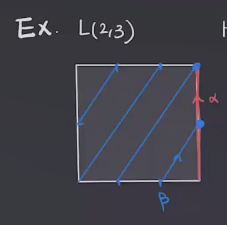
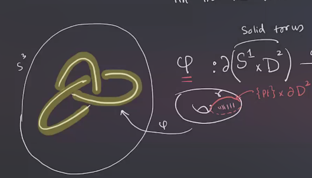
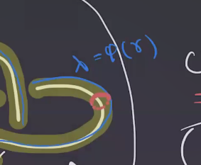
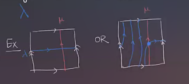

# Tuesday, March 30

## $L\dash$spaces

\todo[inline]{Missing lecture}

:::{.remark}
Today: $L\dash$spaces and the surgery exact triangle.
We've been loosely following [@OS-1], references for upcoming topics include [@OS-2] and Jen Hom's survey [@H].
:::

:::{.remark}
Recall that we were discussing $\HF^-(M, s)$ for $M\in \Mfd^3(\RR)$ and $s$ a $\Spinc$ structure, and if $M\in \QHS$ this decomposes as $\ZZ/2[u] \oplus \qty{\bigoplus_i {\ZZ/2[u] \over \gens{u^{}n_i} }} \da \ZZ/2[u] \oplus \HF_\red(M, s)$.
The Maslov grading of $1$ in the first summand is the **$d\dash$invariant**, $d(M, s)$.
If one defines \( d(M) \da \sum_{s\in \Spinc(M)} d(M, s) \), then $d: \Theta^3_\QQ \to \QQ$ is a group homomorphism.
We want to talk about $X\in \Mfd^3$ which have the "simplest" Floer theory, in the sense that the torsion summand above vanishes.
:::

:::{.definition title="?"}
A manifold $M\in\QHS^3$ is an **$L\dash$space** if $\HF_\red(M, s) = 0$, which happens if and only if $\HF^-(M, s) = \ZZ/2[u]$.
:::

:::{.remark}
Recall that there is an exact triangle

\begin{tikzcd}
	{\HF^-(M, s)} && {\HF^-(M, s)} \\
	\\
	& {\hat\HF-(M, s)}
	\arrow["{\cdot u}", tail reversed, from=1-1, to=1-3]
	\arrow["p", from=1-3, to=3-2]
	\arrow["0", from=3-2, to=1-1]
\end{tikzcd}

> [Link to Diagram](https://q.uiver.app/?q=WzAsMyxbMCwwLCJcXEhGXi0oTSwgcykiXSxbMiwwLCJcXEhGXi0oTSwgcykiXSxbMSwyLCJcXGhhdFxcSEYtKE0sIHMpIl0sWzAsMSwiXFxjZG90IHUiLDAseyJzdHlsZSI6eyJ0YWlsIjp7Im5hbWUiOiJhcnJvd2hlYWQifX19XSxbMSwyLCJwIl0sWzIsMCwiMCJdXQ==)

Since multiplication by $u$ is injective, we obtain 
\[
\hat{\HF} = \im p \cong {\HF^-(M, s) \over \ker p} \cong {\ZZ/2[u] \over u \ZZ/2[u] } \cong \ZZ/2
.\]

:::

:::{.exercise title="?"}
So $\HF^-(M, s) \cong \ZZ/2[u] \implies \hat{\HF}(M, s) \cong \ZZ/2$.
Show the converse is also true.
:::

:::{.corollary title="?"}
$M$ is an $L\dash$space if and only if $\hat{\HF}(M, s) \cong \ZZ/2$ for all $s\in \Spinc(M)$.
This happens if and only if $\rk_{\ZZ[u]} \hat{\HF}(M, s) = 1$, if and only if $\# \Spinc(M) = \# H^2(M) \equalsbecause{\PD} \# H^1(M)$, which is finite for $\QHS$.
:::

:::{.corollary title="?"}
Any $M\in \QHS^3$ is an $L\dash$space if and only if $\rk_{\ZZ[u]} \hat{\HF}(M) = \# H^1(M)$.
:::

:::{.remark}
Note that we've proved the forward implication but not the reverse.
This is sometimes used as a definition in talks!

Sketch of the proof ($\impliedby$):
A computation will show that \( \chi \hat{\HF}(M, s) = \pm 1 \) for all $s$, since the grading can be shifted.
This is proved in [@OS-2 p.33], and is the main ingredient in this proof.
This implies that $\rk \hat{\HF}(M, s) \geq 1$, and so adding all summands yields \( \rk \hat{\HF}(M) \geq \# H_1(M)\).
This implies that \( \hat\HF(M, s) \cong \ZZ/2 \) for all $s$, making $M$ an $L\dash$space.
:::

:::{.remark}
Here note that $C_*$ is $\ZZ/2\dash$graded, as is $(\hat \CF(M), \bd)$, so we define $\chi(C_*) = \rk C_0 - \rk C_1$.
Since we have a relative $\ZZ\dash$grading given by $\mu$, we get a relative $\ZZ/2\dash$grading given by \( \gr_{\ZZ/2}(x, y) = \gr_\ZZ(x, y) \), which gives us $\chi \hat{\HF}(M)$ up to sign.
:::

:::{.example title="?"}
We have seen lens spaces, here's an example of $L(2, 3)$:

Here $\hat\HF L(2, 3) \cong (\ZZ/2)^{\oplus 2}$ and $\rk \hat\HF L(2, 3) = 2 = \# H_1(L(2, 3); \ZZ/2)$.
:::

:::{.example title="?"}
In general, every $L(p, q)$ is a lens space, hence the name!
Note that $H_1(L(p, q)) \cong \ZZ/p$ is not a $\ZHS^3$.
:::

:::{.example title="?"}
A Poincaré homology sphere $\pm P^3$ (with either the standard orientation or its reverse) will be an $L\dash$space.
:::

:::{.conjecture}
Poincaré-type conjecture in Heegard Floer homology:
the only irreducible $\ZHS^3$ $L\dash$spaces are $S^3$ and $\pm P^3$.
Still open!
:::

:::{.remark}
So $\hat\HF$ can detect these two among all integral homology spheres using $\hat\HF$.
:::

## Surgery

:::{.definition title="Dehn Surgery"}
Let $K \subseteq M \in \Mfd^3$ be a knot, i.e. the image of an embedding $S^1 \embeds M$.
Remove a tubular neighborhood of $K$, and set $X = M\sm \nu(K)$.
Fill in the torus boundary with a solid torus $S^1 \cross \DD^2$ using a diffeomorphism
\[
\phi: \bd(S^1 \cross \DD^2) \mapsvia{\text{diffeo}} \bd X
.\]

Any surgery will be determined by the image of the red circle \( \gamma \da \pt \cross \bd\DD^2 \) in the following:

So $\phi$ is determined by $\phi( \gamma)$, and in fact only depends on its class in homology since $\pi_1T^2 = H_1T^2$.
If $\phi ( \gamma) = \lambda$, we denote the resulting manifold as $M_{\lambda}(K)$, the **Dehn surgery on $K$**.
:::

:::{.definition title="Meridian and Longitude"}
A **meridian** $\mu$ of $K$ will be a simple closed curve on $\bd X$ that bounds a disk in the tubular neighborhood $\nu(K)$:

Here we orient $\mu$ on the boundary of this disk.

A **longitude** will be a nullhomotopic simple closed curve such that $\#( \mu \intersect \lambda) = -1$.
For example:

?
:::

:::{.observation}
\envlist

- $\lambda$ is not unique, i.e. $\lambda + n\mu$ will again be a longitude for all $n\in \ZZ$.

- $\mu, \lambda$ is a basis for $H_1(\bd X)$, so any simple closed curve $\gamma$ is a $\ZZ\dash$linear combination of them: 
\[
[ \gamma] = a [ \mu] + b [ \lambda], && a,b\in \ZZ
.\]
:::

:::{.definition title="?"}
A knot $K$ along with a choice of longitude $\lambda$ is called a **framed knot**.
:::

:::{.remark}
This allows us to specify Dehn surgeries by a rational number.
:::

:::{.definition title="?"}
Let $K$ be a framed knot, then $M_{p\over q}(K) = M_{\gamma}(K)$ where \( [\gamma] = p [\mu] + q[ \lambda] \).
We'll use the notation \( \gamma = p\mu + q\lambda \).
:::

:::{.definition title="?"}
If $K$ is nullhomologous, for example when $M = S^3$ since $H^1S^3 = 0$, there is a canonical choice for \( \lambda \) by assuming that

- $\lambda$ is nullhomologous in $X = M \sm \nu(K)$
- Equivalently, $\lk(K, \lambda) = 0$.

This longitude is called the **Seifert framing**.
:::

:::{.exercise title="?"}
Show this equivalence,
and find the Seifert framing for the trefoil in $S^3$.
:::

:::{.example title="?"}

- $S^3_{p/q}(U) = L(p, q)$ for $U$ the unknot.
- $S^3_{\infty }(K) \da S^3_{1\over 0}(K) = S^3$.
- $S^3_{0} \da S^3_{0\over 1} = S^1 \cross S^2$
- $S^3_{+1}(T_{2, 3}) = P^3$ (torus knot).

:::

:::{.theorem title="Gordan-Leuke, '80s"}
IF $K\neq U$ and ${p\over q} \neq \infty$, then $S_{p\over q}^3(K) \neq S^3$.
:::

:::{.remark}
Can we get everything 3-manifold this way, as surgery on a knot?
The answer is no, but yes if you allow *links*!
:::

:::{.theorem title="Lickorish-Wallace"}
There is a bijection
\[
\correspond{
M\in \Mfd^3 \st \text{closed, oriented, connected}
}
&\mapstofrom
\correspond{
\text{Integer $\pm 1$ surgeries on links in $S^3$}
}
\]

:::

