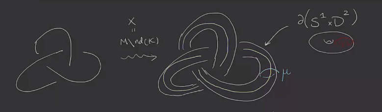
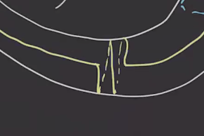
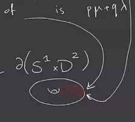
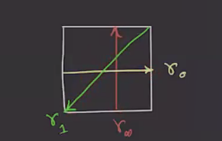

# Tuesday, April 06

## Surgery Exact Triangle

:::{.definition title="Surgery on a Knot"}
Recall that for $K \subseteq M^3$ a knot, surgery on $K$ involves the following:
take a tubular neighborhood of $K$, $\nd(K)$, and set $X \da M \sm \nd(K)$, whose boundary is a solid torus $S^1 \cross \DD^2$:

Take a basis for its homology:

- $\mu$ to be a meridian of $K$, which bounds a disc in $M^3$.
- $\lambda$ to be a meridian of $K$ with $\#(\mu \intersect \lambda) = -1$.
  Note that there are many choices, we can wind many times:

We can then write any simple closed curve $\gamma$ as $[\gamma] = p[\mu] + q[\lambda]$, where for shorthand we'll just write \( \gamma= p \mu + q \lambda \).
We'll refer to the pair $(K, \lambda)$ as a **framed knot** and the corresponding surgery as $M_{p\over q}(K)$, which is surgery on $K$ such that the following curve is $p\mu + q\lambda$:

We'll write $M_{ \lambda}(L) = M_0(K)$ for the surgery that sends \( \lambda \) to this curve instead, since this corresponds to $p=0, q=1$.
:::

:::{.definition title="Triad of 3-Manifolds"}
Suppose \( \gamma_0, \gamma_1, \gamma_{\infty }\) are oriented simple closed curves on \( \bd X = M - \nd(K) \) such that 
\[
-1 = \#( \gamma_0 \intersect \gamma_1) = \#( \gamma_1 \intersect \gamma_{\infty }) = \#( \gamma_{\infty } \intersect \gamma_0)
,\]
and we have a cyclic ordering 

\begin{tikzcd}
	& {\gamma_0} \\
	\\
	{\gamma_\infty} && {\gamma_1}
	\arrow["{-1}", curve={height=-12pt}, from=1-2, to=3-3]
	\arrow["{-1}", curve={height=-18pt}, from=3-3, to=3-1]
	\arrow["{-1}", curve={height=-12pt}, from=3-1, to=1-2]
\end{tikzcd}

> [Link to Diagram](https://q.uiver.app/?q=WzAsMyxbMSwwLCJcXGdhbW1hXzAiXSxbMiwyLCJcXGdhbW1hXzEiXSxbMCwyLCJcXGdhbW1hX1xcaW5mdHkiXSxbMCwxLCItMSIsMCx7ImN1cnZlIjotMn1dLFsxLDIsIi0xIiwwLHsiY3VydmUiOi0zfV0sWzIsMCwiLTEiLDAseyJjdXJ2ZSI6LTJ9XV0=)

Then writing $M_{i } \da M_{ \gamma_{i }}(K)$, the triple $(M_{\infty }, M_0, M_1)$ is a **tried of 3-manifold**.
:::

:::{.example title="?"}
Let \( \gamma_{\infty } = \mu, \gamma_0 = \lambda, \gamma_1 = a\mu - b\lambda \), and the punch line is that the third is determined by the other two.
What are $a$ and $b$?
We have
\[
\#(\gamma_0, \intersect \gamma_1) = \#( \lambda, a\mu + b \lambda) = -a \#(\mu \intersect \lambda) = (-1) a \implies a = -1 
\\ \\
\#( \gamma_1 \intersect \gamma_{\infty }) = \#( a \mu + b\lambda, \mu) = b \#(\lambda \intersect \mu) = b(1) = b \implies b = -1
.\]
We thus obtain the following picture, which has the curves arrange in a clockwise fashion:

Here we get the triad \( (M_{\infty }(K) = M, M_0(K), M_1(K) \).
:::

:::{.exercise title="?"}
Show that $(M, M_{-1}(K), M_0(K))$ is also a triad.
:::

:::{.example title="?"}
Let \( \lambda_{\infty } = p\mu + q\lambda \) and \( \lambda_0 = r\mu + s\lambda \), then
\[
-1 
&= \#( \gamma_{\infty } \intersect \gamma_0) \\
&= \#( p\mu + q \lambda, r \mu + s \lambda) \\
&= ps \#( \mu \intersect \lambda) + qr \# (\lambda \intersect \mu) \\
&= -ps + qr \\
&\implies qr - ps = 1
.\]

Similarly, 
\[
-1 = \#( \gamma_0 \intersect \gamma_1) &= sa -rb = -1 
\#( \gamma_1 \intersect \gamma_{\infty }) &= bp - aq = -1
.\]

:::

:::{.example title="?"}
Pick a framed knot $K$ (or really just a fixed longitude), then pick \( \gamma_{\infty } = \mu, \gamma_0 = p\mu + \lambda \).
Then \( \gamma_1 = (p+1) \mu + \lambda \), and we get the triad $M_{\mu}(K) = M, M_{\gamma_0}(K) = M_p(K), M_{p+1}(K)$.
:::

:::{.theorem title="?"}
Suppose $(M, M_0, M_1)$ is a triad, then there exist exact triangles:

\begin{tikzcd}
	{\hat\HF(M_0)} && {\hat\HF(M_1)} \\
	\\
	& {\hat\HF(M_\infty)}
	\arrow["{\hat{F}_0}", from=1-1, to=1-3]
	\arrow["{\hat{F}_1}", from=1-3, to=3-2]
	\arrow["{\hat{F}_\infty}", from=3-2, to=1-1]
\end{tikzcd}

> [Link to Diagram](https://q.uiver.app/?q=WzAsMyxbMCwwLCJcXGhhdFxcSEYoTV8wKSJdLFsyLDAsIlxcaGF0XFxIRihNXzEpIl0sWzEsMiwiXFxoYXRcXEhGKE1fXFxpbmZ0eSkiXSxbMCwxLCJcXGhhdHtGfV8wIl0sWzEsMiwiXFxoYXR7Rn1fMSJdLFsyLDAsIlxcaGF0e0Z9X1xcaW5mdHkiXV0=)

:::

:::{.remark}
Here exactness means that e.g. $\ker(\hat{F}_1 = \im( \hat{F}_0)$.
There is a similar triangle for $\HF^+$, as well as $\HF^{\infty }$ and $\HF^-$, although these are more complicated.
However, $\HF^-$ becomes easier to work with when one is looking at knot invariants instead.
:::

:::{.example title="?"}
Let $K$ be the unknot in $S^3$, and take as before \( (S^3, S_0^3(K) = S^1 \cross S^2, S_{+1}^3(K) = S^3 \).
We get the exact triangle

\begin{tikzcd}
	{\hat\HF(S^3)= \ZZ/2 } && {\hat\HF(S^1 \cross S^2) = (\ZZ/2)^{\oplus 2}} \\
	\\
	& {\hat\HF(S^3) = \ZZ/2}
	\arrow["{\hat{F}_0}", hook, from=1-1, to=1-3]
	\arrow["{\hat{F}_1}", two heads, from=1-3, to=3-2]
	\arrow["{\hat{F}_\infty = 0}", from=3-2, to=1-1]
\end{tikzcd}

> [Link to Diagram](https://q.uiver.app/?q=WzAsMyxbMCwwLCJcXGhhdFxcSEYoU14zKT0gXFxaWi8yICJdLFsyLDAsIlxcaGF0XFxIRihTXjEgXFxjcm9zcyBTXjIpID0gKFxcWlovMilee1xcb3BsdXMgMn0iXSxbMSwyLCJcXGhhdFxcSEYoU14zKSA9IFxcWlovMiJdLFswLDEsIlxcaGF0e0Z9XzAiLDAseyJzdHlsZSI6eyJ0YWlsIjp7Im5hbWUiOiJob29rIiwic2lkZSI6InRvcCJ9fX1dLFsxLDIsIlxcaGF0e0Z9XzEiLDAseyJzdHlsZSI6eyJoZWFkIjp7Im5hbWUiOiJlcGkifX19XSxbMiwwLCJcXGhhdHtGfV9cXGluZnR5ID0gMCJdXQ==)

:::

:::{.lemma title="?"}
Suppose the following is an exact triangle of vector spaces for some cyclic ordering:

\begin{tikzcd}
	{V_0} && {V_1} \\
	\\
	& {V_{\infty}}
	\arrow["{f_1}", from=1-3, to=3-2]
	\arrow["{f_\infty}", from=3-2, to=1-1]
	\arrow["{f_0}", from=1-1, to=1-3]
\end{tikzcd}

> [Link to Diagram](https://q.uiver.app/?q=WzAsMyxbMCwwLCJWXzAiXSxbMiwwLCJWXzEiXSxbMSwyLCJWX3tcXGluZnR5fSJdLFsxLDIsImZfMSJdLFsyLDAsImZfXFxpbmZ0eSJdLFswLDEsImZfMCJdXQ==)

Then 
\[
V_{\infty } = V_0 \oplus V_1 \iff \rk V_{\infty } = \rk(V_0) + \rk(V_1)
,\]
and if $f_0 = 0$ then $f_1$ is injective and $f_{\infty }$ is surjective.
:::

:::{.proof title="?"}
\[
\rk V_{\infty } 
&\cong \rk \ker f_{\infty } \bigoplus \rk \im f_{\infty } \\
&= \rk \im f_1 \oplus \im f_{\infty } \\
&\leq \rk V_1 + \rk V_0
.\]
Equality holds if and only if $\rk V_1 = \rk \im f_1$, which implies $f_1$ is injective, and similarly $\rk V_0 = \rk \im f_{\infty } \implies f_{\infty }$ is surjective.
These together would imply that $f_0 = 0$.
:::

:::{.example title="?"}
For $K$ the unknot in $S^3$, take the triad \( (S^3, S^3_p(K) = L(p, 1), L(p+1, 1) \).
This yields the exact triangle

\begin{tikzcd}
	{\hat{\HF}(S^3)=\ZZ/2} && {\hat{\HF}(L(p, 1))=(\ZZ/2)^{\oplus p}} \\
	\\
	& {\hat{\HF}(L(p+1, 1))=(\ZZ/2)^{\oplus p+1}}
	\arrow["{f_1}", hook', from=1-3, to=3-2]
	\arrow["{f_\infty}", two heads, from=3-2, to=1-1]
	\arrow["{f_0=0}", from=1-1, to=1-3]
\end{tikzcd}

> [Link to Diagram](https://q.uiver.app/?q=WzAsMyxbMCwwLCJcXGhhdHtcXEhGfShTXjMpPVxcWlovMiJdLFsyLDAsIlxcaGF0e1xcSEZ9KEwocCwgMSkpPShcXFpaLzIpXntcXG9wbHVzIHB9Il0sWzEsMiwiXFxoYXR7XFxIRn0oTChwKzEsIDEpKT0oXFxaWi8yKV57XFxvcGx1cyBwKzF9Il0sWzEsMiwiZl8xIiwwLHsic3R5bGUiOnsidGFpbCI6eyJuYW1lIjoiaG9vayIsInNpZGUiOiJib3R0b20ifX19XSxbMiwwLCJmX1xcaW5mdHkiLDAseyJzdHlsZSI6eyJoZWFkIjp7Im5hbWUiOiJlcGkifX19XSxbMCwxLCJmXzA9MCJdXQ==)

:::

:::{.remark}
Note that this gives a way to produce $L\dash$spaces.
:::

:::{.definition title="$L\dash$spaces"}
Any $M\in \QHS^3$ is called an **$L\dash$space** if 
\[
\rk \hat\HF(M) = \abs{ H_1(M; \ZZ) }
.\]
:::

:::{.example title="?"}
If $p, q$ are coprime then $\hat\HF L(p, q) = (\ZZ/2)^{\oplus p}$ since there is one $\Spinc$ class for each element of $H^1$.
So $\rk \hat\HF = p$, and on the other hand, $\abs{H_1} = \abs{\ZZ/p} = p$.
:::

:::{.exercise title="?"}
For any triad \( (M_{\infty }, M_0, M_1) \) there exists a cyclic reordering such that 
\[
\abs{ H_1(M_{\infty })} =
\abs{ H_1(M_{0})} =
\abs{ H_1(M_{1 })}
,\]
where we define
\[
\abs{ H_1(M) } =
\begin{cases}
\# H_1(M)  & \text{ if this is a finite group} 
\\
0 & \text{otherwise}.
\end{cases}
\]
:::

:::{.example title="?"}
For the triad \( (S^3, L(p, 1), L(p+1, 1)) \) we have 
\[
p+1 \abs{ H_1(L(p+1, 1) ) } = \abs{ H_1(S^3) } + \abs{ H_1( L(p, 1)) } = 1 + p
.\]
:::

:::{.remark}
This exercise is useful because it can be used to prove the following:
:::

:::{.lemma title="?"}
Suppose $(M, M_0, M_1)$ is a triad with an ordering fixed such that
\[
\abs{ H_1 M } = \abs{ H_1 M_0} + \abs{ H_1 M_1 }
.\]
If $M_0, M_1$ are $L\dash$spaces, then $M$ is also an $L\dash$space.
:::

:::{.proof title="?"}
We have the exact triangle

\begin{tikzcd}
	{\abs{H_1 M_0} = \rk\hat{\HF}(M_0)} && {\abs{H_1 M_1} = \rk\hat{\HF}(M_1)} \\
	\\
	& {\hat{\HF}(M_)}
	\arrow["{f_1}", from=1-3, to=3-2]
	\arrow["{f_\infty}", from=3-2, to=1-1]
	\arrow[from=1-1, to=1-3]
\end{tikzcd}

> [Link to Diagram](https://q.uiver.app/?q=WzAsMyxbMCwwLCJcXGFic3tIXzEgTV8wfSA9IFxccmtcXGhhdHtcXEhGfShNXzApIl0sWzIsMCwiXFxhYnN7SF8xIE1fMX0gPSBcXHJrXFxoYXR7XFxIRn0oTV8xKSJdLFsxLDIsIlxcaGF0e1xcSEZ9KE1fKSJdLFsxLDIsImZfMSJdLFsyLDAsImZfXFxpbmZ0eSJdLFswLDFdXQ==)

Thus 
\[
\rk \hat\HF M 
\leq \rk \hat\HF M_0 + \rk \hat\HF M_1 \\
&\leq \abs{ H_1 M_0} + \abs{ H_1 M_1 } \\
= \abs{ H_1 M }
.\]

In general, $\abs{ H_1 M} \leq \rk \hat \HF M$, so we get an equality \( \rk \hat \HF M = \abs{ H_1 M } \).
:::

:::{.example title="?"}
Let $K \subseteq S^3$ be a knot, and take the triad \( (S^3, S_p^3(K), S_{p+1}^3(K) \).
So if $S_p^3(K)$ is an $L\dash$space, so is $S_{p+1}^3(K)$.
Inductively this shows that $S^3_n(K)$ is an $L\dash$space for all $n\geq p$.
:::

:::{.example title="?"}
For $K = T_{p, q}$, the surgery $S^3_{pq-1}(T_{p, q})$ is a lens space.
Thus $S_n^3(T_{p, q})$ is an $L\dash$space for all $n\geq pq-1$.
:::
