# Surgery Exact Triangle and Knot Diagrams (Thursday, April 15)

:::{.remark}
Recall: let $(M, M_0, M_1)$ be a triple of 3-manifolds corresponding to a knot $K \subseteq M$, where $M_0$ is 0-surgery, $M_1$ is 1-surgery, and $M_{\infty}$ is $\infty\dash$surgery.
Here $M$ can be chosen such that
M

- $\gamma_{\infty }$ is a meridian of $K$,
- $\gamma_0$ is a longitude of $K$,
- $\gamma_1 = -\gamma_{\infty } -\gamma_0$

Then there exists an exact triangle:

\begin{tikzcd}
	{\hat{\HF}(M_0)} &&&& {\hat{\HF}(M_1)} \\
	\\
	\\
	&& {\hat{\HF}(M)}
	\arrow["{f_0}", from=1-1, to=1-5]
	\arrow["{f_1}", from=1-5, to=4-3]
	\arrow["{f = f_{\infty}}", from=4-3, to=1-1]
\end{tikzcd}

> [Link to Diagram](https://q.uiver.app/?q=WzAsMyxbMCwwLCJcXGhhdHtcXEhGfShNXzApIl0sWzQsMCwiXFxoYXR7XFxIRn0oTV8xKSJdLFsyLDMsIlxcaGF0e1xcSEZ9KE0pIl0sWzAsMSwiZl8wIl0sWzEsMiwiZl8xIl0sWzIsMCwiZiA9IGZfe1xcaW5mdHl9Il1d)

Our goal is to define $f: \hat{\HF}(M) \to \hat{\HF}(M_0)$.
:::

:::{.remark}
Note that $M$ admits a Heegard diagram
\[
( \Sigma_g, \vec{ \alpha} = [\alpha_1, \cdots, \alpha_g], \vec{ \beta} = [\alpha_1, \cdots, \alpha_g] )
\]
such that \( (\Sigma_g, \vec \alpha, [\beta_1, \cdots, \beta_{g-1}] \) is a "diagram" for $M - \nd(K)$.
Recall the notion of handlebodies, where each handle bounds a disc:

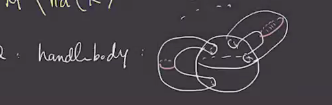

We can generalize this to a **compression body**: 

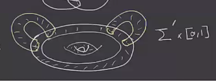

- Start with \( \Sigma'_{g'} \cross [0, 1] \).
- Attach a solid handle $K$ to \( \Sigma' \cross \ts{ 1 } \)

This yields a cobordism from \( \Sigma'_{g'} \cross \ts{ 0 } \) to \( \Sigma_{g' + k} \).
So we can write \( \bd C = \Sigma' \cross \ts{ 0 } \disjoint \Sigma \).
Label the curves bounding the embedded discs as \( \gamma_i \):

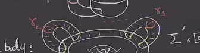

Then we can form a diagram \( (\Sigma_g, \ts{ \gamma_1, \cdots, \gamma_k } \) where $k\leq g$ will specify the compression body.
If these are pairwise disjoint simple closed curves that are linearly independent in $H_1( \Sigma )$, this will be a compression body from a surface with genus $g-k$ to \( \Sigma_g \).

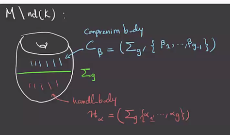

In this case, \( (\Sigma, \vec \alpha, \ts{ \beta_1, \cdots, \beta_{g-1} } \) will be a diagram for $M\sm \nd(K)$.

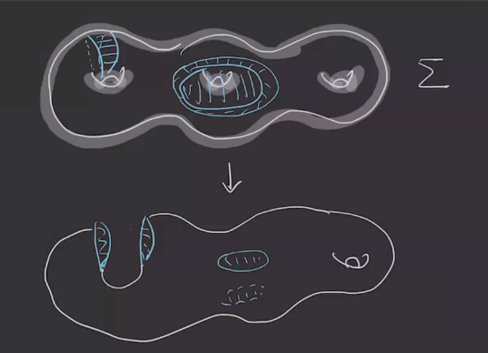
:::

:::{.example title="?"}
Consider $S^3 \sm\nd(T)$ for $T$ the trefoil.
Behold the beautiful trefoil:

After thickening, we obtain the following:

We can push the top down:

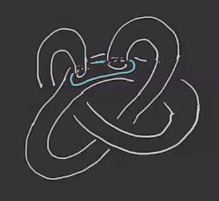

And wrap part of it around:

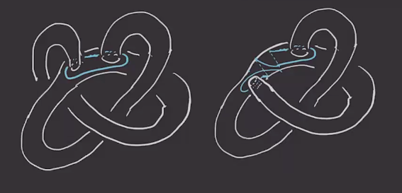

We can keep moving this to undo the crossing:

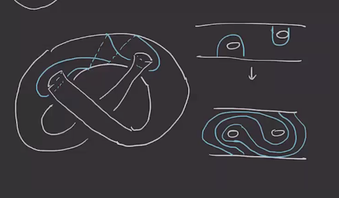

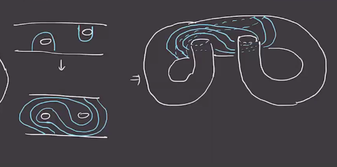

So the blue curve gets complicated, but the neighborhood of $T$ is a genus 2 surface, since the outer two circles bound discs.
So in summary, we have the following process:

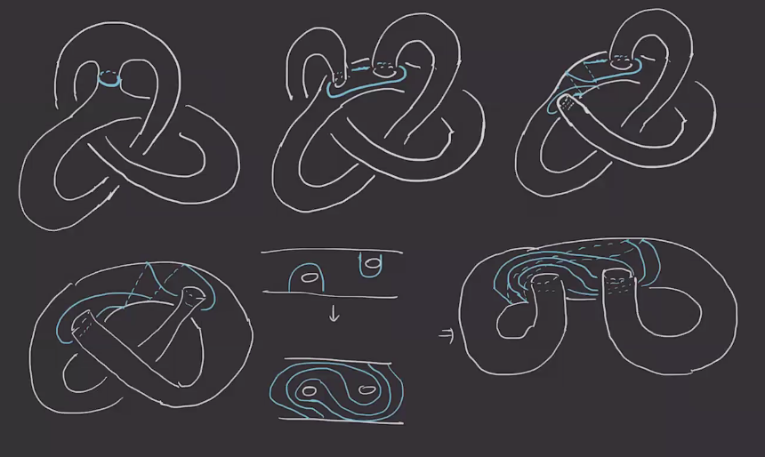

We can represent this with a planar picture:

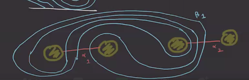

Following the longitude, we obtain:

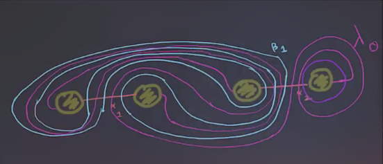

Here $\lambda$ has been wrapped twice, and to do $n\dash$surgery, we wrap $n$ times.

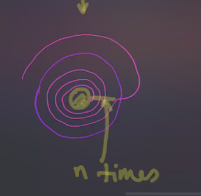

:::

:::{.exercise title="?"}
Draw a diagram for $S_n^3$ (the figure eight).
:::

