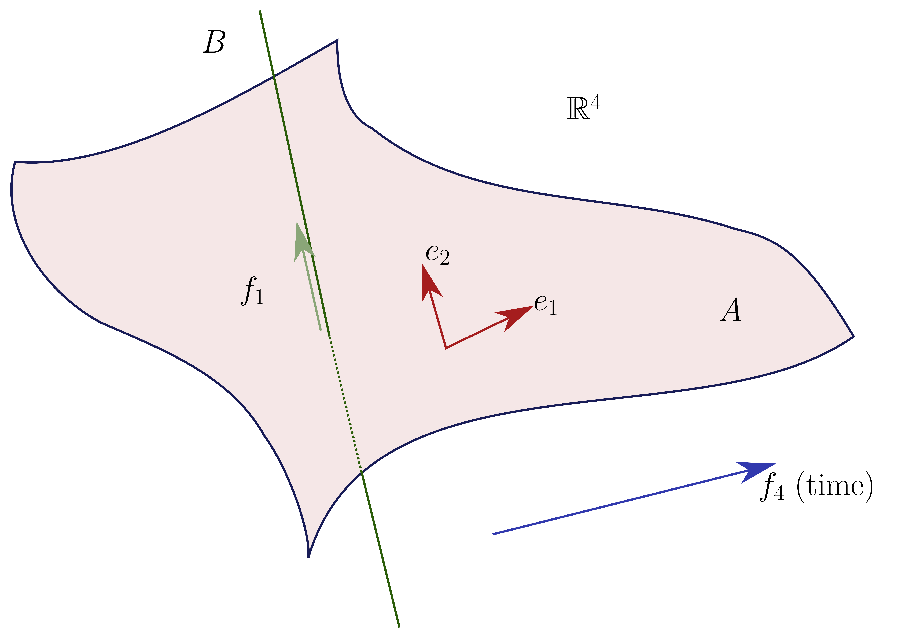

# Wednesday, February 03

Consider an oriented surface, and take two oriented submanifolds

\begin{tikzpicture}
\fontsize{39pt}{1em} 
\node (node_one) at (0,0) { \import{/home/zack/SparkleShare/github.com/Notes/Class_Notes/2021/Spring/FourManifolds/sections/figures}{2021-02-03_13-54.pdf_tex} };
\end{tikzpicture}

We can then take the fundamental classes of the submanifolds, say \( [\alpha], [\beta] \in H^1(X; \ZZ) \mapsvia{PD} H^1(X, \ZZ)\).
Here $T_p \alpha \oplus T_p \beta = T_p X$, since the intersections are transverse.
Since \( \alpha, \beta \) are oriented, let \( \ts{ e } \) be a basis of \( T_p \alpha \) (up to $\RR^+$) and similarly \( \ts{ f } \) a basis of \( T_p \beta \).
We can then ask if \( \ts{ e, f } \) constitutes an *oriented* basis of $T_pX$. 
If so, we write \( \alpha \cdot_p \beta \da +1 \) and otherwise \( \alpha \cdot_p \beta = - 1 \).
We thus have
\[
[ \alpha] \cupprod [ \beta] \in H^2(X; \ZZ) \mapsvia{PD} H_0(X; \ZZ) = \ZZ
\]
since $X$ is connected.
We can thus define the **intersection form** \( \alpha\cdot \beta\da [ \alpha] \cupprod [ \beta] \).
In general if $A, B$ are oriented transverse submanifolds of $M$ which are themselves oriented, we'll have \( [A] \cupprod [B] = [A \intersect B] \).
We need to be careful: how do we orient the intersection?
This is given by comparing the orientations on $A$ and $B$ as before.

:::{.example title="?"}
If $\dim M = \dim A + \dim B$, then any $p\in A \intersect B$ is oriented by comparing $\ts{ \mathrm{or}_A, \mathrm{or}_B}$ to $\mathrm{or}_M$.

\begin{tikzpicture}
\fontsize{45pt}{1em} 
\node (node_one) at (0,0) { \import{/home/zack/SparkleShare/github.com/Notes/Class_Notes/2021/Spring/FourManifolds/sections/figures}{2021-02-03_14-03.pdf_tex} };
\end{tikzpicture}

Here it suffices to check that \( \ts{ e, f_1, f_2 } \) is an oriented basis of $T_p M$.
:::

:::{.example title="?"}
In this case, \( [\alpha] \cupprod [\beta] = 0 \) and so \( \alpha\cdot \beta = 0 \):

\begin{tikzpicture}
\fontsize{44pt}{1em} 
\node (node_one) at (0,0) { \import{/home/zack/SparkleShare/github.com/Notes/Class_Notes/2021/Spring/FourManifolds/sections/figures}{2021-02-03_14-06.pdf_tex} };
\end{tikzpicture}

:::

:::{.remark}
Note that cohomology with $\ZZ$ coefficients can be defined for any topological space, and Poincaré duality still holds.
:::

:::{.remark}
We'll be considering $M = M^4$, smooth 4-manifolds.
How to visualize: take a 3-manifold and cross it with time!

<!--\begin{tikzpicture}-->
<!--\fontsize{42pt}{1em} -->
<!--\node (node_one) at (0,0) { \import{/home/zack/SparkleShare/github.com/Notes/Class_Notes/2021/Spring/FourManifolds/sections/figures}{2021-02-03_14-08.pdf_tex} };-->
<!--\end{tikzpicture}-->

Here $?$ is oriented in the "forward time" direction, and this is a surface at time $t=0$.
Where  $A\cdot B = +1$, since \( \ts{ e_1, e_2, f_1, f_2 } = \ts{ e_x, e_y, e_z, e_t } \)  is a oriented basis for $\RR^4$.
For $?^2$, switching the order of \( \alpha, \beta \) no longer yields an oriented basis, but in this case it is $?$ and $A\cdot B = B \cdot A$.
This is because
\[
A \da 
\begin{bmatrix}
0 &  1
\\
1 & 0 
\end{bmatrix}
\implies \det(A)
=-1 &&
\det 
\begin{bmatrix}
A &  
\\
 & A 
\end{bmatrix}
 = 1
.\]

:::

:::{.remark}
Let $M^{2n}$ be an oriented manifold, then the cup product yields a bilinear map $H^n(M; \ZZ) \tensor H^n(M; \ZZ) \to \ZZ$ which is symmetric when $n$ is odd and antisymmetric (or symplectic) when $n$ is even.
This is a **perfect** (or **unimodular**) pairing (potentially after modding out by torsion) which realizes an isomorphism:
\[
\qty{ H^n(M; \ZZ)/\tors}\dual &\mapsvia{\sim} H^n(M; \ZZ)/\tors \\
\alpha \cupprod \wait &\mapsfrom \alpha
,\]
where the LHS are linear functionals on cohomology.
:::

:::{.remark}
Recall the universal coefficients theorem:
\[
H^i(X; \ZZ)/\tors \cong \qty{ H_i(X; \ZZ)/\tors }\dual
.\]
The general theorem shows that $H^i(X; \ZZ)_\tors = H_{i-1}(X; \ZZ)_\tors$.
:::

:::{.remark}
Note that if $M$ is an oriented 4-manifold, then

% https://q.uiver.app/?q=WzAsMzYsWzAsMSwiSF4wIl0sWzIsMSwiMCJdLFszLDEsIlxcWloiXSxbNiwxLCJIXzAiXSxbOCwxLCIwIl0sWzksMSwiXFxaWiJdLFs4LDIsIkEiXSxbNiw1LCJIXzQiXSxbMCw1LCJIXjQiXSxbOCw1LCIwIl0sWzksNSwiXFxaWiJdLFszLDUsIlxcWloiXSxbMiw1LCIwIl0sWzIsMywiQSJdLFswLDMsIkheMiJdLFs4LDMsIkEiXSxbNiwzLCJIXzIiXSxbNiwyLCJIXzEiXSxbNiw0LCJIXzMiXSxbMCw0LCJIXjMiXSxbMCwyLCJIXjEiXSxbMiwyLCIwIl0sWzIsNCwiQSJdLFs4LDQsIjAiXSxbMiwwLCJcXHRvcnMiXSxbMywwLCJcXHRleHR7dG9yc2lvbmZyZWV9Il0sWzksMCwiXFx0ZXh0e3RvcnNpb25mcmVlfSJdLFs4LDAsIlxcdG9ycyJdLFszLDIsIlxcWlpee1xcYmV0YV8xfSIsWzAsNjAsNjAsMV1dLFs5LDQsIlxcWlpee1xcYmV0YV8xfSIsWzAsNjAsNjAsMV1dLFs5LDIsIlxcWlpee1xcYmV0YV8xfSIsWzMwMCw2MCw2MCwxXV0sWzMsNCwiXFxaWl57XFxiZXRhXzF9IixbMzAwLDYwLDYwLDFdXSxbMywzLCJcXFpaXntcXGJldGFfMn0iLFsyNDAsNjAsNjAsMV1dLFs5LDMsIlxcWlpee1xcYmV0YV8yfSIsWzI0MCw2MCw2MCwxXV0sWzQsM10sWzUsMywie30iXSxbMzQsMzUsIlBEIl1d
\begin{tikzcd}
	&& \tors & {\text{torsionfree}} &&&&& \tors & {\text{torsionfree}} \\
	{H^0} && 0 & \ZZ &&& {H_0} && 0 & \ZZ \\
	{H^1} && 0 & \textcolor{rgb,255:red,214;green,92;blue,92}{\ZZ^{\beta_1}} &&& {H_1} && A & \textcolor{rgb,255:red,214;green,92;blue,214}{\ZZ^{\beta_1}} \\
	{H^2} && A & \textcolor{rgb,255:red,92;green,92;blue,214}{\ZZ^{\beta_2}} & {} & {{}} & {H_2} && A & \textcolor{rgb,255:red,92;green,92;blue,214}{\ZZ^{\beta_2}} \\
	{H^3} && A & \textcolor{rgb,255:red,214;green,92;blue,214}{\ZZ^{\beta_1}} &&& {H_3} && 0 & \textcolor{rgb,255:red,214;green,92;blue,92}{\ZZ^{\beta_1}} \\
	{H^4} && 0 & \ZZ &&& {H_4} && 0 & \ZZ
	\arrow["PD", from=4-5, to=4-6]
\end{tikzcd}

In particular, if $M$ is simply connected, then $H_1(M) = \Ab(\pi_1(M)) = 0$, which forces $A = 0$ and $\beta_1 = 0$.
:::

:::{.definition title="Lattice"}
A **lattice** is a finite-dimensional free \(\ZZ\dash\)module $L$ together with a symmetric bilinear form
\[
\cdot: L^{\tensor 2} &\to \ZZ \\
\ell \tensor m &\mapsto \ell \cdot m
.\]
The lattice $(L, \cdot)$ is **unimodular** if and only if the following map is an isomorphism:
\[
L &\to L\dual \\
\ell &\mapsto \ell \cdot (\wait)
.\]
:::

:::{.remark}
How to determine if a lattice is unimodular: take a basis \( \ts{ e_1, \cdots, e_n } \)  of $L$ and form the *Gram matrix* $M_{ij} \da ( e_i \cdot e_j) \in \Mat(n\times n, \ZZ)^{\sym}$.
Then $(L, \cdot)$ is unimodular if and only if $\det(M) = \pm 1$ if and only if $M ^{-1}$ is integral.
In this case, the rows of \( M ^{-1} \)  will form a basis of the dual basis.
:::

:::{.definition title="Index of a lattice"}
The **index** of a lattice is $\abs{ \det M}$.
:::

:::{.exercise title="?"}
Prove that $\abs{\det M} = \abs{ L\dual / L }$.
:::

:::{.remark}
In general, for $M^{4k}$, the $H^{2k}/\tors$ is unimodular.
For $M^{4k+2}$, the $H^{2k+1}/\tors$ is a unimodular *symplectic* lattice, which is obtained by replacing the word "symmetric" with "antisymmetric" everywhere above.
:::

:::{.example title="?"}
For the torus, since the dimension is $2 \mod 4$, you get the skew-symmetric matrix 
\[
\begin{bmatrix}
0  & 1
\\
-1 & 0
\end{bmatrix}
.\]

\todo[inline]{Check!}

:::

:::{.definition title="Nondegenerate lattices"}
A lattice is **nondegenerate** if $\det M \neq 0$.
:::

:::{.definition title="Base change of lattices"}
The tensor product $L \tensor_\ZZ \RR$ is a vector space with an $\RR\dash$valued symmetric bilinear form.
This allows extending the lattice from $\ZZ^n$ to $\RR^n$.
:::

:::{.remark}
If $(L, \cdot)$ is nondegenerate, then Gram-Schmidt will yield an orthonormal basis \( \ts{ v_i } \).
The number of positive norm vectors is an invariant, so we obtain $\RR^{p, q}$ where $p$ is the number of $+1$s in the Gram matrix and $q$ is the number of $-1$s.
The **signature** of $(L, \wait)$ is $(p, q)$, or by abuse of notation $p-q$.
This is an invariant of the 4-manifold, as is the lattice itself $H^2(X; \ZZ)/\tors$ equipped with the intersection form.
:::

:::{.remark}
There is a perfect pairing called the **linking pairing**:

\[
H^i(X; \QQ/\ZZ) \tensor H^{n-i-1}(X; \QQ/\ZZ) \to \QQ/\ZZ
.\]

\begin{tikzpicture}
\fontsize{44pt}{1em} 
\node (node_one) at (0,0) { \import{/home/zack/SparkleShare/github.com/Notes/Class_Notes/2021/Spring/FourManifolds/sections/figures}{2021-02-03_14-43.pdf_tex} };
\end{tikzpicture}

:::

:::{.remark}
$A \cdot B \da \sum_{p\in A \intersect B} \sgn_p(A, B)$, where $A \transverse B$ and this turns out to be equal to the cup product.
This works for topological manifolds -- but there are no tangent spaces there, so taking oriented bases doesn't work so well!
You can also view 
\[
[A] \cupprod [\omega] = \int_A \omega
.\]
:::

