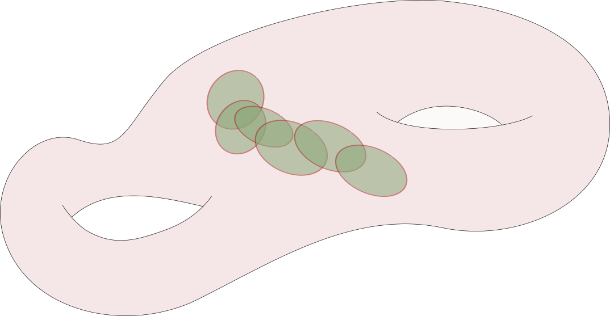

# Monday, February 08

Last time: $BG$ and $EG$.
See Milnor and Stasheff.

:::{.example title="?"}
Let $G \da \GL_n(\RR) = \RR\units$, then we can take 
\[
EG = \RR^{\infty } \da \ts{ (a_1, a_2, \cdots ) \st a_i \in \RR, a_{i\gg 0} = 0, a_i \text{ not all zero } }
.\]
Then $\RR\units$ acts on $EG$ by scaling, and we can take the quotient $\RR^{\infty } \smz / \RR\units$, where $\vector{a} \sim \lambda \vector {a}$ for all $\lambda \in \RR\units$.
This yields $\RP^{\infty }$ as the quotient.
You can check that $E_G$ is contractible: it suffices to show that $S^{\infty } \da \ts{ \sum \abs{a_i} = 1 }$ is contractible.
This works by decreasing the last nonzero coordinate and increasing the first coordinate correspondingly.
Moreover, local lifts exist, so we can identify $\RP^{\infty } \cong B\RR\units = BG$.
Similarly $BC\units \cong \CP^{\infty }$ with $E\CC\units \da \CC^{\infty } \smz$.
:::

:::{.example title="?"}
Consider $G = \GL_n(\RR)$.
It turns out that $BG = \Gr(d, \RR^{\infty })$, which is the set of linear subspaces of $\RR^{\infty }$ of dimension $d$.
This is spanned by $d$ vectors $\ts{e_ i}$ in some large enough $\RR^N \subseteq \RR^{\infty }$, since we can take $N$ to be the largest nonvanishing coordinate and include all of the vectors into $\RR^{\infty }$ by setting $a_{> N} = 0$.
For any $L \in \Gr_d(\RR^{\infty })$, since $\RR^d$ has a standard basis, there is a natural $\GL_d$ torsor: the set of ordered bases of linear subspaces.
So define 
\[
EG \da \ts{ \text{bases of linear subspaces } L \in \Gr_d(\RR^{\infty }) }
,\] 
then any $A\in \GL_d(\RR)$ acts on $EG$ by sending $(L, \ts{e_i}) \mapsto (L, \ts{ Le_i} )$.
We can identify $EG$ as $d\dash$tuples of linearly independent elements of $\RR^{\infty }$, and there is a map 
\[
EG &\to BG \\
\ts{e_i} &\mapsto \spanof_\RR \ts{e_i}
.\]
Thus there is a universal vector bundle over $BGL_d$:

\begin{tikzcd}
\mathcal{E}_L \da L 
  \ar[r] 
& 
\mathcal{E} 
  \ar[d] 
\\
& 
BGL_d
\end{tikzcd}

So \( \mathcal{E} \subseteq BGL_d \cross \RR^{\infty }  \), where we can define \( \mathcal{E} \da \ts{(L, p) \st p\in L}  \).
In this case, $EG = \Frame( \mathcal{E})$ is the frame bundle of this universal bundle. 
The same setup applies for $G \da \GL_d(\CC)$, except we take $\Gr_d(\CC^{\infty })$.
:::

:::{.example title="?"}
Consider $G = O_d$, the set of orthogonal transformations of $\RR^d$ with the standard bilinear form, and $U_d$ the set of unitary such transformations.
To be explicit:
\[
U_d \da \ts{ A \in \Mat(d \cross d, \CC) \st \inner{Av}{Av} = \inner{v}{v} }
,\]
where 
\[
\inner{ \thevector{v_1, \cdots, v_n}}{\thevector{v_1, \cdots, v_n } } = \sum \abs{v_i}^2
.\]
Alternatively, $A^t A = I$ for $O_d$ and $\conjugate{A^t} A = I$ for $U_d$.
In this case, $BO_d = \Gr_d( \RR^{\infty } )$ and $BU_d = \Gr_d( \CC^{ \infty })$, but we'll make the fibers smaller: set the fiber over $L$ to be 
\[
(EO_d)_L \da \ts{ \text{orthogonal frames of } L }
\]
and similarly $(EU_d)_L$ the unitary frames of $L$.
That there are related comes from the fact that $\GL_d$ retracts onto $O_d$ using the Gram-Schmidt procedure.
:::

:::{.remark}
Recall that there is a bijective correspondence
\[
\correspond{
  \text{Principal $G\dash$ bundles}
  \\ \text{on } X
}
&\mapstofrom
  [X, BG]
\]
and there is also a correspondence 
\[
\correspond{
  \text{Principal $\GL_d\dash$bundles }\\
  \text{on } X
}
&\mapstofrom
\correspond{
  \text{Principal $\OO_d\dash$bundles } \\
  \text{on } X
}
\]
Using the associated bundle construction, on the LHS we obtain vector bundles \( \mathcal{E}\to X  \) of rank $d$, and on the RHS we have bundles with a metric.
In local trivializations $U \cross \RR^d \to \RR^d$, the metric is the standard one on $\RR^d$.
This is referred to as a **reduction of structure group**, i.e. a principal $\GL_d$ bundle admits possibly different trivializations for which the transition functions lie in the subgroup $O_d$.
:::

:::{.example title="?"}
Given any trivial principal $G\dash$bundle, it has a reduction of structure group to the trivial group.
But the fact that the bundle is trivial may not be obvious.

<!--\begin{tikzpicture}-->
<!--\fontsize{41pt}{1em} -->
<!--\node (node_one) at (0,0) { \import{/home/zack/SparkleShare/github.com/Notes/Class_Notes/2021/Spring/FourManifolds/sections/figures}{forbidden_donut.pdf_tex} };-->
<!--\end{tikzpicture}-->

:::

:::{.remark}
We want to compute $H^*(BU_d; \ZZ)$.
Why is this important?
Given any complex vector bundle \( \mathcal{E}\to X  \) there is an associated principal $U_d$ bundle by choosing a metric, so we get a homotopy class $[X, BU_d]$.
Given any $f\in [X, BU_d]$ and any \( \alpha\in H^k(BU_d; \ZZ) \), we can take the pullback $f^* \alpha \in H^k(X; \ZZ)$, which are **Chern classes**.
:::

:::{.exercise title="?"}
Show that $H^*(BU_d; \ZZ)$ stabilizes as $d\to \infty$ to an infinitely generated polynomial ring $\ZZ[c_1, c_2, \cdots]$ with each $c_i$ in cohomological degree $2i$, so $c_i \in H^{2i}(BU_d, \ZZ)$.
:::

:::{.definition title="Chern class"}
There is a map $BU_{d-1} \to BU_d$, which we can identify as 
\[
\Gr_{d-1}(C^{\infty }) &\to \Gr_d(\CC^{\infty }) \\
\ts{v_1, \cdots, v_{d-1}} &\mapsto \spanof\ts{ (1, 0, 0, \cdots), sv_1, \cdots, sv_{d-1} }
.\]
This is defined by sending a basis where $s: \CC^{\infty } \to \CC^{\infty}$ is the map that shifts every coordinate to the right by one.

\todo[inline]{
  Question: does $\Gr_d(\CC^{\infty})$ deformation retract onto the image of this map?
}

This will yield a fiber sequence 
\[
S^{2d-1} \to BU_{d-1} \to BU_d
\] 
and using connectedness of the sphere and the LES in homotopy this will identify 
\[
H^*(BU_d) = H^*(BU_{d-1})[c_d] && \text{where } c_d \in H^{2d}(BU_d)
.\]
The **Chern class** of a vector bundle \( \mathcal{E}  \) , denoted \( c_k( \mathcal{E} )  \), will be defined as the pullback $f^* c_k$.
:::

