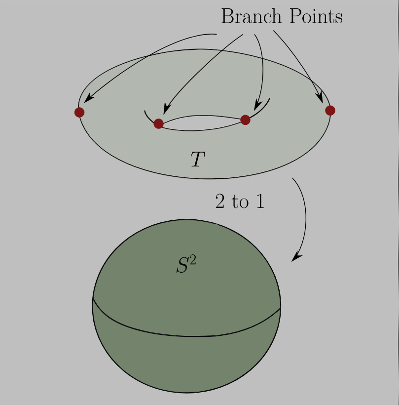

# Monday, February 22

:::{.remark}
Last time: Serre duality, and we'll review Riemann-Roch.
Recall that this depended on the statement that every holomorphic line bundle $L\to C$ for $C$ a complex curve is of the form $L = \OO(D)$ for some divisor $D$.
Then 
\[
\chi(C, L) = h^0(L) - h^1(L) = \deg L + 1 - g, && \deg L = \int_C c_1(L)
,\]
Serre duality said that the space of sections $H^1(C; L)$ is naturally isomorphic to $H^0(C, L ^{-1} \tensor \Omega_C^1)\dual$.
Notation: given $X \in \Mfd_\CC^n$ of complex,  dimension $n$, the **canonical bundle** is written $K_X \da \Omega_X^n$ and is the sheaf of holomorphic $n\dash$forms.
Serre duality will generalize: if \( \bundle{E}\to X \) is a holomorphic vector bundle, then $H^i(X; \bundle{E}) \cong H^{n-i}(X; \bundle{E}\dual \tensor K_X)\dual$.
Note that only $H^0, H^1$ are the only nontrivial degrees for a curve.
For 4-manifolds, we'll have an $H^2$ as well.
:::

## Applications of Riemann-Roch

:::{.proposition title="The 2-sphere has a unique complex structure"}
There is a unique complex $X\in \Mfd_\CC$ diffeomorphic to $S^2$.
:::

:::{.proof title="of proposition"}
Note existence is clear, since we can take $\CP^1 \da (\CC^2 \smz) / \vector x \sim \lambda\vector x$ for \( \lambda\in \CC\units \), which is identified as the set of complex lines through $0$ in $\CC^2$.
This decomposes as $\CC \union \CC = \ts{ [1, *] } \union \ts{ [*, 1] }$.
We now want to show that any two such complex manifolds are biholomorphic.
Let $X \in \Mfd_\CC^1$ with $X\cong_{C^{\infty }} S^2$, and consider for $p\in X$ the point bundle $\OO(p) \to X$.
The defining property was that there exists a section $s_p \in H^0(X; \OO(p) )$ which vanishes at first order at $p$:

\begin{tikzpicture}
\fontsize{43pt}{1em} 
\node (node_one) at (0,0) { \import{/home/zack/SparkleShare/github.com/Notes/Class_Notes/2021/Spring/FourManifolds/sections/figures}{2021-02-22_14-03.pdf_tex} };
\end{tikzpicture}

We have 
\[
\chi(X; \OO(p)) 
= \deg \OO(p) + 1 - g(x) = 1 + 1 - 0 = 2
.\]

:::{.exercise title="?"}
Check that $\deg \OO(p) = 1$.
:::

On the other hand we have
\[
\chi(X; \OO(p)) 
=
h^0(\OO(p)) - h^1( \OO(p) )
.\]

We have \( h^1( \OO(p) ) = H60( K \tensor \OO(-p) \), and $K_X = \Omega_X^1 = T\dual X$, so the question is:
what is the degree of $TX$ for $X\cong S^2$?
We need to compute $\int_X c_1(TX)$.
How many zeros does a vector field on the sphere have?
You can take the gradient vector field for a height function to get $2$, noting that the two zeros come in with a positive orientation

\begin{tikzpicture}
\fontsize{44pt}{1em} 
\node (node_one) at (0,0) { \import{/home/zack/SparkleShare/github.com/Notes/Class_Notes/2021/Spring/FourManifolds/sections/figures}{2021-02-22_14-10.pdf_tex} };
\end{tikzpicture}

In coordinates on $\CP^1$, the coordinate is given by $z$ and $z \dd{}{z} \mapsto -2 \dd{}{w}$ for the coordinate $w = 1/z$.
We get $\int_X c_1(TX) = 2$ and thus $\deg K_X = -2$ by dualizing.

:::{.fact}
$\deg K_X = 2g-2$.
Use the existence of a smooth vector field on $X$.
:::

:::{.lemma title="When h0 of a line bundle on a curve vanishes"}
If $\deg L < 0$ on $C$, thne $h^0(C, L) = 0$.
:::

:::{.proof title="of lemma"}
If $s\in H^0(C, L)$ is nonzero, then since $s$ is a holomorphic section,
\[
0 \leq \sum_{p\in C} \ord_P (s) = \deg L
.\]

:::

By this lemma, $h^1(\OO(p)) = 0$.
We have $H^0(X; \OO(p)) = \CC s_p \oplus \CC s$ for our specific section $s_p$ and some other section $s \neq \lambda s_p$.
Note that $s/s_p$ is a meromorphic section of \( \OO(p) \cross \OO(-p) = \OO \), so we have a map
\[
\varphi: {s \over s_p} : X\to \PP^1
.\]
Note that $P\mapsto \infty \in \PP^1$ under this \( \varphi \), and it's only the ratio that is well-defined.
We have \( \varphi ^{-1} (u) = \ts{ s/s_p = u } = \ts{ s - us_p =0 } \) which is a single point.
So \( \varphi \) is a degree 1 map, and $X$ is biholomorphic to \( \PP^1 \) via \( \varphi \).
:::

:::{.remark}
So there is only one genus 0 Riemann surface.
What about genus 1?

\begin{tikzpicture}
\fontsize{44pt}{1em} 
\node (node_one) at (0,0) { \import{/home/zack/SparkleShare/github.com/Notes/Class_Notes/2021/Spring/FourManifolds/sections/figures}{2021-02-22_14-23.pdf_tex} };
\end{tikzpicture}

By Riemann-Roch we know
\[
\chi(C; \OO) = \deg \OO + l - 1 = 0 = h^0(\OO) - h^1(\OO)
.\]
We know $h^0(\OO) = 1$ by the maximum modulus principle and $h^1(C; \OO) = 1$.
By Serre duality, $h^0(C, K) = 1$, and since $\deg K = 2g-2 = 0$.
So let \( s\in H^0(C, K) \) by a nonzero section, which we know exists.
We then get $\ord_p s = 0$ for all $p$, so $s$ vanishes nowhere.
But then we get an isomorphism of sheaves, since $s$ everywhere nonvanishing implies trivial cokernel:
\[
\OO \mapsvia{\cdot s} K
.\]
So $K_C = \OO_C$ if $g(C) = 1$, and such a Riemann surface is an **elliptic curve**.
:::

:::{.example title="?"}
Let $C \da \CC/ \Lambda$ for \( \Lambda \) some lattice.

\begin{tikzpicture}
\fontsize{34pt}{1em} 
\node (node_one) at (0,0) { \import{/home/zack/SparkleShare/github.com/Notes/Class_Notes/2021/Spring/FourManifolds/sections/figures}{2021-02-22_14-28.pdf_tex} };
\end{tikzpicture}

All transition functions are of the form $z \mapsto z + \lambda$ for some \( \lambda\in \Lambda \).
What is a nonvanishing section of $K_C$, i.e. a holomorphic one form $\omega \da f(z) dz$ on $\CC$ that descends to $\CC/\Lambda$.
We would need $f(z)dz = f(z + \lambda)d(z+ \lambda)$ for all \( \lambda \).
Something like $f=1$ works, so \( \omega= dz \) descends.
In fact, $f$ must be constant, since $H^0( \CC/ \Lambda, \OO) = \CC\dz$ by the maximum modulus principle.
Now let $p, q\in C$ and apply Riemann-Roch to the line bundle $\OO(p+q)$ yields
\[
\chi( \OO(p+q) ) &=
h^0( \OO(p+q) )-
h^1( \OO(-p-q) ) \\
&=
h^0( \OO(p+q) )-0\\
&=
\deg \OO(p+q)+1-1 \\
&=2
.\]
Thus there is a section $s_{p+q} \in H^0( \OO(p+q)) \ni s$ that vanishes at $p+q$, and similarly a map
\[
{s\over s_{p+q}}: C \mapsvia{\varphi} \PP^1
.\]
We can check \( \varphi ^{-1} ( \infty ) = p+q \) and $\deg \varphi = 2$.
Thus genus 1 surfaces have a generically 2-to-1 map to $\PP^1$.

<!--\begin{tikzpicture}-->
<!--\fontsize{43pt}{1em} -->
<!--\node (node_one) at (0,0) { \import{/home/zack/SparkleShare/github.com/Notes/Class_Notes/2021/Spring/FourManifolds/sections/figures}{2021-02-22_14-42.pdf_tex} };-->
<!--\end{tikzpicture}-->

Note that homothetic lattices define an isomorphism between the elliptic curves, and lattices mod homothety are in correspondence of elliptic curves.
By acting $\PGL_2(C) \actson \PP^1$ since $\GL_2$ acts on lines since scaling an element fixes a line.
This is dimension 3.
So elliptic curves are also in correspondence with $\ts{ 4 \text{ points on } \PP^1} / \PGL_2(\CC)$ since this is now dimension 1.
Note that by applying homothety, the two basis vectors for a lattice can be rescaled so one is length 1 and the other is a complex number $\tau$, and we can identify this space with $\HH / \SL_2(\ZZ)$.
:::

:::{.exercise title="?"}
Show that any $g(C) = 2$ curve has a degree 2 map to $\PP^1$.
:::

:::{.remark}
Similarly $g(C) = 3$ are usually a curve of degree $4$ in $\CP^2$.
Severi proof in the 50s: false! issues with building moduli space for $g\geq 23$.
Need to use orbifold structure to take into account automorphisms.
:::

