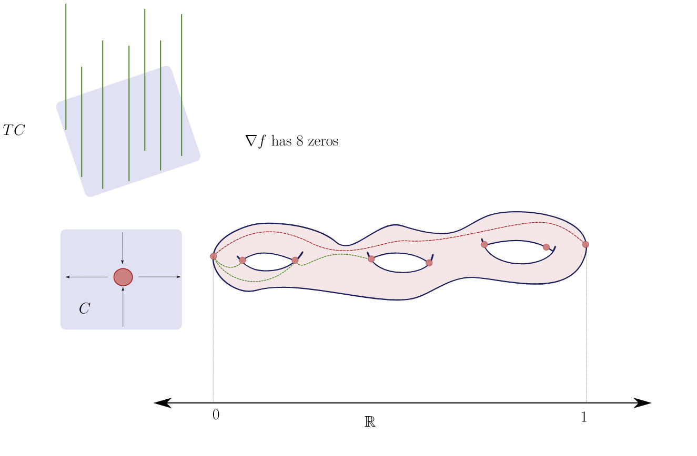

# Wednesday, February 24

Last time:
\[
\chi(C, L) 
&= h^0(C, L) - h^1(C, L) \\
&= h^0(C, L) - h^0(C, L ^{-1} \tensor K_C) \\
&= \deg L + 1 -g
,\]
which is determined by purely topological information.
We can generalize this to arbitrary ranks of the bundle and arbitrary dimensions of manifold:

:::{.theorem title="Hirzebruch-Riemann-Roch (HRR) Formula"}
Let $X$ be a compact complex manifold and let \( \bundle{E} \to X \) be a holomorphic vector bundle.
Then
\[
\chi( \bundle{E} ) = \int_C \ch( \bundle{E} ) \td(X)
.\]
The constituents here: 

- The **Chern character**, summed over $R$ the *Chern roots*, which is in mixed cohomological degree.
\[
\ch( \bundle{E} ) \da \sum_{x_i \in R} e^{x_i} = \ch_0( \bundle{E} ) + \ch_1( \bundle{E} ) + \cdots + \ch_i( \bundle{E} ) \in H^{2i}(X; \QQ)
.\]

- The **Todd class**, defined as
\[
\td( F) \da \prod_{x_i \in R} {x_i \over 1 - e^{-x_i} }
\]
  where $\td(X) \da \td(TX)$ is viewed as a complex vector bundle, which is again in mixed cohomological degree.

:::

:::{.remark}
Note that integrating over cohomology classes in mixed degree is just equal to the integral over the top degree terms.
Applying this to $X = C$ a curve and \( \bundle{E} \da \OO \), we obtain
\[
\chi(C, \OO) 
= \int_C \ch( \OO) \td(C)
.\]

We have 

- $\ch(\OO) = e^{c_1(\OO)} = e^0 = 1$

- $\td(C) \da \td(TC) = c_1(TC) / (1- e^{ - c_1(TC) } )$, whose Taylor coefficients are the Bernoulli numbers.
  We can expand $x/(1 -e^{-x}) = 1 + (x/2) + (x^2/12) - x^4(720) + \cdots$, and since terms above degree 2 vanish, we have
  \[
  \cdots 
  &= \int_C 1 + \qty{ 1 + {c_1(TC) \over 2} } \\
  &= \int_C \qty{c_1(TC) \over 2 }\\
  &= {1\over 2} \chi_\Top(C) && \text{Chern-Gauss-Bonnet} \\
  &= {2-2g \over 2} \\
  &= 1-g
  .\]

We thus obtain
\[
\chi(C, L) 
&= \int_C \ch(L) \td(C) \\
&= \int_C (1 + c_1(L) ) \qty {1 + {c_1(L) \over 2} }\\
&= \int_C c_1(L) + {c_1(TC) \over 2} \\
&= \deg L + 1-g
.\]

:::

:::{.remark}
Note that this is a better definition of genus than the previous one, which was just the correction term in Riemann-Roch.
Here we can define it as $g \da h^1/2$.
:::

:::{.exercise title="?"}
Try to state and prove a Riemann-Roch formula for vector bundles on curves.
:::

:::{.proposition title="Formula for Euler characteristic of a line bundle on a complex surface"}
Let $S$ be a compact complex surface, i.e. $S\in \Mfd_\CC^2$.
An example might be $C\cross D$ for $C,D$ two complex curves, or $\CP^2$.
Let $L\to S$ be a holomorphic vector bundle.
Then
\[
\chi(L) = \chi(\OO_S) + {1\over 2} \qty{ L^2 - L \cdot K}
.\]
Note that $L^2 \da \int_S c_1(L) c_1(L)$ is just shorthand for taking the intersection of $L$ with itself.
Recall that $K \da \Omega_S^2$ is the space of holomorphic top forms.
:::

:::{.proof title="?"}
Let $x_1, x_2$ be the Chern roots of $TS$.
By HRR, we have 
\[
\chi(L) 
&= \int_S \ch(L) \td(S) \\
&= \int_S \qty{ 1 + c_1(L) + {c_1(L)^2 \over 2!} } \qty{ {x_1 \over 1 - e^{-x_1} } {x_2 \over 1-e^{-x_2}} }\\
&= \int_S \qty{ 1 + c_1(L) + {c_1(L)^2 \over 2!} } \qty{1 + {x_1 \over 2} + {x_1^2 \over 12} }\qty{ 1 + {x_2 \over 2} + {x_2^2\over 12}} \\
&= \int_S \qty{ 1 + c_1(L) + {c_1(L)^2 \over 2!} } \qty{1 + {x_1 + x_2 \over 2} + {x_1^2 + x_2^2 + 3x_1 x_2 \over 12} } \\
&= \int_S \qty{ 1 + c_1(L) + {c_1(L)^2 \over 2!} } \qty{1 + {c_1(x_1, x_2) \over 2} + {c_1(x_1, x_2)^2 + c_2(x_1, x_2) \over 12 } } \\
&= \int_S \qty{ 1 + c_1(L) + {c_1(L)^2 \over 2!} } \qty{1 + { c_1(T) \over 2} + {c_1(T)^2 + c_2(T) \over 2 } } \\
&= \int_S {c_1(L)^2 \over 2} + {c_1(L) c_1(T) \over 2} + {c_1(T)^2 \over 2} + {c_2(T) \over 12} \quad \text{Take deg 4} \\
&= \int_S \qty{ c_1(L)^2 + c_1(L) c_1(T) \over 2} + \chi(\OO_S) \quad \text{HRR on last two terms}
.\]
where we've applied HRR to $\OO_S$.
It remains to show that $c_1(T) = -c_1(K)$.
We have
\[
K = \Omega_S^2 = \Wedgepower^2 T\dual 
.\]
Note that $\Wedgepower^{\text{top}} \bundle{E} \da \det( \bundle{E} )$ for any bundle $\bundle{E}$ since this is a 1-dimensional bundle.
We have $c_1(T) = -c_1(T\dual)$ since the Chern roots of $T\dual$ are $-x_1, -x_2$.
So it suffices to show $c_1(T\dual) = c_1(K)$, but there is a general result that $c_1(\bundle{E}) = c_1( \det \bundle{E} )$.
This uses the splitting principle $\bundle{E} = \bigoplus_{i=1}^r L_i$ with $x_i = c_1(L_i)$.
We have $c_1(\bundle{E}) = \sum x_i$ and $\det\bundle{E} = \bigotimes_{i=1}^r L_i$, so $\sum x_i = c_1(L_1\tensor \cdots \tensor L_r)$.
:::

:::{.remark}
We want to use the following formula:
\[
\chi(S, L) = \chi(\OO_S) = {1\over 2}(L^2 - L\cdot K)
.\]
This requires knowing $\chi(\OO_S)$.
Applying HRR yields
\[
\chi(\OO_S) 
&= \int_S {c_1(T)^2 + c_2(T) \over 12}\\
&= \int_S { (-c_1(K))^2 + c_2(T) \over 12}\\
&= {K^2 + \displaystyle\int_S c_2(T) \over 12}
,\]
so we just need to understand $\int_S c_2(T)$.
But for $n=\rank \bundle{E}$, $c_n( \bundle{E} )$ (the top Chern class) is the fundamental class of a zero locus of a section of $\bundle{E}$.
Note that $S \in \Mfd_\RR^4$ is oriented, so $\int_S c_2(T)$ is the signed number of zeros of a smooth vector field.

<!--\begin{tikzpicture}-->
<!--\fontsize{44pt}{1em} -->
<!--\node (node_one) at (0,0) { \import{/home/zack/SparkleShare/github.com/Notes/Class_Notes/2021/Spring/FourManifolds/sections/figures}{2021-02-24_14-33.pdf_tex} };-->
<!--\end{tikzpicture}-->

\todo[inline]{Check.}

Looking at the tangent bundle of the surface, the local sign of an intersection will be the number of incoming directions $\mod 2$, i.e. the index of the critical point.
Then the signed number of zeros here yields $1-6+1 = -4 = \chi_{\Top}(C)$.
More generally, we have
\[
\chi_{\Top}(M^n) = \int_C c_{n}(TM)
,\]
the **Chern-Gauss-Bonnet** formula.
We can thus write
\[
\chi(\OO_S) = {K^2 + \chi_\Top(S) \over 12 }
.\]
:::

