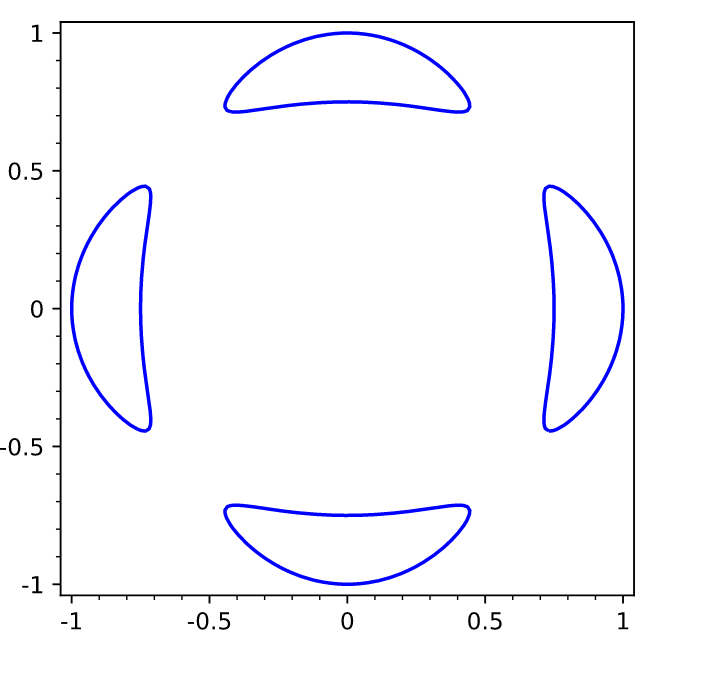

# Wednesday, April 07


:::{.remark}
Last time: let $C, D \subset S$ be distinct curves, then the intersection number is given by 
\[
C\cdot D = \deg \OO_S(C) \ro{}{D} = \sum_{p \in C \intersect D } \len_p( C \intersect D)
\]
where \( \len_p(C \intersect D) \da \dim_\CC \OO(U) / \gens{ f, g }   \) where $V(f) = C \intersect U$ and $V(g) = D \intersect U$ with $f, g \in \OO(U) = \Hol(U)$.
Here we're also assuming that \( C \intersect D \intersect U = \ts{ p } \).
:::

## Adjunction Formula


:::{.remark}
We'll now discuss a way to compute the genus of a curve in a surface.
:::

:::{.proposition title="Adjunction Formula"}
Let $C \subset S$ be a smooth curve, then $K_C = (K_S \tensor \OO_S(C)) \ro{}{C}$, which is restriction of a line bundle.
Note that $K_C = \Omega^1_C$ is the sheaf of holomorphic 1-forms, but $K_S = \Omega^2_S$ since we take the sheaf of top forms.
:::


:::{.proof title="?"}
Let \( s\in \Omega^2_S \tensor \OO(C)(U) \) be a section, then $s_C$ is a section of $\OO_C$ vanishing along $c$ and have $s/s_C$ a meromorphic section of \( \Omega^2_S(U) \).
Here dividing by $s_C$ is like tensoring with $\OO(-C)$.
This can have poles along \( \ts{ s_C = 0 } = C \) up to first order.

There is a residue map: let $p\in C$ be a point and \( \gamma_p(r) \) be an oriented loop in $S\sm C$ around $p\in C$ of radius $r$ (a meridian):

\begin{tikzpicture}
\fontsize{44pt}{1em} 
\node (node_one) at (0,0) { \import{/home/zack/SparkleShare/github.com/Notes/Class_Notes/2021/Spring/FourManifolds/sections/figures}{2021-04-07_14-01.pdf_tex} };
\end{tikzpicture}

We can assemble a 1-form from the following contour integral:
\[
\Res_C {s\over s_C} \da \lim_{r\to 0} {1\over 2\pi i} \oint_{\gamma_p(r)} {s\over s_C} \in \Omega^1(U \intersect C)
.\]

Locally $C = V(x)$ in a coordinate chart of $\CC^2$ where $s_C = x$, so this is roughly of the form $\oint_{\abs x = r} {f(x, y) \over x} \dx \wedge \dy$, which is a one form in the variable $y$.
Note that if $f$ were analytic, writing $f = a_{0,0} + a_{0, 1} y + a_{0, 2} y^2 + \cdots + a_{1, 0}x + \cdots$, we would have
\[
\Res_C {s\over s_C} = (a_{0, 0} + a_{0, 1}y + a_{0, 2}y^2 + \cdots)\dy = f(0, y)\dy \text{locally}
,\]
which picks out all components not involving $x$.
This defines an $\OO\dash$linear map
\[
\Omega^2_S \tensor \OO_C &\to \Omega^1_C \\
s & \mapsto \Res_C {s\over s_C}
,\]
since it doesn't involve any derivatives of $f$.
Note that this only depends on the restriction of $s$ to $C$.
What is the kernel of $\Res_C$?
We claim it is \( \Omega2_S \), which follows from the fact that the contour integral of any holomorphic form $\omega$ will integrate to zero.
We thus get a SES of sheaves
\[
0 \to \Omega^2_S \mapsvia{\cdot s_C} \Omega_S^2 \tensor \OO(C) \to \Omega^1(C) \to 0
.\]
where we send holomorphic forms to meromorphic forms with at most order 1 poles along $C$ to holomorphic 1-forms on $C$.
The residue map is surjective since we can take
\[
\Res_{x=0} {g(y) \over x} \dx \wedge \dy = g(y) \dy
,\]
so locally an arbitrary 1-form is a residue of some 2-form with simple poles along $C$.
We have a SES
\[
0 \to \OO(-C) \mapsvia{\cdot s_C} \OO \to \OO_C \to 0 
,\]
and tensoring with the line bundle \( \Omega^2 \tensor \OO(C) \) we obtain
\[
0 \to \Omega_S^2 \to \Omega^2_S \tensor \OO(C) \to \Omega^2_S \tensor \OO(C) \ro{}{C} \to 0
.\]
Since cokernels are unique, we have \( \Omega^1_C \cong \Omega^2_S \tensor \OO(C) \ro{}{C} \), which yields the adjunction formula.


:::


:::{.corollary title="The Genus Formula"}
We have
\[
\deg \Omega_S^2 \tensor \OO(C) \ro{}{C} = \deg \Omega_C^1 = 2g-2
\]
where $g = g(C)$ is the genus of $C$.
On the other hand, the left-hand side is equal to
\[
(K_S + C) \cdot C = 2g(C) - 2
.\]
:::


:::{.example title="?"}
We showed $K_{\PP^n} = \OO(-n-1)$ where $\OO(-1)$ was the tautological line bundle over $\PP^n$.
So for example $K_{\PP^2} = \OO(-3) = -3 L$ where $L \in H^2(\PP^2, \ZZ)$ is a hyperplane (here a line) in $\PP^2$.
:::


:::{.corollary title="Formula for genus of a curve in terms of degree"}
Let $f$ be a degree $d$ homogeneous polynomial in $x,y,z$, then $V(f) \subseteq \PP^2 = \ts{ [x:y:z] }$. 
If $C\da V(f)$ is a smooth complex curve, then applying the genus formula yields
\[
2g(C) - 2 = (-3L + dL) \cdot dL
.\]
Using that $L^2 = 1$, this equals $d(d-3)$ and thus 
\[
g(C) = {d^2 - 3d + 2 \over 2} = {d-1 \choose 2}
.\]
:::


:::{.example title="?"}
If $d=3$ and say $f(x,y,z) = x^3 + y^3 + z^3$, then $V(f) \subseteq \PP^2$ has genus ${3-1 \choose 2} = 1$.
So this is diffeomorphic to a torus.
:::


:::{.example title="?"}
If $d=2$ then $g(C) = 0$, so conics in $\PP^2$ have genus zero, and we proved that every genus zero curve is isomorphic to $\PP^1$.
So conics in $\PP^2$ are isomorphic to $\PP^1$ (as are lines of course!).
:::


:::{.example title="?"}
If $d=4$ then $g(C) = 3$
:::


:::{.theorem title="Harnack Curve Theorem"}
Noting that $\RP^2 \subset \CP^2 = \PP^2$, the number $n_C$ of connected components of a curve $C \intersect \RP^2$ satisfies 
\[
n_C \leq 1 + g(C)
.\]
:::

:::{.remark}
See the Trott curve:
\[
144(x^4 + y^4) - 225(x^2 + y^2) + 350x^2 y^2 + 81 = 0
,\]
whose plot looks like the following:

```sage
f(x,y) = 12^2*(x^4 + y^4) - 15^2*(x^2 + y^2) + 350*x^2*y^2 + 81
implicit_plot(f, (x,-1,1), (y,-1,1))
```

<!--\begin{tikzpicture}-->
<!--\fontsize{45pt}{1em} -->
<!--\node (node_one) at (0,0) { \import{/home/zack/SparkleShare/github.com/Notes/Class_Notes/2021/Spring/FourManifolds/sections/figures}{2021-04-07_14-31.pdf_tex} };-->
<!--\end{tikzpicture}-->


:::

:::{.example title="?"}
Consider $S \da \PP^1 \cross \PP^1$, which is homeomorphic to $S^2 \cross S^2$.
The homology is given by $\ZZ$ in degrees 0 and 4, $\ZZ^{\oplus 2}$ in degree 3, and 0 elsewhere.
What is the intersection form on $\ZZ^{\oplus 2} = H^2(\PP^1 \cross \PP^1; \ZZ)$?
The two generators are $f_1 = [S^2 \cross \pt], f_2 = [ \pt \cross S^2]$.
We can compute

- $f_1 \cdot f_1 = 0$
- $f_1 \cdot f_2 = 1$
- $f_2 \cdot f_2 = 0$

This is because we can perturb these to be transverse:

\begin{tikzpicture}
\fontsize{44pt}{1em} 
\node (node_one) at (0,0) { \import{/home/zack/SparkleShare/github.com/Notes/Class_Notes/2021/Spring/FourManifolds/sections/figures}{2021-04-07_14-39.pdf_tex} };
\end{tikzpicture}

Since \( f_2 \intersect f_2 ' = \emptyset \), we have \( f_2 \cdot f_2' = f_2 \cdot f_2 = 0 \), and similarly with 1.
So the Gram matrix is 
\[
G = 
\begin{bmatrix}
0 & 1 
\\
1 & 0
\end{bmatrix}
.\]

So setting $C = \PP^1 \cross \PP^1 = V(f_{2, 3})$, a function of bidegree $(2, 3)$, writing the coordinates as $[x: y], [z: w]$, we can write this as $x^2 z^3 + y^2 z^2 w + xy w^3 = 0$.
We get 
\[
2g(C) - 2 = (K_{\PP^1 \cross \PP^1} + 2f_1 + 3f_2) \cdot (2f_1 + 3f_2) = f_2 \cdot (2f_1 + 3f_2) = 2
,\]
since $K_{\PP^1} \circ = -2f_1 - 2f_2$
and so $g(C) = 2$.
:::


