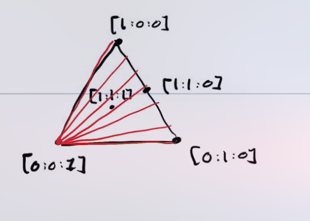
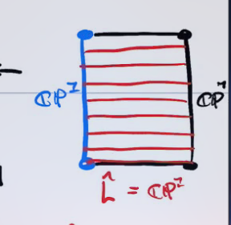
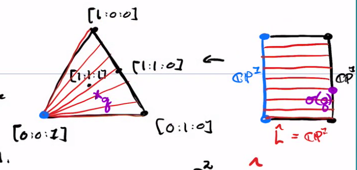
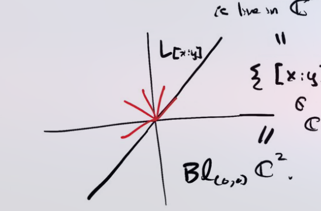

# Blowups and Blowdowns (Wednesday, April 14)

:::{.definition title="Blowup"}
Let $S \in \Mfd_\CC^2$ be a complex surface and $p\in S$ a point, and let $(x, y)$ be local holomorphic coordinates on a neighborhood of $U$ containing $p$.
Without loss of generality, $p = (0, 0)$ in these coordinates.
Set $U^* \da U \smts{p}$, and consider the holomorphic map 
\[
\phi: U^* &\to U \cross \CP^2 \\
(x, y) & \mapsto ( (x, y), [x: y] )
.\]
We'll define the **blowup at $p$** to be $\Bl_p(U) \cl(\phi(U^*))$ to be the closure of the image of $U^*$.
:::

:::{.observation}
There is a map $\Bl_p(U) \to U$ given by projection onto the first coordinate which is the identity on $U^*$.

\begin{tikzpicture}
\fontsize{45pt}{1em} 
\node (node_one) at (0,0) { \import{/home/zack/SparkleShare/github.com/Notes/Class_Notes/2021/Spring/FourManifolds/sections/figures}{2021-04-14_13-56.pdf_tex} };
\end{tikzpicture}

Here $q$ maps to the pair $(q, s)$ where $s$ is the slope of a line through $q$, and this will be continuous.

\todo[inline]{? Missed part}

We claim that $\pi_U\inv(0, 0) \subset \Bl_p(U) = \ts{ p } \cross \CP^1$, and for a fixed $9x_0, y_0) \in U^*$, considering $\phi(x_0 t, y_0 t)$ as $t\to 0$, we can write
\[
( (x_0 t, y_0 t), [x_0: y_0] ) \in U \cross \CP^1 \\
\converges{t\to 0} ( (0, 0) [x_0: y_0] ) \subset \cl(\phi(U^*))
.\]
So approaching $(0, 0)$ along any slope $s$ just yields the point $(0, s)$ in the blowup.
:::

:::{.remark}
We can thus write
\[
\Bl_pS S \smts{p} \disjoint_{U^*} \Bl_p U
.\]

Writing $\pi: \Bl_pS\to S$, we have $\pi\inv(p) \cong \CP^1$ and $\pi\inv(q)$ is a point for all $q\neq p$.
Then all limits approaching $p$ in $S$ turn into distinct limit points in $\Bl_p(S)$

\begin{tikzpicture}
\fontsize{45pt}{1em} 
\node (node_one) at (0,0) { \import{/home/zack/SparkleShare/github.com/Notes/Class_Notes/2021/Spring/FourManifolds/sections/figures}{2021-04-14_14-06.pdf_tex} };
\end{tikzpicture}
:::

:::{.slogan}
The blowup separates all tangent directions at $p$.
:::

:::{.example title="?"}
Consider
\[
\ts{ y^2 = x^3 - x^2 } \subseteq \CC^2
.\]

This yields a nodal curve with a double-point:

\begin{tikzpicture}
\fontsize{45pt}{1em} 
\node (node_one) at (0,0) { \import{/home/zack/SparkleShare/github.com/Notes/Class_Notes/2021/Spring/FourManifolds/sections/figures}{2021-04-14_14-11.pdf_tex} };
\end{tikzpicture}

Here we'll consider $\Bl_{(0, 0)} \CC^2$.

:::{.definition title="Strict Transform"}
Letting $C \subset S$ be a curve, define the **strict transform**
\[
\hat C \da \cl( \pi\inv(C \smts{p} ) )
.\]
:::

Note that approaching by different sequences yields different limiting slopes

\begin{tikzpicture}
\fontsize{45pt}{1em} 
\node (node_one) at (0,0) { \import{/home/zack/SparkleShare/github.com/Notes/Class_Notes/2021/Spring/FourManifolds/sections/figures}{2021-04-14_14-15.pdf_tex} };
\end{tikzpicture}

The curve in the blowup is called the **exceptional divisor**.
:::

:::{.example title="?"}
Consider all lines in $\CP^2$ through $[0:0:1]$, which we can model in the following way:

These are in bijection with $\CP^1$ since there is always a unique line through $[0:0:1]$ and $[s:t:0]$, where the latter is a copy of $\CP^1$ as $s,t$ are allowed to vary.
So consider $\Bl_{p}\CP^2$ for $p=[0:0:1]$, and consider the strict transforms of the lines $L$ to obtain $\hat L \subset \Bl_p \CP^2$.
Any two are disjoint since they pass through different slopes of the exceptional divisor.
Thus the red lines in the blowup go through distinct slopes, yielding a fibration of $\CP^1$s:

So consider the map
\[
\sigma: \Bl_p \CP^2 &\to \CP^2 \\
p \in \hat{L} &\mapsto [0:s:t]
.\]

which projects points to the boundary copy of $\CP^1$:

We can't necessarily project from the blue point itself, but if we add in the data of a tangent vector at that point, the map becomes well-defined.
Thus the blowup makes projecting from a point in $\CP^2$ to a line in $\CP^2$ a well-defined map on $\Bl \CP^2$.
:::

:::{.remark}
This is referred to as $\FF_1$, the **first Hirzebruch surface**.
:::

:::{.proposition title="Blowup for smooth manifolds is connect-sum with CP2"}
For $S\in \Mfd_\RR(C^\infty)$ a smooth manifold, we can identify
\[
\Bl_p S = S \connectsum \bar{\CP^2}
.\]

:::

:::{.proof title="?"}
It suffices to work in coordinate charts and prove this for $p=0$.

:::{.claim}
\[
\Bl_0 \CC^2 = \Tot( \OO_{\CP^1}(-1) )
.\]
:::
Recall that this was the tautological line bundle that whose fibers at a point $p\in \CP^1$ was the line in $\CC^2$ spanned by $p$.
We can write this as \( \ts{ [x:y] \st (x, y) \in L_{[x:y]} } \):

We have $\OO(-1) \mapsvia{\sim} \bar{\OO(1)}$, where this map is a diffeomorphism that can be constructed using a Hermitian metric.
However we can identify $\OO(1)$ with the set of lines in $\CP^2$ through $[0:0:1]$, leaving out the point $[0:0:1]$ itself.
This follows by checking that there exists a section that vanishes at only one point.
In fact $\Tot \OO(1)$ is diffeomorphic to the complement of a ball in $\CP^2$, which ends up precisely being taking a connect-sum.
So we obtain $\Bl_{0} \CC^2 \cong \CC^2 \connectsum \bar{\CP^2}$.
:::

:::{.proof title="Alternative"}
Cut out a ball $B^4 \subseteq \CC^2$, so $\bd B^4 = S^3 = \ts{ \abs x^2 + \abs y^2 = \eps }$.
Then $\Bl_0 \CC^2$ is the result of collapsing $S^3$ along an $S^1\dash$foliation $(e^{i\theta} x, e^{i\theta}y)$.
This has an $S^2$ quotient, yielding the Hopf fibration
\[
S^1 \injects S^3 \to S^2
.\]

:::

:::{.exercise title="?"}
Show that the blowup over $\RR$ is gluing in a mobius strip.
:::

See the Tate curve!

