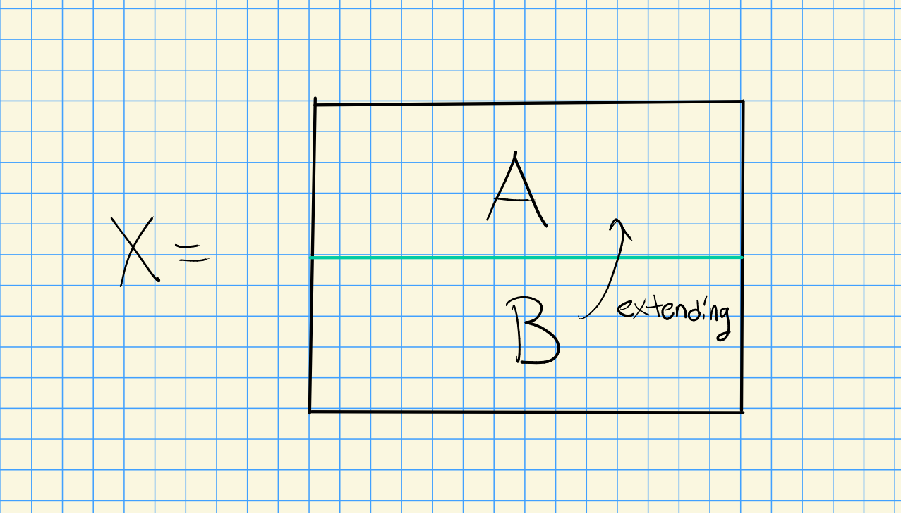

# Friday, February 26

Today: trying to prove acyclic assembly lemma

:::{.proof title="Of acyclic assembly lemma"}
We reduced to proving one case, where $C$ is a double complex upper half-plane with exact columns $\implies \Tot^{\prod}(C)$ is acyclic.
It's enough to check in degree 0 by shifting.
Fix a 0-cycle $\vector c = (\cdots, c_{-j, j}, \cdots, c_{-2, 2}, c_{-1, 1}, c_{0, 0})$.
Find $b \in \prod_{j\leq 0}C_{-j, j+1}$$ such that $d(b) = c$, so $c_{-j, j} = d^v(b_{-j, j+1}) + d^h(b_{-j+1, j})$. 

\begin{tikzcd}
	\textcolor{rgb,255:red,214;green,92;blue,92}{b_{-j, j+1}} \\
	{c_{-j, j}} & {b_{-j+1, j}} \\
	0 && {c_{-j+1, j-1}} & {b_{-j+2, j-1}} \\
	&&&& \ddots \\
	&&&&& {c_{-2, 2}} & {b_{-1, 2}} \\
	&&&&&& {c_{-1, 1}} & {b_{0, 1}} \\
	&&&&&&& {c_{0, 0}} & \textcolor{rgb,255:red,92;green,214;blue,92}{b_{1,0} = 0} \\
	\bullet &&&&&&&&&& \bullet \\
	&&&&&&& 0
	\arrow[dashed, equals, from=8-1, to=8-11]
	\arrow[from=7-8, to=9-8]
	\arrow["{d^v}", from=2-1, to=3-1]
	\arrow["{d^h}"', from=3-3, to=3-1]
\end{tikzcd}

> [Link to Diagram](https://q.uiver.app/?q=WzAsMTYsWzAsMCwiYl97LWosIGorMX0iLFswLDYwLDYwLDFdXSxbMCwxLCJjX3staiwgan0iXSxbMSwxLCJiX3staisxLCBqfSJdLFsyLDIsImNfey1qKzEsIGotMX0iXSxbMywyLCJiX3staisyLCBqLTF9Il0sWzQsMywiXFxkZG90cyJdLFs1LDQsImNfey0yLCAyfSJdLFs2LDQsImJfey0xLCAyfSJdLFs2LDUsImNfey0xLCAxfSJdLFs3LDUsImJfezAsIDF9Il0sWzcsNiwiY197MCwgMH0iXSxbOCw2LCJiX3sxLDB9ID0gMCIsWzEyMCw2MCw2MCwxXV0sWzAsNywiXFxidWxsZXQiXSxbMTAsNywiXFxidWxsZXQiXSxbNyw4LCIwIl0sWzAsMiwiMCJdLFsxMiwxMywiIiwwLHsic3R5bGUiOnsiYm9keSI6eyJuYW1lIjoiZGFzaGVkIn0sImhlYWQiOnsibmFtZSI6Im5vbmUifX19XSxbMTAsMTRdLFsxLDE1LCJkXnYiXSxbMywxNSwiZF5oIiwyXV0=)

Construct by induction on $j$: set $b_{1, 0} = 0$ and need $c_{0, 0} = d^v(b_{0, 1})$. 
Since $d^vc_{0, 0} =0$ and the columns are exact, we can lift this to some $b_{0, 1}$ such that $d^v b_{0, 1} = c_{0, 0}$.
Inductively, we want $d^v(b_{-j, j+1}) = c_{j, -j} - d^h(b_{-j+1, j})$.
Then
\[
d^v( c_{j, -j} - d^h b_{-j+1, j} ) 
&= d^v c_{j, -j} + d^h d^v b_{-j+1, j} \\
&= d^v c_{j, -j} + d^h\qty{ c_{-j+1, j-1} - d^h b_{-j+2, j-1} } \\
&= d^v c_{j. -j} + d^h c_{-j+1, j-1} \\
&= 0 \text{ since } d^{\prod} = 0
.\]
By exactness of column $j$, we can lift to $b_{-j, j+1}$, making $c$ a boundary.
:::

:::{.remark}
This proves that $\wait\tensor_R\wait$ is balanced, i.e. taking the derived functors in either variable with the same pair $(A, B)$ results in the same thing.
To prove a similar result for hom and ext, we want to consider $\Hom_R(A, \wait)$ which requires injective resolutions, and $\Hom_R(\wait, B)$ is contravariant and left-exact, so we take an injective resolution in $\cat{C}\op$, i.e. a projective resolution in $\cat{C}$.
So take a projective resolution $P\to A$ and an injective resolution $B\to I$ and make a first quadrant double complex $C_{i, j} \da \Hom(P_i, I^j)$ for $i, j\geq 0$.
Define the differentials using the following sign convention:

\begin{tikzcd}
	\textcolor{rgb,255:red,92;green,92;blue,214}{(-1)^{i+j+1} d_I f(p)} & {\Hom(P_i, I^{j+1})} \\
	& {\Hom(P_i, I^{j})} && {\Hom(P_{i+1}, I^{j})} \\
	\textcolor{rgb,255:red,92;green,92;blue,214}{f(p)} &&& \textcolor{rgb,255:red,92;green,92;blue,214}{f(d^P p)}
	\arrow["{d^v}", from=2-2, to=1-2]
	\arrow["{d^h}"', from=2-2, to=2-4]
	\arrow[color={rgb,255:red,92;green,92;blue,214}, maps to, from=3-1, to=3-4]
	\arrow[color={rgb,255:red,92;green,92;blue,214}, maps to, from=3-1, to=1-1]
\end{tikzcd}

> [Link to Diagram](https://q.uiver.app/?q=WzAsNixbMSwwLCJcXEhvbShQX2ksIElee2orMX0pIl0sWzEsMSwiXFxIb20oUF9pLCBJXntqfSkiXSxbMywxLCJcXEhvbShQX3tpKzF9LCBJXntqfSkiXSxbMywyLCJmKGReUCBwKSIsWzI0MCw2MCw2MCwxXV0sWzAsMiwiZihwKSIsWzI0MCw2MCw2MCwxXV0sWzAsMCwiKC0xKV57aStqKzF9IGRfSSBmKHApIixbMjQwLDYwLDYwLDFdXSxbMSwwLCJkXnYiXSxbMSwyLCJkXmgiLDJdLFs0LDMsIiIsMix7ImNvbG91ciI6WzI0MCw2MCw2MF0sInN0eWxlIjp7InRhaWwiOnsibmFtZSI6Im1hcHMgdG8ifX19XSxbNCw1LCIiLDAseyJjb2xvdXIiOlsyNDAsNjAsNjBdLCJzdHlsZSI6eyJ0YWlsIjp7Im5hbWUiOiJtYXBzIHRvIn19fV1d)

Now applying a dual argument as the one for tor yields a "dual acyclic assembly lemma".
:::

:::{.remark}
We'll skip the first 3 sections of chapter 3.
It's worth looking at 3.2 on tor and flatness.
There's a slightly circular statement that projective implies flat in the book, since we used this to show that certain rows were exact, so refer to a good algebra book for alternative proofs.
:::

## $\Ext^1$ and Extensions

:::{.definition title="Module Extensions"}
Let \( A, B\in \modr \), then an **extension of $A$ by $B$** is a SES 
\[
\xi: 0 \to B\to X\to A\to 0
.\]

We say two extensions $\xi, \xi'$ are equivalent and write $\xi \sim \xi'$ iff

\begin{tikzcd}
	0 & B & X & A & 0 \\
	\\
	0 & B & {X'} & A & 0
	\arrow["\exists", dashed, from=1-3, to=3-3]
	\arrow[equals, from=1-4, to=3-4]
	\arrow[equals, from=1-2, to=3-2]
	\arrow[from=1-1, to=1-2]
	\arrow[from=1-2, to=1-3]
	\arrow[from=1-3, to=1-4]
	\arrow[from=1-4, to=1-5]
	\arrow[from=3-1, to=3-2]
	\arrow[from=3-3, to=3-4]
	\arrow[from=3-2, to=3-3]
	\arrow[from=3-4, to=3-5]
\end{tikzcd}

> [Link to Diagram](https://q.uiver.app/?q=WzAsMTAsWzAsMCwiMCJdLFsxLDAsIkIiXSxbMiwwLCJYIl0sWzMsMCwiQSJdLFs0LDAsIjAiXSxbMCwyLCIwIl0sWzIsMiwiWCciXSxbMSwyLCJCIl0sWzMsMiwiQSJdLFs0LDIsIjAiXSxbMiw2LCJcXGV4aXN0cyIsMCx7InN0eWxlIjp7ImJvZHkiOnsibmFtZSI6ImRhc2hlZCJ9fX1dLFszLDgsIiIsMCx7InN0eWxlIjp7ImhlYWQiOnsibmFtZSI6Im5vbmUifX19XSxbMSw3LCIiLDAseyJzdHlsZSI6eyJoZWFkIjp7Im5hbWUiOiJub25lIn19fV0sWzAsMV0sWzEsMl0sWzIsM10sWzMsNF0sWzUsN10sWzYsOF0sWzcsNl0sWzgsOV1d)

An extension is **split** if and only if it is equivalent to 
\[
0 \to B \injectsvia{\iota} A \oplus B \to A \surjectsvia{\pi} A \to 0
.\]
:::

:::{.warnings}
Note that a SES as above is related to $\Ext(A, B)$, which reverses the order!
:::

:::{.lemma title="?"}
If $\Ext^1(A, B) = 0$ then every extension of $A$ by $B$ is split.
:::

:::{.warnings}
There are lots of corrections needed to this proof in Weibel!
:::

:::{.proof title="of lemma"}
Given an extension $\xi$, look at the LES associated to $\Hom^*(\wait, B)$:

\begin{tikzcd}
	&& \cdots && {\Ext^1(A, B)} \\
	\\
	{\Hom(B, B)} && {\Hom(X, B)} && {\Hom(A, B)} \\
	\textcolor{rgb,255:red,92;green,214;blue,92}{\one_B} && \textcolor{rgb,255:red,92;green,214;blue,92}{\sigma}
	\arrow[from=3-5, to=3-3]
	\arrow[from=3-3, to=3-1]
	\arrow[from=3-1, to=1-5, out=180, in=0]
	\arrow[from=1-5, to=1-3]
	\arrow[color={rgb,255:red,92;green,214;blue,92}, maps to, from=4-3, to=4-1]
\end{tikzcd}

> [Link to Diagram](https://q.uiver.app/?q=WzAsNyxbMiwwLCJcXGNkb3RzIl0sWzQsMCwiXFxFeHReMShBLCBCKSJdLFswLDIsIlxcSG9tKEIsIEIpIl0sWzIsMiwiXFxIb20oWCwgQikiXSxbNCwyLCJcXEhvbShBLCBCKSJdLFsyLDMsIlxcc2lnbWEiLFsxMjAsNjAsNjAsMV1dLFswLDMsIlxcb25lX0IiLFsxMjAsNjAsNjAsMV1dLFs0LDNdLFszLDJdLFsyLDFdLFsxLDBdLFs1LDYsIiIsMCx7ImNvbG91ciI6WzEyMCw2MCw2MF0sInN0eWxlIjp7InRhaWwiOnsibmFtZSI6Im1hcHMgdG8ifX19XV0=)

However, this gives a splitting:

\begin{tikzcd}
	& \textcolor{rgb,255:red,92;green,214;blue,92}{B} \\
	\\
	0 & B & X & A & 0 \\
	\\
	0 & B & {X'} & A & 0
	\arrow["\exists", dashed, from=3-3, to=5-3]
	\arrow[equals, from=3-4, to=5-4]
	\arrow[equals, from=3-2, to=5-2]
	\arrow[from=3-1, to=3-2]
	\arrow[from=3-2, to=3-3]
	\arrow[from=3-3, to=3-4]
	\arrow[from=3-4, to=3-5]
	\arrow[from=5-1, to=5-2]
	\arrow[from=5-3, to=5-4]
	\arrow[from=5-2, to=5-3]
	\arrow[from=5-4, to=5-5]
	\arrow["{\one_B}", color={rgb,255:red,92;green,214;blue,92}, from=3-2, to=1-2]
	\arrow["{\exists \sigma}", color={rgb,255:red,92;green,214;blue,92}, dashed, from=3-3, to=1-2]
\end{tikzcd}

> [Link to Diagram](https://q.uiver.app/?q=WzAsMTEsWzAsMiwiMCJdLFsxLDIsIkIiXSxbMiwyLCJYIl0sWzMsMiwiQSJdLFs0LDIsIjAiXSxbMCw0LCIwIl0sWzIsNCwiWCciXSxbMSw0LCJCIl0sWzMsNCwiQSJdLFs0LDQsIjAiXSxbMSwwLCJCIixbMTIwLDYwLDYwLDFdXSxbMiw2LCJcXGV4aXN0cyIsMCx7InN0eWxlIjp7ImJvZHkiOnsibmFtZSI6ImRhc2hlZCJ9fX1dLFszLDgsIiIsMCx7InN0eWxlIjp7ImhlYWQiOnsibmFtZSI6Im5vbmUifX19XSxbMSw3LCIiLDAseyJzdHlsZSI6eyJoZWFkIjp7Im5hbWUiOiJub25lIn19fV0sWzAsMV0sWzEsMl0sWzIsM10sWzMsNF0sWzUsN10sWzYsOF0sWzcsNl0sWzgsOV0sWzEsMTAsIlxcb25lX0IiLDAseyJjb2xvdXIiOlsxMjAsNjAsNjBdfSxbMTIwLDYwLDYwLDFdXSxbMiwxMCwiXFxleGlzdHMgXFxzaWdtYSIsMCx7ImNvbG91ciI6WzEyMCw2MCw2MF0sInN0eWxlIjp7ImJvZHkiOnsibmFtZSI6ImRhc2hlZCJ9fX0sWzEyMCw2MCw2MCwxXV1d)

Todo: label $(X, B) \to (B, B)$ as $f_*$.

This is one of the many equivalent criteria for a SES of modules to be split.
:::

:::{.remark}
More generally, given $\xi$, let $\Theta(\xi) \da \bd(\one_B) \in \Ext^1(A, B)$.
Thus TFAE:

- $\xi$ is split 
- $\one-B$ lifts to some $\sigma\in \Hom(X, B)$ 
- $\one_B \in \im f_* = \ker \bd$ 
- $\Theta(\xi) = 0$, even if $\Ext^1(A, B) \neq 0$.

Then $\Theta(\xi)$ is an *obstruction* to $\xi$ being split.
:::

:::{.remark}
If $\xi'\sim \xi$ then $\bd'(\one_B) = \bd(\one_B)\in \Ext^1(A, B)$ by naturality of the connecting morphisms.
So equivalent extensions have the same obstruction, i.e. $\Theta$ only depends only on the equivalence class $[\xi]$ of the SES.
:::

:::{.theorem title="Module extensions correspond to Ext groups"}
Given $A, B\in \modr$ (or an abelian category with enough projectives and injectives), there is a correspondence
\[
\correspond{
  0 \to B \to X\to A \to 0
}_{/\sim}
\mapscorrespond{\Psi}{\Theta}
\Ext^1(A, B)
\]
Note that this is a bijection of sets, but we'll upgrade it to a bijection of abelian groups.
:::

