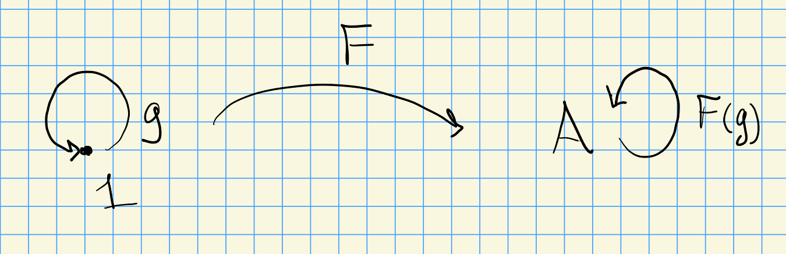

# Monday, March 08

## 3.6: Universal Coefficients Theorem

:::{.remark}
Let $X \in \Top$ and $S_k(X)$ be the free $\ZZ\dash$module on $\Hom_\Top( \Delta_k, X)$, which assemble into a chain complex $S(X)$.
For $M\in \Ab$, we defined $H^n(X; M) \da H^n( \Hom(S(X), M))$ and write $H^n(X) \da H^n(X; \ZZ)$.
The universal coefficient theorem states
\[
H^n(X; M) \cong \Hom_\ZZ(H_n(X), M) \oplus \Ext^1_\ZZ( H_{n-1}(X), M)
.\]
:::

:::{.warnings}
Note that this is homology on the RHS, not cohomology!
:::

:::{.theorem title="Universal Coefficients Theorem for Cohomology"}
Let $\complex{P}$ be a chain complex of projective \(R\dash\)modules.
Assume $dP_n$ is also projective for all $n$.
For $M\in \rmod$, there is a split SES
\[
0 \to \Ext_R^1(H_{n-1}(P), M) \to H^n( \Hom_R( \complex{P}, M)) \to \Hom_R (H_n(P), M) \to 0
.\]
:::

\todo[inline]{Ask about naturality!}

:::{.proof title="Sketch"}
As in the last lecture with free abelian groups, since the $dP_n$ are projective we can split $P_n \cong Z_n \oplus dP_n$ since $Z_n = \ker d$.
Applying homs, since it's an additive functor this yields a new split exact sequence
\[
0 \to \Hom(dP_n, M) \to \Hom(P_n, M) \to \Hom(Z_n, M) \to 0
.\]
Now running the proof for the original Kunneth formula and replacing tensor products to homs, these assemble into a split exact sequence of complexes and this yields the desired SES.
Using the strategy of the proof of the UCF for free abelian groups to see that the sequence splits (although non-canonically).
:::

:::{.remark}
Note that flat is weaker than projective for tensor products, but in an asymmetric situation, there's nothing weaker than projective for the hom functors to be exact (since this is an iff).
:::

## Ch. 6: Group Homology and Cohomology

### Definitions and Properties

:::{.definition title="Modules of Groups"}
Let $G\in \Grp$ be any group, finite or infinite, and let $A\in \modsleft{G}$ be a left \(G\dash\)module, i.e. an abelian group on which $G$ acts by additive maps on the left, written $g.a$ or $ga$ for $g\in G, a\in A$.
Here *additive* means that $g.(a_1 + a_2) = g.a_1 + g.a_2$.
Note that this implies $g.0 = 0, -g.a = -(g.a), g_1 (g_2 . a) = (g_1 g_2).a, 1_G.a = a$.
Writing $\Endo_R(A) \da \Hom_R(A, A)$, we have a group morphism
\[
G &\to \Endo_\ZZ(A) \\
g &\mapsto g.(\wait)
.\]
:::

:::{.definition title="Equivariant Maps"}
If $B \in \modsleft{G}$ is another left \(G\dash\)module, then 
\[
\Hom_G(A, B) = \ts{ f\in \Hom_\ZZ(A, B) \st f(g.a) = g(f(a)) \quad \forall a\in A, \forall g\in G } 
,\]
which are **$G\dash$equivariant maps**.
:::

:::{.definition title="Integral Group Ring"}
We define
\[
\ZZ G\da \ts{ \sum_{i=1}^N m_i g_i \st m_i\in \ZZ, g_i\in G, n\in \NN } 
.\]
We can equip this with a ring structure using \( (mg)(m' g') = mm' gg' \) and extending $\ZZ\dash$linearly.
:::

:::{.remark}
There is an equality of categories $\mods{G} = \modsleft{\ZZ G}$.
This is also the same as the functor category $\Ab^\cat{G}$ (a category of the form \( \cat{A}^{\cat{I}} \)) where \( \cat{G} \) is the category with one object whose morphisms are the elements of $G$.
In other words, \( \Ob(\cat{G}) \da \ts{ 1 } \)  and \( \Hom_{\cat{G}}(1, 1) = G \).
Note that every morphism is invertible since $G$ is a group.

The right-hand side yields a \(G\dash\)module since $F(g)(a) = g.a$.
:::

:::{.definition title="Trivial modules"}
An object $A\in \modsleft{G}$ is a **trivial** module if and only if $g.a = a$ for all $g\in G$.
:::

:::{.remark}
Any $G\in \Ab$ can be viewed as a trivial \(G\dash\)module in this way.
This yields a functor $\operatorname{Triv}:\Ab \to \modsleft{G}$.
There is a distinguished trivial \(G\dash\)module, namely $A \da \ZZ$ with the trivial $G\dash$action.
There are two natural functors $\modsleft{G}\to \Ab$:

- $A^G \da \ts{ a\in A \st g.a = a \forall g\in G }$, the **invariant subgroup** of $A$.
- $A_G \da A / \gens{ ga-a \st g\in G, a\in A }$, where we take the \(G\dash\)module generated by the relation in the denominator, which are the **coinvariants** of $A$.
:::

:::{.exercise title="6.1.1"}
\envlist

1. $A^G$ is the maximal trivial submodule of $A$, so the functor $(\wait)^G$ is right-adjoint to $\operatorname{Triv}$.
  These should both be easy checks!
  So this is left-exact and has right-derived functors (similar to ext).

2. $A_G$ is the largest $G\dash$trivial quotient of $A$, and $(\wait)_G$ is left-adjoint to $\operatorname{Triv}$.
  Thus it is right-exact and has left-derived functors (similar to tor).
  
:::

:::{.lemma title="?"}
Let $A\in \modsleft{G}$ and $\ZZ$ be the trivial $G\dash$module.
Then

1. $A_G \cong \ZZ \tensor_{\ZZ G} A$, and 
2. $A^G \cong \Hom_G(\ZZ, A)$ (**important!!**)

:::

:::{.warnings}
Number 2 above is important to remember!
:::

:::{.proof title="of 1"}
Viewing $\ZZ = _{\ZZ} \ZZ_{\ZZ G} \in \bimod{\ZZ}{\ZZ G}$ with the trivial structure, recall[^recall_bimod_struct]
that we have a functor
\[
\Hom_(\ZZ, \wait): \modsleft{\ZZ} &\to \modsleft{\ZZ G}\\
\]
where $\Hom_\ZZ(\ZZ, A)$ has an action $(g.f)(x) \da f(x. g)$ for $x\in \ZZ g\in G$.
Since $x.g = x$ for all $x, g$, we have \( g.f = f \) and thus \( \Hom_\ZZ(\ZZ, A) \) is a trivial \(G\dash\)module, and there is an isomorphism in $\Ab$:
\[
\Hom_\ZZ(\ZZ, A) &\underset{\Ab}{\mapsvia{\sim}} A \\
f &\mapsto f(a)
.\]
Thus $\Hom_\ZZ(\ZZ, \wait) \cong \operatorname{Triv}(\wait)$.
By prop 2.6.3, the functor $\ZZ\tensor_{\ZZ G} (\wait)$ is left-adjoint to $\Hom_\ZZ( _{\ZZ} \ZZ_{\ZZ G}, \wait)$.
Now applying exercise 6.1.1 part 2, $(\wait)_G \cong \operatorname{Triv}(\wait)$.
Since left-derived functors are universal \( \delta\dash \)functors, we have a natural isomorphism $(\wait)_G \cong \ZZ\tensor_{\ZZ G} (\wait)$ since they're both left-adjoint to the same functor.

[^recall_bimod_struct]: 
See Weibel p. 41.

:::

:::{.proof title="of 2 "}
Taking $f(1)$, we have $A^G \cong \Hom_\ZZ(\ZZ, A^G)$.
Using the adjoint property from exercise 6.1.1 part 1, this is isomorphic to $\Hom_G( \operatorname{Triv}(\ZZ), A)$.
Thus $(\wait)^G \cong \Hom_G(\ZZ, \wait)$.
:::

:::{.remark}
The exts here will classify extensions in the category of left $\ZZ\dash$modules.
Note the switched order on the hom functor however!
:::

