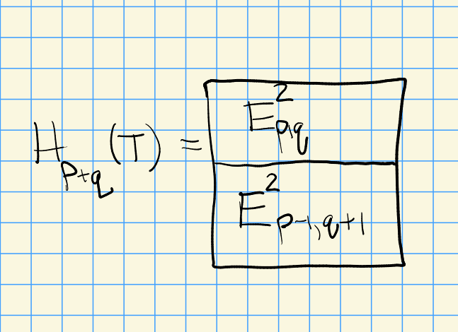

# Spectral Sequences (Monday, March 15)

## Motivation

:::{.remark}
Invented by John Leray, 1946 while a prisoner of war in Austria, as an algorithmic way to compute homology of chain complexes.
Start with a first-quadrant double complex \( \ts{ E_{p, q} \st p, q\geq 0 } \), say of \(R\dash\)modules.
Let $T_n \da \bigoplus_{p}$ be the total complex (direct sum or product, since the diagonals are finite) where $d \da d^b + d^h$.
Suppose one could compute the homology of each "piece" of the differential separately and independently.
First forget $d^h$, and let this complex be $E_{p, q}^0$ (where the $0$ superscript denotes a "zeroth approximation").

\begin{tikzcd}
	q \\
	\\
	3 & \bullet & \bullet & \bullet \\
	2 & \bullet & \bullet & \bullet \\
	1 & \bullet & \bullet & \bullet \\
	0 & 1 & 2 & 3 &&& p
	\arrow[from=3-4, to=4-4]
	\arrow[from=4-4, to=5-4]
	\arrow[from=3-3, to=4-3]
	\arrow[from=4-3, to=5-3]
	\arrow[from=3-2, to=4-2]
	\arrow[from=4-2, to=5-2]
\end{tikzcd}

> [Link to Diagram](https://q.uiver.app/?q=WzAsMjQsWzAsNSwiMCJdLFswLDQsIjEiXSxbMCwzLCIyIl0sWzAsMiwiMyJdLFsxLDIsIlxcYnVsbGV0Il0sWzEsMywiXFxidWxsZXQiXSxbMSw0LCJcXGJ1bGxldCJdLFsxLDUsIjEiXSxbMiw1LCIyIl0sWzMsNSwiMyJdLFs2LDUsInAiXSxbMCwwLCJxIl0sWzIsNCwiXFxidWxsZXQiXSxbMiw0LCJcXGJ1bGxldCJdLFsyLDMsIlxcYnVsbGV0Il0sWzIsMywiXFxidWxsZXQiXSxbMywyLCJcXGJ1bGxldCJdLFszLDIsIlxcYnVsbGV0Il0sWzIsMiwiXFxidWxsZXQiXSxbMiwyLCJcXGJ1bGxldCJdLFszLDMsIlxcYnVsbGV0Il0sWzMsMywiXFxidWxsZXQiXSxbMyw0LCJcXGJ1bGxldCJdLFszLDQsIlxcYnVsbGV0Il0sWzE3LDIxXSxbMjEsMjNdLFsxOSwxNV0sWzE1LDEzXSxbNCw1XSxbNSw2XV0=)

Now let $E^1{p, q} \da H_q(E_{p, q}^0)$ be the homology obtained from the vertical complexes, i.e. $E^1_{p, q} \da \ker d^v_{p, q} / \im d^v_{p, q-1}$.
Recall that by convention we require anticommutativity, so $d^vd^h + d^h d^v = 0$, so this is not quite a complex of complexes.
So these won't quite give a chain map, but $d^vd^h = -d^h d^v$ is enough to induce well-defined maps on $E^1_{*, *}$ since they will preserve kernels and images.
So $E^1$ has horizontal differentials $d^h: E^1_{*,*} \to E^1_{*-1, *}$:

\begin{tikzcd}
	{E^1_{p, q}:} & q \\
	\\
	& 3 & \bullet & \bullet & \bullet \\
	& 2 & \bullet & \bullet & \bullet \\
	& 1 & \bullet & \bullet & \bullet \\
	& 0 & 1 & 2 & 3 &&& p
	\arrow[from=5-5, to=5-4]
	\arrow[from=4-5, to=4-4]
	\arrow[from=3-5, to=3-4]
	\arrow[from=3-4, to=3-3]
	\arrow[from=4-4, to=4-3]
	\arrow[from=5-4, to=5-3]
\end{tikzcd}

> [Link to Diagram](https://q.uiver.app/?q=WzAsMjUsWzEsNSwiMCJdLFsxLDQsIjEiXSxbMSwzLCIyIl0sWzEsMiwiMyJdLFsyLDIsIlxcYnVsbGV0Il0sWzIsMywiXFxidWxsZXQiXSxbMiw0LCJcXGJ1bGxldCJdLFsyLDUsIjEiXSxbMyw1LCIyIl0sWzQsNSwiMyJdLFs3LDUsInAiXSxbMSwwLCJxIl0sWzMsNCwiXFxidWxsZXQiXSxbMyw0LCJcXGJ1bGxldCJdLFszLDMsIlxcYnVsbGV0Il0sWzMsMywiXFxidWxsZXQiXSxbNCwyLCJcXGJ1bGxldCJdLFs0LDIsIlxcYnVsbGV0Il0sWzMsMiwiXFxidWxsZXQiXSxbMywyLCJcXGJ1bGxldCJdLFs0LDMsIlxcYnVsbGV0Il0sWzQsMywiXFxidWxsZXQiXSxbNCw0LCJcXGJ1bGxldCJdLFs0LDQsIlxcYnVsbGV0Il0sWzAsMCwiRV4xX3twLCBxfToiXSxbMjMsMTNdLFsyMSwxNV0sWzE3LDE5XSxbMTksNF0sWzE1LDVdLFsxMyw2XV0=)

We can now write $E_{p, q}^2$ for the horizontal homology $H_p(E^1_{*, q})$ at the $p, q$ spot.
We've done the horizontal and vertical homology separately, how close is \( \ts{ E_{p, q}^2 \st p+q = n } \) to giving us information about the total homology?

:::

:::{.exercise title="5.1.1"}
If $E^0_{*,*}$ consists of only two columns $p$ and $p-1$, then there is a SES
\[
0 \to E_{p-1, q+1}^2 \to H_{p+q}(T) \to E_{p, q}^2 \to 0
.\]

\begin{tikzcd}
	n \\
	& \vdots \\
	{q+1} && \bullet \\
	{n-p=q} &&& \bullet \\
	&&&& \vdots \\
	&& {p-1} & p && n
	\arrow[from=2-2, to=3-3]
	\arrow[from=3-3, to=4-4]
	\arrow[from=4-4, to=5-5]
	\arrow[from=1-1, to=2-2]
	\arrow[from=5-5, to=6-6]
\end{tikzcd}

> [Link to Diagram](https://q.uiver.app/?q=WzAsMTAsWzIsNSwicC0xIl0sWzMsNSwicCJdLFswLDMsIm4tcD1xIl0sWzAsMiwicSsxIl0sWzIsMiwiXFxidWxsZXQiXSxbMywzLCJcXGJ1bGxldCJdLFswLDAsIm4iXSxbNSw1LCJuIl0sWzEsMSwiXFx2ZG90cyJdLFs0LDQsIlxcdmRvdHMiXSxbOCw0XSxbNCw1XSxbNSw5XSxbNiw4XSxbOSw3XV0=)

So in general, $H_*(T)$ is determined up to extensions.
:::

:::{.exercise title="5.1.2"}
We view $E^2_{*, *}$ as a 2nd order approximation to $H_*( \complex{T} )$.
We've used both differentials, so how do we continue?
There are well-defined maps $d_{p, q}^2: E_{p, q}^2 \to E^{2}_{p-2, q+1}$ such that $d^2_{*,*} \circ d^2_{*, *} = 0$ (noting that these are superscripts, not squaring).
:::

:::{.remark}
This yields differentials on $E^2$ on lines of slope $-1/2$  which move from the $n$th diagonal to the $n-1$st diagonal:

\begin{tikzcd}
	& {} & {} \\
	{q+1} && \bullet \\
	q &&&& \bullet \\
	\\
	&& {p-2} && p & {} & {}
	\arrow["n"{pos=0}, color={rgb,255:red,92;green,214;blue,214}, dashed, no head, from=1-3, to=5-7]
	\arrow["{n-1}"{pos=0}, color={rgb,255:red,92;green,214;blue,214}, dashed, no head, from=1-2, to=5-6]
	\arrow[from=3-5, to=2-3]
\end{tikzcd}

> [Link to Diagram](https://q.uiver.app/?q=WzAsMTAsWzIsNCwicC0yIl0sWzQsNCwicCJdLFswLDIsInEiXSxbMCwxLCJxKzEiXSxbMiwxLCJcXGJ1bGxldCJdLFs0LDIsIlxcYnVsbGV0Il0sWzIsMF0sWzYsNF0sWzEsMF0sWzUsNF0sWzYsNywibiIsMCx7ImxhYmVsX3Bvc2l0aW9uIjowLCJjb2xvdXIiOlsxODAsNjAsNjBdLCJzdHlsZSI6eyJib2R5Ijp7Im5hbWUiOiJkYXNoZWQifSwiaGVhZCI6eyJuYW1lIjoibm9uZSJ9fX0sWzE4MCw2MCw2MCwxXV0sWzgsOSwibi0xIiwwLHsibGFiZWxfcG9zaXRpb24iOjAsImNvbG91ciI6WzE4MCw2MCw2MF0sInN0eWxlIjp7ImJvZHkiOnsibmFtZSI6ImRhc2hlZCJ9LCJoZWFkIjp7Im5hbWUiOiJub25lIn19fSxbMTgwLDYwLDYwLDFdXSxbNSw0XV0=)

\begin{tikzcd}
	\bullet \\
	& \bullet & {(p, q)} \\
	&& \bullet
	\arrow["{d^0}", from=2-3, to=3-3]
	\arrow["{d^2}"', from=2-3, to=1-1]
	\arrow["{d^1}", from=2-3, to=2-2]
\end{tikzcd}

> [Link to Diagram](https://q.uiver.app/?q=WzAsNCxbMiwxLCIocCwgcSkiXSxbMiwyLCJcXGJ1bGxldCJdLFswLDAsIlxcYnVsbGV0Il0sWzEsMSwiXFxidWxsZXQiXSxbMCwxLCJkXjAiXSxbMCwyLCJkXjIiLDJdLFswLDMsImReMSJdXQ==)

So we let $E^3$ be the homology, and it turns out there are differentials $d^3: E^3_{p, q} \to E^3_{p-3, q+2}$ which go from diagonal $n$ to $n-1$.
:::

## Setup

:::{.definition title="Homology Spectral Sequences"}
A **homology spectral sequence** starting with $E^a$ for $a\in \ZZ$ in an abelian category \( \cat{A} \) consists of the following data:

a. Pages: For all $r\geq a$ and all $p, q\in \ZZ$, a family \( \ts{ E_{p, q}^r } \) of objects in \( \cat{A} \) (some of which my be zero), where typically $a=1, 2$.

b. Differentials: A family of maps \( \ts{ d_{p, q}^r: E_{p, q}^r \to E_{p-r, q+r-1}^r } \)  with $d^r \circ d^r =0$ of slope $-\frac{r-1}{r}$ in that lattice $E_{*, *}^r$ the form chain complexes.
  We take the convention that the differentials go to the left:

  \begin{tikzcd}
    \bullet \\
    \\
    && \bullet \\
    \\
    &&&& \bullet
    \arrow["{d^r}", from=5-5, to=3-3]
    \arrow["{d^r}", from=3-3, to=1-1]
  \end{tikzcd}

  > [Link to Diagram](https://q.uiver.app/?q=WzAsMyxbNCw0LCJcXGJ1bGxldCJdLFsyLDIsIlxcYnVsbGV0Il0sWzAsMCwiXFxidWxsZXQiXSxbMCwxLCJkXnIiXSxbMSwyLCJkXnIiXV0=)

c. Structure Maps: Isomorphisms $E_{p, q}^{r+1} \cong \ker d_{p, q}^r / \im d_{p+r, q-r+1}^r$.

We denote $E^r_{*,*}$ to be the **$r$th page** of the sequence, and the **total degree** of an entry $E_{p, q}^r$ is $p+q$.
:::

:::{.remark}
The term $E_{p, q}^{r+1}$ is a *subquotient*, i.e. a submodule of a quotient, of $E_{p, q}^r$, and hence inductively a subquotient of $E_{p, q}^a$ by transitivity of "being a subquotient".
The terms of total degree $n$ lie on a line of slope $-1$, and each differential $d^r_{p, q}$ decreases the total degree by 1.
:::

:::{.remark}
There is a category of homology spectral sequences over a fixed abelian category \( \cat{A} \).
The objects consist of the above data of pages, differentials, and structure maps from the above definition
The morphisms $f: E\to \tilde E$ are families of maps
\[
f_{p, q}^r: E_{p, q}^r \to \tilde{E}^r_{p, q}
\]
for all $r \geq\max\ts{a, \tilde a}$ with $\tilde{d}^r f^r = f^r d^r$ such that $f_{p, q}^{r+1}$ is the map on homology induced by $f_{p, q}^r$.
:::

:::{.definition title="Cohomology Spectral Sequence"}
A **cohomology** spectral sequence is defined dually: we'll write this as $E_r^{p, q}, d_r^{p, q}$, where the differentials go down and to the right, and increase the total degree by 1:
\[
d_r^{p, q}: E_r^{p, q} \to E_{r}^{p+r, q-r+1}
.\]

\begin{tikzcd}
	q & \bullet \\
	\\
	{q-r+1} &&&&& \bullet \\
	& p &&&& {p+r}
	\arrow["{d_r^{p, q}}", from=1-2, to=3-6]
\end{tikzcd}

> [Link to Diagram](https://q.uiver.app/?q=WzAsNixbMSwwLCJcXGJ1bGxldCJdLFs1LDIsIlxcYnVsbGV0Il0sWzEsMywicCJdLFs1LDMsInArciJdLFswLDAsInEiXSxbMCwyLCJxLXIrMSJdLFswLDEsImRfcl57cCwgcX0iXV0=)

There is similarly a category of these.
:::

:::{.lemma title="Mapping Lemma"}
Let $f:E\to \tilde{E}$ be a morphism of spectral sequences (homology or cohomology) such that for some fixed $r$, the map $f^r: E_{p, q}^r\to \tilde{E}_{p, q}^r$ is an isomorphism for all $p, q$.
Then all $f^s_{p, q}$ are isomorphisms for all $s\geq r$ and all $p, q$.
:::

:::{.proof title="of the mapping lemma"}
There is a commutative diagram with exact rows:

\begin{tikzcd}
	0 && {B_{p, q}^r} && {Z_{p, q}^r} && {E_{p, q}^{r+1}} && 0 && 0 \\
	\\
	0 && {\tilde B_{p, q}^r} && {\tilde Z_{p, q}^r} && {\tilde E_{p, q}^r} && 0 && 0
	\arrow[from=1-1, to=1-3]
	\arrow[from=1-3, to=1-5]
	\arrow[from=1-5, to=1-7]
	\arrow[from=1-7, to=1-9]
	\arrow[from=3-1, to=3-3]
	\arrow[from=3-3, to=3-5]
	\arrow[from=3-5, to=3-7]
	\arrow[from=3-7, to=3-9]
	\arrow["{f_{p ,q}^r (\sim)}"', from=1-5, to=3-5]
	\arrow["{f_{p ,q}^r (\sim)}"', from=1-3, to=3-3]
	\arrow["{f_{p, q}^{r+1}}"', from=1-7, to=3-7]
	\arrow[from=1-9, to=1-11]
	\arrow[from=3-9, to=3-11]
	\arrow[no head, from=1-11, to=3-11]
	\arrow[no head, from=1-9, to=3-9]
\end{tikzcd}

> [Link to Diagram](https://q.uiver.app/?q=WzAsMTIsWzAsMCwiMCJdLFsyLDAsIkJfe3AsIHF9XnIiXSxbNCwwLCJaX3twLCBxfV5yIl0sWzYsMCwiRV97cCwgcX1ee3IrMX0iXSxbOCwwLCIwIl0sWzIsMiwiXFx0aWxkZSBCX3twLCBxfV5yIl0sWzQsMiwiXFx0aWxkZSBaX3twLCBxfV5yIl0sWzYsMiwiXFx0aWxkZSBFX3twLCBxfV5yIl0sWzAsMiwiMCJdLFs4LDIsIjAiXSxbMTAsMCwiMCJdLFsxMCwyLCIwIl0sWzAsMV0sWzEsMl0sWzIsM10sWzMsNF0sWzgsNV0sWzUsNl0sWzYsN10sWzcsOV0sWzIsNiwiZl97cCAscX1eciAoXFxzaW0pIiwyXSxbMSw1LCJmX3twICxxfV5yIChcXHNpbSkiLDJdLFszLDcsImZfe3AsIHF9XntyKzF9IiwyXSxbNCwxMF0sWzksMTFdLFsxMCwxMSwiIiwxLHsic3R5bGUiOnsiaGVhZCI6eyJuYW1lIjoibm9uZSJ9fX1dLFs0LDksIiIsMSx7InN0eWxlIjp7ImhlYWQiOnsibmFtZSI6Im5vbmUifX19XV0=)

Extending the right-hand side as indicate, we can apply the Five Lemma to conclude that $f_{p, q}^{r+1}$ is an isomorphism.
Now do induction on $r$.
:::

